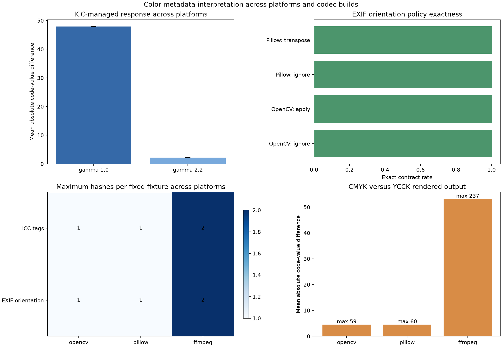

# Research Notes

Reproducible technical investigations that connect a focused research question
to source review, controlled experiments, evaluation, interpretation, and
explicit limitations.

## Overview

This repository demonstrates a compact research workflow for computer vision
and image-processing questions. Each note is backed by reviewable code,
synthetic data, committed reference results, tests, and continuous integration.
It is not a collection of links and does not claim that a controlled synthetic
experiment automatically generalizes to production imagery.

The intended readers are R&D engineers and technical reviewers who want to
trace a conclusion back through the research question, sources, fixtures,
experiment code, measurements, and limitations. Unlike `vision-playground`,
which presents a stable suite of algorithm comparisons, this repository keeps
an evolving record of related investigations and the evidence boundaries of
each release.

The studies progress from one global blur heuristic to comparative robustness,
spatial aggregation, window geometry, preprocessing sensitivity, optical blur
models, photometric pipeline drift, JPEG compression history, and codec
portability. v0.12.0 holds JPEG scans fixed while varying ICC and EXIF APP
metadata, then compares explicit color, orientation, CMYK, and YCCK rendering
policies through structural, exact-pixel, and numerical contracts.

## Representative Result

The v0.12.0 study compares 13 fixed JPEG streams across five GitHub-hosted
platform profiles. All 570 raw, policy, and control arrays satisfied their
interface contracts; all 135 raw metadata-invariance pairs and all 160
declared orientation-policy observations were pixel-exact. ICC transforms
changed output code values despite identical compressed scans, and the
rendered CMYK/YCCK separation varied substantially by decoder path.



This is fixture-specific regression evidence, not a perceptual-quality result
or a guarantee for every JPEG stream. The observation and pair tables are
committed under [`results/`](results/).

## Key Features

- Twelve published notes connecting a focused question to sources, controls,
  measurements, interpretation, and limitations
- Programmatically generated blur, noise, window, preprocessing, optical, and
  photometric conditions
- Fixed JPEG fixtures covering baseline, progressive, restart-marker,
  grayscale, RGB, CMYK, YCCK, chroma sampling, ICC, and EXIF orientation cases
- Laplacian variance, Tenengrad, spatial aggregation, calibration drift,
  decoded-pixel contracts, and codec/runtime manifests
- CSV observations and summaries plus figures generated from the same runs
- Exact dependency versions and deterministic random seeds
- A five-profile CI matrix for cross-platform JPEG observations
- Tests and CI regeneration checks for committed reference evidence

## Quick Start

Python 3.11 or newer is required; the reference environment uses Python 3.12.
On Debian or Ubuntu, install `python3-venv` if `venv` reports that `ensurepip`
is unavailable.

```bash
git clone https://github.com/cab0a/research-notes.git
cd research-notes
python3 -m venv .venv
source .venv/bin/activate
python -m pip install -e .
python experiments/run_laplacian_variance.py --output-dir output/quickstart
```

Review `output/quickstart/laplacian_variance.png` and
`output/quickstart/laplacian_variance_summary.csv`. This smallest study shows
both the expected blur response and the noise confound.

## Generated Artifacts

Each study writes observation-level or trial-level CSV, compact summary CSV,
and one or more explanatory PNG figures. JPEG studies also write fixture,
codec, runtime, syntax, decoded-pixel, and pair-comparison manifests. Committed
reference files live in [`results/`](results/); fixed decoder inputs and their
declared references live in [`fixtures/`](fixtures/).

## Technical Design

```text
Research Question
    -> Source Review
    -> Method Selection
    -> Controlled Experiment
    -> Evaluation
    -> Interpretation
    -> Limitations
    -> Documentation
```

Every published note makes that chain inspectable and reproducible.

## Published Notes

- [Color Management, YCCK, and Metadata Interpretation](notes/color-management-ycck-metadata-interpretation.md)
  — v0.12.0
- [Independent Codec Families and Advanced JPEG Syntax](notes/independent-codec-families-advanced-jpeg-syntax.md)
  — v0.11.0
- [Cross-Platform Codec Builds and Decoded-Pixel Contracts](notes/cross-platform-codec-builds-decoded-pixel-contracts.md)
  — v0.10.0
- [JPEG Quantization Tables and Codec Portability](notes/jpeg-quantization-codec-portability.md)
  — v0.9.0
- [JPEG Compression History: Quality Order, Grid Alignment, and Chroma Sampling](notes/jpeg-compression-history.md)
  — v0.8.0
- [Photometric Normalization and Recompression Drift](notes/photometric-normalization-recompression-drift.md)
  — v0.7.0
- [Optical Blur Models and Directional Motion Sensitivity](notes/optical-blur-models-directional-motion.md)
  — v0.6.0
- [Preprocessing Sensitivity and Calibration Drift](notes/preprocessing-sensitivity-calibration-drift.md)
  — v0.5.0
- [Window Geometry and Robustness for Local Blur Detection](notes/window-geometry-robustness.md)
  — v0.4.0
- [Local Blur and Spatial Aggregation](notes/local-blur-spatial-aggregation.md)
  — v0.3.0
- [Laplacian Variance vs. Tenengrad Under Blur and Noise](notes/laplacian-vs-tenengrad.md)
  — v0.2.0
- [Laplacian Variance as a Blur Heuristic: Controlled Evaluation and Limitations](notes/laplacian-variance-blur.md)
  — v0.1.0

## Reproducibility

Python 3.11 or newer is required. The reference environment uses Python 3.12
and exact runtime dependency versions declared in `pyproject.toml`.

```bash
git clone https://github.com/cab0a/research-notes.git
cd research-notes
python -m venv .venv
source .venv/bin/activate
python -m pip install --upgrade pip
python -m pip install -e ".[test]"
python -m pytest
python experiments/run_laplacian_variance.py
python experiments/run_focus_metric_comparison.py
python experiments/run_local_blur_evaluation.py
python experiments/run_window_geometry_evaluation.py
python experiments/run_preprocessing_sensitivity.py
python experiments/run_optical_blur_models.py
python experiments/run_photometric_recompression.py
python experiments/run_jpeg_compression_history.py
python experiments/run_jpeg_codec_portability.py
python experiments/run_cross_platform_codec_contracts.py
python experiments/run_advanced_jpeg_syntax.py
python experiments/run_color_metadata_interpretation.py
```

On Windows PowerShell, activate the environment with
`.venv\Scripts\Activate.ps1`. The experiments use only programmatically
generated images and deterministic random seeds. Each experiment writes its
CSV and PNG artifacts under `results/`.

The v0.10.0 through v0.12.0 workflows also run a five-profile GitHub Actions
matrix and share each platform observation through workflow artifacts before
producing the combined cross-platform reports.

## Evaluation Methodology

Each note declares the variable being changed, the controls held fixed, the
number of observations, the aggregation policy, and the claim boundary. Blur
studies use known sharp/blurred patterns and deterministic noise; spatial
studies preserve region identity and window geometry; photometric and JPEG
studies record processing order and codec parameters. Decoder studies separate
file structure, array-interface validity, exact decoded hashes, pairwise code-
value differences, and cross-platform agreement.

Metrics are interpreted as relative responses inside each controlled design.
They are not converted into a universal blur threshold, perceptual score, or
codec ranking. Individual notes contain their sources, hypotheses, full tables,
and experiment-specific limitations.

## Results and Interpretation

The notes evaluate relative relationships under declared controls instead of
proposing a fixed quality threshold:

- v0.1.0 confirms that noiseless Gaussian blur lowers Laplacian variance and
  that added noise can reverse a simple interpretation.
- v0.2.0 compares Laplacian variance with area-normalized Tenengrad over 720
  repeated observations, plus bounded motion-blur and resize controls.
- v0.3.0 shows spatial dilution: with one of 16 aligned tiles blurred at sigma
  3, mean full-image ratios remain 0.936866 for Laplacian variance and 0.940676
  for Tenengrad, while mean minimum tile ratios fall to 0.005025 and 0.062950.
- v0.4.0 shows a window-geometry blind spot: a 64/64 grid captures at most 25%
  of a 64-pixel region offset by 32 pixels, while a 64/32 grid recovers 100%
  coverage. In repeated sigma-3 trials, noise standard deviation 15 raises the
  mean minimum Laplacian ratio from 0.005765 to 0.200820 on the 64/32 grid even
  though localization ranking remains unchanged.
- v0.5.0 shows preprocessing calibration drift over 9,360 observations. For
  clean sharp inputs, resize and Gaussian denoising lower mean Laplacian ratios
  to 0.091416 and 0.048873, causing the unchanged synthetic midpoint rule to
  fall to balanced accuracy 0.5. JPEG quality 50 raises the sigma-3 Laplacian
  response to 1.853677 times the same uncompressed input, while unsharp masking
  under noise 15 produces a blurred miss rate of 0.666667.
- v0.6.0 compares 17 identity, disk-defocus, and directional-motion conditions
  over 5,100 metric observations. At motion length 15 without noise, mean
  aligned-to-perpendicular ratios are 0.066796 for Laplacian variance and
  0.024429 for Tenengrad. At noise standard deviation 15, the Laplacian ratio
  reaches 1.008207, showing that noise can erase and slightly reverse the
  directional contrast in this controlled setting.
- v0.7.0 records 11,520 metric observations across 16 photometric and JPEG
  pipelines. Contrast gain 0.50 lowers clean sharp responses to 0.250919 for
  Laplacian variance and 0.250680 for Tenengrad, reducing the unchanged
  midpoint calibration to balanced accuracy 0.5 for both metrics. A first
  grayscale JPEG quality-75 round trip lowers the clean sharp Laplacian ratio
  to 0.930825 but raises the sigma-3 ratio to 1.637515; rounds 2 and 5 converge
  to the same six-decimal aggregate values in this bounded setting.
- v0.8.0 records 4,320 metric observations across nine two-stage JPEG
  histories. An aligned grayscale quality-75 second round remains at a
  six-decimal final-to-primary ratio of 1.000000, while a 4 x 4 grid shift
  changes the sigma-3 Laplacian ratio to 0.805242. Reversing quality 95 -> 75
  to 75 -> 95 changes the clean sharp Laplacian ratio from 0.920521 to
  1.003831. At noise standard deviation 15, the unchanged uncompressed midpoint
  rule falls to balanced accuracy 0.666667 for Laplacian variance and 0.833333
  for Tenengrad on the shifted quality-75 path.
- v0.9.0 audits all numeric qualities from 1 through 100 and records 1,152
  decoded metric observations. The pinned OpenCV 4.13.0 and Pillow 12.3.0
  default paths produce identical DQT fingerprints and JPEG bytes throughout
  the sweep and all 72 larger image conditions. Supplying the extracted DQT
  explicitly also reproduces all 72 files byte for byte. Huffman optimization
  preserves every DQT and decoded pixel array while changing every file and
  reducing encoded size to a mean ratio of 0.708379.
- v0.10.0 commits 12 synthetic baseline JPEG streams and their declared BGR
  decode references. The five-profile release matrix produced 120 of 120 exact
  reference decodes and 60 of 60 exact within-profile OpenCV-versus-Pillow
  comparisons. Every fixture and decoder had one decoded hash across Ubuntu
  x64 default and forced-scalar, Windows x64, macOS arm64, and macOS Intel x64.
  These exact hashes are regression evidence for the fixed corpus and pinned
  wheels, not a perceptual quality score or a codec-wide guarantee.
- v0.11.0 adds ten fixed baseline, progressive, restart-marker, grayscale,
  RGB, and CMYK streams and a native FFmpeg MJPEG path. Across five CI profiles,
  all 150 decoder observations satisfied the array interface and all 75
  controlled progression and restart comparisons were pixel-exact. OpenCV and
  Pillow each produced one decoded hash per fixture across platforms. FFmpeg
  did so for six fixtures, while its four 4:2:0 RGB fixtures produced two hashes:
  macOS arm64 returned one array and the other four profiles agreed on another.
  Relative to the OpenCV BGR anchor, FFmpeg's maximum error was 3 for 4:4:4 RGB
  and up to 79 for the 4:2:0 hard-chroma controls; Pillow differed by at most 2
  on the two CMYK streams. These are fixture-specific code-value observations,
  not perceptual acceptance limits.
- v0.12.0 adds 13 fixed ICC, EXIF orientation, CMYK, and YCCK controls. All 27
  local raw metadata-invariance pairs were pixel-exact when orientation and ICC
  processing were explicitly disabled. Mapping identical compressed RGB scans
  through the synthetic gamma 1.0 and 2.2 profiles produced mean absolute
  differences of 47.907630 and 2.139913 relative to the untagged unmanaged
  array. All eight OpenCV automatic-orientation and Pillow explicit-transpose
  outputs matched their declared normalized arrays. The CMYK/YCCK mean pair
  difference was 4.514200 for OpenCV, 4.534322 for Pillow, and 53.128695 for
  FFmpeg. These are synthetic code-value responses, not perceptual or device-
  color accuracy claims. Across five CI profiles, all 135 raw metadata-
  invariance pairs and 160 orientation-policy observations were exact. OpenCV
  and Pillow each retained one raw hash per fixture; FFmpeg had two hashes for
  the eleven RGB metadata fixtures and the CMYK fixture, with macOS arm64
  differing from the other four profiles.

These are experiment-specific observations, not transferable quality
thresholds or proof of universal metric superiority.

## Limitations

The studies use small, 8-bit synthetic images. v0.12.0 adds ICC matrix/TRC
controls, EXIF orientation, and one synthetic YCCK path, but it does not
establish behavior for measured device profiles, LUT profiles, gamut mapping,
proofing, hardware or camera codecs, malformed metadata, arithmetic or lossless
JPEG, human color judgments, or print accuracy. GitHub-hosted runner
observations are snapshots of recorded images and bundled codec builds rather
than guarantees for every machine with the same operating-system label.
Scores remain dependent on texture, contrast, resolution, codec implementation,
preprocessing order, window geometry, PSF rasterization, border handling, and
metric details. Known pattern identities, matched sharp references, and
synthetic anchors are controls that are usually unavailable in blind
inspection.

## Development and Testing

```bash
python -m pip install -e ".[test]"
python -m pytest
```

The tests cover blur metrics and models, preprocessing and photometric
transforms, JPEG parsing and fixture contracts, experiment outputs, and
cross-platform summary logic. GitHub Actions runs tests and regenerates the
reference evidence on Ubuntu with Python 3.12. Separate jobs collect JPEG
observations on Ubuntu x64 default and scalar paths, Windows x64, macOS arm64,
and macOS Intel x64, then aggregate and compare them with committed reports.

## Compatibility

Python 3.11 or newer is required; Python 3.12 and the exact runtime versions in
`pyproject.toml` define the reference environment. Cross-platform conclusions
apply only to the runner images and bundled codec builds recorded in the
manifests. The project does not promise identical decoded arrays for other
dependency versions, codecs, hardware paths, or platform images.

## Project Structure

```text
.
|-- .github/workflows/ci.yml
|-- experiments/
|   |-- run_advanced_jpeg_syntax.py
|   |-- run_color_metadata_interpretation.py
|   |-- run_cross_platform_codec_contracts.py
|   |-- run_focus_metric_comparison.py
|   |-- run_jpeg_compression_history.py
|   |-- run_jpeg_codec_portability.py
|   |-- run_laplacian_variance.py
|   |-- run_local_blur_evaluation.py
|   |-- run_optical_blur_models.py
|   |-- run_photometric_recompression.py
|   |-- run_preprocessing_sensitivity.py
|   |-- run_window_geometry_evaluation.py
|   |-- summarize_advanced_jpeg_syntax.py
|   |-- summarize_color_metadata_contracts.py
|   `-- summarize_cross_platform_codec_contracts.py
|-- fixtures/color-metadata-contracts/
|   |-- manifest.csv
|   |-- *.jpg
|   `-- *.reference.png
|-- fixtures/advanced-jpeg-syntax/
|   |-- manifest.csv
|   |-- *.jpg
|   `-- *.reference.png
|-- fixtures/jpeg-decoder-contracts/
|   |-- manifest.csv
|   |-- *.jpg
|   `-- *.reference.png
|-- notes/
|   |-- color-management-ycck-metadata-interpretation.md
|   |-- cross-platform-codec-builds-decoded-pixel-contracts.md
|   |-- independent-codec-families-advanced-jpeg-syntax.md
|   |-- laplacian-variance-blur.md
|   |-- laplacian-vs-tenengrad.md
|   |-- jpeg-compression-history.md
|   |-- jpeg-quantization-codec-portability.md
|   |-- local-blur-spatial-aggregation.md
|   |-- optical-blur-models-directional-motion.md
|   |-- photometric-normalization-recompression-drift.md
|   |-- preprocessing-sensitivity-calibration-drift.md
|   `-- window-geometry-robustness.md
|-- results/
|   |-- README.md
|   |-- *.csv
|   `-- *.png
|-- src/research_notes/
|   |-- __init__.py
|   |-- blur_models.py
|   |-- blur_metrics.py
|   |-- jpeg_codec.py
|   |-- jpeg_contracts.py
|   |-- jpeg_metadata.py
|   |-- photometric.py
|   `-- preprocessing.py
|-- tests/test_blur_metrics.py
|-- LICENSE
|-- README.md
`-- pyproject.toml
```

## Roadmap

- Evaluate malformed or incomplete ICC chunks, invalid or conflicting EXIF
  orientation, marker conflicts, truncation, decoder recovery, and application
  trust boundaries without presenting unsafe recovery as silent correctness.
- Evaluate adaptive or multiscale aggregation without treating overlapping
  windows as independent evidence.
- Extend the global PSF controls to spatially varying defocus and non-uniform
  motion without treating synthetic labels as measured camera truth.
- Replicate selected controls on a traceable public image set with labels.

The roadmap is exploratory and does not represent completed work.

## License

Code and documentation are available under the [MIT License](LICENSE).
