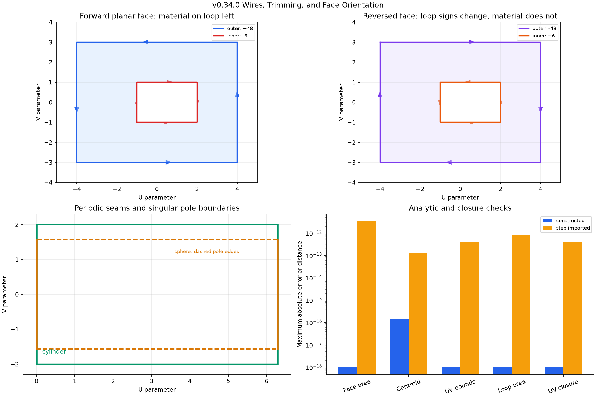

# Research Notes

## 日本語概要

このリポジトリは、画像処理とSTEP/B-repの調査を再現可能に記録し、Pythonパーサー、モデリング、3D AI利用へ進みます。

v0.34.0では、外周と穴を持つ平面枠、その反転面、全周円柱面、球面を解析式から生成し、支持曲面と切り取り領域、外周と内周、辺の接続順、面の向き、周期的な継ぎ目、極の縮退辺を分離して評価します。平面枠の面積は `42` のまま、面反転で外周・内周の符号付き媒介変数面積だけが反転しました。球面では三次元曲線を持たない極上の縮退辺2本が二次元境界を閉じることをSTEP再読込後にも確認しました。

合成データ、CSV・JSON・PNG、213件のテストを備えます。一般的なSTEP適合、任意の曲線境界、壊れた位相、Bスプライン曲線・曲面、修復、形状編集は主張しません。詳細は英語本文に示します。

研究・教育・個人的実験にはPolyForm Noncommercial 1.0.0を適用し、商用利用は別契約です。

---

Reproducible image-processing and STEP/B-Rep studies that connect a focused
question to source review, controlled experiments, committed evidence,
interpretation, and explicit claim boundaries.

The current release and future development are source-available for
noncommercial research, academic, educational, and personal experimental use.
Commercial use requires a separate written license. See
[Licensing](LICENSING.md) for the controlling terms, historical record, and
inquiry process.

## Overview

This repository records a sequence of related technical investigations rather
than a fixed algorithm showcase. Each published study includes a research
question, controlled inputs, versioned experiment code, CSV observations, PNG
figures, interpretation, and limitations.

The work starts with blur heuristics, then tests spatial aggregation,
preprocessing, optical and photometric effects, JPEG compression history,
decoder portability, metadata interpretation, malformed-metadata recovery,
metadata round-trip policies, multi-generation policy drift, field-level
selective retention, and resource-bounded admission before evaluating extended
metadata-family coverage and digest-bound transform integrity before composing
those controls into explainable routing policies. The current track develops a
dependency-free STEP Part 21 parser foundation before advancing into EXPRESS,
application semantics, and evaluated B-Rep geometry. The current release is
v0.34.0.

Unlike `vision-playground`, which compares image-processing methods as a stable
experiment suite, this repository preserves how questions, controls, evidence,
and claim boundaries evolve from one study to the next.

## Research Themes

| Theme | Studies | Central question |
| --- | --- | --- |
| Blur measurement and localization | v0.1.0–v0.4.0 | How do noise, spatial aggregation, and window geometry change Laplacian variance and Tenengrad responses? |
| Processing-pipeline sensitivity | v0.5.0–v0.8.0 | How do preprocessing, optical blur, photometric transforms, and JPEG history move scores and fixed calibration rules? |
| JPEG codec and metadata contracts | v0.9.0–v0.20.0 | Which byte, pixel, metadata, recovery, sanitization, temporal, field-retention, resource-boundary, nested-relationship, transform-integrity, and composed-policy behaviors remain stable across encoders, decoders, syntax variants, policies, generations, and recorded CI environments? |
| STEP and B-Rep foundations | v0.21.0 onward | Which exchange-structure, schema, topology, geometry, validity, and modeling claims can be reproduced from controlled product-model data? |

The [study index](docs/studies.md) maps all 34 releases to their questions,
representative findings, artifacts, commands, and complete notes.

## Representative Result

The v0.34.0 study evaluates two planar frames, one full cylinder, and one
sphere against closed-form truth that does not call the geometry backend. It
separates support surfaces, trimmed material regions, outer and inner wires,
ordered edge uses, face orientation, periodic seams, and degenerate pole edges
before and after STEP exchange.

| Condition | Observed state | Evidence |
| --- | --- | --- |
| Analytic controls | independent | Material area, centroid, restricted UV bounds, and signed loop areas are derived with Python arithmetic and `math` |
| Outer and inner loops | distinguished | The forward planar frame has signed UV areas `+48` and `-6`; face reversal changes them to `-48` and `+6` without changing material area `42` |
| Ordered wires | closed | All six wires have zero reported defects, topologically identical next vertices, and matching point classifications before and after STEP exchange |
| Seam representation | retained | Cylinder and sphere each use one seam edge twice at the two periodic U boundaries |
| Singular boundary | retained | The sphere uses two degenerate pole edges without 3D curves to close its UV boundary |



These are regression results for one pinned backend and four generated
analytic faces. The numeric test limits are not universal CAD quality or
manufacturing thresholds. The study does not repair invalid wires, and it
does not generalize signed polygon area to arbitrary curved trim loops.

## Current STEP and B-Rep Capability

The current implementation is strongest at source-preserving Part 21 parsing,
bounded EXPRESS and instance validation, physical-reference graphs, and one
controlled AP242 product and assembly mapping. It can inventory selected
declared B-Rep topology and evaluate small analytic face, edge, and wire
corpora, including holes, periodic seams, and sphere-pole degeneracy, but it
cannot yet evaluate arbitrary trimmed geometry or modify a model.

| Capability level | Available now | Not available yet |
| --- | --- | --- |
| Exchange and schema | Selected Part 21 editions, source spans, EXPRESS declarations and relationships, and staged instance checks | Complete grammar, external schemas, rule execution, or ISO/AP242 conformance |
| Product and assembly | Controlled AP242 product paths, occurrence identity, rigid placements, nested composition, and supported length units | Alternate mappings, all unit forms, persistent CAD identity, or transformed-solid evaluation |
| B-Rep and modeling | Selected declarations plus an optional OCCT route evaluated on analytic faces, outer and inner wires, line and circle edges, p-curves, parameter ranges, orientations, periodic seams, and sphere-pole degenerate edges before and after STEP exchange | Arbitrary curved trims, invalid topology, B-splines, shell and solid validity, tessellation, editing, healing, or a supported export API |

The [detailed STEP and B-Rep capability matrix](docs/step-brep-capabilities.md)
maps each current field to its evidence, exact limitation, and planned release.

## Claim Boundaries

- The studies use small, 8-bit synthetic images rather than a representative
  natural-image benchmark.
- Metric responses are relative to declared controls. They are not universal
  blur thresholds, perceptual scores, or proof that one metric is superior.
- The malformed-metadata corpus is not a fuzzer, vulnerability assessment,
  resource benchmark, or memory-safety proof.
- The metadata normalizer supports only EXIF Orientation and complete embedded
  ICC profiles; it is not a general-purpose metadata sanitizer.
- The field-level parser supports twelve controlled fields and two layouts.
  It is not a general EXIF, XMP, ICC, IPTC, or privacy sanitizer.
- The resource-boundary auditor receives an already resident byte string and
  bounds only its declared header and metadata work. It does not bound file
  reads, decoder pixels, process memory, wall-clock time, or exploitability.
- The metadata-coverage parser recognizes only the synthetic EXIF, XMP, IPTC
  IIM, Photoshop IRB, and maker-note structures used by v0.18.0. It is not a
  complete metadata implementation.
- The transform-integrity record is a project-specific unsigned digest
  assertion. Matching bindings are not authenticated provenance.
- The composition engine returns decisions and optional bytes; it does not
  enforce quarantine storage, access control, retention, or operator review.
- The observed generation-3 pixel fixed point applies only to one small
  synthetic image, quality 75, 4:4:4 sampling, and the pinned builds. It is not
  a convergence guarantee or losslessness claim.
- Cross-platform observations describe pinned wheels on recorded GitHub-hosted
  runner images. They do not guarantee identical behavior for other builds.
- The STEP conformance layer supports only the committed 34-fixture subset.
  It is not an ISO certification suite, complete Wirth Syntax Notation
  coverage, EXPRESS validation, external-resource resolver, CMS verifier, or
  proof of support for arbitrary STEP files.
- The EXPRESS resolver supports a controlled ASCII declaration subset and
  direct imports from schemas in the same document. It does not implement
  complete visibility, transitive re-export, external schema loading,
  expression typing, constraint evaluation, or executable rule behavior.
- The Part 21-to-EXPRESS validator covers a controlled internal mapping and
  selected values. Complex instances remain quarantined after structural
  checks; constants, value instances, complete assignment compatibility,
  rules, and application semantics remain deferred.
- The generic STEP graph contains physical local and nonlocal reference
  occurrences. Zero indegree, isolation, reachability, cycles, and
  root-relative orphans do not establish application meaning.
- The AP242 assembly evaluator supports one exact schema identifier, one
  controlled occurrence mapping, explicit 3D item-defined rigid transforms,
  SI metre prefixes, and conversion-based length units. An evaluated path is
  not complete AP242 conformance; alternate transformations, derived units,
  tolerances, and evaluated B-Rep geometry remain deferred.
- The optional geometry backend is selected from project-specific gates and
  tested on one Linux x64 synthetic box. This is not legal advice, binary
  redistribution approval, independent kernel validation, or general STEP
  interoperability evidence.
- The face-geometry evaluator covers two rectangular planar faces and one
  non-seam cylindrical patch. Its analytic regression limits do not establish
  accuracy for arbitrary trimmed, periodic, singular, repaired, or spline
  geometry, and imported face tolerance is not assumed to preserve source
  identity.
- The wire-trimming evaluator covers two planar frames, one full cylinder, and
  one sphere. Its signed UV areas, point classifications, closure checks, seam
  uses, and degenerate pole edges do not establish validity for arbitrary
  curved, nested, self-intersecting, disconnected, non-manifold, or repaired
  boundaries.
- The installed Python distribution inventory did not surface an OCCT LGPL
  notice through its standard license-file records. That observation is not a
  noncompliance finding and blocks this project's redistribution until a
  separate audit is completed.
- STEP face and edge indices are analysis-local. They are not persistent CAD
  identities across export, editing, Boolean operations, or healing.
- Known pattern identities, matched references, and synthetic calibration
  anchors are controls that are usually unavailable in blind inspection.

Each [complete research note](notes/) records additional limitations for its
own experiment.

## Quick Start

Python 3.11 or newer is required. The reference environment uses Python 3.12
and the exact dependency versions in `pyproject.toml`.

```bash
git clone https://github.com/cab0a/research-notes.git
cd research-notes
python3 -m venv .venv
source .venv/bin/activate
python -m pip install -e .
python experiments/run_laplacian_variance.py --output-dir output/quickstart
```

Review:

- `output/quickstart/laplacian_variance.png`
- `output/quickstart/laplacian_variance_summary.csv`

This smallest study shows both the expected blur response and the noise
confound.

## Generated Artifacts

Each study writes observation-level or trial-level CSV files, compact summary
tables, and one or more explanatory PNG figures. The v0.28.0 graph, v0.29.0
AP242 product-path, v0.30.0 assembly, v0.31.0 geometry-kernel decision,
v0.32.0 face-geometry, v0.33.0 edge-geometry, and v0.34.0 wire-trimming studies also write
deterministic versioned JSON records.
JPEG studies write fixture, codec, runtime, syntax, decoded-pixel, and
pair-comparison manifests.
The STEP studies commit generated Part 21 and EXPRESS fixtures, token and
source-span inventories, structure, section, declaration, face-, edge-, shell-,
and solid-level tables, and visual controls.

- Committed reference evidence: [`results/`](results/)
- Artifact catalog: [`results/README.md`](results/README.md)
- Fixed decoder inputs and declared references: [`fixtures/`](fixtures/)

## STEP and EXPRESS Sample Gallery

The [STEP sample and preview catalog](docs/step-sample-catalog.md) links each
generated input to its manifest, purpose, expected route, and visual evidence.
The catalog includes the v0.24.0 Part 21 conformance corpus, the v0.25.0 and
v0.26.0 EXPRESS corpora, the paired v0.27.0 STEP/EXPRESS validation corpus,
the v0.28.0 physical-reference graph corpus, the v0.29.0 AP242 product-path
corpus, the v0.30.0 assembly occurrence and placement corpus, the v0.31.0
OCCT-generated box round-trip fixture, the v0.32.0 analytic face fixture, and
the v0.33.0 plane, partial-cylinder, and full-cylinder edge fixture, and the
v0.34.0 planar-frame, closed-cylinder, and natural-sphere trimming fixture.
Syntax-only samples use source and relationship figures rather than fabricated
geometry previews.


Preview images support inspection; CSV invariants and tests remain the
validation evidence.

## Key Features

- Thirty-four published studies with explicit questions, controls, results, and
  limitations
- Programmatically generated blur, noise, window, preprocessing, optical, and
  photometric conditions
- Fixed or deterministically generated JPEG fixtures for syntax, chroma
  sampling, color metadata, malformed metadata, trailing data, resource
  boundaries, and round-trip policies
- One dependency-free, source-preserving Part 21 lexer and parser shared by
  the exchange-structure and topology studies, plus topology resolution for
  the geometry-bearing subset
- Edition-aware Part 21 conformance observations and isolated comparisons with
  two pinned public Python parsers
- A source-preserving EXPRESS lexer and parser plus bounded symbol, direct
  import, type-alias, aggregate-bound, and inheritance resolution
- Staged binding from Part 21 DATA sections and parameters to controlled
  EXPRESS schemas, entities, attributes, value domains, and inheritance order
- A deterministic Part 21 directed multigraph with stable local node IDs,
  source-linked reference occurrences, bounded traversal, cycle detection,
  and versioned JSON output
- A controlled AP242 product-to-representation resolver that assigns semantic
  roles to source-linked graph edges and retains direct items, dimension, and
  explicit context units
- A controlled AP242 assembly evaluator that separates definitions from
  occurrences, evaluates child-to-parent rigid placements, composes nested
  paths, and normalizes supported length units to millimetres
- A source-backed geometry-kernel decision matrix plus a pinned, headless,
  optional OCCT box construction and STEP round-trip probe
- Closed-form plane and cylinder truth compared with evaluated face area,
  centroid, UV bounds, points, normals, analytic parameters, orientation, and
  stage-specific tolerance observations
- Closed-form boundary truth compared with 3D line and circle curves,
  p-curves, parameter ranges, oriented wire uses, and one periodic cylindrical
  seam
- Closed-form material and parameter-domain truth compared with ordered outer
  and inner wires, face reversal, point classification, periodic seams, and
  degenerate sphere-pole edges
- Observation-level CSV files alongside summaries and figures from the same
  runs
- Deterministic seeds, pinned runtime dependencies, hashed fixtures, and
  committed reference evidence
- A five-profile CI matrix for decoded-pixel and metadata-recovery contracts
- Unit tests and CI regeneration checks against committed CSV and fixture data

## Research Workflow

```text
Research Question
    -> Source Review
    -> Method Selection
    -> Controlled Experiment
    -> Evaluation
    -> Interpretation
    -> Limitations
    -> Documentation
```

The experiment-specific evidence is organized in three layers:

1. `notes/` contains the complete research record.
2. `experiments/` and `src/research_notes/` contain the executable method.
3. `results/` and `fixtures/` contain committed evidence and fixed inputs.

## Evaluation Methodology

Each study declares the variable being changed, the controls held fixed, the
observation count, the aggregation policy, and the claim boundary. Decoder
studies separate file structure, array-interface validity, exact decoded
hashes, pairwise code-value differences, metadata admission, and
cross-platform agreement. The STEP studies separate container recognition,
physical-file parsing, exact source retention, source coordinates, section
order, declared schema identifiers, external trust boundaries, topology
resolution, visual previews, EXPRESS declaration parsing, semantic graph
states, DATA-schema binding, attribute-level parameter validation, and deferred
expression, application, and geometry evaluation. Physical-reference graph
queries preserve repeated occurrences and nonlocal target scopes. The AP242
studies add separate product-path and assembly-occurrence semantic layers. The
assembly layer evaluates one bounded rigid-placement and length-unit subset
while keeping alternate mappings and B-Rep meaning outside that contract. The
geometry-kernel study separately evaluates candidate gates, unique topology
preservation, kernel validity, package metadata, and license-layer boundaries.
The face-geometry study then separates analytic truth, backend observation,
topological orientation, STEP exchange, and tolerance-stage provenance. The
edge study additionally separates unique topology, 3D curves, p-curves,
parameter spans, oriented wire traversal, seam branches, and sampled
3D-to-surface residuals. The wire-trimming study further separates support
surface bounds from face restrictions, unique edges from ordered occurrences,
outer from inner loops, winding from material classification, and degenerate
3D geometry from necessary UV boundary topology.

Measurements are interpreted inside each controlled design. Detailed results
for every release are collected in [`docs/studies.md`](docs/studies.md), while
the notes preserve hypotheses, source references, failure modes, and
experiment-specific limitations.

## Reproducibility

Install test dependencies and run the suite:

```bash
python -m pip install -e ".[geometry,test]"
python -m pytest
```

Every experiment can be run independently. The complete command list,
deterministic controls, fixture-refresh commands, CI aggregation design, and
repository layout are documented in
[`docs/reproducibility.md`](docs/reproducibility.md).

## Development and Testing

The repository contains 213 tests covering blur metrics and models,
preprocessing and photometric transforms, JPEG parsing, fixed-fixture
contracts, repeated and field-level metadata policies, resource-boundary
routing, the unified source-preserving Part 21 parser, edition and
conformance-class checks, bounded exchange structures, B-Rep topology
ownership and incidence, EXPRESS tokenization, declaration models, resource
limits, symbol tables, direct imports, type aliases, aggregate bounds,
inheritance, redeclarations, inverse links, experiment outputs, and
schema-bound Part 21 parameters, occurrence-reference compatibility, staged
validation boundaries, source-linked graph construction, bounded queries,
AP242 product paths, direct representation items, contexts, assigned units,
assembly occurrences, rigid transforms, nested composition, conversion-based
length units, geometry-kernel candidate selection, deterministic OCCT STEP
round trips, installed-package audits, analytic plane and cylinder truth,
evaluated face geometry, orientation and tolerance-stage behavior, versioned
JSON records, analytic edge lengths and parameter spans, 3D curve and p-curve
agreement, oriented vertex-parameter traversal, periodic seams, experiment
outputs, planar holes, face-reversal winding, support-versus-restriction
domains, ordered wire closure, UV point classification, sphere-pole
degeneracy, and cross-platform summary logic.

GitHub Actions runs the README Quick Start, checks its summary CSV and figure,
then runs the tests and regenerates the reference evidence on Ubuntu with
Python 3.12. Separate jobs record JPEG observations on Ubuntu x64 default and
scalar paths, Windows x64, macOS arm64, and macOS Intel x64 before aggregating
the combined reports.

## Compatibility

Python 3.11 or newer is required. Python 3.12 and the exact runtime versions in
`pyproject.toml` define the reference environment. Cross-platform conclusions
apply only to the runner images and bundled codec builds recorded in the
manifests. The v0.21.0 through v0.30.0 STEP and EXPRESS layers remain
geometry-kernel-free. v0.31.0 adds an optional pinned OCCT route, v0.32.0
evaluates three analytic faces, v0.33.0 evaluates controlled edge curves,
p-curves, parameter ranges, and one seam, and v0.34.0 evaluates outer and
inner wires, trimming, face reversal, periodic seams, and degenerate pole
edges on the same Linux x64 reference route. These releases do not claim
compatibility beyond their controlled fixtures or change the parser subset.

## Roadmap

The [STEP mastery, Python parser, and 3D tool roadmap](docs/brep-learning-roadmap.md)
makes specification knowledge and a source-preserving Python parser the
foundation. v0.31.0 selects an optional bounded OCCT route after a reproducible
technical, packaging, and license-layer comparison. v0.32.0 establishes the
first independently checked face-geometry contract, v0.33.0 adds edge curves,
p-curves, parameter ranges, and seams, and v0.34.0 adds ordered outer and inner
wires, trimming, face reversal, and sphere-pole degeneracy. The roadmap next
proceeds through shell and solid validity, repair, inspection, modeling, STEP
round trips, feature recognition, and evidence-backed parametric
reconstruction. v0.40.0
starts new parameter-driven construction, v0.44.0 targets import-edit-export
round trips, and v0.55.0 begins STEP-to-feature reconstruction candidates.
Geometry-kernel binary distribution remains a separate license and packaging
checkpoint even though the bounded research backend is selected.

The roadmap is exploratory; only published releases represent completed work.

## License

The current release and future development are licensed under the
[PolyForm Noncommercial License 1.0.0](LICENSE). Commercial use requires a
separate written license from the copyright holder. To discuss commercial
licensing, [open a GitHub issue](https://github.com/cab0a/research-notes/issues/new)
with `Commercial licensing inquiry` in the title and do not include
confidential information.

Third-party material retains its own terms. Historical releases and the
complete project policy are documented in [Licensing](LICENSING.md).
