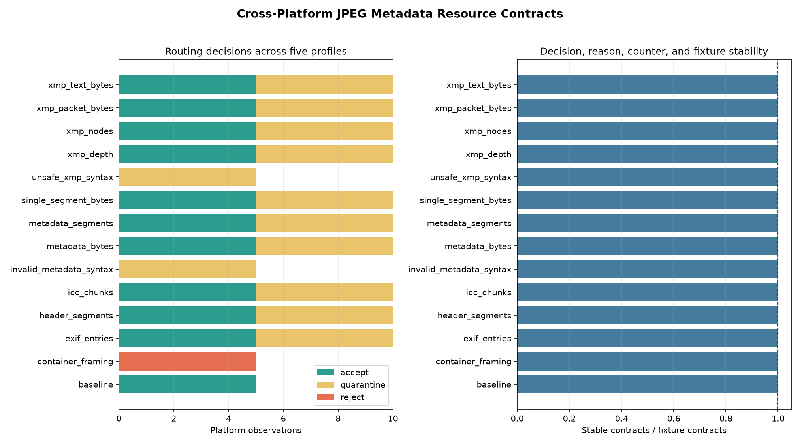

# Research Notes

## 日本語概要

このリポジトリは、画像処理に関する研究課題、文献調査、仮説、統制実験、結果、考察、制約を継続的に記録する研究ノートです。

研究テーマは、ぼけ評価と局所化、前処理や圧縮による評価値の変化、JPEGの復号・メタデータ・環境間互換性です。現在の研究では、JPEG metadataをdecoderへ渡す前の10種類のresource上限について、上限値ちょうどと上限値+1を含む24個の合成fixtureを評価しています。5環境の120観測では、全24契約でaccept・quarantine・reject、reason code、work counter、fixture hashが一致しました。

入力が同じなら同じ結果を生成するテストデータ、CSV・PNG成果物、固定した依存関係、テスト、5種類の環境を使った互換性検証を含みます。研究ごとの結果、再現手順、主張できる範囲は、以下の英語本文と個別ノートを参照してください。

---

Reproducible image-processing studies that connect a focused question to
source review, controlled experiments, committed evidence, interpretation,
and explicit claim boundaries.

## Overview

This repository records a sequence of related technical investigations rather
than a fixed algorithm showcase. Each published study includes a research
question, controlled inputs, versioned experiment code, CSV observations, PNG
figures, interpretation, and limitations.

The work starts with blur heuristics, then tests spatial aggregation,
preprocessing, optical and photometric effects, JPEG compression history,
decoder portability, metadata interpretation, malformed-metadata recovery,
metadata round-trip policies, multi-generation policy drift, and field-level
selective retention before evaluating resource-bounded metadata admission.
The current release is v0.17.0.

Unlike `vision-playground`, which compares image-processing methods as a stable
experiment suite, this repository preserves how questions, controls, evidence,
and claim boundaries evolve from one study to the next.

## Research Themes

| Theme | Studies | Central question |
| --- | --- | --- |
| Blur measurement and localization | v0.1.0–v0.4.0 | How do noise, spatial aggregation, and window geometry change Laplacian variance and Tenengrad responses? |
| Processing-pipeline sensitivity | v0.5.0–v0.8.0 | How do preprocessing, optical blur, photometric transforms, and JPEG history move scores and fixed calibration rules? |
| JPEG codec and metadata contracts | v0.9.0–v0.17.0 | Which byte, pixel, metadata, recovery, sanitization, temporal, field-retention, and resource-boundary behaviors remain stable across encoders, decoders, syntax variants, policies, generations, and recorded CI environments? |

The [study index](docs/studies.md) maps all 17 releases to their questions,
representative findings, artifacts, commands, and complete notes.

## Representative Result

The v0.17.0 study declares ten ceilings for JPEG header traversal, metadata
segments and bytes, one metadata segment, EXIF entries, XMP packet bytes,
nodes, depth and text, and ICC chunks. Twenty paired fixtures exercise each
ceiling exactly at the limit and at limit plus one.

| Boundary class | Fixtures | Local decision | Five-profile observations |
| --- | ---: | --- | ---: |
| Exactly at limit | 10 | 10 `accept` | 50 `accept` |
| Limit plus one | 10 | 10 `quarantine` | 50 `quarantine` |
| Mixed baseline | 1 | 1 `accept` | 5 `accept` |
| Metadata syntax controls | 2 | 2 `quarantine` | 10 `quarantine` |
| Container framing control | 1 | 1 `reject` | 5 `reject` |



Every over-limit fixture stopped at the first disallowed value, and no
corresponding admitted counter exceeded its ceiling. The five-profile matrix
produced 120 observations. All 24 fixture contracts retained one decision,
reason-code, issue, counter, and fixture-hash signature.

`accept` means only that the controlled header policy permits a downstream
decoder attempt. It does not establish metadata trust, full-JPEG validity, or
bounded decoder memory and time.

## Claim Boundaries

- The studies use small, 8-bit synthetic images rather than a representative
  natural-image benchmark.
- Metric responses are relative to declared controls. They are not universal
  blur thresholds, perceptual scores, or proof that one metric is superior.
- The malformed-metadata corpus is not a fuzzer, vulnerability assessment,
  resource benchmark, or memory-safety proof.
- The metadata normalizer supports only EXIF Orientation and complete embedded
  ICC profiles; it is not a general-purpose metadata sanitizer.
- The field-level parser supports twelve controlled fields and two layouts.
  It is not a general EXIF, XMP, ICC, IPTC, or privacy sanitizer.
- The resource-boundary auditor receives an already resident byte string and
  bounds only its declared header and metadata work. It does not bound file
  reads, decoder pixels, process memory, wall-clock time, or exploitability.
- The observed generation-3 pixel fixed point applies only to one small
  synthetic image, quality 75, 4:4:4 sampling, and the pinned builds. It is not
  a convergence guarantee or losslessness claim.
- Cross-platform observations describe pinned wheels on recorded GitHub-hosted
  runner images. They do not guarantee identical behavior for other builds.
- Known pattern identities, matched references, and synthetic calibration
  anchors are controls that are usually unavailable in blind inspection.

Each [complete research note](notes/) records additional limitations for its
own experiment.

## Quick Start

Python 3.11 or newer is required. The reference environment uses Python 3.12
and the exact dependency versions in `pyproject.toml`.

```bash
git clone https://github.com/cab0a/research-notes.git
cd research-notes
python3 -m venv .venv
source .venv/bin/activate
python -m pip install -e .
python experiments/run_laplacian_variance.py --output-dir output/quickstart
```

Review:

- `output/quickstart/laplacian_variance.png`
- `output/quickstart/laplacian_variance_summary.csv`

This smallest study shows both the expected blur response and the noise
confound.

## Generated Artifacts

Each study writes observation-level or trial-level CSV files, compact summary
tables, and one or more explanatory PNG figures. JPEG studies also write
fixture, codec, runtime, syntax, decoded-pixel, and pair-comparison manifests.

- Committed reference evidence: [`results/`](results/)
- Artifact catalog: [`results/README.md`](results/README.md)
- Fixed decoder inputs and declared references: [`fixtures/`](fixtures/)

## Key Features

- Seventeen published studies with explicit questions, controls, results, and
  limitations
- Programmatically generated blur, noise, window, preprocessing, optical, and
  photometric conditions
- Fixed or deterministically generated JPEG fixtures for syntax, chroma
  sampling, color metadata, malformed metadata, trailing data, resource
  boundaries, and round-trip policies
- Observation-level CSV files alongside summaries and figures from the same
  runs
- Deterministic seeds, pinned runtime dependencies, hashed fixtures, and
  committed reference evidence
- A five-profile CI matrix for decoded-pixel and metadata-recovery contracts
- Unit tests and CI regeneration checks against committed CSV and fixture data

## Research Workflow

```text
Research Question
    -> Source Review
    -> Method Selection
    -> Controlled Experiment
    -> Evaluation
    -> Interpretation
    -> Limitations
    -> Documentation
```

The experiment-specific evidence is organized in three layers:

1. `notes/` contains the complete research record.
2. `experiments/` and `src/research_notes/` contain the executable method.
3. `results/` and `fixtures/` contain committed evidence and fixed inputs.

## Evaluation Methodology

Each study declares the variable being changed, the controls held fixed, the
observation count, the aggregation policy, and the claim boundary. Decoder
studies separate file structure, array-interface validity, exact decoded
hashes, pairwise code-value differences, metadata admission, and
cross-platform agreement.

Measurements are interpreted inside each controlled design. Detailed results
for every release are collected in [`docs/studies.md`](docs/studies.md), while
the notes preserve hypotheses, source references, failure modes, and
experiment-specific limitations.

## Reproducibility

Install test dependencies and run the suite:

```bash
python -m pip install -e ".[test]"
python -m pytest
```

Every experiment can be run independently. The complete command list,
deterministic controls, fixture-refresh commands, CI aggregation design, and
repository layout are documented in
[`docs/reproducibility.md`](docs/reproducibility.md).

## Development and Testing

The repository contains 70 tests covering blur metrics and models,
preprocessing and photometric transforms, JPEG parsing, fixed-fixture
contracts, repeated and field-level metadata policies, resource-boundary
routing, experiment outputs, and cross-platform summary logic.

GitHub Actions runs the tests and regenerates the reference evidence on Ubuntu
with Python 3.12. Separate jobs record JPEG observations on Ubuntu x64 default
and scalar paths, Windows x64, macOS arm64, and macOS Intel x64 before
aggregating the combined reports.

## Compatibility

Python 3.11 or newer is required. Python 3.12 and the exact runtime versions in
`pyproject.toml` define the reference environment. Cross-platform conclusions
apply only to the runner images and bundled codec builds recorded in the
manifests.

## Roadmap

- v0.18.0 candidate: extend controlled parser coverage to EXIF thumbnails,
  extended XMP, IPTC IIM, maker notes, and nested payload relationships
  without treating one implementation as semantically complete.
- Evaluate authenticated provenance and signature-preservation boundaries
  without treating metadata presence as authenticity.
- Evaluate adaptive or multiscale aggregation without treating overlapping
  windows as independent evidence.
- Extend global point-spread-function controls to spatially varying defocus and
  non-uniform motion without treating synthetic labels as measured camera
  truth.
- Replicate selected controls on a traceable public image set with labels.

The roadmap is exploratory and does not represent completed work.

## License

Code and documentation are available under the [MIT License](LICENSE).
