# STEP Sample and Preview Catalog

## 日本語概要

本書は、STEP/B-repとEXPRESSの調査でコミットした合成サンプル、ハッシュ付き一覧、目視用画像、主な用途を対応付けます。v0.42.0では、貫通穴立体、球、開いたBスプライン殻の3個のSTEP試験ファイルを4条件で三角形分割します。各三角形の頂点、媒介変数、法線、面積、曲面標本偏差、元のSTEP面への対応を保存し、粗い分割と細かい分割の目視比較も収録します。プレビューは診断補助であり、厳密形状や最大誤差の証明ではありません。詳細は英語本文に示します。

---

## English Summary

This catalog maps committed synthetic STEP and EXPRESS samples to their
manifests, previews, research purpose, and validation boundary. Samples live
under `fixtures/` because they are both human-inspectable examples and exact
CI inputs.

## Sample Policy

Each STEP, B-Rep, or EXPRESS study keeps the actual input bytes whenever licensing and
privacy permit. This repository uses only generated synthetic inputs. A sample
set includes:

- a deterministic generator in `src/research_notes/`;
- committed `.step` or container files under `fixtures/`;
- a manifest with byte lengths, SHA-256 digests, conditions, and expectations;
- an experiment command that regenerates and compares the corpus;
- a PNG shape preview or structure diagram when visually meaningful;
- CSV observations that remain the primary validation evidence.

## v0.21.0 — Topology Samples

Directory: [`fixtures/step-brep-topology/`](../fixtures/step-brep-topology/)

Manifest: [`manifest.csv`](../fixtures/step-brep-topology/manifest.csv)

Representative samples:

| Sample | Visual or structural purpose |
| --- | --- |
| [`closed_tetrahedron.step`](../fixtures/step-brep-topology/closed_tetrahedron.step) | Closed four-face solid control |
| [`open_tetrahedron.step`](../fixtures/step-brep-topology/open_tetrahedron.step) | One removed face and three free edges |
| [`two_closed_solids.step`](../fixtures/step-brep-topology/two_closed_solids.step) | Two disconnected solids and ownership separation |
| [`surface_catalog.step`](../fixtures/step-brep-topology/surface_catalog.step) | Declared plane, cylinder, cone, sphere, torus, and B-spline surfaces |
| [`unresolved_reference.step`](../fixtures/step-brep-topology/unresolved_reference.step) | Missing topology target; quarantine control |
| [`duplicate_entity_id.step`](../fixtures/step-brep-topology/duplicate_entity_id.step) | Ambiguous occurrence identifier; reject control |

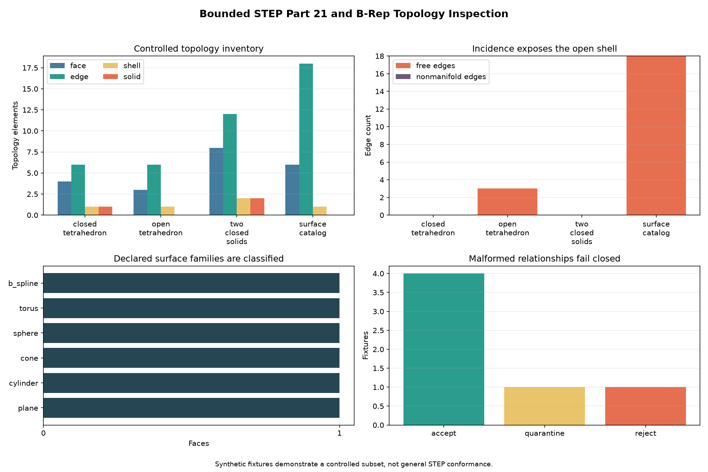

The surface catalog tests declaration extraction. Its triangular face bounds
do not establish valid trimmed geometry on every listed support surface.

## v0.22.0 — Advanced Exchange Structure Samples

Directory: [`fixtures/step-part21-exchange/`](../fixtures/step-part21-exchange/)

Manifest: [`manifest.csv`](../fixtures/step-part21-exchange/manifest.csv)

The [`single_data_control.step`](../fixtures/step-part21-exchange/single_data_control.step)
sample is the same closed tetrahedron used by the v0.21.0 topology study. It is
the geometry-bearing control for v0.22.0: 74 Part 21 entity instances and 97
local occurrence references resolve to four faces, six edges, one shell, one
solid, and no free edges.

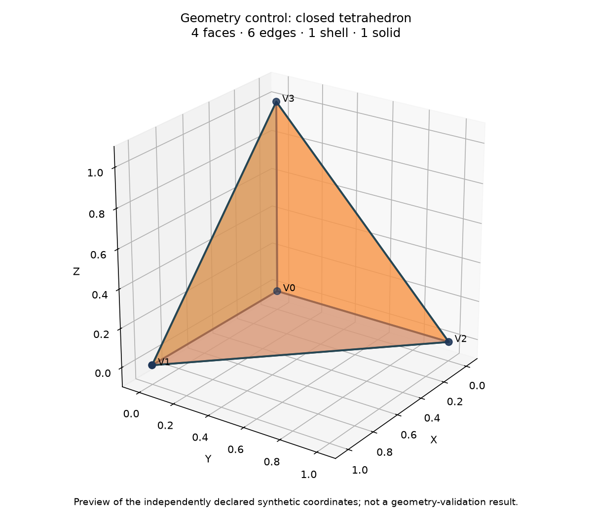

The remaining samples isolate exchange-structure forms or parser boundaries:

| Sample | Purpose | Expected route |
| --- | --- | --- |
| [`multiple_data_sections.step`](../fixtures/step-part21-exchange/multiple_data_sections.step) | Two named DATA sections governed by a declared schema | accept |
| [`complex_entity_instance.step`](../fixtures/step-part21-exchange/complex_entity_instance.step) | One subsuper record with three component records | accept |
| [`utf8_binary_values.step`](../fixtures/step-part21-exchange/utf8_binary_values.step) | Direct UTF-8 string and valid binary token | accept |
| [`anchor_with_tag.step`](../fixtures/step-part21-exchange/anchor_with_tag.step) | Local anchor and one non-schema tag | accept |
| [`external_reference.step`](../fixtures/step-part21-exchange/external_reference.step) | External URI retained without retrieval | quarantine |
| [`signature_present.step`](../fixtures/step-part21-exchange/signature_present.step) | Two Base64 payloads retained without CMS verification | quarantine |
| [`deep_nesting.step`](../fixtures/step-part21-exchange/deep_nesting.step) | Aggregate depth beyond the parser budget | quarantine |
| [`zip_archive.stpz`](../fixtures/step-part21-exchange/zip_archive.stpz) | ZIP signature recognized without extraction | quarantine |
| [`duplicate_entity_across_sections.step`](../fixtures/step-part21-exchange/duplicate_entity_across_sections.step) | Duplicate global entity identifier | reject |
| [`unnamed_multiple_data.step`](../fixtures/step-part21-exchange/unnamed_multiple_data.step) | Missing names on repeated DATA sections | reject |
| [`undeclared_data_schema.step`](../fixtures/step-part21-exchange/undeclared_data_schema.step) | DATA schema absent from FILE_SCHEMA | reject |
| [`invalid_binary.step`](../fixtures/step-part21-exchange/invalid_binary.step) | Non-hex character in a binary token | reject |

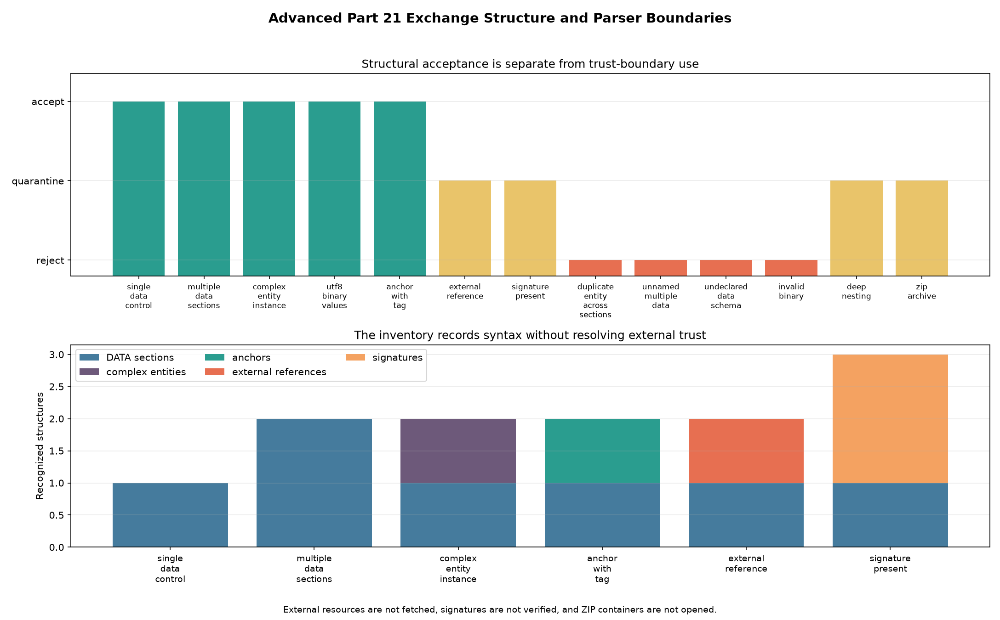

Most v0.22.0 samples intentionally use a minimal synthetic schema vocabulary
and do not define a meaningful CAD shape. The structure diagram is therefore
more honest than fabricating a 3D preview for them.

## v0.23.0 — Unified Source Model Samples

Directory: [`fixtures/step-part21-source-model/`](../fixtures/step-part21-source-model/)

Manifest: [`manifest.csv`](../fixtures/step-part21-source-model/manifest.csv)

The [`geometry_control.step`](../fixtures/step-part21-source-model/geometry_control.step)
sample is byte-identical to the v0.21 closed tetrahedron. Reusing the exact
shape makes the parser refactor measurable: the unified source model retains
74 entities and 97 references, and the compatibility adapter still produces
the same face, edge, shell, and solid observations.


The syntax-focused samples isolate source retention and diagnostics:

| Sample | Purpose | Expected route |
| --- | --- | --- |
| [`trivia_preservation.step`](../fixtures/step-part21-source-model/trivia_preservation.step) | Preserve whitespace, comments, aggregates, and an escaped apostrophe | accept |
| [`utf8_coordinates.step`](../fixtures/step-part21-source-model/utf8_coordinates.step) | Separate character positions from UTF-8 byte positions | accept |
| [`simple_and_complex.step`](../fixtures/step-part21-source-model/simple_and_complex.step) | Parse simple and subsuper records with one grammar | accept |
| [`forward_reference.step`](../fixtures/step-part21-source-model/forward_reference.step) | Retain a reference whose target is defined later | accept |
| [`missing_semicolon.step`](../fixtures/step-part21-source-model/missing_semicolon.step) | Localize a missing entity terminator | reject |
| [`unterminated_comment.step`](../fixtures/step-part21-source-model/unterminated_comment.step) | Localize an open comment at end of input | reject |
| [`nesting_limit.step`](../fixtures/step-part21-source-model/nesting_limit.step) | Stop beyond an explicit aggregate-depth budget | quarantine |
| [`token_length_limit.step`](../fixtures/step-part21-source-model/token_length_limit.step) | Stop beyond an explicit token-character budget | quarantine |
| [`invalid_utf8.step`](../fixtures/step-part21-source-model/invalid_utf8.step) | Reject invalid UTF-8 before grammar construction | reject |

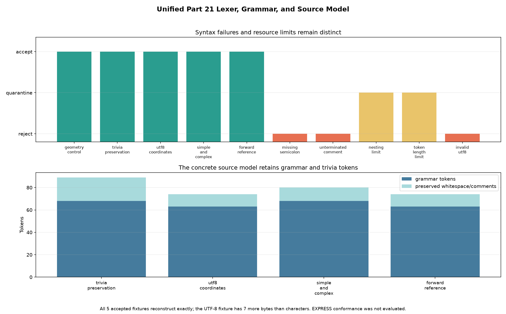

Most samples have no meaningful shape. Their diagram shows syntax decisions
and retained token classes rather than fabricating a geometry preview. The
invalid UTF-8 sample is intentionally not a valid text document and should be
inspected as bytes or through its manifest and observation row.

## v0.24.0 — Edition and Conformance Samples

Directory: [`fixtures/step-part21-conformance/`](../fixtures/step-part21-conformance/)

Manifest: [`manifest.csv`](../fixtures/step-part21-conformance/manifest.csv)

The corpus contains 31 clear-text `.step` inputs and three `.stpz` archives.
Every byte is generated in code and the manifest records its SHA-256 digest,
condition, expected decision, reason code, and edition floor.

| Sample group | Representative samples | Boundary isolated |
| --- | --- | --- |
| Edition 1 core | [`edition1_minimal.step`](../fixtures/step-part21-conformance/edition1_minimal.step), [`edition1_legacy_controls.step`](../fixtures/step-part21-conformance/edition1_legacy_controls.step) | Core exchange and legacy `X`, `X4`, `S/P`, and `N/F` controls |
| Comments and binary | [`edition1_comment.step`](../fixtures/step-part21-conformance/edition1_comment.step), [`invalid_binary.step`](../fixtures/step-part21-conformance/invalid_binary.step) | Non-nested trivia and binary hexadecimal rules |
| Edition 2 structure | [`edition2_multiple_data.step`](../fixtures/step-part21-conformance/edition2_multiple_data.step), [`edition2_section_context.step`](../fixtures/step-part21-conformance/edition2_section_context.step) | Multiple named `DATA` and an Edition 2 header entity |
| Edition 3 text and sections | [`edition3_utf8.step`](../fixtures/step-part21-conformance/edition3_utf8.step), [`edition3_anchor.step`](../fixtures/step-part21-conformance/edition3_anchor.step), [`edition3_value_reference.step`](../fixtures/step-part21-conformance/edition3_value_reference.step), [`edition3_signature.step`](../fixtures/step-part21-conformance/edition3_signature.step) | Direct UTF-8, anchor, external value reference, and signature syntax |
| Edition and class mismatch | [`edition1_multiple_data.step`](../fixtures/step-part21-conformance/edition1_multiple_data.step), [`reference_class_1.step`](../fixtures/step-part21-conformance/reference_class_1.step), [`constant_class_2.step`](../fixtures/step-part21-conformance/constant_class_2.step) | Parsed feature floor versus declared implementation level |
| Numeric and identifier errors | [`invalid_real_exponent.step`](../fixtures/step-part21-conformance/invalid_real_exponent.step), [`zero_occurrence.step`](../fixtures/step-part21-conformance/zero_occurrence.step), [`lowercase_keyword.step`](../fixtures/step-part21-conformance/lowercase_keyword.step) | Strict real, occurrence-name, and keyword syntax |
| Character errors | [`invalid_string_control.step`](../fixtures/step-part21-conformance/invalid_string_control.step), [`invalid_utf8.step`](../fixtures/step-part21-conformance/invalid_utf8.step) | Unknown legacy directive and invalid UTF-8 input |
| ZIP transport | [`zip_root.stpz`](../fixtures/step-part21-conformance/zip_root.stpz), [`zip_missing_root.stpz`](../fixtures/step-part21-conformance/zip_missing_root.stpz), [`zip_unsafe_path.stpz`](../fixtures/step-part21-conformance/zip_unsafe_path.stpz) | Required root and fail-closed path admission without extraction |

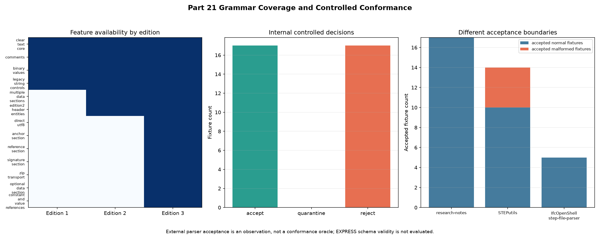

These files intentionally use a synthetic schema vocabulary and generally do
not describe a meaningful 3D shape. The figure shows edition coverage and
acceptance boundaries; the CSV observations remain the validation evidence.

## v0.25.0 — EXPRESS Schema-Model Samples

Directory: [`fixtures/express-schema-model/`](../fixtures/express-schema-model/)

Manifest: [`manifest.csv`](../fixtures/express-schema-model/manifest.csv)

The corpus contains 40 generated `.exp` sources. The manifest records exact
byte length, SHA-256 digest, active resource limits, expected route, and reason
code for every input.

| Sample group | Representative samples | Boundary isolated |
| --- | --- | --- |
| Schema and lexical controls | [`minimal_schema.exp`](../fixtures/express-schema-model/minimal_schema.exp), [`mixed_case.exp`](../fixtures/express-schema-model/mixed_case.exp), [`comments.exp`](../fixtures/express-schema-model/comments.exp) | Schema envelopes, case-insensitive names, and source-preserved trivia |
| Type declarations | [`aggregate_type.exp`](../fixtures/express-schema-model/aggregate_type.exp), [`select_type.exp`](../fixtures/express-schema-model/select_type.exp), [`enumeration_type.exp`](../fixtures/express-schema-model/enumeration_type.exp) | Structured type references and member lists |
| Entity declarations | [`entity_inheritance.exp`](../fixtures/express-schema-model/entity_inheritance.exp), [`derived_attribute.exp`](../fixtures/express-schema-model/derived_attribute.exp), [`inverse_attribute.exp`](../fixtures/express-schema-model/inverse_attribute.exp) | Header relationships and three attribute kinds |
| Interfaces and algorithms | [`use_import.exp`](../fixtures/express-schema-model/use_import.exp), [`function_envelope.exp`](../fixtures/express-schema-model/function_envelope.exp), [`rule_envelope.exp`](../fixtures/express-schema-model/rule_envelope.exp) | Parsed declarations with unresolved imports and opaque executable bodies |
| Lexical and grammar failures | [`invalid_real.exp`](../fixtures/express-schema-model/invalid_real.exp), [`duplicate_declaration.exp`](../fixtures/express-schema-model/duplicate_declaration.exp), [`missing_end_entity.exp`](../fixtures/express-schema-model/missing_end_entity.exp) | Stable rejection reasons and case-insensitive collisions |
| Resource boundary | [`comment_nesting_limit.exp`](../fixtures/express-schema-model/comment_nesting_limit.exp) | Quarantine before accepting excessive nested-comment work |

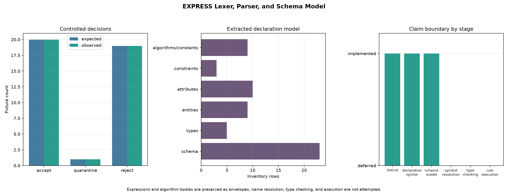

These sources specify no CAD shape and therefore have no geometry preview.
The figure shows the observed routes, model composition, and the boundary
between parsed declarations, opaque envelopes, and deferred semantic stages.

## v0.26.0 — EXPRESS Semantic-Graph Samples

Directory: [`fixtures/express-symbol-resolution/`](../fixtures/express-symbol-resolution/)

Manifest: [`manifest.csv`](../fixtures/express-symbol-resolution/manifest.csv)

The corpus contains 38 generated `.exp` sources. Every source is independently
readable and the manifest records its exact bytes, SHA-256 identity, expected
semantic route, reason code, and active graph limits.

| Sample group | Representative samples | Boundary isolated |
| --- | --- | --- |
| Local symbols and types | [`alias_chain.exp`](../fixtures/express-symbol-resolution/alias_chain.exp), [`select_members.exp`](../fixtures/express-symbol-resolution/select_members.exp), [`constant_bounds.exp`](../fixtures/express-symbol-resolution/constant_bounds.exp) | Terminal domains, select targets, and bounded constants |
| Interfaces | [`use_alias.exp`](../fixtures/express-symbol-resolution/use_alias.exp), [`reference_constant.exp`](../fixtures/express-symbol-resolution/reference_constant.exp), [`import_collision.exp`](../fixtures/express-symbol-resolution/import_collision.exp) | Direct imports, aliases, kinds, and multiple visible candidates |
| Inheritance | [`diamond_inheritance.exp`](../fixtures/express-symbol-resolution/diamond_inheritance.exp), [`qualified_redeclaration.exp`](../fixtures/express-symbol-resolution/qualified_redeclaration.exp), [`inherited_collision.exp`](../fixtures/express-symbol-resolution/inherited_collision.exp) | Shared origins, qualified replacement, and conflicting origins |
| Graph failures | [`alias_cycle.exp`](../fixtures/express-symbol-resolution/alias_cycle.exp), [`inheritance_cycle.exp`](../fixtures/express-symbol-resolution/inheritance_cycle.exp), [`missing_type.exp`](../fixtures/express-symbol-resolution/missing_type.exp) | Cyclic and unresolved states without guessed targets |
| Resource boundary | [`symbol_limit.exp`](../fixtures/express-symbol-resolution/symbol_limit.exp) | Quarantine before exceeding a declared semantic graph budget |


These sources define schema relationships, not CAD instance geometry. The
figure therefore visualizes decisions and graph states rather than inventing
shape previews.

## v0.27.0 — Paired STEP and EXPRESS Validation Samples

Directory: [`fixtures/step-express-validation/`](../fixtures/step-express-validation/)

Manifest: [`manifest.csv`](../fixtures/step-express-validation/manifest.csv)

The corpus contains 40 generated pairs. Each condition has one `.step` exchange
and one `.exp` schema. The manifest binds both file names, byte lengths,
SHA-256 identities, expected decision and reason, and active schema-validation
limits.

| Sample group | Representative pairs | Boundary isolated |
| --- | --- | --- |
| Values and markers | [`scalar_types.step`](../fixtures/step-express-validation/scalar_types.step) + [`scalar_types.exp`](../fixtures/step-express-validation/scalar_types.exp), [`derived_redeclaration.step`](../fixtures/step-express-validation/derived_redeclaration.step) + [`derived_redeclaration.exp`](../fixtures/step-express-validation/derived_redeclaration.exp) | Scalar domains, `$`, and inherited `*` positions |
| Inheritance | [`internal_inheritance.step`](../fixtures/step-express-validation/internal_inheritance.step) + [`internal_inheritance.exp`](../fixtures/step-express-validation/internal_inheritance.exp), [`diamond_inheritance.step`](../fixtures/step-express-validation/diamond_inheritance.step) + [`diamond_inheritance.exp`](../fixtures/step-express-validation/diamond_inheritance.exp) | Ancestor order and shared-origin deduplication |
| References and selects | [`subtype_entity_reference.step`](../fixtures/step-express-validation/subtype_entity_reference.step), [`select_typed_defined.step`](../fixtures/step-express-validation/select_typed_defined.step) | Forward targets, subtype compatibility, and typed select members |
| Staged failures | [`part21_syntax_failure.step`](../fixtures/step-express-validation/part21_syntax_failure.step), [`express_syntax_failure.exp`](../fixtures/step-express-validation/express_syntax_failure.exp), [`express_resolution_failure.exp`](../fixtures/step-express-validation/express_resolution_failure.exp) | Part 21 syntax, EXPRESS syntax, and name resolution stop independently |
| Deferred work | [`complex_mapping_deferred.step`](../fixtures/step-express-validation/complex_mapping_deferred.step), [`constant_reference_deferred.step`](../fixtures/step-express-validation/constant_reference_deferred.step), [`width_constraint_deferred.exp`](../fixtures/step-express-validation/width_constraint_deferred.exp) | Evaluated sets, external values, and width constraints remain quarantine boundaries |

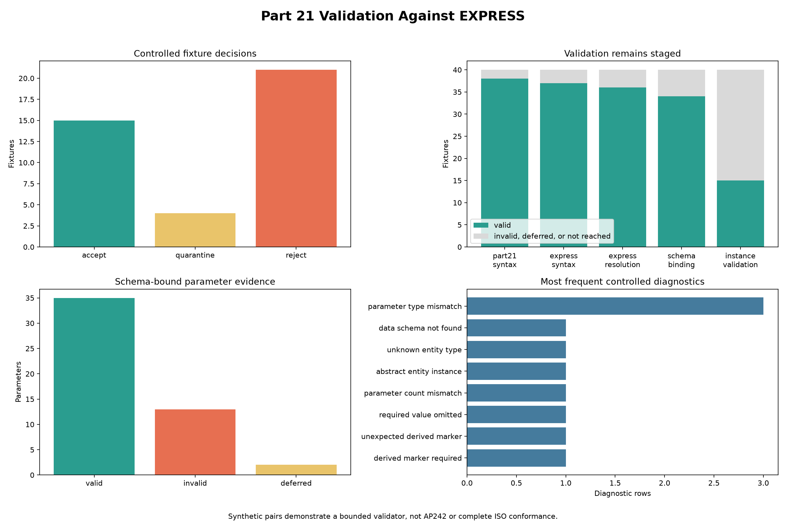

The paired sources describe schema-validation controls rather than meaningful
product geometry. The figure shows validation stages and parameter evidence;
it is not a fabricated CAD preview.

## v0.28.0 — Physical Reference Graph Samples

Directory: [`fixtures/step-graph-queries/`](../fixtures/step-graph-queries/)

Manifest: [`manifest.csv`](../fixtures/step-graph-queries/manifest.csv)

The corpus contains 14 generated STEP files. The manifest binds exact bytes
and SHA-256 identities to expected routes, graph-construction budgets,
traversal roots, and per-fixture depth limits.

| Sample group | Representative samples | Boundary isolated |
| --- | --- | --- |
| Reachability | [`branching_orphan.step`](../fixtures/step-graph-queries/branching_orphan.step), [`isolated_nodes.step`](../fixtures/step-graph-queries/isolated_nodes.step) | Caller-relative reachability, zero indegree, isolation, and orphans |
| Cycles and multiplicity | [`directed_cycles.step`](../fixtures/step-graph-queries/directed_cycles.step), [`duplicate_reference_occurrences.step`](../fixtures/step-graph-queries/duplicate_reference_occurrences.step) | Strongly connected components, self-loops, and repeated edge occurrences |
| Source and ownership | [`nested_parameter_paths.step`](../fixtures/step-graph-queries/nested_parameter_paths.step), [`multiple_data_sections.step`](../fixtures/step-graph-queries/multiple_data_sections.step), [`complex_instance.step`](../fixtures/step-graph-queries/complex_instance.step) | Nested parameter paths, schema-owned DATA sections, and multiple record types on one node |
| Nonlocal targets | [`external_entity.step`](../fixtures/step-graph-queries/external_entity.step), [`external_value_and_constant.step`](../fixtures/step-graph-queries/external_value_and_constant.step), [`unresolved_entity.step`](../fixtures/step-graph-queries/unresolved_entity.step) | External entity and value scopes, schema constants, and unresolved local IDs without retrieval |
| Resource boundaries | [`depth_limited_chain.step`](../fixtures/step-graph-queries/depth_limited_chain.step), [`node_budget.step`](../fixtures/step-graph-queries/node_budget.step), [`edge_budget.step`](../fixtures/step-graph-queries/edge_budget.step), [`syntax_failure.step`](../fixtures/step-graph-queries/syntax_failure.step) | Partial query results, construction quarantine, and parse rejection |

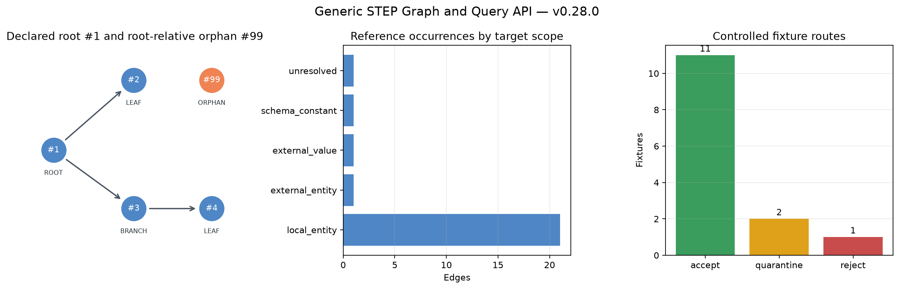

The figure shows source-level reference relationships and controlled query
states. It does not assert product structure, assembly occurrence semantics,
B-Rep ownership, evaluated geometry, or persistent identity.

## v0.29.0 — AP242 Product-Path Samples

Directory: [`fixtures/ap242-product-paths/`](../fixtures/ap242-product-paths/)

Manifest: [`manifest.csv`](../fixtures/ap242-product-paths/manifest.csv)

The corpus contains 14 generated STEP files. The manifest binds each exact
byte stream and SHA-256 identity to an expected semantic route and explicit
product-definition, path, relation, item, and unit work budgets.

| Sample group | Representative samples | Boundary isolated |
| --- | --- | --- |
| Resolved paths | [`ap242_block_path.step`](../fixtures/ap242-product-paths/ap242_block_path.step), [`ap242_multiple_representations.step`](../fixtures/ap242-product-paths/ap242_multiple_representations.step) | Product, formation, definition, shape, representation, item, context, and unit roles |
| Representation subtype | [`ap242_advanced_brep_root.step`](../fixtures/ap242-product-paths/ap242_advanced_brep_root.step) | Controlled advanced B-rep representation root without geometry evaluation |
| Optional and subset boundaries | [`product_without_shape.step`](../fixtures/ap242-product-paths/product_without_shape.step), [`unsupported_representation.step`](../fixtures/ap242-product-paths/unsupported_representation.step), [`context_without_units.step`](../fixtures/ap242-product-paths/context_without_units.step) | Absent or unsupported semantic evidence remains quarantine |
| Schema boundary | [`ap214_schema_boundary.step`](../fixtures/ap242-product-paths/ap214_schema_boundary.step) | Familiar entity names do not establish AP242 interpretation |
| Invalid and bounded routes | [`wrong_formation_target.step`](../fixtures/ap242-product-paths/wrong_formation_target.step), [`unresolved_formation.step`](../fixtures/ap242-product-paths/unresolved_formation.step), [`path_budget.step`](../fixtures/ap242-product-paths/path_budget.step) | Wrong type, absent target, and semantic work limit |

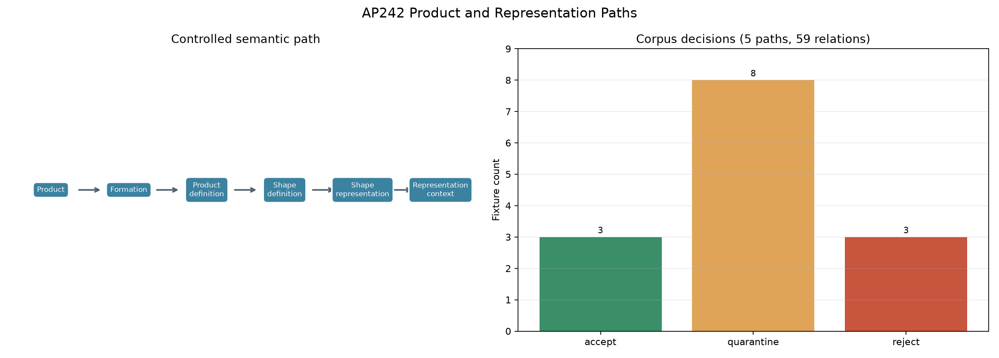

The representative block is encoded with product and shape context sufficient
for the controlled path query. The advanced B-rep sample reuses the v0.21.0
closed tetrahedron, so its shape remains inspectable through the existing
geometry control below. The path figure visualizes semantic relationships,
not evaluated solid geometry or AP242 conformance.


## v0.30.0 — AP242 Assembly and Placement Samples

Directory: [`fixtures/ap242-assemblies/`](../fixtures/ap242-assemblies/)

Manifest: [`manifest.csv`](../fixtures/ap242-assemblies/manifest.csv)

The corpus contains 17 generated STEP files. Each readable file encodes only
synthetic products and block primitives. The manifest binds the exact bytes
and SHA-256 identity to an expected assembly route and explicit occurrence,
path, relation, depth, and unit-conversion budgets.

| Sample group | Representative samples | Boundary isolated |
| --- | --- | --- |
| Placement direction | [`single_translation.step`](../fixtures/ap242-assemblies/single_translation.step), [`rotated_occurrence.step`](../fixtures/ap242-assemblies/rotated_occurrence.step), [`source_frame_offset.step`](../fixtures/ap242-assemblies/source_frame_offset.step) | Translation, rotation, and child-frame inverse order |
| Nested reuse | [`nested_reuse.step`](../fixtures/ap242-assemblies/nested_reuse.step) | Distinct occurrences of one reusable definition and parent-to-root composition |
| Unit conversion | [`conversion_based_inch.step`](../fixtures/ap242-assemblies/conversion_based_inch.step) | Conversion-based child unit normalized into the parent millimetre frame |
| Optional and subset boundaries | [`missing_occurrence_shape.step`](../fixtures/ap242-assemblies/missing_occurrence_shape.step), [`unsupported_transform_operator.step`](../fixtures/ap242-assemblies/unsupported_transform_operator.step), [`missing_length_unit.step`](../fixtures/ap242-assemblies/missing_length_unit.step) | Missing evidence and unsupported forms remain quarantine |
| Invalid and bounded routes | [`wrong_representation_order.step`](../fixtures/ap242-assemblies/wrong_representation_order.step), [`assembly_cycle.step`](../fixtures/ap242-assemblies/assembly_cycle.step), [`unit_conversion_cycle.step`](../fixtures/ap242-assemblies/unit_conversion_cycle.step), [`assembly_depth_budget.step`](../fixtures/ap242-assemblies/assembly_depth_budget.step) | Direction mismatch, cycles, and semantic work limits |

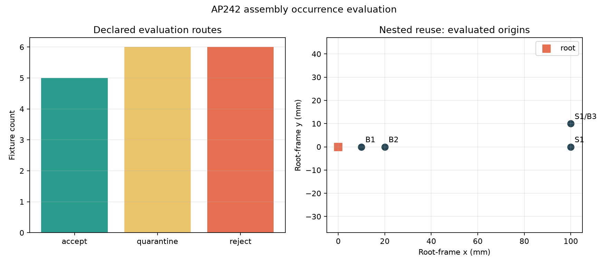

The right panel is a coordinate-frame view of evaluated occurrence origins,
not a kernel rendering of moved solids. The STEP files include block geometry
so the exchange records remain inspectable, but v0.30.0 does not tessellate,
transform, intersect, or validate those solids.

## v0.31.0 — Geometry-Kernel Round-Trip Sample

Directory: [`fixtures/geometry-kernel-selection/`](../fixtures/geometry-kernel-selection/)

Manifest: [`manifest.csv`](../fixtures/geometry-kernel-selection/manifest.csv)

The corpus contains one STEP file generated headlessly by the pinned optional
OCCT route. `ocp_box.step` is a 10 × 20 × 30 synthetic box with a normalized
writer timestamp and process counter. Its committed SHA-256 binds the visible
sample to the round-trip observations.

| Sample | Construction | Recorded round-trip evidence |
| --- | --- | --- |
| [`ocp_box.step`](../fixtures/geometry-kernel-selection/ocp_box.step) | `BRepPrimAPI_MakeBox(10.0, 20.0, 30.0)` | 1 solid, 6 faces, 12 unique edges, and 8 unique vertices before and after STEP exchange; both shapes pass the selected kernel check |

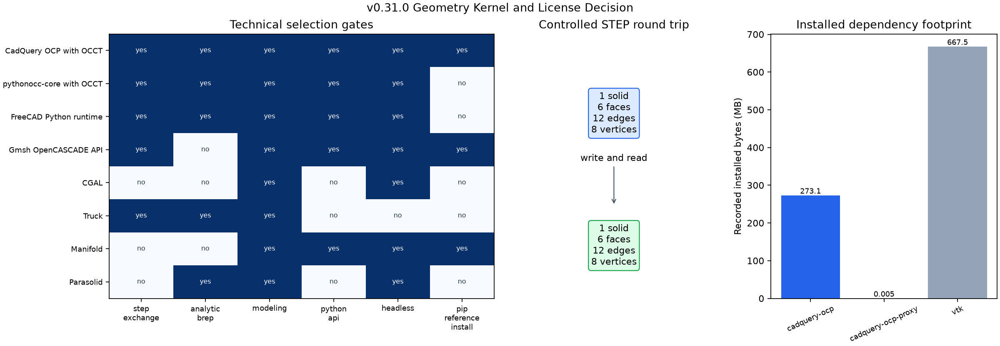

The figure includes the candidate gate matrix and the topology counts rather
than a tessellated rendering. v0.31.0 proves one construction and exchange
probe, not face geometry, visual equivalence, general STEP compatibility, or
independent-kernel agreement. The strict internal Part 21 parser rejects the
writer's `.PCURVE_S1.` spelling; the exact boundary remains visible in the
probe CSV.

## v0.32.0 — Evaluated Analytic Face Sample

Directory: [`fixtures/evaluated-face-geometry/`](../fixtures/evaluated-face-geometry/)

Manifest: [`manifest.csv`](../fixtures/evaluated-face-geometry/manifest.csv)

`analytic_faces.step` contains two bounded planes and one bounded cylindrical
lateral face generated from fixed numeric controls. One plane has reversed
topological orientation. Each face occupies a distinct location so the study
can match it by surface type and nearest independent analytic centroid rather
than relying on traversal order.

| Face | Construction | Intended visual and numeric evidence |
| --- | --- | --- |
| `plane_forward` | 5 × 5 rectangular parameter domain at the origin | Area 25, centroid `(0.5, 1.5, 0)`, support and oriented normal `+Z` |
| `plane_reversed` | 3 × 4 rectangular parameter domain at `(20, 0, 5)` | Area 12, support normal `+Y`, oriented normal `-Y` |
| `cylinder_forward` | Radius 2.5, angular span `[0.3, 1.7]`, axial span `[-1, 4]` | Area 17.5, analytic area centroid distinct from the UV-midpoint sample |

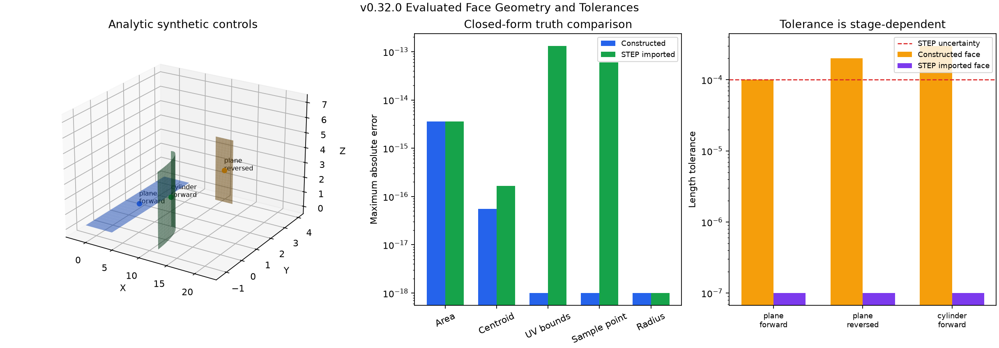

The figure's left panel is generated directly from the independent plane and
cylinder equations, so the shapes remain inspectable without relying on a
viewer. The committed STEP bytes are also available for external visual
inspection. The sample demonstrates one pinned analytic regression contract;
it does not cover seams, holes, degenerate trims, B-splines, general STEP
interoperability, or per-face tolerance preservation.

## v0.33.0 — Edge Curves, P-Curves, and Seam Sample

Directory: [`fixtures/edge-curve-evaluation/`](../fixtures/edge-curve-evaluation/)

Manifest: [`manifest.csv`](../fixtures/edge-curve-evaluation/manifest.csv)

`analytic_edge_faces.step` contains one bounded plane, one partial cylindrical
face, and one full-period cylindrical lateral face generated from fixed
numeric controls. The full cylinder makes the seam directly inspectable: its
three unique edges form four oriented wire occurrences because one axial edge
is used at both periodic U boundaries.

| Face | Construction | Intended visual and numeric evidence |
| --- | --- | --- |
| `planar_rectangle` | U `[-2, 3]`, V `[-1, 2]` | Four line edges and four linear p-curves |
| `partial_cylinder` | Radius 2, U `[0.25, 1.75]`, V `[-1, 3.5]` | Two axial lines, two circular arcs, and no seam |
| `closed_cylinder` | Radius 3, U `[0, 2π]`, V `[0, 4]` | Two full circles plus one axial seam with p-curves at `u=0` and `u=2π` |

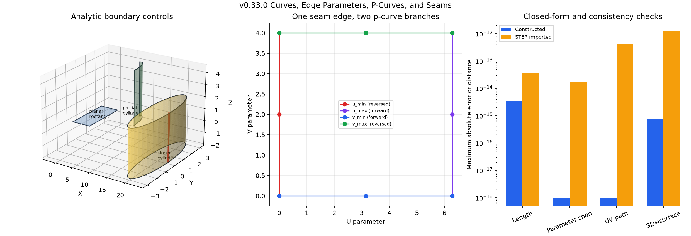

The STEP fixture retains 11 `EDGE_CURVE`, 10 `SURFACE_CURVE`, 12 `PCURVE`,
and one `SEAM_CURVE` instances. These are writer-specific observations. The
sample does not cover degenerate edges, singularities, inner wires, spline
curves, adaptive consistency checks, repair, or another shape kernel.

## v0.34.0 — Wire Trimming and Face Orientation Sample

Directory: [`fixtures/wire-trimming-evaluation/`](../fixtures/wire-trimming-evaluation/)

Manifest: [`manifest.csv`](../fixtures/wire-trimming-evaluation/manifest.csv)

`analytic_trimmed_faces.step` contains two planar frames, one full-period
cylindrical lateral face, and one natural sphere generated from fixed numeric
controls. It is the first committed geometry fixture with inner wires and
degenerate pole edges.

| Face | Construction | Intended visual and numeric evidence |
| --- | --- | --- |
| `planar_frame_forward` | Outer `[-4,4] × [-3,3]`, hole `[-1,2] × [-1,1]` | Material area `42`; outer/inner signed UV areas `+48/-6` |
| `planar_frame_reversed` | Translated copy with the face reversed | The same area and classifications; signed UV areas `-48/+6` |
| `closed_cylinder` | Radius `2`, U `[0,2π]`, V `[-2,2]` | Three unique edges and four uses because the seam occurs twice |
| `natural_sphere` | Radius `3`, natural U/V bounds | One seam used twice and two degenerate pole edges without 3D curves |

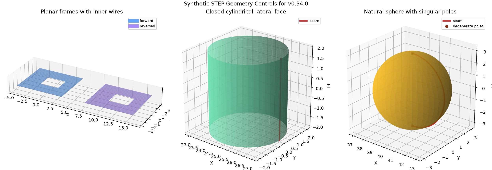

The [parameter-domain evaluation figure](../results/wire_trimming_evaluation.png)
separately shows winding direction, signed loop areas, and closure evidence.

The 22,605-byte fixture has SHA-256
`224f0d295a684602264ef82e30b6632041570490b5514788ca90fd9796e47366`.
All sixteen point classifications match after import. The sample does not
cover curved p-curve integration, invalid or self-intersecting wires, nested
islands, splines, non-manifold uses, repair, or another shape kernel.

## v0.35.0 — Shell and Solid Validity Samples

Directory: [`fixtures/shell-solid-validity/`](../fixtures/shell-solid-validity/)

Manifest: [`manifest.csv`](../fixtures/shell-solid-validity/manifest.csv)

Seven separate STEP files retain one controlled condition per input so that a
successful import, global topology, shell grouping, and backend validity can be
compared without relying on spatial matching inside one compound.

| File | Bytes | SHA-256 | Intended evidence |
| --- | ---: | --- | --- |
| `valid_box.step` | 15,377 | `25ba866189fc0ea901e282dfc620750b086022408cdd438343027ce01b8d3993` | Closed outward genus-zero solid; volume `120` |
| `reversed_box.step` | 15,403 | `b6df0cb5a01364a3343ac236c6a47208f5a9019fdbdf3284193770fb5aaf4f74` | Whole-solid reversal and signed-volume normalization |
| `open_box.step` | 13,629 | `96ebf08a0f5f343a5e6ce441db472970b0b1ad0d9ff73c7139f93387ecf44f07` | Four boundary edges and an open-shell report |
| `flipped_face_box.step` | 15,412 | `b8e8b352ad42c96195d82f73919f6f776964f2bf1fe2b2a3c99696deb4ddec30` | Incidence closure with one inconsistent face orientation |
| `nonmanifold_fan.step` | 7,751 | `607e98aa4115e5bc434706c45c02be01b1bd23afbf8c8238e7db1d611107ce6f` | Three oriented uses and three incident faces on one edge |
| `valid_torus.step` | 4,150 | `40b20c6c119b07f98a53d60166ddcbcb41af6fb41edb236a49e09f8b0ad3439a` | Closed genus-one solid with `V=1, E=2, F=1, χ=0` |
| `disconnected_faces.step` | 6,406 | `797cf27124a62cac6edeaaf0860a694b2c9449f03e788e6cabeac303a026cc8c` | Two disconnected triangular face components |

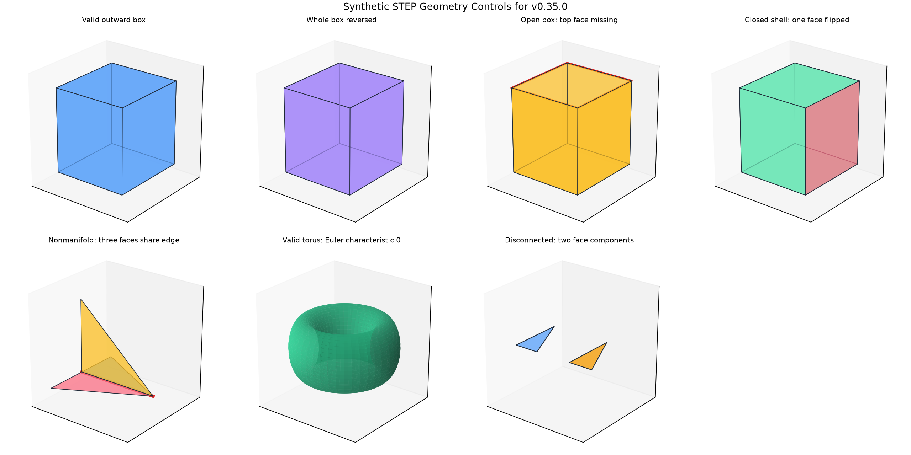

All global control topology values survive import. Representation details do
not: the reversed solid becomes positive-volume, the flipped face becomes
consistent, and the nonmanifold and disconnected shell containers are split.
The fixtures are regression evidence for one writer/reader route, not a
general invalid-STEP corpus, repair benchmark, or cross-kernel contract.

## v0.36.0 — Tolerance, Sewing, and Healing Samples

Directory: [`fixtures/tolerance-sewing-healing/`](../fixtures/tolerance-sewing-healing/)

Manifest: [`manifest.csv`](../fixtures/tolerance-sewing-healing/manifest.csv)

Ten normalized STEP files retain operation inputs and selected outputs. The
manifest contains each full SHA-256, byte length, operation role, backend
version, STEP processor, entity counts, and imported topology.

| Sample group | Files | Intended evidence |
| --- | ---: | --- |
| Independent face inputs | 3 | Coincident, `5e-7` gap, and `5e-5` gap controls before sewing |
| Selected sewn outputs | 3 | Shared topology created at requested tolerance `1e-4` while support faces remain fixed |
| Orientation controls | 3 | Valid no-op input plus one-face-flipped input and reoriented output |
| Rejected tolerance output | 1 | Closed topology whose in-memory local tolerance cap makes native validity false |

The STEP read-back of the rejected tolerance sample is valid in the fixed
translator route. The file therefore remains evidence of exchange
normalization, not a serialization contract for the invalid in-memory state.

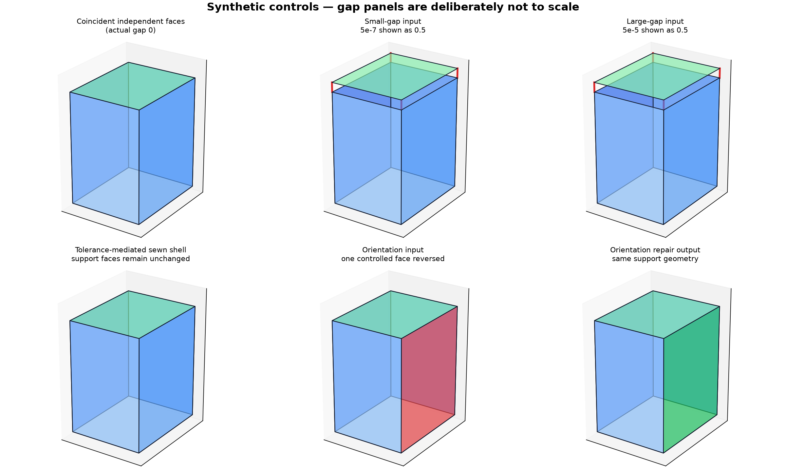

The two nonzero gaps are deliberately exaggerated in the preview. Exact gap,
requested tolerance, stored local tolerance, closure, and validity evidence
remain in the CSV and operation log.

## v0.37.0 — Manifoldness and Self-Intersection Samples

Directory: [`fixtures/manifold-self-intersection/`](../fixtures/manifold-self-intersection/)

Manifest: [`manifest.csv`](../fixtures/manifold-self-intersection/manifest.csv)

The normalized files separate combinatorial vertex neighborhoods from
geometric relationships between otherwise separate shapes. The manifest binds
each generated input to its exact bytes, backend versions, STEP processor, and
reader/writer status.

| Sample | Bytes | SHA-256 | Intended evidence |
| --- | ---: | --- | --- |
| `valid_tetrahedron.step` | 9,415 | `4f92825f59a9698dc8ad172829f9de6f9594f1dc1b5f744ee7584dc4bf189bfe` | Four closed-manifold vertex links |
| `pinched_tetrahedra.step` | 17,196 | `9e73f0001f81441bdef18f3304b00137bd7ff8b20b2fc5627016a5c84bc4dad7` | Two face uses per edge but a disconnected shared-vertex link |
| `nonmanifold_fan.step` | 7,734 | `87bb0c4465282fb4f7b4a656218c247dd530e9e180c22593dffe0f6d69f1f056` | One three-use edge and branching endpoint links |
| `separated_edges.step` | 5,516 | `d1b6cff0a56cfd1bc51716ca9163c1a45527fa91c1910941bcf708afa9dbc514` | No edge/edge interference in one aggregate B-Rep |
| `crossing_edges.step` | 5,589 | `7244fbf7e21ff7f56a64de2a132a8f28db8b2c2d50b6497dca42fd56e9907650` | One interior edge/edge interference point in one aggregate B-Rep |
| `disjoint_boxes.step` | 32,477 | `7e678aa0afba90d1868800c00af3f55fc3c5ec792800c240fd35d751e7a71d7b` | Unit separation with no contact |
| `vertex_touching_boxes.step` | 32,477 | `471ed95b7ed27dae9fbdd5e5f1b8b4b7f300b9d04e819087b96b921f6fee1fa8` | Zero-dimensional contact |
| `edge_touching_boxes.step` | 32,477 | `d49664ab71807b68a96c9a730af24609809b5511bbc5083b5359cc7ebc403528` | One-dimensional contact of length `4` |
| `face_touching_boxes.step` | 32,477 | `28d662153361dde8b68a8d6b92193c15150c4f4fbe3c89eec54603df355c71f2` | Two-dimensional contact of area `16` |
| `overlapping_boxes.step` | 32,477 | `7a13118e3af2438d2773e42e72c6a47bd8950b05a2f91c1c035f4088ddf88d46` | Three-dimensional common volume `9` |
| `separated_faces.step` | 10,723 | `eec3e89b621a43f18b5f25a5d58c1f2ec8da61a6c5a92d4ca89c1ce8d8dc2d1f` | No face/face interference and unit separation in one aggregate B-Rep |
| `crossing_faces.step` | 10,723 | `19f0260f2ab80fc36b5c43609483b9bb899de9d23546bc7ed82e057cbaa33957` | Transverse section edge of length `2` |

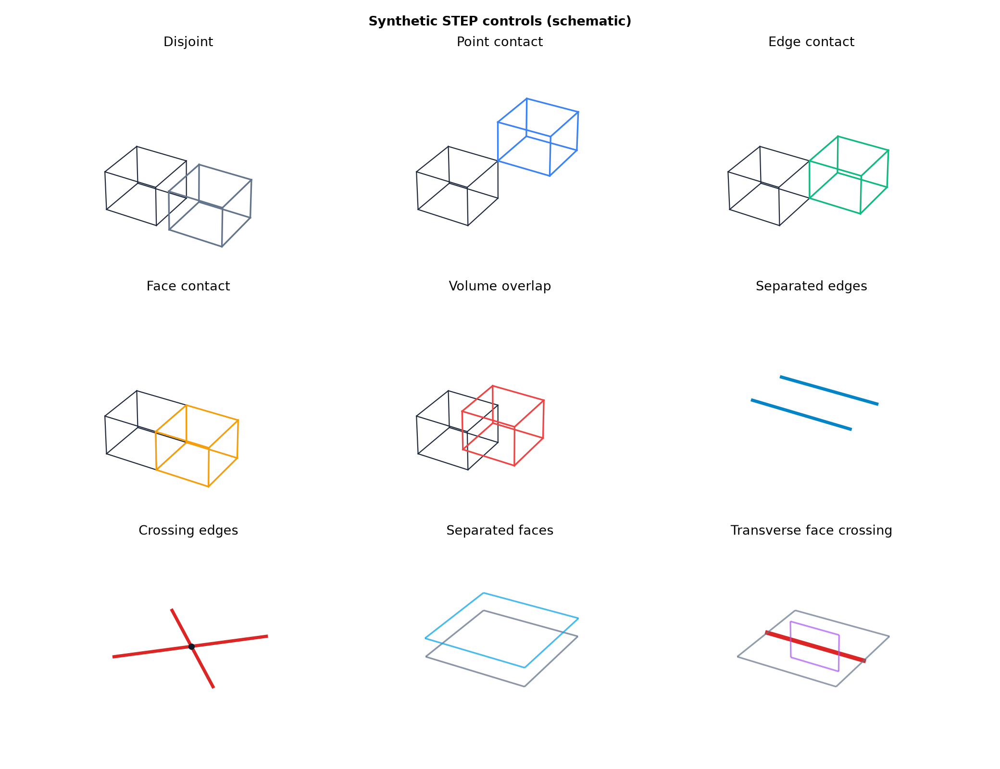

The STEP files are inspection and regression samples for one pinned route.
They do not establish a general contact policy, curved-shell self-intersection
proof, persistent topology identity, or independent-kernel agreement. The
edge and face pairs are intentionally stored inside one aggregate so the
single-argument checker result is not inferred from two independent calls.

## v0.38.0 — Void, Inner-Shell, and Composite-Solid Samples

Directory: [`fixtures/solid-regions/`](../fixtures/solid-regions/)

Manifest: [`manifest.csv`](../fixtures/solid-regions/manifest.csv)

Ten normalized files separate shell containment and orientation from scalar
volume, and container type from shared-face connectivity. The manifest records
exact bytes, hashes, backend versions, STEP processor status, and selected STEP
solid/shell entity counts.

| Sample | Bytes | SHA-256 | Intended evidence |
| --- | ---: | --- | --- |
| `single_outer_box.step` | 15,390 | `1dc5a6cca9e43b1deacf23c8283969d060138a9d18ac1988871d83b0d4a1ae7c` | One outer shell and material volume `480` |
| `centered_void_box.step` | 29,279 | `0d277c1d5e1f297a872bd4e114588bde274a683cb1d4d43c43fa5f1cd0bf7b9a` | One contained, correctly oriented void and material volume `464` |
| `two_void_box.step` | 43,199 | `76894d5c141082fc14187ac0d708365fab021a8047619fbdd8a7ad95b3b7a37b` | Two disjoint void shells and material volume `560` |
| `wrong_void_orientation.step` | 29,279 | `b89766e35383371e05589957901ee06ee767b146463721e6abe0058df1505de0` | Correct containment with the wrong inner-shell sign before import |
| `outside_void_shell.step` | 29,305 | `373443b23873b1ba8bc5189fdd5710e7ce913daeb18b7172a02a52ff7a85b2f9` | Reversed shell outside the body despite constructed volume `464` |
| `overlapping_void_shells.step` | 43,242 | `a0f9e555825cdc91710c51858169d7ba37c0602bb8c5e8b5dabd0bc5459cfc72` | Two depth-one voids with volume-`9` partial overlap |
| `material_island_compound.step` | 46,491 | `89ba9609fd4376354cd1db5f4e41bc032841d476bbc0afca5f02ab74222df97a` | A second material solid nested inside a void |
| `shared_face_compsolid.step` | 32,477 | `b4d61a543036442b8a6bfc66315c5a4d0451a79bfbf85078b02b2257517e7e00` | Connected two-cell composite-solid input whose shared identity is lost on import |
| `disconnected_compsolid.step` | 32,477 | `29cb8e157efabc7c172bff37faf8a78f7d905465535530154f5650a6bbd4bc89` | Invalid disconnected composite-solid claim |
| `disjoint_compound.step` | 32,477 | `29cb8e157efabc7c172bff37faf8a78f7d905465535530154f5650a6bbd4bc89` | Generic collection with the same emitted STEP bytes as the disconnected composite-solid control |

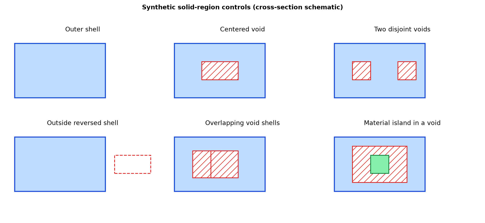

The identical bytes for the disconnected composite solid and generic compound
show that this writer route does not preserve their original kernel-container
distinction. The samples do not prove general nonconvex containment or
cross-translator preservation.

## v0.39.0 — Face- and Edge-Correspondence Samples

Directory: [`fixtures/shape-correspondence/`](../fixtures/shape-correspondence/)

Manifest: [`manifest.csv`](../fixtures/shape-correspondence/manifest.csv)

Four normalized files isolate uniquely distinguishable planar regions, whole-
shape reversal, same-domain face and edge merging, and deliberate ambiguity.
The manifest binds exact bytes and hashes to the pinned STEP writer and reader.

| Sample | Bytes | SHA-256 | Intended evidence |
| --- | ---: | --- | --- |
| `asymmetric_prism.step` | 19,435 | `5c29f5c0c063ca63413d1722ce2b5404badd0c2806a991f9dc189c578a11fc68` | Seven analytically distinguishable planar faces and 15 open line edges |
| `reversed_box.step` | 15,377 | `74aa7e419a37b8a7012edb9b341ee0b88747cbd7c029f7dca0849553c8c72152` | Six planar faces and 12 open line edges despite whole-shape reversal |
| `split_box.step` | 24,503 | `0c5831dd613855b963af8f4c1e70cd04516077881350a03f3b62181bb2c61153` | Ten faces and 20 edges that become six faces and 12 edges after same-domain healing |
| `coincident_faces.step` | 10,725 | `bd9856b83799b8453b4852d0650f0219d17608d52caddd1352f7fbb045e5c460` | Two indistinguishable faces and eight source edges that each retain two candidate targets |

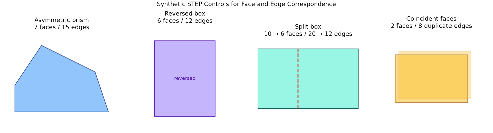

The correspondence experiment assigns fresh local face and edge indices at
each stage. Its 56 face descriptors produce 37 candidates and 35 source
relations: STEP import resolves 23 faces one-to-one and abstains for two
ambiguous sources, while healing records two one-to-one and eight many-to-one
relations in four merge groups. All ten healing-face relations agree with the
separately recorded operation history.

The 122 edge descriptors produce 79 candidates and 75 source relations. STEP
import resolves 47 edges one-to-one and abstains for eight ambiguous sources.
Same-domain healing changes the split box from 20 edges to 12, with eight
`one_to_one_modified`, eight many-to-one relations in four merge groups, and
four deleted source edges; all 20 relations agree with operation history.
None of the 75 edge relations reports direct `IsSame` or `IsPartner` identity.
Edge geometry, incident-face topology support, operation history, and direct
identity checks remain separate evidence columns rather than interchangeable
proofs.

The controls contain only planar faces and open line edges in fixed frames.
They do not provide persistent names, topological identity, semantic
provenance, recovered design history, moving-frame correspondence, or general
curved and closed-edge matching.

## v0.40.0 — Rule-Based Feature-Recognition Samples

Directory: [`fixtures/feature-recognition/`](../fixtures/feature-recognition/)

Manifest: [`manifest.csv`](../fixtures/feature-recognition/manifest.csv)

Nine generated controls and their normalized STEP fixtures isolate five
geometry-only feature families, two negative controls, and one deliberate
design-intent ambiguity. The manifest binds exact bytes and hashes to the
pinned STEP writer and reader.

| Sample | Bytes | SHA-256 | Intended evidence |
| --- | ---: | --- | --- |
| `plain_block.step` | 15,390 | `1e7a3ecda9402ee740bf40fbae47a384f4c8bbf6dd5a131bc8f2b06b1bcea0e3` | Feature-free negative control |
| `through_hole.step` | 19,001 | `c968f97ab06be32a631aedb3fd526d43e3de49f40154b3c7508b4e118bb54543` | Through-hole candidate with diameter `2.5` and depth `6` |
| `blind_hole.step` | 19,207 | `5dd90a8675941d66c4226aaf50a058a2f9b1e3b88d4b5a67452c0b0d206ba6d5` | Blind-hole candidate with diameter `2` and depth `3.5` |
| `stepped_block.step` | 22,389 | `d3dbec2139d94d6bb4efbbed5453759ad2d243c2ec6fa9e49cf6cd2018606b9d` | Open-step candidate with height `2` and span `8` |
| `through_slot.step` | 31,908 | `7bad2742a1a43cae093fc186ac85cd1d7497d46f27df6272f61f4611475b6829` | Through-slot candidate with width `2`, total length `6`, and depth `4` |
| `chamfer_operation.step` | 18,884 | `1cf397f42b551b726b788d041595179769b4b87f1ad8bb9837a6ab76924931c7` | Operation-built `45`-degree chamfer-like boundary |
| `equivalent_bevel.step` | 19,186 | `2d3d807b63e31301d443056ba1564394bb4d13f9d7ced2ffe72a53d09e5ff62d` | Direct-profile bevel with the same final controlled boundary |
| `fillet_operation.step` | 19,982 | `c10fee8a84fc0205bc5afd8dfbb089f8f41d0e2c1fe6e19cb2b29020729b5758` | Constant-radius fillet-like candidate with radius `1` and `90`-degree sweep |
| `cylindrical_boss.step` | 19,217 | `1d6031f6491207d92cde8dbb41691a3a54d4515af02ae887f85453299b7163b4` | External-cylinder negative control for a hole-only rule |

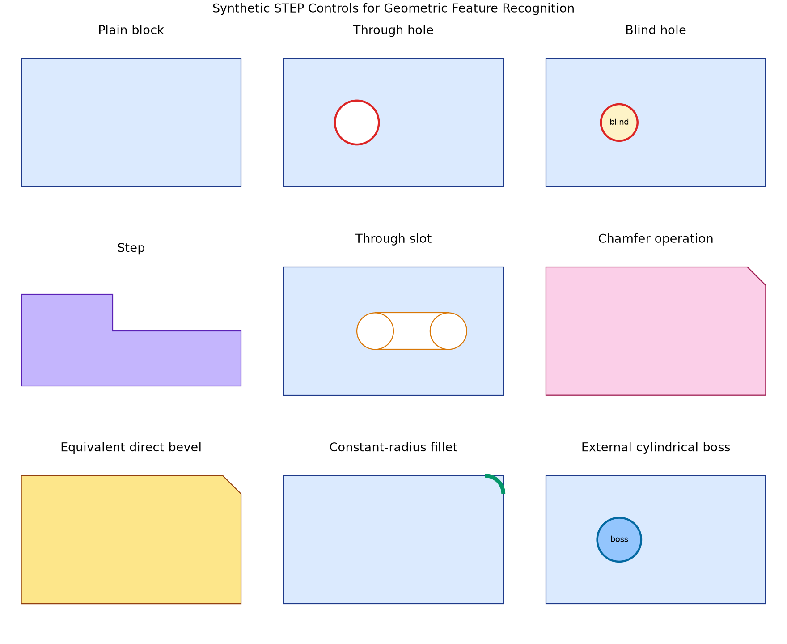

Across constructed and STEP-imported stages, the experiment records 136 face-
attribute rows, 282 face-adjacency rows, 14 candidate rows, 18 whole-shape
observation rows, and two equivalent-boundary comparison rows. Each stage has
seven candidates. All 14 candidate classifications and all 14 controlled
dimension comparisons match their registered truth. The maximum controlled-
truth errors are `3.9612757518625585e-13` model units for length and
`5.8832938520936295e-12` degrees for angle. The plain block and external
cylindrical boss produce zero false positives.

The operation-built chamfer and directly profiled equivalent bevel have the
same controlled final boundary at both stages: `V=10`, `E=15`, `F=7`, one
shell, one solid, volume `572`, and zero Boolean difference volume in both
directions. Both receive a chamfer-like geometric candidate, while
`design_intent_proven` remains false for every candidate. The rules cover only
the generated through and blind holes, open step, through slot, chamfer-like
faces, and fillet-like faces. They are neither feature-history reconstruction
nor a general feature recognizer.

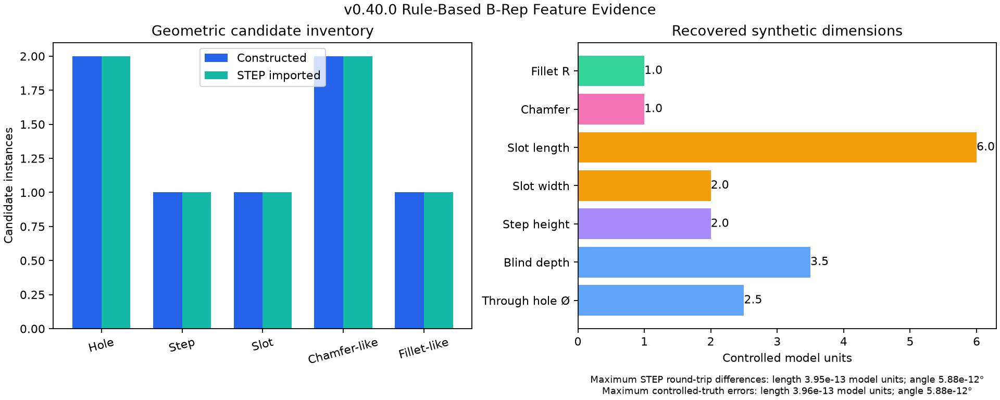

## v0.41.0 — Face-Level Analysis Samples

Directory: [`fixtures/face-analysis/`](../fixtures/face-analysis/)

Manifest: [`manifest.csv`](../fixtures/face-analysis/manifest.csv)

Five normalized STEP fixtures cover solid ownership, one open-shell case,
inner planar wires, and six support-surface families. The manifest binds each
file to the pinned writer, reader, and exact hash.

| Sample | Bytes | SHA-256 | Intended evidence |
| --- | ---: | --- | --- |
| `through_hole_solid.step` | 19,001 | `c968f97ab06be32a631aedb3fd526d43e3de49f40154b3c7508b4e118bb54543` | Six planes, one cylinder, inner wires, solid/shell parents, and adjacency |
| `conical_solid.step` | 5,722 | `3afc40ee90a8ab671a249206bbe6bdae57a6a9a6317a4a34c6f85ef1cb8aa8e2` | Two planar caps, one cone, and signed axis/semi-angle parameterization |
| `spherical_solid.step` | 2,121 | `221bec5d9d90a16317294d5d85e34d2e8b551a2aa3a3200e57f7a159e287fb52` | One complete analytic sphere and periodic self-seam boundary |
| `toroidal_solid.step` | 4,139 | `163ae8bc3155ac55f0fdc35bcab9b8f4102cabd8c2d886566eda51f1c1a9f104` | One complete torus with major and minor radii |
| `bspline_shell.step` | 5,836 | `bd5045460f860f81cd0593eeb81fbb18df91665c6d0a579b721ec040fb67e7e6` | One bicubic B-spline face with a shell parent and no solid parent |

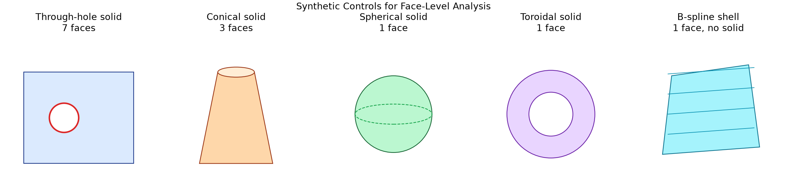

Each stage contains 13 face rows: eight planes and one cylinder, cone, sphere,
torus, and B-spline. The evaluation matches faces by surface type and nearest
centroid rather than equating local indices. All 13 pairs retain orientation
and boundary counts. The samples do not establish persistent naming, arbitrary
surface coverage, XCAF metadata transfer, or cross-kernel portability.

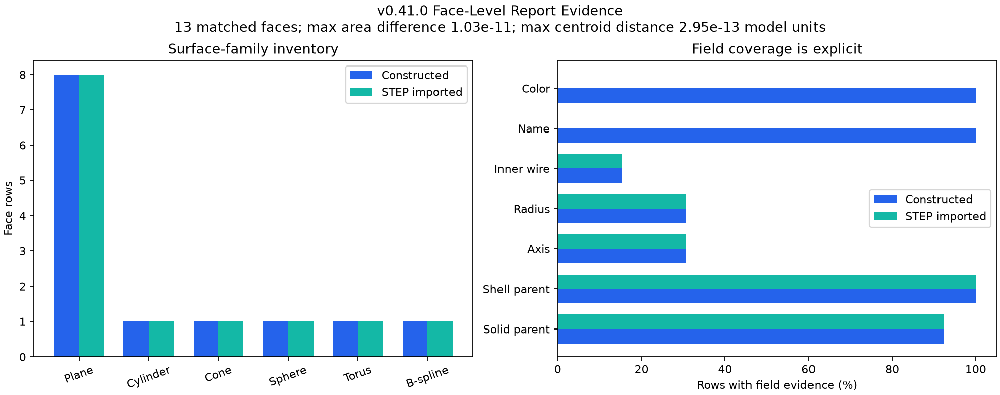

## v0.42.0 — Tessellation Diagnostic Samples

Directory: [`fixtures/tessellation-diagnostics/`](../fixtures/tessellation-diagnostics/)

Manifest: [`manifest.csv`](../fixtures/tessellation-diagnostics/manifest.csv)

Three normalized STEP fixtures isolate analytic curvature, trimmed topology,
and a non-analytic support surface. The experiment reads each fixture through
the STEP transfer process before remeshing it under four deterministic
conditions.

| Sample | Bytes | SHA-256 | Intended evidence |
| --- | ---: | --- | --- |
| `meshing_through_hole.step` | 19,001 | `c968f97ab06be32a631aedb3fd526d43e3de49f40154b3c7508b4e118bb54543` | Seven-face trimmed solid, planar regions, cylindrical curvature, and angular-deflection sensitivity |
| `meshing_sphere.step` | 2,121 | `221bec5d9d90a16317294d5d85e34d2e8b551a2aa3a3200e57f7a159e287fb52` | Closed analytic curvature, coupled refinement response, and explicit pole degeneracy |
| `meshing_bspline_shell.step` | 5,836 | `bd5045460f860f81cd0593eeb81fbb18df91665c6d0a579b721ec040fb67e7e6` | Open B-spline face and linear-deflection sensitivity |

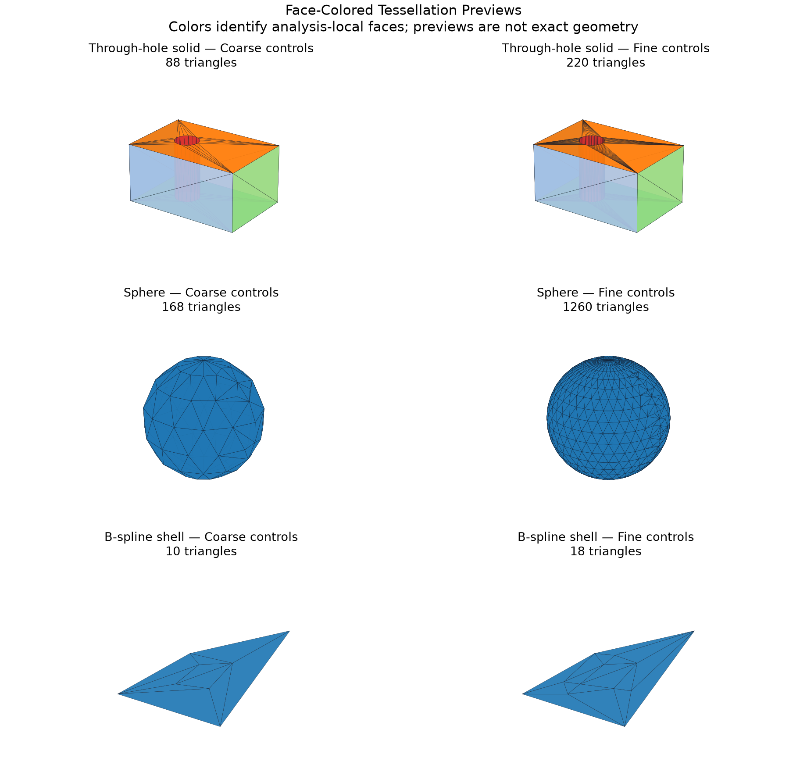

The fixed design combines linear deflections `0.8` and `0.05` with angular
deflections `0.7` and `0.25` radians. It yields 3,782 triangle rows and 36
face-condition rows. Every face row resolves directly to the source
`ADVANCED_FACE` used by this STEP transfer, but that link is read-history
provenance rather than a persistent name. The eight zero-area sphere-pole
triangles are retained and flagged.

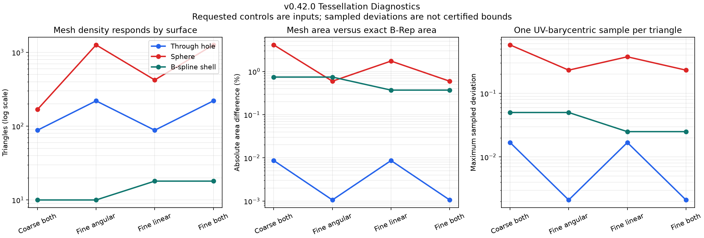

Requested meshing controls are inputs, not independently certified geometric
error bounds. The surface-deviation field samples one UV barycenter per
triangle, so it is not a maximum-over-triangle proof. The preview is useful for
finding suspicious faces and triangles, but the CSV and exact B-Rep
observations define the machine-checkable evidence.

## Regeneration

```bash
python experiments/run_step_brep_topology.py \
  --fixture-dir fixtures/step-brep-topology \
  --refresh-fixtures

python experiments/run_step_exchange_structure.py \
  --fixture-dir fixtures/step-part21-exchange \
  --refresh-fixtures

python experiments/run_step_part21_source_model.py \
  --fixture-dir fixtures/step-part21-source-model \
  --refresh-fixtures

python experiments/run_step_part21_conformance.py \
  --fixture-dir fixtures/step-part21-conformance \
  --refresh-fixtures

python experiments/run_express_schema_model.py \
  --fixture-dir fixtures/express-schema-model \
  --refresh-fixtures

python experiments/run_express_symbol_resolution.py \
  --fixture-dir fixtures/express-symbol-resolution \
  --refresh-fixtures

python experiments/run_step_express_validation.py \
  --fixture-dir fixtures/step-express-validation \
  --refresh-fixtures

python experiments/run_step_graph_queries.py \
  --fixture-dir fixtures/step-graph-queries \
  --refresh-fixtures

python experiments/run_ap242_product_paths.py \
  --fixture-dir fixtures/ap242-product-paths \
  --refresh-fixtures

python experiments/run_ap242_assembly.py \
  --fixture-dir fixtures/ap242-assemblies \
  --refresh-fixtures

python experiments/run_geometry_kernel_selection.py \
  --fixture-dir fixtures/geometry-kernel-selection \
  --refresh-fixtures

python experiments/run_evaluated_face_geometry.py \
  --fixture-dir fixtures/evaluated-face-geometry \
  --refresh-fixtures

python experiments/run_edge_curve_evaluation.py \
  --fixture-dir fixtures/edge-curve-evaluation \
  --refresh-fixtures

python experiments/run_wire_trimming_evaluation.py \
  --fixture-dir fixtures/wire-trimming-evaluation \
  --refresh-fixtures

python experiments/run_shell_solid_validity.py \
  --fixture-dir fixtures/shell-solid-validity \
  --refresh-fixtures

python experiments/run_tolerance_sewing_healing.py \
  --fixture-dir fixtures/tolerance-sewing-healing \
  --refresh-fixtures

python experiments/run_manifold_self_intersection.py \
  --fixture-dir fixtures/manifold-self-intersection \
  --refresh-fixtures

python experiments/run_solid_region_evaluation.py \
  --fixture-dir fixtures/solid-regions \
  --refresh-fixtures

python experiments/run_shape_correspondence.py \
  --fixture-dir fixtures/shape-correspondence \
  --refresh-fixtures

python experiments/run_feature_recognition.py \
  --fixture-dir fixtures/feature-recognition \
  --refresh-fixtures

python experiments/run_face_level_analysis.py \
  --fixture-dir fixtures/face-analysis \
  --refresh-fixtures

python experiments/run_tessellation_diagnostics.py \
  --fixture-dir fixtures/tessellation-diagnostics \
  --refresh-fixtures
```

## Interpretation Boundary

Opening a sample in a viewer is useful diagnostic evidence, but viewer success
does not prove Part 21 conformance, EXPRESS conformance or semantic validity,
application-protocol conformance, B-Rep validity, unit correctness, tolerance
consistency, or preservation across another kernel. Those claims require the
separate observations and tests defined by each study.
