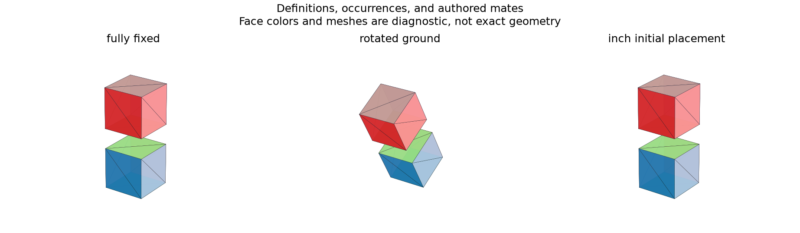

# Assembly Constraints and Reusable Components

## 日本語概要

v0.64.0では、部品定義とその配置を分離し、同じ部品を再利用します。10種類の組立入力に対し、局所座標、単位、固定・面一致・同心・距離の拘束を明示します。詳細は英語本文に示します。

---

## English Summary

Ten authored documents separate reusable definitions, occurrences, datum frames, units, and mate constraints.

## Question and Model

Can reusable component definitions, occurrences, datum frames, and constraints
remain distinct records with explicit units?
A component definition contains one confirmed millimetre feature model.
Occurrences reference that definition and carry their own initial translation,
rotation vector, and length unit. Geometry is computed once per definition;
placement creates separate native shapes for each occurrence.

Datums record a local origin, rotation vector, unit, anchor, and provenance.
An explicit anchor is fixed in component coordinates. Plate-top, plate-bottom,
and plate-center anchors are reevaluated from the current plate dimensions.
They are authored datums, not recovered STEP mates.

| Constraint | Equations | Meaning |
| --- | ---: | --- |
| Fixed pose | 1–6 | Selected translation/rotation-vector coordinates equal a world target; default fixes all six |
| Coincident planes | 3 | One signed normal offset and two normal-alignment components |
| Concentric axes | 4 | Two transverse offsets and two axis-alignment components |
| Distance | 1 | Signed axial displacement along the second datum's Z direction |

The two-component alignment formulation avoids the intrinsic redundancy of
a three-component cross product. Co-oriented normals are required. Fixed
constraints lock occurrence pose coordinates, not an arbitrary local datum.

## Evidence

Ten authored JSON controls cover an unconstrained pair, one grounded part,
concentric axes, axial distance, complete fixation, plane coincidence,
duplicate distance, conflicting distance, a rotated ground, and an initial
placement written in inches. Each has one reusable definition and two
occurrences. Three qualified placed-shape STEP previews accompany the JSON.

The next study evaluates placement rank and interference. It uses
[NumPy SVD](https://numpy.org/doc/stable/reference/generated/numpy.linalg.svd.html)
for local rank and nullspace analysis.

## Boundary

Documents are capped at 8 definitions, 12 occurrences, 64 constraints, and
16 local frames per definition. Initial and solved occurrence rotation-vector
norms stay within 90 degrees; translations stay within 10000 mm.
Definitions remain qualified v0.60.0 feature models. There are no nested
assemblies, general joints, automatic mate inference, or arbitrary STEP
assembly import. STEP preview/export carries placed geometry; the authored
definition IDs, units, and mates remain in JSON.

## Reproduction and Artifacts

```bash
python experiments/run_assembly_constraints.py
```

Default runs verify fixture bytes. Use `--fixture-dir` and `--output-dir`
with `--refresh-fixtures` to generate separate copies.

- [Fixture manifest](../fixtures/assembly-constraints/manifest.csv)
- [Observations](../results/assembly_constraints.csv)
- [Detailed records](../results/assembly_documents.json)
- [Contract](../results/assembly_constraints_contract.json)
- [Implementation](../src/research_notes/assembly_constraints.py)
- [Experiment](../experiments/run_assembly_constraints.py)


