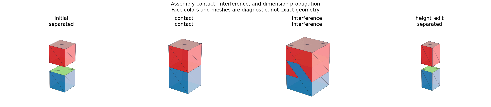

# Assembly Recompute and Degrees of Freedom

## 日本語概要

v0.65.0では、部品の形状と配置を再計算し、残る自由度、重複拘束、矛盾、接触、干渉を判定します。10種類の拘束条件と8回の編集を検証し、厚さの変更に接続位置が追従することを確認します。Python APIと対話ターミナルから利用できます。詳細は英語本文に示します。

---

## English Summary

Ten solver controls and eight edit events verify freedom, redundancy, conflicts, contact, interference, and recovery.

## Question and Solver

Can component edits propagate through reusable geometry and mate placements,
while preserving the difference between free motion, redundant constraints,
conflicts, and physical interference?

The solver uses six coordinates per occurrence: three translations in mm
and a rotation vector in rad. Rodrigues rotation maps local datum frames into
world coordinates. Bounded Gauss–Newton steps use central-difference Jacobians,
least squares, and backtracking for at most 60 iterations.
[NumPy SVD](https://numpy.org/doc/stable/reference/generated/numpy.linalg.svd.html)
provides the local rank/nullspace computation.

Residual gates are 1e-8 in each reported component unit. Rank uses a threshold
of `max(1e-8, largest_singular_value * 1e-8)`. Remaining freedom is
`6 × occurrences − rank`. Redundant equations are `equation_count − rank`.
Motion vectors follow the reported occurrence order and coordinate order
`tx, ty, tz, rx, ry, rz`, using the 1 mm / 1 rad coordinate scale.
They describe tangent motion at the computed pose, not a global motion range.

Satisfied systems are fully constrained, under-constrained, or redundant.
Redundancy can coexist with nonzero freedom, so both numbers remain visible.
Duplicate constraint definitions with incompatible right-hand sides establish
the declared inconsistent cases. Other unsatisfied nonlinear problems report
`not_converged`; failure alone is not an inconsistency proof.

## Results

| Control | Remaining freedom | Redundant equations | Status |
| --- | ---: | ---: | --- |
| Two free occurrences | 12 | 0 | Under-constrained |
| One occurrence fixed | 6 | 0 | Under-constrained |
| Concentric moving part | 2 | 0 | Under-constrained |
| Add axial distance | 1 | 0 | Under-constrained |
| Add rotation-coordinate lock | 0 | 0 | Fully constrained |
| Ground plus plane coincidence | 3 | 0 | Under-constrained |
| Duplicate distance | 0 | 1 | Redundant |
| Contradictory distance | 0 | 1 | Inconsistent |
| Ground tilted by 30 degrees | 0 | 0 | Fully constrained |
| Inch-based initial placement | 0 | 0 | Fully constrained |

Eight further events cover initial calculation, unchanged reuse, contact,
interference, restored clearance, height change, invalid height, and recovery.
All 18 controls pass. A 2 × 2 × 2 mm block is reused twice; the lower block
is grounded and the upper block's bottom datum follows the lower top datum.

| Edit | Upper origin Z (mm) | Separation (mm) | Overlap volume (mm³) |
| --- | ---: | ---: | ---: |
| Clearance 1, height 2 | 3 | 1 | 0 |
| Clearance 0 | 2 | 0 | 0 |
| Clearance −1 | 1 | 0 | 4 |
| Clearance 1, height 3 | 4 | 1 | 0 |

These values follow independent box arithmetic. Rotating the ground by
30 degrees about X and translating to (4,5,1) places the upper origin at
`(4, 3.5, 1 + 3√3/2)`. The unit-converted initial condition reaches the same
qualified result.

Pair checks use OCCT [common volume](https://occt3d.com/dev/doc/refman/html/class_b_rep_algo_a_p_i___common.html)
and minimum distance. Volume above 1e-7 mm³ is interference; otherwise distance
at most 1e-7 mm is contact. Under-constrained placements receive provisional
pair observations. Contradictory or failed-component cases have no current
placed geometry. Component caches retain prior valid results for recovery.

## Try the Interactive Terminal

From the repository root with the pinned geometry environment:

```bash
python -m research_notes.assembly_tool --output-dir output/assembly-workspace
```

Enter one command per line:

```text
open fixtures/assembly-constraints/fully_fixed.json
inspect
recompute
report
set clearance 0 * mm
recompute
report
set clearance -1 * mm
recompute
report
set clearance 1 * mm
set height 3 * mm
recompute
report
export output/assembly-workspace/edited.step
drop twist
recompute
status
restore twist
recompute
quit
```

At clearance −1 the report shows 4 mm³ interference. Export refuses that state.
Removing `twist` exposes one remaining motion degree; restoring it returns
to a fully constrained pose. `drop`/`restore` toggle named constraints in this
session; they are not a general undo/redo history.

`report` writes `assembly.html`, `assembly.png`, and `assembly.json`.
The report contains initial/current images, distance, overlap volume, solver
residuals, and motion modes. A failed revision never appears as current valid
geometry. Existing STEP destinations need explicit `--overwrite`.

The repeatable demo runs the complete qualified sequence:

```bash
python -m research_notes.assembly_tool --script fixtures/assembly-recompute/demo_commands.txt --output-dir output/assembly-demo
```

## Python API

```python
from pathlib import Path
from research_notes.assembly_controls import slider_assembly
from research_notes.assembly_recompute import AssemblySession

session = AssemblySession(slider_assembly())
session.recompute()
session.set_parameter("height", "3 * mm")
result = session.recompute()
print(result.solution.degrees_of_freedom)
print(result.pair_checks)
session.export_step(Path("output/my-assembly.step"))
```

Author your own bounded JSON document or use `assembly_from_dict` to load one.
JSON stores definition/occurrence/constraint provenance; STEP exports placed
shape geometry only. The earlier single-part STEP reconstruction tool remains
available as `research_notes.modeling_tool`.

## Boundaries

The controls use a small local rotation domain, a fixed residual scale, and
one pinned kernel. They do not certify global mobility, singular mechanisms,
nonlinear infeasibility, general tolerances, full swept-motion collision,
nested assemblies, or arbitrary real-world assemblies. The importer and
kernel are not an OS sandbox. Shape export requires a current fully constrained
result without detected interference and checks volume, area, material difference,
bounds, topology counts, and surface inventories on reimport.
It does not preserve assembly mates, names, PMI, or authored IDs in STEP.

## Reproduction and Artifacts

```bash
python experiments/run_assembly_recompute.py
```

Default runs verify fixture bytes. Use `--fixture-dir` and `--output-dir`
with `--refresh-fixtures` to generate separate copies.

- [Fixture manifest](../fixtures/assembly-recompute/manifest.csv)
- [Observations](../results/assembly_recompute.csv)
- [Detailed records](../results/assembly_recompute_states.json)
- [Contract](../results/assembly_recompute_contract.json)
- [Implementation](../src/research_notes/assembly_recompute.py)
- [Experiment](../experiments/run_assembly_recompute.py)


