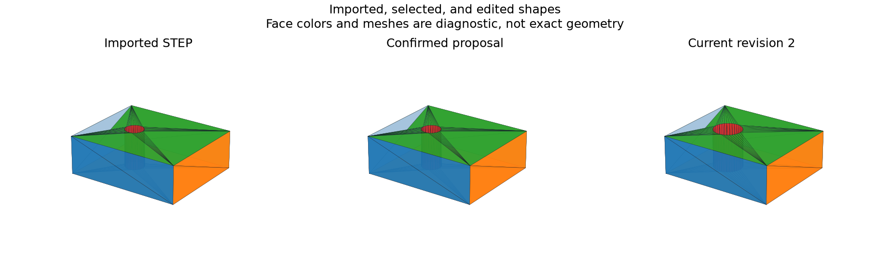
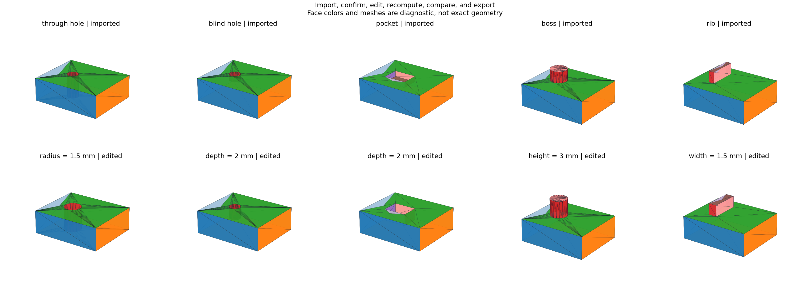

# Assisted Parametric Modeling Tool

## 日本語概要

v0.60.0では、STEP読込、検査、候補確認、寸法変更、再計算、比較図、STEP再出力をPython APIと対話型ターミナルにまとめます。5種類の編集は独立な体積・表面積の真値と一致し、11件の拒否・復旧・初期化の検査も成功しました。元のSTEPは保護し、推定候補を使う操作には明示的な確認を要求します。対応は検証済みのmm単位・軸に平行な単一立体に限定します。詳細は英語本文に示します。

---

## English Summary

A Python session API and terminal workspace connect qualified STEP import,
inspection, explicit proposal selection, dimension edits, recompute, visual
comparison, and verified STEP export. Five complete workflows match independent
volume/area truth and round-trip geometry. Eleven state and output guards pass.

## Research Question and Design

Can the v0.57.0–v0.59.0 components form a usable, reviewable workflow without
silently adopting inferred construction history or exporting stale geometry?

The tool composes [feature construction](parametric-holes-pockets-bosses-ribs.md),
[deterministic recompute](dependency-graph-deterministic-recompute.md), and
[evidence-bound reconstruction](step-to-feature-reconstruction-candidates.md).
It adds an in-memory session rather than another geometry inference algorithm.

A successful import resets selection; an unsuccessful import preserves the
previous session. Candidates can be inspected freely. Selection requires
`confirm=True` in Python or `--confirm` in the terminal. This explicitly
adopts a reconstruction proposal, with provenance
`user_selected_reconstruction`; it does not authenticate its history.

Edits increment the model revision. Comparison and export require recompute
of the current revision and a valid current output. Last valid shapes retained
after failure cannot be exported as current geometry. A new selection replaces
the active model only after its proposal has recomputed successfully.

## Terminal Workflow

Install the pinned dependencies in an environment supporting the repository:

```bash
python -m pip install -e ".[geometry]"
python -m research_notes.modeling_tool --output-dir output/modeling-workspace
```

From the repository root, enter:

```text
open fixtures/step-reconstruction/through_hole.step
inspect
candidates
select 2 --confirm
set feature radius 1.5
recompute
compare
export output/modeling-workspace/edited.step
status
quit
```

Candidate 2 is the through-hole cut in this fixed example. For another source,
inspect the returned numbers or stable candidate IDs before choosing.
`help` lists the commands. `compare` writes `comparison.html`,
`comparison.png`, `comparison.json`, and `session.json` into the output
directory. The HTML contains three static shape previews and measurement
changes. The JSON session record is for inspection; session restoration is
not implemented.

A repeatable script is also supplied:

```bash
python -m research_notes.modeling_tool \
  --script fixtures/assisted-modeling/demo_commands.txt \
  --output-dir output/modeling-demo
```

That script explicitly allows replacement of its own demo export path.
Scripts stop with a nonzero exit status on the first command error.

## Python API

```python
from pathlib import Path
from research_notes.assisted_modeling import ModelingSession

session = ModelingSession()
inspection = session.open_step(Path("fixtures/step-reconstruction/through_hole.step"))
proposal = next(
    c for c in inspection["candidates"] if c["explanation"] == "through_hole"
)
session.select_candidate(proposal["candidate_id"], confirm=True)
session.edit("feature", "radius", 1.5)
session.recompute()
session.write_comparison(Path("output/my-model"))
receipt = session.export_step(Path("output/my-model/edited.step"))
```

`confirm=True` records an explicit caller decision. It must not be inserted
by an application before its operator has chosen the intended proposal.

## Results

| Workflow | Edit (mm) | Volume before → after (mm³) |
| --- | --- | ---: |
| Through hole | Radius 1 → 1.5 | 467.433629386 → 451.725666118 |
| Blind hole | Depth 1 → 2 | 476.858407346 → 473.716814693 |
| Pocket | Depth 1 → 2 | 468 → 456 |
| Boss | Height 2 → 3 | 494.137166941 → 501.205750412 |
| Rib | Width 1 → 1.5 | 490 → 495 |

All five preserve source bytes, match independent edited volume/area truth
within 1e-7, and pass the qualified export round trip. Eleven controls cover
editing before selection, selection without confirmation, export before
selection, export/comparison before recompute, an existing export without
overwrite permission, source overwrite, export/comparison of stale results,
recovery from a failed edit, and resetting selection on a new import.





Export verifies geometry before writing, requires an explicit overwrite flag
for an existing destination, and refuses the imported source path, including
an existing hard-link alias. Its receipt includes source/output digests,
revision, selected candidate, and round-trip residuals.

## Reproduction and Evidence

```bash
python experiments/run_assisted_modeling.py
python -m pytest -q tests/test_assisted_modeling.py tests/test_modeling_study_artifacts.py
```

- [Workflow inputs](../fixtures/assisted-modeling/workflow.json), [demo commands](../fixtures/assisted-modeling/demo_commands.txt), and [manifest](../fixtures/assisted-modeling/manifest.csv)
- [Workflow observations](../results/assisted_modeling.csv) and [guard outcomes](../results/assisted_modeling_guards.csv)
- [Session evidence](../results/assisted_modeling_sessions.json) and [contract](../results/assisted_modeling_contract.json)
- [Session API](../src/research_notes/assisted_modeling.py), [terminal tool](../src/research_notes/modeling_tool.py), and [experiment](../experiments/run_assisted_modeling.py)

## Boundaries and Next Work

The input restrictions of v0.59.0 still apply: local millimetre STEP, one
qualified solid, small axis-aligned planar/cylindrical geometry, no external
retrieval, and no native execution sandbox or timeout. This is a terminal
workflow with static comparison images, not a graphical CAD editor.
Exports preserve tested shape geometry; source names, colors, PMI, and
constraints are not carried over. No general metadata preservation is claimed.

Persistent topology references, parameter expressions, document transactions,
undo/redo, saved-session restoration, assemblies, arbitrary feature sequences,
general STEP compatibility, and original CAD history remain outside v0.60.0.
The next roadmap stage is v0.61.0, persistent topological references.
