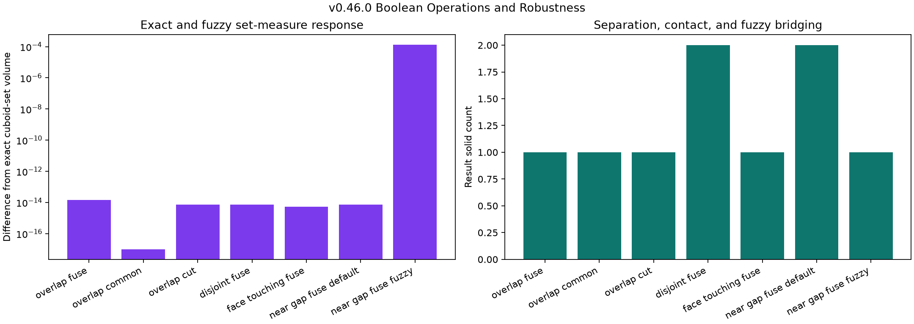
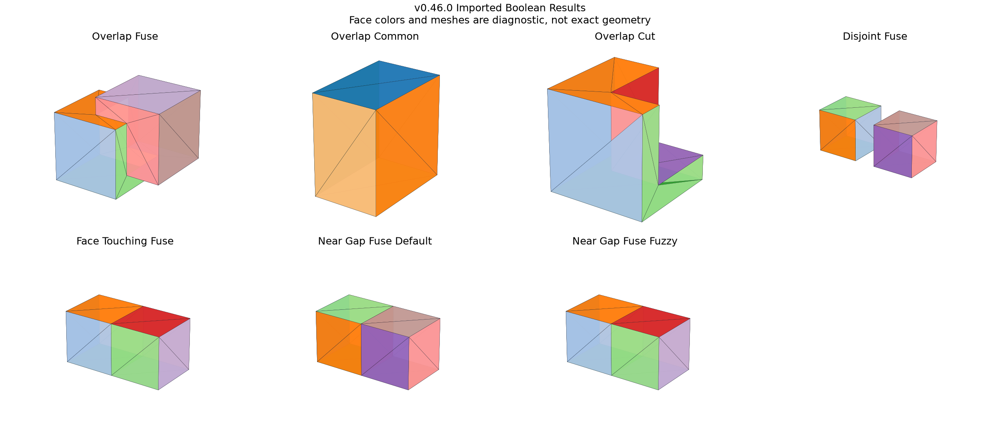

# Boolean Operations and Robustness

## 日本語概要

本ノートは、軸に平行な直方体2個に対する和・共通・差を、体積重なり、非接触、面接触、5万分の1の隙間で検証します。既定条件の6例は独立なセル分割で求めた厳密集合の体積・表面積と一致し、STEP往復でも保持されました。追加許容値0.0001は隙間をつないで立体数を2から1へ変えましたが、厳密集合から体積0.0001333、表面積約7.9998ずれ、STEP再読込でも測定値がさらに変化しました。追加許容値は万能な修復値ではなく、位相と形状を同時に変え得る操作条件として扱います。詳細は英語本文に示します。

---

## English Summary

This study evaluates union, intersection, and subtraction on seven pairs of
synthetic axis-aligned cuboids. An independent cell decomposition supplies
exact-set volume and area truth. Six default-tolerance controls match that
truth and pass literal STEP round trips. One near-gap fuzzy control changes
connectivity and geometry, preserving topology across STEP while failing the
literal measure-preservation contract.

## Research Question

How do Boolean operation type, spatial relationship, and an additional fuzzy
tolerance change result validity, topology, exact-set measures, and STEP
round-trip behavior in a controlled B-Rep experiment?

## Background

Open CASCADE defines Boolean union, intersection, and subtraction over groups
of valid arguments and tools. Its Boolean API exposes an additional fuzzy
tolerance beyond shape tolerances. That option can help classify nearby
geometry, but it changes the numerical contract: the result need not equal the
mathematical set operation on the original exact solids.

## Method

Seven controls isolate operation and contact conditions:

| Control | Operation | Relationship | Requested fuzzy value |
| --- | --- | --- | ---: |
| `overlap_fuse` | union | volume overlap | 0 |
| `overlap_common` | intersection | volume overlap | 0 |
| `overlap_cut` | subtraction | volume overlap | 0 |
| `disjoint_fuse` | union | positive gap | 0 |
| `face_touching_fuse` | union | shared face | 0 |
| `near_gap_fuse_default` | union | gap `0.00005` | 0 |
| `near_gap_fuse_fuzzy` | union | gap `0.00005` | `0.0001` |

The independent truth routine partitions the cuboid coordinate planes into
cells, classifies each cell midpoint under union, intersection, or difference,
then sums cell volumes and exposed faces. It does not call the geometry kernel.

## Controlled Experiment

For each control, the experiment:

1. constructs two valid cuboids;
2. measures both operands before the operation;
3. runs the selected Boolean operation with parallel processing disabled and
   non-destructive mode enabled;
4. remeasures both operands and records native completion, history availability,
   and the applied fuzzy value;
5. reverses operands for union and intersection and compares bounded topology,
   support-surface, volume, and area invariants;
6. compares the result with independent exact-set volume and area;
7. writes and rereads normalized STEP; and
8. repeats validity, topology, tolerance, volume, area, and centroid
   measurements.

Run the study with:

```bash
python experiments/run_boolean_robustness.py
```

## Results

| Evidence | Observed result |
| --- | ---: |
| Controls | 7 |
| Constructed / imported observations | 7 / 7 |
| Analyzer-valid observations | 14 / 14 |
| Default controls matching exact volume and area | 12 / 12 stage observations |
| Literal STEP round-trip contracts passed | 6 / 7 |
| Operand-preservation checks | 14 / 14 |
| Applicable reversed-operand invariant checks | 6 / 6 |
| Near-gap solids, default / fuzzy | 2 / 1 |
| Fuzzy constructed volume difference from exact union | about `0.0001333333` |

The three overlapping cases match independent truth: union volume and area are
`110` and `150`, intersection values are `18` and `42`, and subtraction values
are `46` and `96`. Disjoint and near-gap default unions remain two solids. The
face-touching union becomes one solid with exact volume `16` and area `40`.





## Interpretation

The default controls establish a bounded baseline: the pinned operation route
matches an independent polyhedral set calculation for exact overlap,
separation, and face contact. Reversing union and intersection preserves the
recorded invariants, but this is not a persistent-identity claim.

The fuzzy control is deliberately different. Its `0.0001` additional
tolerance bridges a `0.00005` gap and changes two solids into one. The
constructed result differs from the exact disjoint union by about `0.0001333`
in volume and `7.9998` in surface area. After STEP import, the topology and
surface inventory remain stable, but volume changes by another
`0.0000666667` and area by `0.0002`. Therefore a topologically convenient
result can still violate an exact geometric round-trip contract.

## Failure Modes

- A fuzzy value can merge geometry that the exact input sets keep separate.
- Connectivity changes can remove facing boundary area and introduce a small
  volumetric bridge.
- STEP exchange can normalize the tolerance-shaped result without changing its
  observed topology, producing additional measure drift.
- Successful completion and analyzer validity do not establish exact-set
  equivalence or design correctness.
- Positional face and edge indices cannot carry operand or operation history.

## Practical Guidance

- Validate both operands before Boolean processing and retain them separately.
- Record the requested and applied fuzzy values with every result.
- Compare volume, area, bounds, topology, and tolerances; validity alone is
  insufficient.
- Use independent truth on simple controls before extending a tolerance policy.
- Treat fuzzy tolerance as a model-changing parameter requiring domain-specific
  acceptance limits, not as a universal repair switch.
- Preserve native history before STEP export when downstream correspondence is
  required.

## Limitations

All operands are valid axis-aligned cuboids under one pinned backend. The study
does not cover curved, thin, sliver, self-intersecting, non-manifold, or invalid
operands; coincident analytic surfaces with different parameterizations;
multi-argument operations; parallel execution; glue modes; all warning and
error reports; performance; cross-kernel portability; or a general tolerance
policy. The reversed-operand check compares topology and measures, not exact
topological identity. Only one gap and one additional fuzzy value are tested.

## Sources

- [Open CASCADE `BRepAlgoAPI_BooleanOperation` reference](https://dev.opencascade.org/doc/refman/html/class_b_rep_algo_a_p_i___boolean_operation.html)
- [Open CASCADE `BRepAlgoAPI_Fuse` reference](https://dev.opencascade.org/doc/refman/html/class_b_rep_algo_a_p_i___fuse.html)
- [Open CASCADE `BRepAlgoAPI_Common` reference](https://dev.opencascade.org/doc/refman/html/class_b_rep_algo_a_p_i___common.html)
- [Open CASCADE `BRepAlgoAPI_Cut` reference](https://dev.opencascade.org/doc/refman/html/class_b_rep_algo_a_p_i___cut.html)
