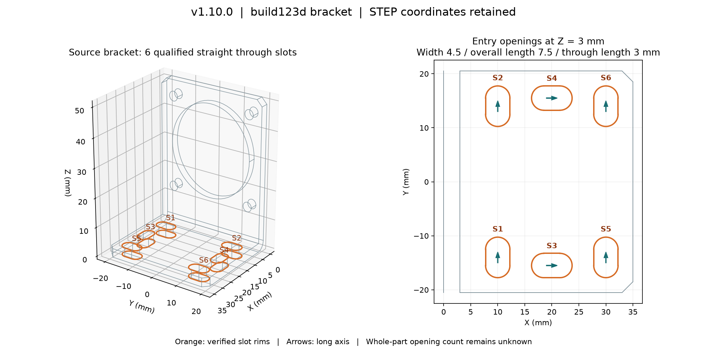

# Bracket Straight Through-Slot Recognition — v1.10.0

## 日本語概要

公開済みのbuild123dブラケットSTEPから、両端が半円の直線状貫通長孔6か所を局所検証しました。幅はすべて4.5 mm、全長7.5 mm、貫通長3 mmです。開口中心XYZ、長手方向、貫通方向も取得し、開口境界の長さ・重心を使う別経路と照合しました。X方向の長孔が2か所、Y方向が4か所です。3回の結果は同一でした。これは同一OCCTカーネル内の整合性確認で、元図面や別CADによる独立した精度保証ではありません。

Python API・専用CLIと検証結果を追加しました。丸穴5か所を扱う既存画面・CSVへの統合はv1.11の予定で、今回は変更していません。長孔の全体数や部品内の全穴数は確定せず、認識0件も「長孔なし」としません。以下にコマンド、測定値、判定条件と制限を示します。

---

## English Summary

Six straight capsule through slots qualify in the frozen public build123d
NEMA-17 bracket. Each is 4.5 mm wide, 7.5 mm overall and 3 mm through. Entry and
exit centres, longitudinal direction and through direction retain the STEP
coordinates after unit conversion. The existing circle recognizer still reports
five circular holes separately. This extension provides a dedicated Python API
and JSON CLI; it does not yet merge slots into the browser or round-hole CSV.

## Question and evidence scope

Can the earlier [controlled slot rule](rule-based-brep-feature-recognition.md)
be extended to locate and qualify the actual slots of this bracket? The older
rule associated inward partial cylinders and planar sides in synthetic shapes.
The new scanner adds exact four-edge opening loops, two-opening/four-wall
connectivity, per-solid ownership, support and area checks, and sampled material
and void checks before emitting dimensions and positions.

The public input was inspected during development. Six expected positions and
dimensions in `slot_benchmark.EXPECTED` and its fixed dimensional checks were
transcribed from inspection of the frozen STEP geometry. They are regression
expectations, not a held-out dataset, engineering drawing or machining truth.
No new accuracy rate over industrial STEP files is claimed.

## Frozen input and provenance

- File: [build123d_bracket.step](../fixtures/public-step-corpus/sources/build123d_bracket.step)
- Geometry: one solid, 42 faces; source bytes unchanged from the v1.9 study.
- SHA-256: `bc7b546d7062b56d93ad3a82fc90f25aa44e3930a9e98bdc93c5d409e4a84c2d`
- Upstream: build123d contributors, `docs/topology_selection/examples/nema-17-bracket.step`, revision `17999d509ea0b08a6b45cb9bf71f6a7c9cc5dbc1`.
- Attribution/license: Apache-2.0, with the pinned [LICENSE](../fixtures/public-step-corpus/licenses/build123d/LICENSE) and [NOTICE](../fixtures/public-step-corpus/licenses/build123d/NOTICE).
- The [existing manifest](../fixtures/public-step-corpus/manifest.json) retains the upstream URL, revision, hashes and historical selection policy.

## Measured slots



| ID | Width mm | Overall length mm | Entry X mm | Entry Y mm | Entry Z mm | Long axis | Through length mm |
| --- | ---: | ---: | ---: | ---: | ---: | --- | ---: |
| S1 | 4.5 | 7.5 | 10 | -14 | 3 | +Y | 3 |
| S2 | 4.5 | 7.5 | 10 | 14 | 3 | +Y | 3 |
| S3 | 4.5 | 7.5 | 20 | -15.5 | 3 | +X | 3 |
| S4 | 4.5 | 7.5 | 20 | 15.5 | 3 | +X | 3 |
| S5 | 4.5 | 7.5 | 30 | -14 | 3 | +Y | 3 |
| S6 | 4.5 | 7.5 | 30 | 14 | 3 | +Y | 3 |

All exit centres share the entry X/Y and have Z = 0 mm. The through direction is
`(0, 0, -1)`. Overall length includes both semicircular ends: 3 mm centre spacing
plus 4.5 mm width. The location is the centre of the selected opening, not a
corner, the centroid of the whole solid, or a recovered sketch placement.

The entry is the lexicographically larger opening centre after 9-decimal
normalization. The long axis points from the lexicographically smaller arc
centre to the larger one. These signs provide deterministic output, not inferred
machining or assembly directions. S IDs and topology IDs are local to a source;
they do not establish correspondence after a shape edit or between files.

## Qualification and abstention

1. Read a local STEP snapshot with the existing inspection importer. Resolve
   supported length units into mm and reject external references without fetching.
2. Find planar inner loops with exactly two equal-radius semicircles and two
   parallel tangent straight edges. Check endpoints and outward-facing arc halves.
3. Associate exactly two matching openings through four distinct common walls
   within one solid. Centres must differ only along the through direction;
   opening planes must be perpendicular to that direction.
4. Require two inward semicylinders and two planar walls, one unsplit wire and
   four edges per wall, axial side edges, and matching untrimmed wall areas.
5. Check 72 material/void samples beside the four walls and 15 void samples
   within and just beyond the openings. Emit only candidates passing all checks.

Opening faces with curved outer boundaries are conservatively withheld because
they can be internal shoulders of stepped slots. An opening surrounded entirely
by neighboring faces whose centroids rise along its outward normal is also
withheld as a recessed shoulder. This catches the declared capsule and
rectangular counter-recess controls, but is a conservative local rule, not a
proof of arbitrary pocket topology. It can reject otherwise usable parts.

Face/edge tolerances must be at most `1e-5` mm. Radius, semicircle-centre spacing
and through length must each exceed `100 × 1e-5` mm. Arc-span and directional
checks use `1e-7`; wall-area agreement uses `max(1e-7, expected_area × 1e-8)` in
square millimetres. Output is rounded to 9 decimals. These are qualification
thresholds, not manufacturing tolerances or promised measurement accuracy.

`recognized_slot_count` counts accepted rows only. `whole_opening_count` is
always null. Status is `partial` when at least one slot qualifies and `unresolved`
otherwise. Withheld candidates include local face/edge references and reasons;
they are not an exhaustive list of every unsupported feature. Single-edge
circular loops are skipped because this API handles slots only.

## Separate boundary measurement

The cross-check first visits all four-edge planar inner loops, independently
of the reported dimensions. It integrates arc lengths, straight-edge lengths
and line centroids using OCCT mass-property routines:

- Width = sum of the two semicircle lengths / pi.
- Overall length = average straight-side length + width.
- Opening centre = the integrated wire centroid.
- Long axis = straight-edge endpoint direction, compared without sign.
- Through length/direction = separation of the two integrated opening centroids.

All 12 opening rims match, with no duplicated rim assignment. The largest
length/position disagreement is approximately `5.04e-15` mm against a `1e-6` mm
threshold. This compares two calculations within the same OCCT kernel; it does
not establish independent CAD equivalence or physical measurement accuracy.

## Controls and reproducibility

Eight authored solids are evaluated before and after STEP exchange (16 cases).
The through-slot control has declared width 2 mm, overall length 6 mm, through
length 4 mm and entry centre `(7, 5, 4)`. The other seven are a blind slot, open
notch, capsule counter-recess, rectangular counter-recess, round hole, external
capsule boss and internally interrupted passage. All match their declared
one-slot or no-qualified-slot expectations. Zero accepted rows do not certify
absence of other features. These small controls are regression checks, not the
broader robustness study planned for v1.12.

The frozen public bracket is measured three times with identical results.
Tests additionally cover a rotated/translated slot, separate solids, excessive
tolerance, a face budget, source preservation, CLI failure semantics and
cross-check disagreement. Existing round-hole, revision and browser regressions
are included in the [verification record](../results/bracket-slot-inventory/verification.json).

```bash
python -m pip install -e ".[geometry,test]"
python -m research_notes.slot_inventory fixtures/public-step-corpus/sources/build123d_bracket.step --output output/bracket-slots.json
python -m research_notes.slot_benchmark --output-dir output/bracket-slot-check --repeats 3
python -m pytest tests/test_slot_inventory.py tests/test_public_hole_inventory.py -q
```

In the prepared WSL environment, replace `python` with
`output/venv312/bin/python`. The installed console command is `research-slot-list`.
CLI exit 0 means at least one **locally qualified** slot, exit 2 means unresolved,
and exit 1 means rejected input. No result means a complete whole-part inventory.
This is a separate CLI contract from the older circular-hole command, whose
partial results exit 2. The STEP input cannot be used as the JSON output path,
including aliases. A separate existing JSON output is replaced on request.

```python
from research_notes.slot_inventory import inspect_slots

result = inspect_slots("fixtures/public-step-corpus/sources/build123d_bracket.step")
for slot in result["slots"]:
    print(slot["id"], slot["width_mm"], slot["length_mm"],
          slot["entry_center_mm"], slot["longitudinal_direction"],
          slot["through_direction"], slot["depth_mm"])
```

The lower-level `scan_straight_through_slots(shape)` requires a valid millimetre
B-Rep. The path API raises a validation/I/O error for rejected input; the CLI
records a rejected JSON result and nonzero exit. The benchmark saves
[JSON evidence](../results/bracket-slot-inventory/results.json), a
[measurement CSV](../results/bracket-slot-inventory/bracket-slots.csv) and the
numbered PNG above. JSON includes runtime versions, source/code hashes, each
control, boundary observations and elapsed times. Timing covers STEP snapshot,
import and slot qualification, including the first run; it excludes cross-check,
control construction/exchange, plotting and output.

## Limits and next scope

- Only straight, constant-width capsule through slots with the stated unsplit
  analytic faces and edges qualify. Curved slots, spline approximations, split
  faces, arbitrary recesses, tapered/stepped slots, threads, filleted openings
  and complex blind slots are outside this result.
- A 2 MB input limit, existing STEP topology/root budgets and a 512-face scan
  limit apply. Processing is local; no external service receives the STEP.
  Native geometry calls are in process, without hard CPU or memory deadlines.
- Components are checked individually. Obstruction by another assembly part is
  not checked. The per-solid material samples do not prove every point is clear.
- Six measured slots plus the existing five measured circles do not certify a
  complete eleven-opening inventory. Whole-part count stays unknown.
- UI/CSV integration, wider public samples, systematic scale/rotation/tolerance
  stress tests, batch processing and Excel reports remain later milestones.
- This release changes only this research repository, not the separate website.

The repository's [license](../LICENSING.md) applies to the implementation;
third-party sample notices remain separate and unchanged.
