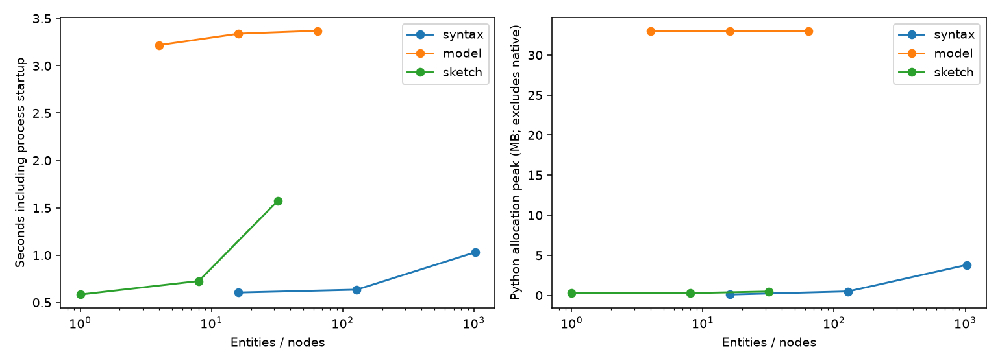

# 性能と資源制限 / Cad Resource Contracts

## 日本語概要

v0.93.0では、11件の規模変更と12件の制限超過を測定し、時間とPythonメモリの曲線を保存します。メモリは推定による受入制限であり、ネイティブ処理の実メモリ上限ではありません。詳細は英語本文に示します。

---

## English Summary

Twenty-three cases separate valid workloads from twelve resource outcomes. Syntax grows from 16 to 1,024 entities, models from 4 to 64 nodes, and sketches from 1 to 32 circles. Worker time includes startup; Python peaks exclude native allocations. Timing and allocation measurements are observations, not byte-exact regression fixtures.

## Evidence and Reproduction

- [CSV observations](../results/cad_resource_contracts.csv)
- [Detailed evidence](../results/cad_resource_contracts_evidence.json)
- [Contract](../results/cad_resource_contracts_contract.json)
- [HTML report](../results/cad_resource_contracts.html)
- [Input manifest](../fixtures/cad-resource-contracts/manifest.csv)

```bash
python experiments/run_cad_resource_contracts.py
```

To regenerate into a separate directory, use `--output-dir output/release-results
--fixture-root output/release-fixtures --refresh-fixtures`. The platform study
consumes the committed measured runner records; creating fresh observations
requires the CAD platform workflow. The release-candidate and stable studies
also require the preceding eight reports in their output directory.

## Interpretation and Limits

A passing check means the declared case outcome matched; it may record a
rejection, abstention or known unsupported behavior. See the
[v1 support contract](../docs/cad-v1-support.md),
[reproduction guide](../docs/reproducibility.md) and
[capability matrix](../docs/step-brep-capabilities.md). Project and public-source
license terms are preserved; no unrestricted commercial license is implied.

## Primary Sources

- [ISO 10303-21 public edition-3 text](https://www.steptools.com/stds/step/IS_final_p21e3.html), syntax, source transport and exchange structure.
- [OCCT modeling algorithms](https://dev.opencascade.org/doc/overview/html/occt_user_guides__modeling_algos.html), the native geometry implementation boundary.
- [Python subprocess deadlines](https://docs.python.org/3/library/subprocess.html#subprocess.run), worker timeout semantics.



[Measured runtime and host](../results/cad-resource-environment.json) describe the observation conditions. Each scale point is a single run, includes worker startup and is not a statistical latency or speedup claim.
