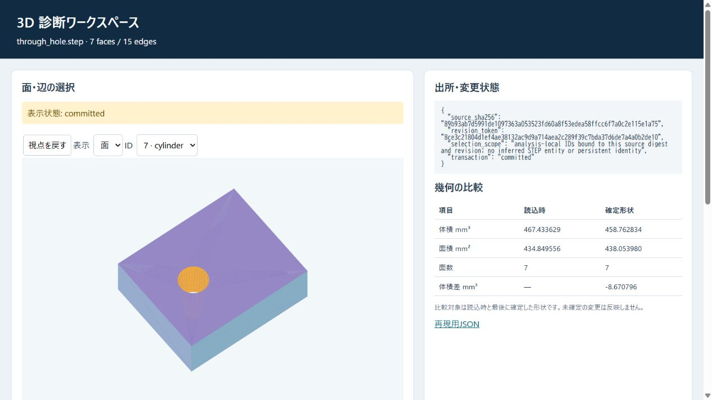

# 確認・修正・拒否の操作検証 / Cad Review Workflow

## 日本語概要

v0.95.0では、根拠の確認、候補の確認拒否、不正寸法の拒否、修正、比較を10手順で確認します。画面は閲覧専用で、編集はAPIまたはターミナルです。人間の参加者による効率測定ではありません。詳細は英語本文に示します。

---

## English Summary

Ten scripted tasks inspect alternatives, require confirmation, retain an unselected state, adopt explicitly, reject stale tokens, abort invalid edits, block draft export, correct and commit, compare evidence and write a read-only snapshot. Browser checks inspect a cylinder face and circular edge. No participant recruitment, speedup estimate or usability generalization is made.

## Evidence and Reproduction

- [CSV observations](../results/cad_review_workflow.csv)
- [Detailed evidence](../results/cad_review_workflow_evidence.json)
- [Contract](../results/cad_review_workflow_contract.json)
- [HTML report](../results/cad_review_workflow.html)
- [Input manifest](../fixtures/cad-review-workflow/manifest.csv)

```bash
python experiments/run_cad_review_workflow.py
```

To regenerate into a separate directory, use `--output-dir output/release-results
--fixture-root output/release-fixtures --refresh-fixtures`. The platform study
consumes the committed measured runner records; creating fresh observations
requires the CAD platform workflow. The release-candidate and stable studies
also require the preceding eight reports in their output directory.

## Interpretation and Limits

A passing check means the declared case outcome matched; it may record a
rejection, abstention or known unsupported behavior. See the
[v1 support contract](../docs/cad-v1-support.md),
[reproduction guide](../docs/reproducibility.md) and
[capability matrix](../docs/step-brep-capabilities.md). Project and public-source
license terms are preserved; no unrestricted commercial license is implied.

## Primary Sources

- [ISO 10303-21 public edition-3 text](https://www.steptools.com/stds/step/IS_final_p21e3.html), syntax, source transport and exchange structure.
- [OCCT modeling algorithms](https://dev.opencascade.org/doc/overview/html/occt_user_guides__modeling_algos.html), the native geometry implementation boundary.
- [Python subprocess deadlines](https://docs.python.org/3/library/subprocess.html#subprocess.run), worker timeout semantics.

[Browser verification record](../results/cad-review-browser.json).


