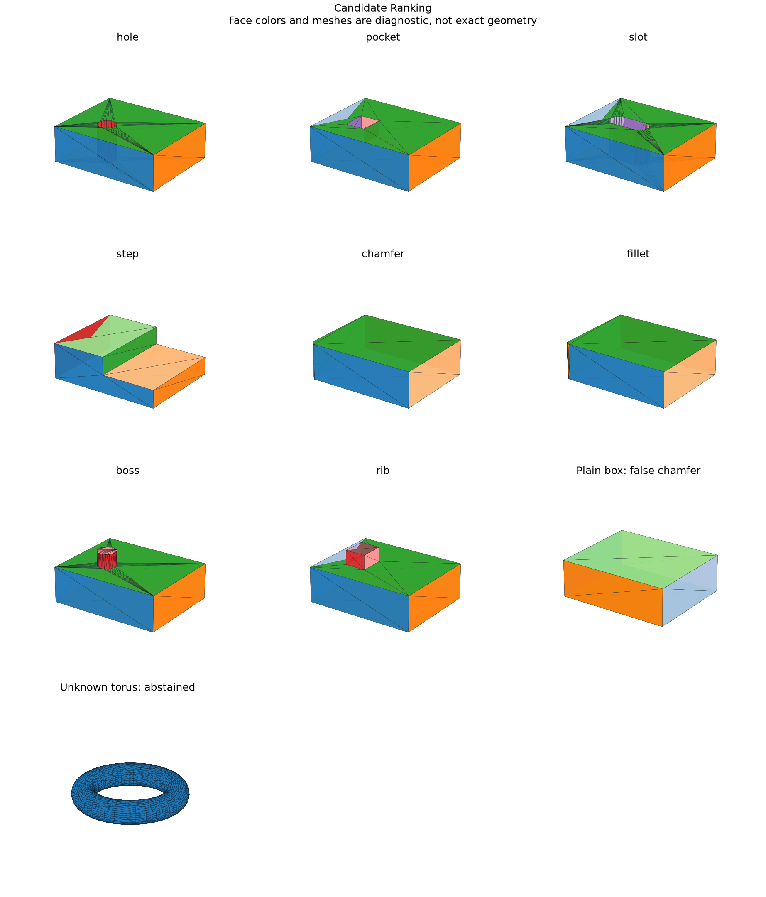

# Learned Feature-Candidate Ranking

## 日本語概要

v0.77.0では特徴候補の学習による順位付けを実装し、34件の限定した合成条件を検証しました。入力・判断根拠・結果をCSV、JSON、図、再生成可能なサンプルに残しています。

検証範囲と失敗例は以下の英語本文に示します。一般のCADデータへの適用や完全な規格適合を主張するものではありません。

---

## English Summary

Each design lineage belongs to one split; all eight labels occur in training. This tests bounded dimension generalization, not unseen feature families. Whole-shape graph and geometry descriptors produce eight hypotheses. Every score links source hash, supporting face/edge indices and winner-versus-runner descriptor margins. These are aggregate support sets, not learned feature localization or recovered design intent. Ranking never selects or edits a model.

## Results and Interpretation

Thirty-two authored designs cover hole, pocket, slot, step, chamfer, fillet, boss and rib, with two additional unknown controls. All eight known held-out designs rank correctly. A plain box is wrongly accepted as chamfer at about 97.1% confidence; an unknown torus abstains despite a large raw score.

The 34 `checks_pass` observations check the declared expectation, including
expected rejections and recorded learning failures. They do not mean that every
input was accepted or every learned prediction was correct.

## Sources and Implementation Boundary

The same explicit centroid/calibration implementation as v0.76 is used. Negative and unknown shapes expose errors that an eight-class-only benchmark would hide; full predictions and selective metrics remain in JSON.

- eight authored single-feature labels; 32 independently built dimensional designs plus two unknown/negative controls, with whole design lineages isolated
- all labels appear in training; test is bounded dimension generalization, not unseen manufacturing-family validation
- scores link source hashes, support faces/edges and per-descriptor distance margins; calibrated confidence can still be wrong
- ranks whole-shape candidate hypotheses; does not certify feature intent or recover history

## Reproduction and Artifacts

Run from the repository root in the pinned geometry environment:

```bash
python experiments/run_candidate_ranking.py
```

Default runs verify fixture bytes. To regenerate into separate directories:

```bash
python experiments/run_candidate_ranking.py --output-dir output/candidate-ranking --fixture-dir output/fixtures/candidate-ranking --refresh-fixtures
```

- [Observations](../results/candidate_ranking.csv)
- [Detailed evidence](../results/candidate_ranking_evidence.json)
- [Contract and limits](../results/candidate_ranking_contract.json)
- [Fixture manifest](../fixtures/candidate-ranking/manifest.csv)
- [Experiment](../experiments/run_candidate_ranking.py)
- [Implementation](../src/research_notes/learning_studies.py)


