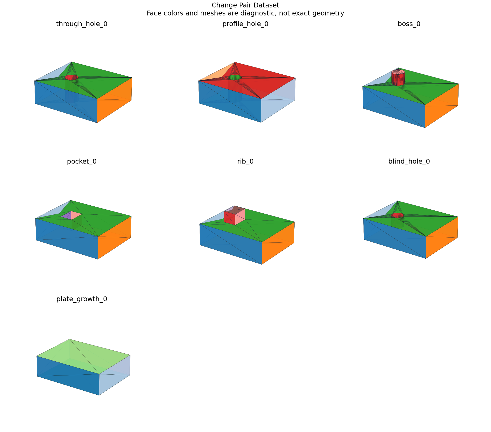

# Parametric Change-Pair Dataset

## 日本語概要

v0.75.0ではパラメータ変更前後のデータセットを実装し、21件の限定した合成条件を検証しました。入力・判断根拠・結果をCSV、JSON、図、再生成可能なサンプルに残しています。

検証範囲と失敗例は以下の英語本文に示します。一般のCADデータへの適用や完全な規格適合を主張するものではありません。

---

## English Summary

Each pair binds the edit, construction lineage, source hashes, model fingerprints and representations. Leakage checks cover cross-split source identity, family and derivation lineage. The family split is fixed before fitting; no filenames or truth values become numeric features. The authored-history representation is explicitly privileged information unavailable from generic STEP reconstruction. Geometric novelty beyond the declared family relation is not certified.

## Results and Interpretation

Twenty-one edits produce 42 STEP states, 21 before/after previews, model DAGs, topology relations, face/edge descriptors and measurement truth. Six construction families are split into train, validation and test; through-hole/profile-hole equivalent construction routes stay together.

The 21 `checks_pass` observations check the declared expectation, including
expected rejections and recorded learning failures. They do not mean that every
input was accepted or every learned prediction was correct.

## Sources and Implementation Boundary

The dataset extends the repository v0.53 provenance model and v0.58 recompute contract. Native geometry agreement is paired with independently computed feature volume and area, rather than used as its own truth.

- 21 parameter changes across six declared construction families; through/profile-hole derivations share train split
- STEP, model DAG, measurements, scoped topology correspondences and descriptor records share hashes
- geometry matches or ambiguity do not recover original design history; family isolation is synthetic only

## Reproduction and Artifacts

Run from the repository root in the pinned geometry environment:

```bash
python experiments/run_change_pair_dataset.py
```

Default runs verify fixture bytes. To regenerate into separate directories:

```bash
python experiments/run_change_pair_dataset.py --output-dir output/change-pair-dataset --fixture-dir output/fixtures/change-pair-dataset --refresh-fixtures
```

- [Observations](../results/change_pair_dataset.csv)
- [Detailed evidence](../results/change_pair_dataset_evidence.json)
- [Contract and limits](../results/change_pair_dataset_contract.json)
- [Fixture manifest](../fixtures/change-pair-dataset/manifest.csv)
- [Experiment](../experiments/run_change_pair_dataset.py)
- [Implementation](../src/research_notes/change_pair_dataset.py)


