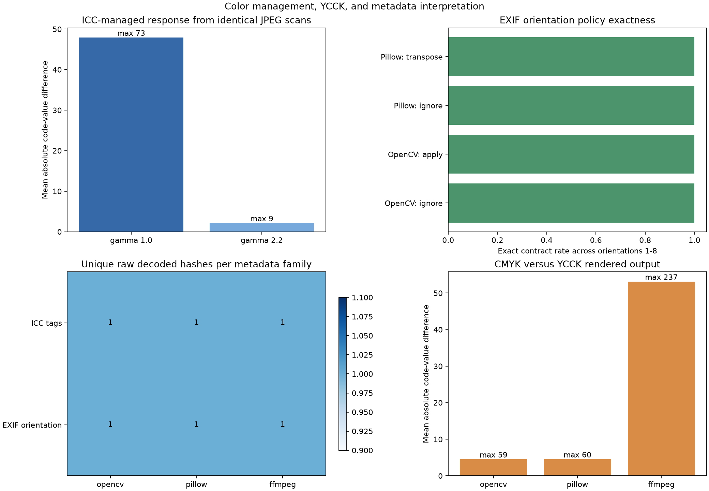

# Color Management, YCCK, and Metadata Interpretation

## Research Question

When JPEG coefficient data is held fixed, how can ICC profiles and EXIF
orientation change the pixels delivered to an application? For four-component
JPEG, how consistently do OpenCV, Pillow, and FFmpeg render matched synthetic
CMYK and YCCK intentions?

The study separates four layers that are often collapsed into one word,
"decode":

1. compressed JPEG components and scan data;
2. interpretation metadata in APP segments;
3. a decoder's default output policy; and
4. an application's explicit orientation or color-normalization policy.

The experiment reports exact arrays and numerical code-value differences. It
does not define a perceptual acceptance threshold, claim that one decoder is
universally correct, or treat an arithmetic CMYK preview as device color
management.

## Background

An ICC profile describes how encoded device values relate to a profile
connection space. The ICC specification includes matrix/TRC RGB profiles, in
which colorant matrices and tone reproduction curves jointly define the
mapping. Merely extracting RGB code values is therefore different from
transforming profile-tagged values into a declared output space. ICC guidance
stores a JPEG profile in ordered APP2 segments identified by `ICC_PROFILE`.

EXIF Orientation describes how stored rows and columns should be transformed
for presentation. Values 1 through 8 cover identity, reflections, rotations,
and transposed cases. A decoder can expose the stored raster, apply orientation
automatically, or leave the choice to a separate normalization step. OpenCV
documents automatic orientation unless an ignore-orientation or unchanged flag
is used. Pillow provides `ImageOps.exif_transpose` as an explicit operation.
FFmpeg documents automatic rotation as enabled by default and exposes
`-noautorotate`; the raw FFmpeg adapter uses that input option explicitly.

Four-component JPEG adds another interpretation boundary. The Adobe APP14
transform value commonly distinguishes untransformed CMYK from YCCK. The
libjpeg-turbo color-conversion source describes its encoder-side YCCK path as
forming RGB complements from C, M, and Y, converting those values to YCbCr,
and passing K through. Its project documentation also notes that a generally
correct CMYK/YCCK-to-RGB conversion requires color management and is outside
the codec library's scope. A three-channel BGR result from such a stream is
therefore a policy output, not a device-independent ground truth.

## Method Selection

The ICC and EXIF controls must not be re-encoded. One asymmetric 104 x 72 RGB
pattern is encoded once as a baseline 4:4:4 JPEG at numeric quality control 75.
The experiment inserts or replaces only selected APP segments, then verifies
that the metadata-stripped JPEG bytes have one SHA-256 identity within each
control family.

Two deterministic matrix/TRC RGB profiles are derived from Pillow's built-in
sRGB profile. They share the matrix, use fixed profile metadata, and replace
the shared parametric RGB TRC with gamma 1.0 or 2.2. LittleCMS validates both
profiles before use. These are synthetic response controls, not measured
monitor, camera, printer, or working-space profiles.

Eight JPEGs receive minimal EXIF payloads containing Orientation 1 through 8.
The four-component family uses a generated CMYK array. Pillow encodes one
ordinary CMYK stream. A second control converts the C/M/Y complements to YCbCr,
keeps K, encodes the four planes, and declares Adobe transform 2. The pair is a
bounded encoder control rather than a complete specification of every YCCK
producer.

## Controlled Experiment

The fixed corpus contains 13 JPEGs:

| Family | Fixtures | Controlled difference |
| --- | ---: | --- |
| ICC profile | 3 | no profile, gamma 1.0 TRC, or gamma 2.2 TRC |
| EXIF orientation | 8 | Orientation values 1 through 8 |
| Four-component color | 2 | Adobe transform 0 CMYK or transform 2 YCCK |

Every fixture has a committed lossless BGR reference. The reference is the
OpenCV decode with orientation explicitly ignored; it is an anchor for fixed
regression inputs, not a claim that OpenCV supplies the preferred rendering.

The experiment records four kinds of evidence:

- 39 raw observations: 13 fixtures through OpenCV, Pillow, and FFmpeg, with
  orientation explicitly ignored and no ICC transform requested;
- 44 policy observations: unmanaged and ICC-to-sRGB Pillow outputs, four EXIF
  policies for every orientation, and three rendered outputs for each
  four-component fixture;
- 31 control pairs: raw ICC invariance, raw EXIF invariance, a managed gamma
  response pair, and rendered CMYK-versus-YCCK pairs;
- wrapper, JPEG backend, FFmpeg build, and LittleCMS provenance.

The CI matrix repeats the fixed corpus on Ubuntu x64 with default and forced-
scalar libjpeg-turbo paths, Windows x64, macOS arm64, and macOS Intel x64.
Compressed fixture bytes are committed rather than regenerated on each runner.

Run the local experiment from the repository root:

```bash
python experiments/run_color_metadata_interpretation.py
```

Regenerate the corpus only when intentionally updating its fixed identities:

```bash
python experiments/run_color_metadata_interpretation.py \
  --fixture-dir output/color-metadata-contracts \
  --output-dir output/color-metadata-results \
  --refresh-fixtures
```

## Results

All 39 local raw observations, 44 policy observations, and 31 control pairs
returned three-channel `uint8` arrays with the expected shape. The 27 raw ICC
and EXIF metadata-invariance pairs were pixel-exact after orientation was
explicitly disabled. OpenCV's automatic orientation path and Pillow's explicit
EXIF transpose path matched the expected array for all eight orientation
values.

The unmanaged Pillow output was identical for the untagged and both ICC-tagged
files because the compressed scan data was identical and no profile transform
was requested. Mapping the tagged files to sRGB with LittleCMS produced the
following local responses relative to the untagged unmanaged array:

| ICC control | Mean absolute difference | Maximum difference | Changed pixel fraction |
| --- | ---: | ---: | ---: |
| gamma 1.0 TRC | 47.907630 | 73 | 1.000000 |
| gamma 2.2 TRC | 2.139913 | 9 | 0.998665 |

These values show that a profile can materially change rendered code values;
they are not color-difference metrics or acceptance bounds. The gamma 2.2
control remains close to the built-in sRGB response by construction.

The matched CMYK and YCCK controls did not produce identical BGR arrays:

| Decoder | Mean absolute CMYK/YCCK difference | Maximum difference |
| --- | ---: | ---: |
| OpenCV | 4.514200 | 59 |
| Pillow | 4.534322 | 60 |
| FFmpeg | 53.128695 | 237 |

Relative to the declared arithmetic source preview, local CMYK mean absolute
differences were 2.164975, 1.827324, and 1.967771 for OpenCV, Pillow, and
FFmpeg. The corresponding YCCK values were 4.141070, 3.954149, and 53.070735.
This synthetic result demonstrates decoder-policy sensitivity; it does not
establish visual error because the arithmetic preview is not an ICC-managed
reference.



The observation tables preserve the exact hashes, changed fractions, and
shape contracts behind these summaries.

### Cross-platform matrix

The successful [five-profile workflow](https://github.com/cab0a/research-notes/actions/runs/29971527088)
produced 195 raw observations, 220 policy observations, and 155 control pairs.
All 570 arrays satisfied their shape and dtype contracts. All 135 raw ICC and
EXIF metadata-invariance pairs were pixel-exact, and all 160 declared OpenCV
and Pillow orientation-policy observations matched their adapter-specific
expected arrays.

The two ICC-managed responses were identical across all five profiles: gamma
1.0 retained mean and maximum differences of 47.907630 and 73, while gamma 2.2
retained 2.139913 and 9. OpenCV and Pillow each produced one raw decoded hash
per fixture across the matrix. FFmpeg produced two hashes for the eleven RGB
metadata fixtures and the CMYK fixture: macOS arm64 returned one array and the
other four profiles agreed on another. The YCCK FFmpeg output had one hash
across all five profiles.

OpenCV and Pillow also retained one CMYK/YCCK rendered pair across profiles,
with mean differences of 4.514200 and 4.534322. FFmpeg's pair mean was
53.127404 on macOS arm64 and 53.128695 on the other four profiles; every FFmpeg
pair had maximum difference 237. This is a build-associated decoded-array
observation, not a causal attribution to an operating system or architecture.


## Interpretation

Metadata can change application-visible pixels without changing compressed
image components. Raw array identity is therefore meaningful only when the
orientation and color policies are part of the contract.

For ICC-tagged RGB, the correct question is not whether a decoder "supports
JPEG," but whether the application requests a transform, which source profile
is used, which destination space and intent are declared, and which color
management engine performed the conversion. Ignoring the profile is a valid
explicit data-extraction policy, but it is not equivalent to color-managed
rendering.

For orientation, automatic and explicit transforms can both be correct APIs.
The failure occurs when downstream code cannot tell which policy has already
run. Applying orientation twice, or hashing arrays before and after an implicit
transform, changes the meaning of an otherwise deterministic pipeline.

For CMYK and YCCK, successful conversion to BGR proves only that a rendering
path exists. The large FFmpeg separation on this fixture shows why a
three-channel interface alone is insufficient for color equivalence. A real
publishing workflow needs the embedded or assigned source profile and a
declared destination transform.

## Failure Modes

- Hashing decoded pixels without recording whether EXIF orientation was
  applied.
- Assuming that loading an ICC-tagged image automatically invokes color
  management.
- Applying EXIF orientation twice because both a decoder and application layer
  normalize it.
- Treating Adobe APP14 transform 0 or 2 as a complete device color profile.
- Comparing CMYK/YCCK BGR outputs against a simple arithmetic preview as if it
  were perceptual ground truth.
- Re-encoding metadata controls and thereby confounding APP metadata with DCT
  and quantization changes.
- Using one decoder's default output as a portable cache or checksum contract.
- Inferring natural-image or print behavior from one synthetic 8-bit fixture.

## Practical Guidance

1. Declare stored-raster, orientation-normalized, and color-managed outputs as
   separate interfaces.
2. Disable implicit orientation when raw compressed-content comparisons are
   required; otherwise normalize once at a documented boundary.
3. Preserve and validate all ICC APP2 chunks before constructing a transform.
4. Record source profile, destination profile, rendering intent, and color
   management engine with rendered outputs.
5. Inspect component count and Adobe transform before assigning CMYK or YCCK
   semantics.
6. Use measured device profiles or an explicitly assigned standard profile for
   production CMYK conversion. Do not silently substitute the arithmetic
   preview used in this experiment.
7. Keep exact pixel identity, numerical code-value differences, and perceptual
   evaluation as separate contracts.

## Limitations

- The corpus uses one small, synthetic, 8-bit pattern and one numeric JPEG
  quality control. It is a controlled regression set, not a content benchmark.
- The ICC profiles are synthetic matrix/TRC controls derived from a built-in
  sRGB profile. They do not model real devices, gamut mapping, black-point
  compensation, proofing, or display calibration.
- Only relative colorimetric ICC-to-sRGB conversion is exercised. LUT profiles,
  malformed or split ICC sequences, conflicting profiles, and alternate
  rendering intents are not covered.
- EXIF is limited to one valid Orientation tag per file. Conflicting metadata,
  thumbnails, multiple APP1 payloads, and invalid values are excluded.
- The YCCK fixture follows one controlled conversion and Adobe marker
  convention. It does not represent every encoder, JPEG variant, or CMYK
  inversion convention.
- The arithmetic CMYK preview has no device characterization and cannot support
  perceptual, print, or quality claims.
- Hosted-runner and bundled-codec observations are versioned snapshots, not
  guarantees for other builds, hardware decoders, applications, or platforms.

## Sources

- [ICC specifications](https://www.color.org/icc_specs2.xalter)
- [ICC.1:2022 profile specification](https://www.color.org/specification/ICC.1-2022-05.pdf)
- [ICC profile embedding guidance](https://www.color.org/profile_embedding.xalter)
- [ICC profile embedding technical note](https://www.color.org/technotes/ICC-Technote-ProfileEmbedding.pdf)
- [CIPA Exif standards](https://www.cipa.jp/e/std/std-sec.html)
- [CIPA Exif orientation table](https://www.cipa.jp/std/documents/e/DC-008-2012_E_C.pdf)
- [OpenCV image file reading and writing](https://docs.opencv.org/4.x/d4/da8/group__imgcodecs.html)
- [FFmpeg command-line orientation options](https://ffmpeg.org/ffmpeg.html#Advanced-Video-options)
- [Pillow `ImageOps.exif_transpose`](https://pillow.readthedocs.io/en/stable/reference/ImageOps.html#PIL.ImageOps.exif_transpose)
- [Pillow `ImageCms`](https://pillow.readthedocs.io/en/stable/reference/ImageCms.html)
- [Pillow JPEG format support](https://pillow.readthedocs.io/en/stable/handbook/image-file-formats.html#jpeg)
- [Pillow JPEG ICC segment handling](https://pillow.readthedocs.io/en/stable/_modules/PIL/JpegImagePlugin.html)
- [libjpeg-turbo color conversion source](https://github.com/libjpeg-turbo/libjpeg-turbo/blob/main/src/jccolor.c)
- [libjpeg-turbo project documentation](https://github.com/libjpeg-turbo/libjpeg-turbo)
- [ITU-T T.81: JPEG](https://www.itu.int/rec/T-REC-T.81-199209-I/en)
