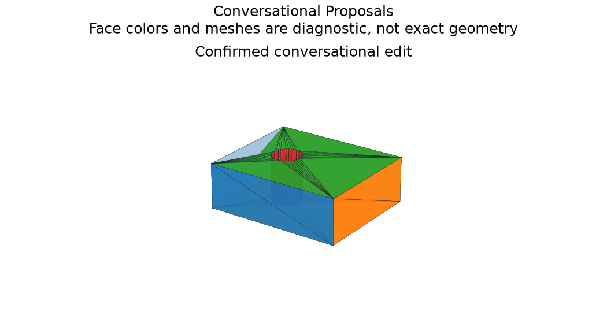

# Conversational Analysis and Edit Proposals

## 日本語概要

v0.79.0では会話による解析・編集案を実装し、8件の限定した合成条件を検証しました。入力・判断根拠・結果をCSV、JSON、図、再生成可能なサンプルに残しています。

検証範囲と失敗例は以下の英語本文に示します。一般のCADデータへの適用や完全な規格適合を主張するものではありません。

---

## English Summary

A deterministic, bounded English/Japanese grammar produces read-only queries or immutable edit intents. It is not a general language model and calls no external service. Explicit unit expressions reuse the safe arithmetic parser. An edit carries selected node/parameter, assumptions, supporting faces, predicted geometry, before/after measurements, recomputed nodes and source/selection/model fingerprints. Apply rechecks freshness and rebuilds before atomically replacing the session.

## Results and Interpretation

Eight workflow controls cover Japanese dimension preview, confirmation refusal, unknown language, code-like expressions, invalid geometry, confirmed application, stale replay and a material-aware mass query. Preview leaves the active model fingerprint and shape unchanged.

The 8 `checks_pass` observations check the declared expectation, including
expected rejections and recorded learning failures. They do not mean that every
input was accepted or every learned prediction was correct.

## Sources and Implementation Boundary

Examples: `ask 穴の半径を1.3 mmに`, `ask set feature radius 1.3 mm`, `ask 質量を教えて`, then `apply latest --confirm` after inspecting the concrete proposal. Failed or stale proposals cannot be exported as current geometry.

- deterministic bounded English/Japanese intent grammar; no LLM service or arbitrary language execution
- preview evaluates proposed geometry without mutating the active model; confirmation is bound to source, selection and model fingerprint
- unknown requests, unsafe expressions, invalid dimensions and stale/replayed proposals fail closed

## Reproduction and Artifacts

Run from the repository root in the pinned geometry environment:

```bash
python experiments/run_conversational_proposals.py
```

Default runs verify fixture bytes. To regenerate into separate directories:

```bash
python experiments/run_conversational_proposals.py --output-dir output/conversational-proposals --fixture-dir output/fixtures/conversational-proposals --refresh-fixtures
```

- [Observations](../results/conversational_proposals.csv)
- [Detailed evidence](../results/conversational_proposals_evidence.json)
- [Contract and limits](../results/conversational_proposals_contract.json)
- [Fixture manifest](../fixtures/conversational-proposals/manifest.csv)
- [Experiment](../experiments/run_conversational_proposals.py)
- [Implementation](../src/research_notes/integration_studies.py)


