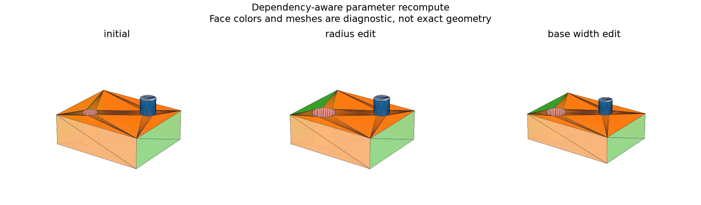

# Dependency Graph and Deterministic Recompute

## 日本語概要

v0.58.0では、特徴の依存関係を非巡回グラフとして再計算します。6ノードに対する6イベント・36状態を記録し、変更された枝だけの評価、独立した枝の再利用、失敗時の最後の有効形状の保持、下流の古い状態、正常値への復旧を検証します。5つの正常イベントではキャッシュ利用時と初期状態からの計算のSTEPが一致します。詳細は英語本文に示します。

---

## English Summary

A bounded feature DAG propagates parameter changes, reuses unchanged results,
isolates failures, and marks descendants stale. Six events produce 36 node
states. All five valid events agree with analytic volume truth and produce
the same normalized STEP bytes when recomputed from an empty cache.

## Research Question and Sources

How can a dependency engine distinguish a current valid result from retained
geometry after a failed edit?

[OCCT OCAF](https://github.com/Open-Cascade-SAS/OCCT/wiki/ocaf) and its
[function mechanism](https://github.com/Open-Cascade-SAS/OCCT/wiki/ocaf_func)
motivate explicit dependencies and evaluation state. This study implements
a small Python DAG and cache; it does not implement OCAF document transactions
or persistent naming.

## Model and Evaluation Contract

`FeatureModel` records a model ID, revision, provenance, source digest,
immutable nodes, and one output ID. Nodes contain an operation, named numeric
parameters, and prerequisite IDs. A bounded graph has at most 64 nodes and
supports plates, the v0.57.0 feature grammar, and result aliases.

Validation rejects duplicate IDs, missing endpoints, cycles, invalid operation
arity, unknown parameter keys, and nonfinite values. Ready nodes are evaluated
in sorted ID order. A node fingerprint includes its operation, parameters,
and the fingerprints/statuses of its dependencies.

Unchanged valid nodes reuse their prior shape. A failed operation keeps its
last valid shape and fingerprint for diagnosis. Its descendants become stale,
while independent branches may still run. Neither a failed nor stale output
is returned by `current_output()`. Returning a parameter to its last valid
value can reuse the retained result without rerunning the kernel.

The six-node control branches from a plate to a hole/boss/result chain and
an independent rib/result chain. Positive dimensions that violate geometric
domains are diagnosed during recompute; a malformed graph fails validation.

## Results

| Event | Revision | Evaluated | Reused | Outcome |
| --- | ---: | ---: | ---: | --- |
| Initial | 1 | 6 | 0 | Both branches valid |
| Unchanged | 1 | 0 | 6 | All cached |
| Hole radius 1 → 1.5 | 2 | 3 | 3 | Only affected chain evaluated |
| Hole radius → 30 | 3 | 1 | 3 | Hole failed; boss and output stale |
| Radius restored to 1.5 | 4 | 0 | 6 | Last valid shapes reused |
| Plate width 12 → 14 | 5 | 6 | 0 | Both branches evaluated |



Every event passes its state and reuse checks. For the five valid events,
the selected output volume matches W × 10 × 4 − πr² × 4 + π × 2 within
1e-7 mm³. The hole and boss are disjoint, so this formula is an independent
oracle for these controls. Cold and cached normalized STEP bytes agree for
all five events. The invalid event has no current-output truth or export claim.

## Reproduction and Evidence

```bash
python experiments/run_deterministic_recompute.py
python -m pytest -q tests/test_deterministic_recompute.py
```

- [Model fixtures](../fixtures/deterministic-recompute/models.json) and [manifest](../fixtures/deterministic-recompute/manifest.csv)
- [Event observations](../results/deterministic_recompute.csv) and [node states](../results/recompute_node_states.csv)
- [Model revisions](../results/recompute_models.json) and [contract](../results/deterministic_recompute_contract.json)
- [Implementation](../src/research_notes/deterministic_recompute.py) and [experiment](../experiments/run_deterministic_recompute.py)

## Limitations and Next Question

Determinism applies to the pinned runtime, stable graph ordering, serialized
parameters, fixed STEP uncertainty, and normalized synthetic outputs.
Cross-platform byte identity, concurrent evaluation, persistent cache storage,
undo/redo, document transactions, expressions, general constraint graphs,
and persistent face/edge references remain unqualified. Retained shapes are
diagnostic state and cannot stand in for the current failed revision.

The next study builds unconfirmed editable candidates from measured STEP
geometry, without supplying the source construction parameters to inference.
