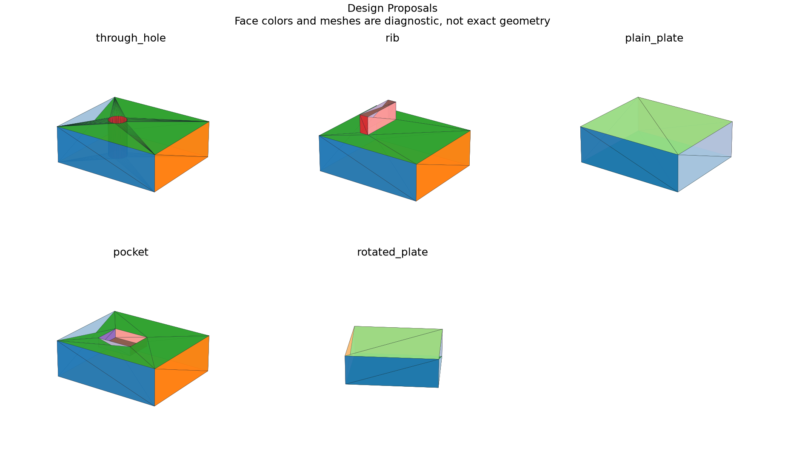

# Assisted Design-Reconstruction Proposals

## 日本語概要

v0.78.0では設計再構成の複数候補を実装し、5件の限定した合成条件を検証しました。入力・判断根拠・結果をCSV、JSON、図、再生成可能なサンプルに残しています。

検証範囲と失敗例は以下の英語本文に示します。一般のCADデータへの適用や完全な規格適合を主張するものではありません。

---

## English Summary

The review evaluates fresh unconfirmed hypotheses at minus/plus 5% of one editable dimension. It reports valid/failed recompute and topology/volume changes without adopting the model or pretending the user confirmed it. Local stability is two samples, not a global editability proof. Selection continues to require the exact candidate ID and explicit confirmation.

## Results and Interpretation

Five imported shapes produce two equivalent through-hole explanations, two rib/boss explanations, one plain-plate and one pocket proposal, and no proposal for a rotated unsupported plate. Each alternative includes source faces, residuals, DAG complexity and sketch fingerprints.

The 5 `checks_pass` observations check the declared expectation, including
expected rejections and recorded learning failures. They do not mean that every
input was accepted or every learned prediction was correct.

## Sources and Implementation Boundary

This extends the source-bound v0.59 reconstruction grammar. A Boolean hole and a hole built into the extrusion profile can have the same final B-Rep, so fit alone cannot recover the original feature history.

- multiple fitting sketch/feature DAG explanations remain separate with source binding
- complexity and +/-5% local dimension stability supplement geometric residuals; no recovered authoring intent
- selection is always explicit; rotated and unsupported feature grammars can return no proposal

## Reproduction and Artifacts

Run from the repository root in the pinned geometry environment:

```bash
python experiments/run_design_proposals.py
```

Default runs verify fixture bytes. To regenerate into separate directories:

```bash
python experiments/run_design_proposals.py --output-dir output/design-proposals --fixture-dir output/fixtures/design-proposals --refresh-fixtures
```

- [Observations](../results/design_proposals.csv)
- [Detailed evidence](../results/design_proposals_evidence.json)
- [Contract and limits](../results/design_proposals_contract.json)
- [Fixture manifest](../fixtures/design-proposals/manifest.csv)
- [Experiment](../experiments/run_design_proposals.py)
- [Implementation](../src/research_notes/integration_studies.py)


