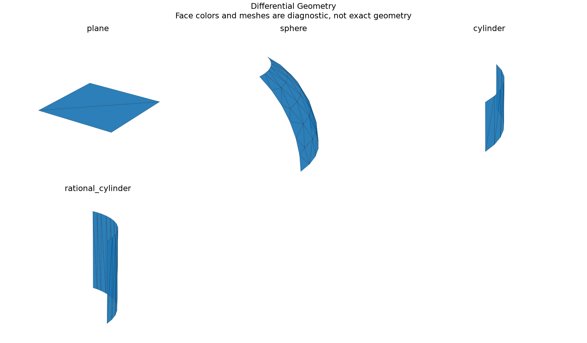

# Differential Geometry and Surface Continuity

## 日本語概要

v0.68.0では微分幾何と曲面の連続性を実装し、9件の限定した合成条件を検証しました。入力・判断根拠・結果をCSV、JSON、図、再生成可能なサンプルに残しています。

検証範囲と失敗例は以下の英語本文に示します。一般のCADデータへの適用や完全な規格適合を主張するものではありません。

---

## English Summary

The implementation forms the first and second fundamental forms from native second derivatives. A symmetric generalized eigenproblem gives principal curvatures and tangent directions. Mean curvature changes sign with orientation; Gaussian curvature does not. Repeated principal values produce nonunique directions. Continuity compares matched sample positions, oriented normals and world-space curvature tensors; samples never certify an entire seam.

## Results and Interpretation

Nine controls include plane, sphere, cylinder and rational cylinder curvature, reversed orientation, a singular sphere pole, coincident/disconnected/tilted planes, and a tangent join with a curvature jump. The quadratic patches retain G1 at three matched samples while failing G2.

The 9 `checks_pass` observations check the declared expectation, including
expected rejections and recorded learning failures. They do not mean that every
input was accepted or every learned prediction was correct.

## Sources and Implementation Boundary

The [OCCT local surface-property interface](https://dev.opencascade.org/doc/occt-6.9.1/refman/html/class_geom_l_prop___s_l_props.html) provides background for derivative and curvature quantities. This implementation computes fundamental-form eigenvalues explicitly rather than treating the interface as an independent oracle.

- signed curvature uses du cross dv; reversing orientation reverses mean curvature
- generalized fundamental-form eigensystem; repeated principal values have nonunique directions
- continuity is a sampled positional/normal/curvature-tensor comparison, never a whole-surface proof

## Reproduction and Artifacts

Run from the repository root in the pinned geometry environment:

```bash
python experiments/run_differential_geometry.py
```

Default runs verify fixture bytes. To regenerate into separate directories:

```bash
python experiments/run_differential_geometry.py --output-dir output/differential-geometry --fixture-dir output/fixtures/differential-geometry --refresh-fixtures
```

- [Observations](../results/differential_geometry.csv)
- [Detailed evidence](../results/differential_geometry_evidence.json)
- [Contract and limits](../results/differential_geometry_contract.json)
- [Fixture manifest](../fixtures/differential-geometry/manifest.csv)
- [Experiment](../experiments/run_differential_geometry.py)
- [Implementation](../src/research_notes/advanced_geometry_studies.py)


