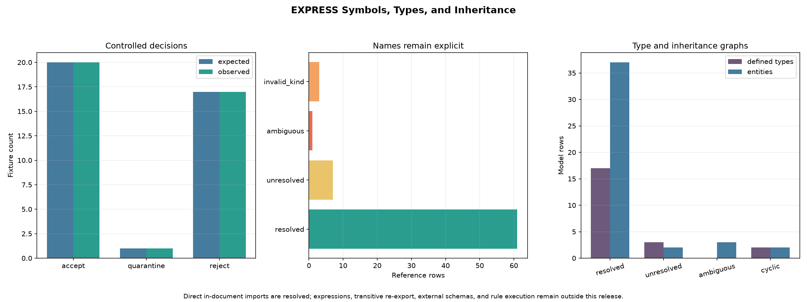

# EXPRESS Symbols, Types, and Inheritance

## 日本語概要

この研究ノートは、v0.25.0で構築した未解決EXPRESSモデルに、シンボル表、大小文字を区別しない名前解決、文書内の直接`USE`・`REFERENCE`、型別名、`SELECT`、集約境界、エンティティ継承、属性再宣言、逆属性の検証を追加します。38個の合成fixtureは20件受理・17件拒否・1件隔離となり、未解決・曖昧・種類不一致・循環を推測で補わず別の状態として保存しました。これは完全なISO 10303-11適合、外部schema読込み、推移的な再公開、式の型検査、制約・rule実行を証明するものではありません。詳しい方法、結果、疑問点は以下の英語本文に示します。

---

## English Summary

This note advances the source-preserving v0.25 EXPRESS model from declarations
to bounded semantic graphs. It evaluates case-insensitive symbols, direct
in-document interfaces, defined types, aggregate bounds, entity inheritance,
qualified attribute redeclarations, and inverse links while retaining
unresolved, ambiguous, invalid-kind, and cyclic states as evidence.

## Research Question

Can a bounded Python implementation connect parsed EXPRESS names to explicit
symbols, type domains, and inheritance relationships without silently choosing
an ambiguous target or implying complete EXPRESS semantic validation?

## Background

[ISO 10303-11:2004](https://www.iso.org/standard/38047.html) defines EXPRESS as
a data-specification language for data types and constraints. It explicitly
does not define a physical file, database, or transfer format, and it is not a
general-purpose programming language. This distinction matters: parsing an
EXPRESS declaration describes a schema, while parsing a Part 21 exchange
structure reads instance syntax governed by such a schema.

EXPRESS identifiers are compared without case sensitivity. A schema can expose
declarations from another schema through `USE FROM` and `REFERENCE FROM`, and
an entity may inherit from multiple supertypes. Defined types can refer to
other defined types; `SELECT` domains refer to named type alternatives; and
attributes can refer to defined types or entity types. These relationships form
graphs, so forward references, cycles, multiple candidates, and kind mismatches
cannot be handled reliably by a single string substitution pass.

The public [STEPcode resolver pass](https://github.com/stepcode/stepcode/blob/7836a9ec77edf01816720e0c6e2b9529ee210129/src/express/resolve2.c)
resolves supertypes and types before later expression and statement work. Its
[schema implementation](https://github.com/stepcode/stepcode/blob/7836a9ec77edf01816720e0c6e2b9529ee210129/src/express/schema.c)
also retains separate USE and REFERENCE structures. This release adopts the
architectural lesson that declaration parsing, name binding, graph resolution,
and expression execution are separate stages. It does not copy STEPcode source
or treat one OSS implementation as a conformance oracle.

The [STEP Tools EXPRESS data-dictionary documentation](https://www.steptools.com/docs/roselib/data_dictionary.html)
provides another public implementation perspective: schema domains retain
types, attributes, select members, and entity hierarchy for late-bound access.
The v0.26 model is much smaller and is not binary- or API-compatible with that
tooling.

## Method

The implementation consumes the immutable declaration model produced by
`parse_express_document()` and adds a bounded semantic stage:

1. Index each schema as `schema::normalized_name` and each local declaration
   as `normalized_schema::normalized_name` using stable analysis-local IDs.
2. Preserve original spelling while comparing schema and declaration names
   case-insensitively.
3. Construct direct in-document visibility tables for local declarations,
   explicit or whole-schema `USE`, and explicit or whole-schema `REFERENCE`.
4. Emit one reference row for each interface schema, imported item, named type,
   `SELECT` member, supertype, rule target, aggregate-bound constant, and
   inverse forward attribute.
5. Resolve defined-type aliases to a controlled terminal domain and detect
   alias cycles.
6. Evaluate aggregate bounds only when they are omitted, `?`, integer literals,
   or constants whose preserved expression is an integer literal.
7. Resolve immediate and transitive entity supertypes, detect cycles, deduplicate
   shared origins in diamonds, and compute effective attribute counts.
8. Validate the controlled `SELF\supertype.attribute` redeclaration form and
   inverse forward-attribute names.
9. Stop semantic graph construction at explicit symbol, reference, and
   inheritance-edge limits.

Reference states are deliberately distinct:

- `resolved`: exactly one candidate of an admitted kind exists;
- `unresolved`: no candidate exists;
- `ambiguous`: more than one visible candidate remains;
- `invalid_kind`: candidates exist, but none has the required declaration kind;
- `cyclic`: a type or inheritance traversal returns to an active node;
- `deferred`: a syntactically retained construct is outside the controlled
  evaluator rather than known to be invalid.

An unresolved or invalid semantic graph is rejected in this experiment.
Resource-limit exhaustion is quarantined. Legal expression forms outside the
small bound evaluator remain deferred and are not reclassified as invalid
EXPRESS.

## Controlled Experiment

All 38 `.exp` inputs are generated by
`build_express_resolution_fixtures()` and committed with a manifest containing
the expected route, reason code, byte length, SHA-256 digest, and active graph
limits. They contain only synthetic names and relationships.

The 20 accepted controls cover:

- local, forward, mixed-case, and aggregate-element references;
- multi-level type aliases and mixed entity/defined-type `SELECT` members;
- literal, unbounded, local-constant, and referenced-constant bounds;
- single, transitive, multiple, and diamond inheritance;
- one qualified inherited-attribute redeclaration;
- explicit, aliased, and whole-schema direct `USE` imports;
- direct `REFERENCE` imports of a constant and a function;
- one inverse attribute and one global-rule target.

The 17 rejected controls isolate missing and wrong-kind names, missing schemas
and import items, a function imported through `USE`, an import collision, type
and inheritance cycles, invalid or ambiguous inherited attributes, a missing
inverse forward attribute, reversed aggregate bounds, and a missing bound
constant. One additional fixture exceeds a one-symbol semantic budget and is
quarantined.

## Results

Every fixture matched its expected decision and reason code.

| Decision | Expected | Observed |
| --- | ---: | ---: |
| Accept | 20 | 20 |
| Quarantine | 1 | 1 |
| Reject | 17 | 17 |

The semantic artifacts contain the following graph evidence across all
fixtures that reached the resolution stage:

| Evidence | Rows | State breakdown |
| --- | ---: | --- |
| Symbols | 118 | schema and declaration identities |
| References | 72 | 61 resolved, 7 unresolved, 1 ambiguous, 3 invalid kind |
| Defined types | 23 | 17 resolved, 3 unresolved, 1 invalid kind, 2 cyclic |
| Entity inheritance | 44 | 37 resolved, 2 unresolved, 3 ambiguous, 2 cyclic |
| Aggregate bounds | 9 | 7 resolved, 2 unresolved |

The diamond control reports the root attribute once even though two immediate
supertypes reach it. The qualified redeclaration replaces one inherited origin
and retains one effective attribute. The collision control exposes two
candidate symbol IDs instead of selecting the first import. Both two-node
cycles remain visible in their graph tables.

These counts describe this synthetic corpus. They are not estimates of public
schema complexity or conformance rates.

## Interpretation

The main result is not simply that 61 names resolved. It is that unsuccessful
resolution remains structured evidence. A caller can distinguish an absent
declaration from two conflicting imports, a wrong declaration kind, or a graph
cycle. That distinction is necessary for diagnostics, safe Part 21 validation,
schema inspection, and any later attempt to construct Python model classes.

Stable symbol IDs are analysis-local and deterministic for one document. They
are useful join keys across the committed CSV files, but they are not global
schema identifiers and must not be treated as persistent identities across
renaming or schema revisions.

The experiment also demonstrates why inheritance is more than a list of
parent names. Effective attributes depend on transitive ancestry, diamonds,
colliding origins, and qualified redeclarations. A syntactically valid
`SUBTYPE OF` clause does not prove a coherent inheritance graph.

## Failure Modes

- Selecting the first case-insensitive match hides import conflicts and makes
  results depend on declaration order.
- Treating `USE` and `REFERENCE` as interchangeable loses the kind boundary
  between named types and broader referenced resources.
- Flattening aliases to strings hides cycles and terminal domains.
- Counting a shared diamond ancestor once per path duplicates inherited
  attributes.
- Accepting an unqualified local attribute with an inherited name can disguise
  an intended EXPRESS redeclaration.
- Resolving an inverse entity type without checking its `FOR` attribute leaves
  a broken relationship looking complete.
- Evaluating arbitrary bound expressions with a host-language evaluator would
  cross both a semantic and a trust boundary.
- Loading an absent schema from a network location during resolution would make
  results non-deterministic and expand the input trust boundary.

## Practical Guidance

- Keep source spelling, normalized lookup keys, and resolved identities as
  separate fields.
- Return all candidates for ambiguity; do not retain only a message string.
- Validate declaration kinds at every reference role.
- Run cycle detection before computing transitive type or inheritance results.
- Track attribute origin so a shared diamond ancestor is not mistaken for two
  independent declarations.
- Treat `SELF\supertype.attribute` as a qualified semantic operation, not a
  decorative attribute name.
- Use a dedicated, bounded expression implementation before expanding constant
  or bound evaluation.
- Require an explicit schema catalog and access policy before permitting
  external schema loading.

## Limitations

- This is a controlled subset and not ISO 10303-11 conformance certification.
- Visibility is limited to local declarations and direct imports from schemas
  present in the same source document. Implicit imports, transitive re-export,
  interface cycles, schema catalogs, and external schema loading are not
  implemented.
- Whole-schema imports expose declarations directly owned by the source schema;
  they do not reproduce the complete EXPRESS implicit-interface rules.
- The parser still supports an ASCII declaration subset. Several EXPRESS
  productions, extensible types, subtype constraints, generic types, local
  scopes, and complete redeclaration syntax remain unsupported.
- Type compatibility, assignment compatibility, parameter checking, `SELECT`
  extensibility, enumeration extension, and entity instance compatibility are
  not implemented.
- Aggregate-bound evaluation accepts only integers, `?`, and integer-literal
  constants. Arithmetic, functions, and general constant expressions remain
  deferred.
- Expression grammar, algorithm statements, `WHERE` and `UNIQUE` typing,
  derived expressions, and global-rule execution remain envelopes or
  `not_attempted`.
- The inverse check confirms one forward attribute name but does not prove the
  complete inverse cardinality and domain rules.
- The 38 generated fixtures do not establish compatibility with AP242, IFC,
  another large public schema, or a production EXPRESS compiler.
- STEPcode and STEP Tools are architectural references, not conformance
  oracles, and neither implementation is executed in this experiment.

## Questions Carried Forward

- Which implicit and transitive interface rules must be represented before a
  multi-file schema catalog can be trusted?
- Should legal but unsupported semantic constructs produce a partial model,
  quarantine, or a capability-negotiated result?
- How should a future expression parser share scope information with type
  checking without mutating the source-preserving declaration model?
- What minimum type-compatibility rules are required before validating Part 21
  entity parameters against EXPRESS declarations?
- Which redistributable public schema subset should provide the first
  interoperability test without embedding restricted standards text?

## Sources

- [ISO 10303-11:2004 catalog page](https://www.iso.org/standard/38047.html)
- [Public final draft of ISO 10303-21 Edition 3, Annex E interface example](https://www.steptools.com/stds/step/IS_final_p21e3.html)
- [STEPcode documentation](https://stepcode.github.io/docs/home/)
- [Pinned STEPcode semantic resolver pass](https://github.com/stepcode/stepcode/blob/7836a9ec77edf01816720e0c6e2b9529ee210129/src/express/resolve2.c)
- [Pinned STEPcode schema interface implementation](https://github.com/stepcode/stepcode/blob/7836a9ec77edf01816720e0c6e2b9529ee210129/src/express/schema.c)
- [Pinned STEPcode entity inheritance implementation](https://github.com/stepcode/stepcode/blob/7836a9ec77edf01816720e0c6e2b9529ee210129/src/express/entity.c)
- [Pinned STEPcode type implementation](https://github.com/stepcode/stepcode/blob/7836a9ec77edf01816720e0c6e2b9529ee210129/src/express/type.c)
- [STEPcode 3-Clause BSD license](https://github.com/stepcode/stepcode/blob/7836a9ec77edf01816720e0c6e2b9529ee210129/COPYING)
- [STEP Tools EXPRESS data dictionary](https://www.steptools.com/docs/roselib/data_dictionary.html)
