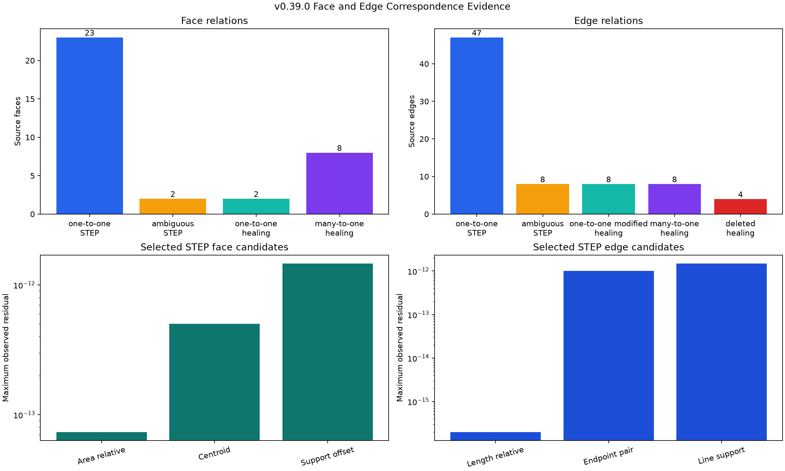

# Face and Edge Correspondence Across STEP Import and Healing

## 日本語概要

本研究は、非対称角柱、全体反転した直方体、分割直方体、完全に重なる2面を合成し、解析用の面番号・辺番号を恒久識別子とせずに、STEP再読込と同一領域統合の前後で面と辺を追跡します。STEP再読込では23面と47辺を一対一対応させ、区別不能な2面と8辺は候補集合を残して棄権しました。分割直方体の統合では10面から6面、20辺から12辺となり、辺は8件の一対一変更、8件の二対一統合、4件の削除として記録され、処理履歴20件すべてと一致しました。幾何推定、隣接面による位相上の裏付け、処理中だけ有効な変更履歴、直接的な位相同一性を別々に記録します。全75辺で直接同一性は確認されず、対応関係は恒久同一性ではありません。詳細、失敗条件、出典は英語本文に示します。

---

## English Summary

Four synthetic controls test face and edge correspondence across STEP
write/read and same-domain healing without treating traversal indices as
persistent names. Geometry inference resolves 23 faces and 47 edges across
STEP import, while the matcher abstains for two coincident faces and eight
duplicate edges. Healing changes the split box from 10 faces and 20 edges to 6
faces and 12 edges. The edge report distinguishes eight one-to-one modified
relations, eight sources participating in four two-to-one merges, and four
deleted internal boundaries. All 20 healing edge relations agree with
operation-local history. Geometry, topology corroboration, operation history,
and direct native identity are separate evidence; no persistent naming is
claimed.

## Research Question

Can face and edge relationships across STEP import and topology-changing
healing be reported as one-to-one, modified, many-to-one, deleted, ambiguous,
or unmatched claims without silently treating analysis-local order as
identity?

## Background

A B-Rep explorer produces useful local indices, but a STEP reader constructs
new backend topology and a repair operation may merge, replace, generate, or
remove entities. Consequently, equality of traversal position is not evidence
that two faces or edges represent the same bounded geometry.

OCCT separates operation history from inferred matching.
[`BRepTools_History`](https://dev.opencascade.org/doc/refman/html/class_b_rep_tools___history.html)
records generated, modified, and removed relations supplied by an operation.
[`ShapeUpgrade_UnifySameDomain`](https://dev.opencascade.org/doc/refman/html/class_shape_upgrade___unify_same_domain.html)
can merge neighboring faces on coincident surfaces and exposes its collected
history. STEP translation does not supply that in-memory operation history;
the translator may also run configurable shape processing, as documented by
the [OCCT STEP translator guide](https://dev.opencascade.org/doc/overview/html/occt_user_guides__step.html).

OCCT also distinguishes native topology identity from geometric equivalence.
`IsSame` tests shared underlying topology at the same location, while
`IsPartner` permits a different location. The experiment records those checks
but does not use them to select correspondence candidates.

This distinction is related to, but narrower than, persistent topological
naming. Kripac's primary study describes the broader requirement of mapping
topological identifiers when a history-based model is reevaluated. This study
does not assign persistent names or solve arbitrary model edits.

## Method

Each stage receives new analysis-local face and edge indices. Every index is
interpretable only with its control and stage.

### Face evidence

A face descriptor records:

- analytic support type;
- area and area centroid;
- an orientation-insensitive canonical plane direction and offset;
- wire and edge counts;
- adjacent-face count; and
- a sorted boundary-edge length signature.

For STEP import, a face candidate must have the same support, a relative area
residual no greater than `1e-8`, and a centroid distance no greater than
`1e-7`. A pair is selected only when it is the sole candidate for both source
and target. These values are regression gates for the generated corpus, not
general CAD tolerances.

For same-domain healing, a source face must lie on the same support plane, its
centroid must classify inside or on the target face, and the target area must
be at least the source area. Multiple independently selected source faces may
therefore map to one target. The inferred target set is compared with the
unifier's history, but the history is retained in separate columns.

### Edge geometry and topology evidence

The edge descriptor records curve type, length, orientation-normalized
endpoints, canonical line direction, the closest point on the line to the
origin, incident-face count, and incident analysis-local face indices. The
controlled corpus contains open straight edges only.

For STEP import, geometry candidates require the same curve type and controlled
agreement in line support, length, and endpoint pair. A candidate is selected
only when the source and target are mutually unique. For healing, both source
endpoints must lie on the target segment, so two collinear source segments may
map to one longer result edge. Geometry inference can leave a seam unmatched;
it becomes `deleted` only when the operation reports it as removed.

Mapped incident-face candidate sets are recorded in both directions as
separate topology corroboration. They are not used to break a geometric tie.
This matters for the coincident control: all duplicate edge candidates have
compatible incident-face candidates, so topology does not justify an arbitrary
selection.

### Operation history and direct identity

For same-domain healing, `Modified`, `Generated`, and `IsRemoved` evidence is
recorded separately for every source edge and compared with the geometric
relation. A one-to-one result is named `one_to_one_modified`, not `preserved`,
because the operation returns a modified topology entity. Direct `IsSame` and
`IsPartner` checks are run across all STEP and healing source/target edge sets,
but they are not candidate signals. Operation history exists only while the
operation object is available; it is not serialized as STEP provenance.

Controlled truth roles are derived from the analytic construction. They are
used for evaluation only and are not passed into the candidate rules. Two
coincident faces and their duplicate edges intentionally share equivalent
geometry and topology evidence. The declared correct outcome is abstention,
not an arbitrary tie break.

## Controlled Experiment

| Control | Independent truth | Intended boundary |
| --- | --- | --- |
| `asymmetric_prism` | Irregular pentagon of area `24.5`, extruded by `4`; 7 faces, 15 edges, volume `98` | Unique planar faces and line edges across STEP import |
| `reversed_box` | `4 × 5 × 6`; 6 faces, 12 edges, volume magnitude `120` | Geometry matching despite whole-shape orientation normalization |
| `split_box` | `10 × 6 × 3`; 10 faces and 20 edges split at `x=4` | Healing produces 6 faces and 12 edges; face and edge merges plus deleted seams are explicit |
| `coincident_faces` | Two independent `3 × 2` faces and 8 duplicate edges at the same location | Tied face and edge candidate sets must remain ambiguous |

Run from the repository root:

```bash
python -m pip install -e ".[geometry,test]"
python experiments/run_shape_correspondence.py
python -m pytest tests/test_shape_correspondence.py
```

Refresh the committed synthetic STEP files explicitly:

```bash
python experiments/run_shape_correspondence.py --refresh-fixtures
```

## Results

| Result | Observed value |
| --- | ---: |
| Face descriptors / candidates / source relations | 56 / 37 / 35 |
| STEP-import face one-to-one relations | 23 |
| Correctly abstained coincident source faces | 2 |
| Split-box imported faces | 10 |
| Split-box healed faces | 6 |
| Face healing one-to-one / many-to-one source relations | 2 / 8 |
| Face relations matching truth / healing history | 35 / 35; 10 / 10 |
| Edge descriptors / candidates / source relations | 122 / 79 / 75 |
| STEP-import edge one-to-one relations | 47 |
| Correctly abstained duplicate source edges | 8 |
| Split-box imported / healed edges | 20 / 12 |
| Healing one-to-one modified / many-to-one / deleted edge sources | 8 / 8 / 4 |
| Distinct many-to-one edge target groups | 4 |
| Edge relations matching truth / healing history | 75 / 75; 20 / 20 |
| History `Modified` / `Generated` items; removed sources | 16 / 0; 4 |
| Direct identity checks / `IsSame` / `IsPartner` sources | 75 / 0 / 0 |
| Maximum selected face area residual / centroid distance | `7.35e-14` / `5.00e-13` |
| Maximum selected edge length residual | `1.99e-16` |
| Maximum selected edge endpoint / line-support distance | `1.00e-12` / `1.49e-12` |

Each split side has two source regions. The two `y`-normal pairs have source
areas `12 + 18 = 30`, and the two `z`-normal pairs have source areas
`24 + 36 = 60`. Every inferred group conserves its controlled target area.
Each of the four merged edge groups also conserves controlled length:
`4 + 6 = 10`.

Twenty-eight of the 47 selected STEP edge relations change analysis-local
index. This is an observation, not a preregistered truth requirement. Face
indices happened to retain their order in this route, which does not make them
persistent.



The preview makes the asymmetric roles, whole reversal, split plane, and
coincident ambiguity inspectable without relying on private models.


## Interpretation

Geometry is sufficient for the deliberately asymmetric controls, but it does
not create identity where the final evidence is indistinguishable. The two
coincident faces have four equally valid face pairs, and each of their eight
source edges has two equally valid target edges. Selecting by explorer order
would produce a deterministic-looking but unsupported answer. Compatible
adjacent-face candidates correctly corroborate the duplicate edge candidates,
but cannot resolve the symmetry.

Healing also changes the cardinality of a correspondence. A persistent-name
column that accepts only one source and one target cannot represent the four
controlled merges. Relation kind and complete source/target sets are therefore
part of the output contract.

Edge cardinality adds a deletion case. The four split seams have no surviving
geometric target and the unifier reports each as removed. The eight end-loop
edges have one-to-one geometry but `Modified` history, while eight longitudinal
segments participate in four two-to-one groups. Calling the first group
"preserved" would overstate native topology identity.

Operation history is stronger provenance than post hoc inference for the
specific operation that produced it. It is not available merely because two
independently loaded shapes look alike, and it does not establish semantic
design intent. The absence of `IsSame` and `IsPartner` across all 75 edge
source relations further demonstrates that inferred correspondence and native
topology identity are separate claims.

## Failure Modes

- Treating face index 4 or edge index 7 before and after import as one
  persistent entity.
- Breaking equal-cost ties by traversal order without reporting ambiguity.
- Requiring face orientation to remain identical when the geometry remains
  equivalent.
- Forcing a many-to-one merge into one preferred source.
- Calling a geometrically one-to-one modified edge the same native topology
  entity.
- Calling an unmatched edge deleted without operation history or another
  explicit deletion witness.
- Using adjacent-face candidates as a tie breaker when they preserve the same
  symmetry as the edge geometry.
- Using a centroid containment sample as proof of arbitrary trimmed-region
  equivalence.
- Treating operation history as STEP-carried provenance.
- Presenting the fixed regression gates as universal matching tolerances.

## Practical Guidance

- Retain stage, fixture hash, backend version, local index, relation kind, and
  evidence source with every mapping.
- Prefer explicit operation history when it exists, but compare it with
  independently measured geometry.
- Preserve complete candidate sets and abstain when evidence is tied.
- Represent one-to-many and many-to-one relations directly.
- Check group-level conservation, such as total area, after merges.
- Check both source-to-target and target-to-source candidate uniqueness.
- Keep geometry candidates, incident-face corroboration, operation history,
  and native identity checks in separate fields.
- Keep semantic names and source-document provenance separate from inferred
  geometric correspondence.

## Limitations

- All support surfaces in this study are planes.
- All evaluated edges are open straight line segments. Circles, ellipses,
  closed or periodic curves, B-splines, degenerate edges, seam edges, p-curves,
  wire order, and edge-use orientation are not evaluated.
- Only one controlled same-domain merge operation is evaluated.
- There are no deleted faces, generated edges, one-to-many splits, moving
  coordinate frames, unit conversions, curved overlaps, holes, or interacting
  repairs.
- Centroid containment is sufficient for the controlled rectangular regions
  but is not a proof for arbitrary trimmed faces or faces with inner loops.
- The experiment uses one pinned `cadquery-ocp`/OCCT route.
- Exact model semantics, construction history, names, and design intent are
  not reconstructed from STEP geometry.
- The evaluated shapes share placement and units.
- Operation history is valid only for this in-memory operation; it is not a
  permanent identifier and is not carried by the written STEP fixtures.
- Native geometry processing is not admitted for arbitrary untrusted input.

## Open Questions

1. How should one-to-many generated relations be evaluated without confusing
   operation output with post hoc geometric inference?
2. Which overlap and curve measures remain reliable for curved trimmed faces,
   holes, closed edges, and splines?
3. How should a matcher normalize independent rigid transforms and units
   without hiding a real placement change?
4. Can STEP identifiers or names be joined to inferred geometry
   without treating optional labels as universally persistent?

## Sources

- [OCCT `BRepTools_History`](https://dev.opencascade.org/doc/refman/html/class_b_rep_tools___history.html)
  defines generated, modified, and removed shape relations.
- [OCCT `TopoDS_Shape`](https://dev.opencascade.org/doc/refman/html/class_topo_d_s___shape.html)
  distinguishes `IsSame`, `IsPartner`, and other native shape comparisons.
- [OCCT `ShapeUpgrade_UnifySameDomain`](https://dev.opencascade.org/doc/refman/html/class_shape_upgrade___unify_same_domain.html)
  documents coincident-surface unification and collected history.
- [OCCT `BRepBuilderAPI_MakeShape`](https://dev.opencascade.org/doc/refman/html/class_b_rep_builder_a_p_i___make_shape.html)
  documents the common generated, modified, and deleted interface.
- [OCCT STEP translator guide](https://dev.opencascade.org/doc/overview/html/occt_user_guides__step.html)
  documents STEP transfer and configurable shape processing.
- [Jiri Kripac, "A mechanism for persistently naming topological entities in history-based parametric solid models"](https://doi.org/10.1016/S0010-4485(96)00040-1)
  describes the broader persistent-identification problem.
