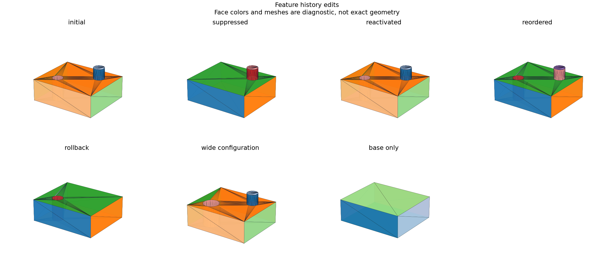

# Feature-History Editing and Configurations

## 日本語概要

v0.63.0では、特徴の抑制・再有効化・順序変更・ロールバック・名前付き構成を扱います。独立な穴とボスの7状態を、体積・表面積の式とSTEP再読込で検証します。詳細は英語本文に示します。

---

## English Summary

Seven authored history variants match independent volume/area truth before and after STEP exchange.

## Question and Method

Can authored feature histories be edited without mutating the original
snapshot or reusing the wrong downstream shape?
[OCAF](https://github.com/Open-Cascade-SAS/OCCT/wiki/ocaf) provides broader
document/history concepts; this implementation uses immutable Python records
and the existing feature DAG.

`FeatureHistory` stores a plate and ordered feature IDs. Suppression bypasses
an operation and reconnects the active dependency chain. Reactivation restores
it. Reordering must contain each ID exactly once. Rollback stops after a
specified feature or the base. A named `Configuration` supplies overrides,
suppression, order, and rollback selection. Invalid changes reject before
adoption. Configurations fork an authored snapshot; revision numbers across
independent cases do not represent one chronological edit log.

## Results

The base is 12 × 10 × 4 mm. A radius-1 through hole and a radius-1,
height-2 boss have disjoint footprints.

| Variant | Independent volume (mm³) | Independent area (mm²) |
| --- | --- | --- |
| Initial | 480 − 2π | 416 + 10π |
| Hole suppressed | 480 + 2π | 416 + 4π |
| Hole reactivated | 480 − 2π | 416 + 10π |
| Boss before hole | 480 − 2π | 416 + 10π |
| Rollback after hole | 480 − 4π | 416 + 6π |
| Wide configuration, radius 1.5 | 480 − 7π | 416 + 11.5π |
| Base only | 480 | 416 |

All seven constructed and imported results match these formulas within
1e-7. Records identify active nodes and reused/evaluated dependencies.
Reordering these disjoint operations preserves geometry while changing
dependency order.

## Boundary

This API edits explicitly authored sequences. It does not recover a STEP
authoring history or qualify arbitrary interacting-feature reordering.
Rollback changes the active construction endpoint; it is not a general
transactional undo/redo system. Only the existing bounded feature grammar is
available, and the full-profile hole route still requires a plain plate.

## Reproduction and Artifacts

```bash
python experiments/run_feature_history_editing.py
```

Default runs verify fixture bytes. Use `--fixture-dir` and `--output-dir`
with `--refresh-fixtures` to generate separate copies.

- [Fixture manifest](../fixtures/feature-history-editing/manifest.csv)
- [Observations](../results/feature_history_editing.csv)
- [Detailed records](../results/feature_history_models.json)
- [Contract](../results/feature_history_editing_contract.json)
- [Implementation](../src/research_notes/feature_history_editing.py)
- [Experiment](../experiments/run_feature_history_editing.py)


