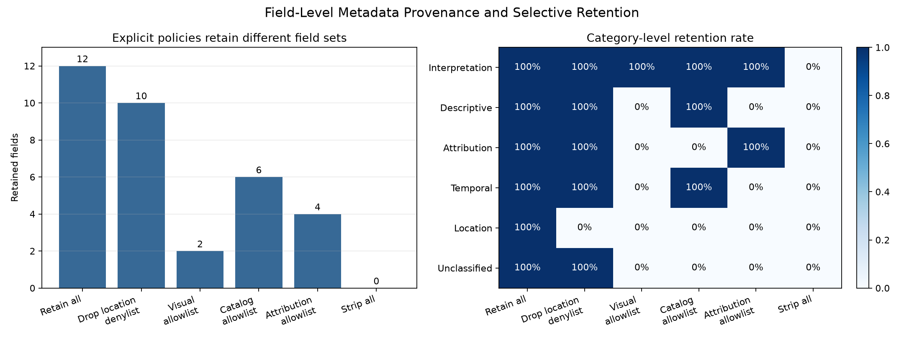
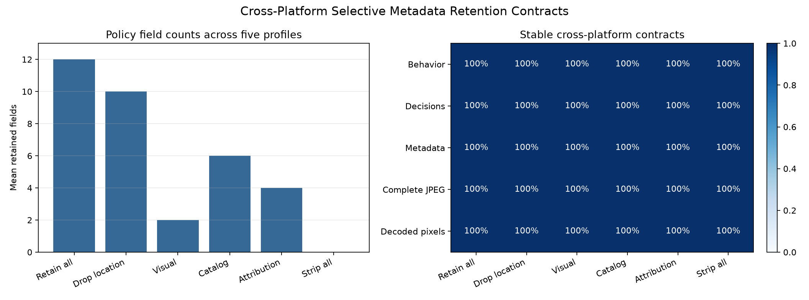

# Field-Level Metadata Provenance and Selective Retention

## 日本語概要

本ノートは、EXIF・XMP・ICC・JPEG COM・opaque APP13にまたがる12個の合成metadata fieldを対象に、field単位の出所、保持判断、source/output hashを記録します。24件のローカルpolicy観測と288件のfield判断では、明示的allowlistが指定外fieldを除去する一方、location denylistは位置情報を除去しても未分類fieldを保持しました。5環境の120観測と1,440判断でも、全24契約でbehavior、decision、metadata、完全JPEG、復号画素が一致しています。

実験設計、結果、実務上の判断基準、適用範囲は以下の英語本文を参照してください。

---

## English Summary

This study tracks twelve controlled JPEG metadata fields through explicit
retain, denylist, allowlist, and strip policies. It records each source
field's normalized hash, category, source container, decision reason, and
output hash while separately checking strict validity, compressed image data,
and raw decoded pixels.

## Research Question

Can a JPEG metadata pipeline make selective retention decisions at field
granularity while preserving an auditable link from each source field to its
output state?

The experiment asks four narrower questions:

1. Can semantically equivalent metadata stored with different byte order,
   segment order, and XML property order produce the same normalized field
   identities?
2. Do explicit allowlists retain only declared fields, including fields that
   affect image interpretation?
3. Does a location denylist remove the declared location fields while still
   retaining unclassified or opaque fields?
4. Can the policy change metadata without changing the re-encoded JPEG image
   data or raw decoded pixels?

The study evaluates provenance as a declared processing record. It does not
claim that a hash proves who created a field, that a value is truthful, or
that the source is authentic.

## Background

JPEG application metadata is not one homogeneous object. EXIF uses a
TIFF-based structure, XMP uses an extensible RDF/XML data model, ICC profiles
have their own binary format and JPEG chunking rules, and JPEG also permits
comments and application-specific marker payloads.

Consequently, "preserve metadata" can describe several different operations:

- copying an opaque byte envelope;
- preserving a normalized semantic value;
- retaining selected fields while rebuilding their containers;
- retaining every field not named by a denylist;
- retaining only fields named by an allowlist.

These operations have different failure modes. A denylist can remove known
location fields but leave a custom XMP property or opaque APP payload whose
meaning was never classified. An allowlist can bound the output field set, but
it can also discard legitimate information when its support list is
incomplete.

EXIF Orientation and an embedded ICC profile are treated as
interpretation-affecting fields in this experiment. Their presence can change
layout or color handling even when a raw decoder returns the same sample
array. Descriptive, attribution, temporal, location, and unclassified fields
are recorded separately so policy intent is visible rather than inferred from
the container marker alone.

## Method

The controlled source contains twelve fields:

| Field | Container | Category |
| --- | --- | --- |
| `exif.orientation` | EXIF APP1 | interpretation |
| `exif.image_description` | EXIF APP1 | descriptive |
| `exif.artist` | EXIF APP1 | attribution |
| `exif.datetime` | EXIF APP1 | temporal |
| `xmp.dc_title` | XMP APP1 | descriptive |
| `xmp.dc_creator` | XMP APP1 | attribution |
| `xmp.exif_gps_latitude` | XMP APP1 | location |
| `xmp.exif_gps_longitude` | XMP APP1 | location |
| `xmp.synthetic_pipeline_hint` | XMP APP1 | unclassified |
| `icc.profile` | ICC APP2 | interpretation |
| `jpeg.comment` | JPEG COM | descriptive |
| `app13.opaque` | controlled APP13 | unclassified |

All values are synthetic and fixed in code. CSV evidence stores field
identifiers, lengths, and SHA-256 values rather than the source text.

Two source layouts carry the same normalized values:

- `canonical_order` uses big-endian EXIF, canonical EXIF and XMP property
  order, and a declared segment order;
- `reordered_equivalent` uses little-endian EXIF, reversed EXIF and XMP
  property order, and reversed metadata segment order.

The layouts are byte-distinct but share the same compressed image data and
normalized metadata-state hash. The parser accepts only this bounded
controlled corpus. It is not an arbitrary EXIF or XMP implementation.

Every source is decoded through Pillow and re-encoded at quality 75 with 4:4:4
sampling through Pillow or OpenCV. The field policy is applied after that
re-encode.

The six policies are:

| Policy | Declared behavior |
| --- | --- |
| `retain_all` | Retain every recognized controlled field |
| `drop_location_denylist` | Remove fields categorized as location and retain every other field |
| `allow_visual_context` | Retain only EXIF Orientation and the ICC profile |
| `allow_catalog` | Retain Orientation, ICC, description, title, timestamp, and comment |
| `allow_attribution` | Retain Orientation, ICC, EXIF Artist, and XMP Creator |
| `strip_all` | Retain no controlled field |

Retained fields are serialized in one deterministic canonical layout. Each
decision row records:

- source layout, encoder, and policy;
- field identifier, category, and source container;
- source ordinal, length, and normalized SHA-256;
- retain or remove decision and reason code;
- output SHA-256 when retained;
- semantic-value equality between source and output.

Each output observation separately records strict audit acceptance, normalized
metadata-state hash, complete JPEG hash, metadata-free re-encoded core
equality, and raw BGR equality to the policy-free re-encode control.

## Controlled Experiment

The local experiment produces 24 output observations:

```text
2 equivalent metadata layouts
  x 2 fixed re-encoders
  x 6 selective-retention policies
= 24 output observations
```

Each observation evaluates all twelve source fields:

```text
24 output observations
  x 12 source fields
= 288 field-level decisions
```

The controlled variables are:

- one deterministic 112 x 80 synthetic BGR image;
- one synthetic gamma 2.2 RGB ICC profile;
- fixed field values and field classifications;
- fixed quality 75 and 4:4:4 sampling;
- one raw Pillow decoder boundary;
- explicit policy definitions without runtime configuration;
- normalized value hashes that are independent of source field order;
- no natural images, external metadata, timestamps, or machine-specific
  paths.

The layout pair is a semantic-equivalence control, not a claim that arbitrary
EXIF or XMP serializations are equivalent.

## Results

All 24 outputs passed the strict metadata audit. All 24 retained the exact
policy-free compressed image core and were raw-pixel exact to their re-encode
control.

The retained field counts were identical for both source layouts and both
encoder wrappers:

| Policy | Retained fields | Location retained | Unclassified retained |
| --- | ---: | ---: | ---: |
| `retain_all` | 12 / 12 | 2 / 2 | 2 / 2 |
| `drop_location_denylist` | 10 / 12 | 0 / 2 | 2 / 2 |
| `allow_visual_context` | 2 / 12 | 0 / 2 | 0 / 2 |
| `allow_catalog` | 6 / 12 | 0 / 2 | 0 / 2 |
| `allow_attribution` | 4 / 12 | 0 / 2 | 0 / 2 |
| `strip_all` | 0 / 12 | 0 / 2 | 0 / 2 |

Every retained decision preserved the normalized source value exactly. Every
removed decision had no output value hash.

For each encoder and policy, the two byte-distinct source layouts produced one
output metadata-state hash and one complete JPEG hash. Canonical
serialization therefore removed the controlled layout difference without
changing the selected values.



The location denylist demonstrates the intended negative control. It removed
both declared GPS fields but retained the custom XMP pipeline hint and opaque
APP13 payload because neither field was categorized as location. Passing that
denylist is not evidence of data minimization.

### Cross-Platform Results

The successful
[five-profile workflow](https://github.com/cab0a/research-notes/actions/runs/30501815768)
recorded 120 output observations, 1,440 field decisions, and 24 fixture,
encoder, and policy contracts:

- all 120 outputs passed the strict metadata audit;
- all 24 contracts had one categorical behavior signature;
- all 24 contracts had one complete field-decision signature;
- all 24 contracts had one normalized metadata-state hash;
- all 24 contracts had one complete JPEG hash;
- all 24 contracts had one decoded-pixel hash.



The matrix covers Ubuntu x64 default and forced-scalar paths, Windows x64,
macOS arm64, and macOS Intel x64 with the pinned wheels. This exact agreement
is compatibility evidence for those profiles and controlled fields. It is not
a guarantee for other parser implementations, codec builds, or future runner
images.

## Interpretation

Field-level provenance makes three claims separable:

1. **Origin within this pipeline:** the decision row identifies which
   controlled source field produced an output field.
2. **Semantic value continuity:** source and output normalized value hashes
   match for retained fields.
3. **Policy justification:** every field has an explicit retain or remove
   reason.

None of these claims establishes external authorship or truth. The source
value could be wrong, forged, stale, or copied from another file before it
reaches this pipeline.

The allowlist policies bound the output to an enumerated field set. The
denylist policy bounds only the fields it explicitly rejects. This distinction
is observable in the two unclassified fields: the denylist retains them,
whereas every selective allowlist removes them.

The canonical output also shows why byte identity and semantic provenance are
different. Big-endian and little-endian EXIF plus different XML and segment
orders converge to one output representation, so the complete source
metadata bytes are not preserved even though every retained normalized value
is exact.

## Failure Modes

### A location denylist is treated as complete minimization

Removing known GPS fields does not inspect the meaning of custom XMP
properties, comments, filenames, thumbnails, maker notes, or opaque APP
payloads. The controlled denylist deliberately retains two unclassified
fields.

### An allowlist is treated as semantically complete

An allowlist bounds output fields only relative to its implemented parser and
schema. Unsupported EXIF IFDs, extended XMP, IPTC IIM, maker-specific data,
thumbnails, and unknown namespaces are outside this parser.

### Matching hashes are treated as authenticity

The hashes demonstrate equality between values observed inside one controlled
run. They do not authenticate the source, author, capture device, capture
time, or prior processing history.

### Raw decoded pixels are treated as rendered equivalence

The raw-pixel check deliberately does not apply EXIF Orientation or ICC color
management. Removing either field can change downstream presentation while
the raw BGR array remains unchanged.

### Canonicalization is treated as byte preservation

The two source layouts intentionally use different bytes. A canonical output
retains selected normalized values, not source container order, endian choice,
padding, or complete metadata bytes.

## Practical Guidance

- Define retention at field or explicitly bounded namespace granularity
  rather than using an undocumented "copy metadata" option.
- Record one decision for every parsed source field, including removals.
- Include field identifier, parser version, source value hash, output value
  hash, and decision reason in the audit record.
- Use allowlists when the output field set must be bounded, and publish the
  unsupported-field behavior.
- Do not describe a denylist as minimization without testing unclassified and
  opaque controls.
- Treat interpretation-affecting fields separately from raw-pixel equality.
- Avoid a lossy image re-encode when only metadata needs to change.
- Route malformed, oversized, duplicate, or unsupported structures through an
  explicit accept, sanitize, reject, or quarantine boundary.

## Limitations

- The source is one small synthetic RGB image with two equivalent metadata
  layouts.
- The corpus contains twelve fixed controlled fields, not a representative
  sample of real camera or editing metadata.
- The EXIF parser supports four IFD0 fields only.
- The XMP parser supports five fixed properties in one standard packet; it
  does not support extended XMP, qualifiers beyond the controls, or arbitrary
  RDF graphs.
- APP13 is a controlled opaque payload and is not interpreted as IPTC IIM or
  another registered format.
- ICC is retained as one complete binary profile; individual ICC tags are not
  selectively filtered.
- The study does not cover EXIF thumbnails, GPS IFD parsing, maker notes,
  multiple conflicting fields, signatures, or authenticated provenance.
- Quality 75, 4:4:4 sampling, Pillow raw decode, and the pinned encoder builds
  define the image path.
- Malformed metadata, duplicate-field recovery, parser resource limits, and
  quarantine decisions are deferred to v0.17.0.
- The experiment is not a privacy certification, security assessment, or
  proof that retained metadata is truthful.

## Sources

- [CIPA Exif standards list](https://www.cipa.jp/e/std/std-sec.html)
- [Adobe XMP specifications](https://developer.adobe.com/xmp/docs/xmp-specifications/)
- [Adobe XMP namespace definitions](https://developer.adobe.com/xmp/docs/xmp-namespaces/)
- [ICC.1:2022 profile specification](https://www.color.org/specifications/ICC.1-2022-05.pdf)
- [ICC profile embedding guidance](https://www.color.org/profile_embedding.xalter)
- [ITU-T T.81: JPEG continuous-tone image coding](https://www.itu.int/ITU-T/recommendations/rec.aspx?id=2633)
- [ITU-T T.86: JPEG APPn markers](https://www.itu.int/epublications/publication/itu-t-t-86-v2-2024-02-information-technology-digital-compression-and-coding-of-continuous-tone-still-images-appn-markers)
- [Pillow JPEG format documentation](https://pillow.readthedocs.io/en/stable/handbook/image-file-formats.html#jpeg-saving)
