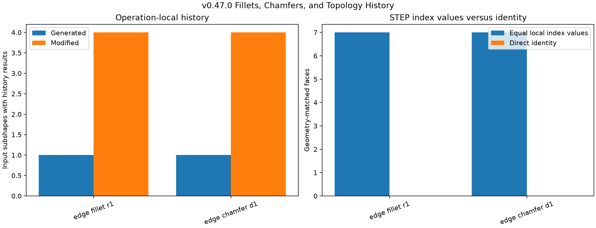
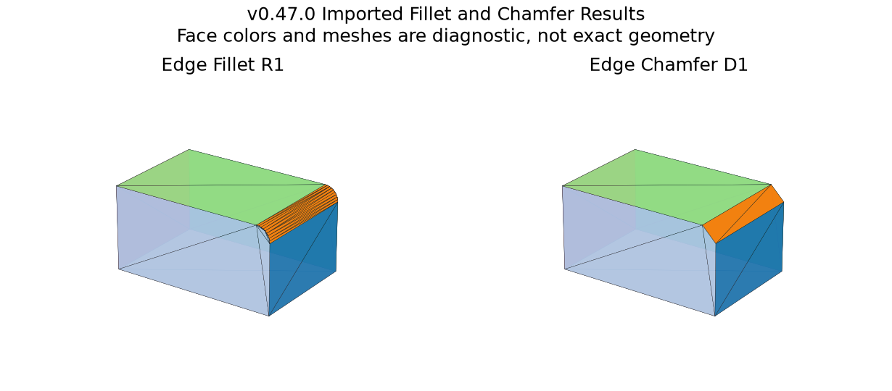

# Fillets, Chamfers, and Topology History

## 日本語概要

本ノートは、12×8×6の直方体の同じ辺に半径1の丸めと距離1の面取りを適用し、解析真値、STEP往復、演算中だけ取得できる位相履歴を検証します。半径・距離20は計算核が完了せず拒否されました。正常2例では入力26要素ごとに履歴を記録し、各例で1本の辺から新しい面1個、4面から変更後の面を取得しました。この条件では分割・統合・対応範囲内の削除は0件です。STEP往復では全14面の解析番号が偶然一致しても、直接同一性と演算履歴は0件でした。番号一致を永続識別子と解釈できないことを示します。詳細は英語本文に示します。

---

## English Summary

This study applies one fillet and one chamfer to the same controlled box edge,
checks analytic volume and area, records source-kind-scoped native history,
and compares successful results across STEP. Oversized parameters provide two
native non-completion controls. All face index values happen to remain equal
across this writer/reader route, while direct topological identity and
operation history remain absent after import.

## Research Question

What can operation-local `Generated`, `Modified`, and `IsDeleted` queries say
about a controlled fillet and chamfer, and which of those relationships survive
STEP exchange?

## Background

Open CASCADE's make-shape base class defines deferred history methods for
generated, modified, and deleted subshapes. The local fillet and chamfer APIs
narrow their documented roles: `Generated` accepts input edges or vertices,
while `Modified` and `IsDeleted` describe input faces. These relationships
belong to the in-memory algorithm instance. A STEP B-Rep stores evaluated
geometry and topology but does not automatically serialize that algorithm
object or its construction parameters.

## Method

The base solid is a `12 x 8 x 6` box. Every control selects the edge from
`(12, 0, 6)` to `(12, 8, 6)` by endpoint coordinates rather than relying on its
local index.

| Control | Operation | Parameter | Expected route |
| --- | --- | ---: | --- |
| `edge_fillet_r1` | fillet | radius `1` | accept |
| `edge_chamfer_d1` | chamfer | distance `1` | accept |
| `edge_fillet_r20` | fillet | radius `20` | native not done |
| `edge_chamfer_d20` | chamfer | distance `20` | native not done |

For successful operations, cross-section formulas define independent truth.
The fillet removes `8 * (1 - pi/4)` volume and replaces two rectangular strips
with a quarter-cylinder side. The chamfer removes an `8 * 1/2` triangular
prism and replaces two strips with one diagonal strip.

## Controlled Experiment

For each successful result, the experiment:

1. checks kernel validity, topology, support surfaces, volume, and area;
2. queries `Generated` for each input vertex and edge;
3. queries `Modified` and `IsDeleted` for each input face;
4. resolves history outputs to result-local indices and counts one-to-many
   splits and multiple-source merge candidates;
5. records direct presence of every input subshape in the result independently
   of native history;
6. writes and rereads normalized STEP;
7. matches result faces to imported faces by support type, area, and centroid;
   and
8. records local index equality, direct topological identity, and imported
   history availability as separate fields.

Run the study with:

```bash
python experiments/run_topology_history.py
```

## Results

| Evidence | Fillet | Chamfer |
| --- | ---: | ---: |
| Successful input-history rows | 26 | 26 |
| Sources directly present in result | 15 | 15 |
| Sources with generated results | 1 | 1 |
| Sources with modified results | 4 | 4 |
| Supported deleted sources | 0 | 0 |
| Modified split sources | 0 | 0 |
| Modified merge targets | 0 | 0 |
| Geometry-matched STEP faces | 7 | 7 |
| Equal local face-index values | 7 | 7 |
| Direct identities across STEP | 0 | 0 |
| Imported operation histories | 0 | 0 |

Both successful results are analyzer-valid before and after STEP import and
match analytic volume and area within `1e-8`. The fillet result contains six
planes and one cylinder; the chamfer contains seven planes. Both oversized
controls build one contour description but finish with `IsDone=false`.





## Interpretation

The selected edge generates the new fillet or chamfer face, while four box
faces report modified successors. Fifteen of 26 source subshapes remain
directly present in each result. These are different relationships and are
therefore stored in separate columns.

No split, merge, or supported face deletion occurs in these two controls. A
zero is an observation about this input, not evidence that local operations
cannot create those histories elsewhere.

All 14 constructed/imported face pairs happen to use equal local integer
indices in the pinned route. Nevertheless, every direct `IsSame` identity
check is false and no imported algorithm history exists. Equal positional
numbers are thus ordering coincidence, not persistent naming. Geometry-based
matching can reconnect this bounded report, but it still does not recover
authoring identity or intent.

## Failure Modes

- Oversized fillet and chamfer parameters create a contour but do not complete
  a result on the controlled box.
- Calling history methods outside their documented source-kind roles can
  produce misleading interpretations, so unsupported cells remain blank.
- A source subshape can remain directly present without appearing in a
  generated or modified history list.
- A geometry match after STEP is an inferred correspondence, not direct
  topological identity.
- Local indices can remain numerically equal while all object identities and
  feature history have changed.

## Practical Guidance

- Select modeling inputs by geometric and topological predicates, not a bare
  positional index.
- Retain the live operation history before export when downstream feature
  correspondence matters.
- Store generated, modified, deleted, direct-presence, split, and merge evidence
  separately.
- Treat native non-completion as a first-class result with the attempted
  parameter and selected input recorded.
- After STEP import, use explicit geometry/topology matching with ambiguity and
  abstention rules; never promote local index equality to persistent identity.

## Limitations

The study uses one convex box edge, symmetric unit fillet and chamfer, two
oversized parameters, and one pinned backend. It does not cover multi-edge
propagation, variable radii, asymmetric chamfers, concave edges, tangent chains,
partial failures, blends meeting blends, deleted-face cases, split or merge
positive controls, history composition across multiple operations, naming
algorithms, XCAF labels, cross-kernel exchange, or arbitrary STEP inputs. Face
matching uses support type, area, and centroid on uniquely distinguishable
synthetic faces and is not a general correspondence algorithm.

## Sources

- [Open CASCADE `BRepBuilderAPI_MakeShape` reference](https://dev.opencascade.org/doc/refman/html/class_b_rep_builder_a_p_i___make_shape.html)
- [Open CASCADE `BRepFilletAPI_MakeFillet` reference](https://dev.opencascade.org/doc/refman/html/class_b_rep_fillet_a_p_i___make_fillet.html)
- [Open CASCADE `BRepFilletAPI_MakeChamfer` reference](https://dev.opencascade.org/doc/refman/html/class_b_rep_fillet_a_p_i___make_chamfer.html)
- [Open CASCADE `BRepTools_History` reference](https://dev.opencascade.org/doc/refman/html/class_b_rep_tools___history.html)
