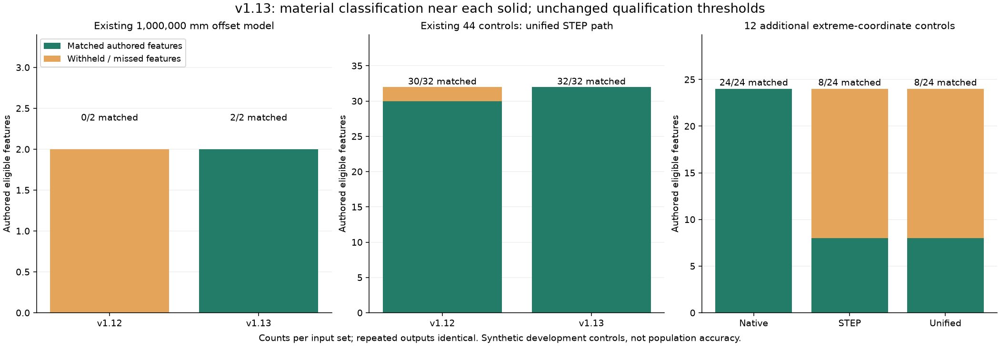

# Hole Numerical Stability — v1.13.0

## 日本語概要

原点から100万mm離した部品で、丸穴と長孔を取りこぼす問題を修正しました。穴の壁の両側がどちらも境界と判定されていたため、材料判定用の部品コピーと検査点だけを原点近くへ平行移動します。表示・CSV・JSONの位置、入力内の面番号、判定許容差は維持します。

既存44形状のSTEP読込後と統合APIでは、取得対象32個中30個から32個中32個へ改善しました。この固定評価の誤取得と取得値の照合失敗は0個です。公開ブラケットの丸穴5か所・長孔6か所も変わりません。

追加した遠方座標12形状は、作成直後のB-Repでは24個中24個を取得しましたが、STEP交換後は24個中8個でした。書出・読込で円弧の角度・許容差・開口の証拠が変わる条件には16個の見逃しが残ります。正解を0個へ変えず、未取得として記録します。

合成形状の開発時評価です。実部品全体への精度保証、独立した測定精度の実証、全体の穴数の保証ではありません。

## English summary

Material sampling now uses a private per-solid translated frame. The existing
1,000,000 mm offset model improves from zero to two matched local features.
The frozen 44-control imported/unified matrix improves from 30/32 to 32/32;
false accepted rows and measurement mismatches remain zero. Output coordinates,
original face IDs and tolerance gates are unchanged.

Twelve additional extreme-coordinate controls retain their authored two-feature
truth. Native geometry matches 24/24, while STEP exchange and unified intake
match 8/24, retaining 16 misses. These are development controls from the same
OCCT creation/exchange/recognition chain, not held-out accuracy or metrology.

## 修正した判定

既存の`translated_1e6.step`は、丸穴と長孔がある部品を
`(1000000, -1000000, 1000000) mm`へ移動した入力です。
v1.12では円筒・開口・面積などの条件を満たしていても、壁の内外を調べる点が
`ON`（境界）となり、通常の材料`IN`と空間`OUT`を確認できませんでした。

v1.13ではソリッドごとの境界ボックス中心を内部の基準点にします。
判定用のコピーとサンプルに同じ平行移動を適用し、元の長さ許容差で材料を判定します。
位置合わせ・拡大縮小・形状修復・許容差の置換は行いません。
別々の場所にある複数ソリッドも、それぞれの近くの座標で判定します。

形状の認識・寸法取得・面番号は元のB-Repから行います。
元の面・辺・頂点の許容差上限`1e-5 mm`、半径・貫通長の小ささの判定、
円弧角度・支持面・接続・面積・段差の条件は変更していません。
材料判定を通過するだけで、認識条件を満たさない形状を取得することはありません。

| 既存100万mm移動モデル | v1.12 | v1.13 |
| --- | ---: | ---: |
| 作成直後の丸穴・長孔 | 0 / 2 | 2 / 2 |
| 同じ凍結STEPの読込後 | 0 / 2 | 2 / 2 |

[比較記録](../results/hole-numerical-stability/before-after.json)は、
v1.12のコミット`5182f09b53fa824f119bf8fd51ab855d5824d212`から取得した2つの認識関数を、
同じ凍結入力と今回の実行環境で評価したものです。旧ソース・入力のSHA-256を記録しています。
共通の幾何ヘルパーを使う関数単位の比較で、過去の実行環境全体の復元ではありません。

## 既存44形状の再評価

| 経路 | 取得対象 | v1.12の取得 | v1.13の取得 | v1.13の誤取得 | v1.13の見逃し |
| --- | ---: | ---: | ---: | ---: | ---: |
| 作成直後のB-Rep | 32 | 26 | 28 | 0 | 4 |
| STEP読込後の個別認識 | 32 | 30 | 32 | 0 | 0 |
| STEPからの統合API | 32 | 30 | 32 | 0 | 0 |

各経路を2回評価し、繰り返し結果は一致しました。
対象外・微小寸法の28形状は引き続き取得0個です。物理的な穴の不存在は意味しません。
面・辺・頂点の許容差を変える9条件と、入力・API例外の17観測も維持しています。
STEP読込後の最大寸法・位置の照合差は約`2.84e-7 mm`、方向成分差は約`9.90e-9`です。
正解は作成寸法と解析的な変換から定義しました。測定誤差の実証値ではありません。

作成直後に残る4個は100倍拡大とその複合変換です。
辺・頂点の許容差が約`1.5e-5 mm`となるため、元の許容差上限で保留します。
内部の判定用コピーで、この上限を回避しません。
STEP交換後には許容差が再設定され、この固定入力では取得します。

## 追加の遠方座標12形状と残る限界

移動量`1e6 / 1e7 / 1e8 mm`の各3条件に対して、通常寸法・3D回転・
0.01倍・0.1倍と3D回転の4条件を組み合わせました。
丸穴・長孔が各1個あるため、全12形状の取得対象は24個です。
各形状を3経路で2回評価し、36観測行・72回の入力評価を記録しました。

| 経路 | 取得対象 | 正しく取得 | 誤取得 | 見逃し | 取得値の照合失敗 |
| --- | ---: | ---: | ---: | ---: | ---: |
| 作成直後のB-Rep | 24 | 24 | 0 | 0 | 0 |
| STEP読込後の個別認識 | 24 | 8 | 0 | 16 | 0 |
| STEPからの統合API | 24 | 8 | 0 | 16 | 0 |

STEP交換後の回転モデルでは、円筒の一周や半円の角度が厳密な条件から外れます。
最遠の回転モデルでは許容差上限超過も観測しました。
0.01倍かつ`1e7 / 1e8 mm`移動した入力では開口の証拠を確認できませんでした。
判定用の平行移動は、保存・読込で失われた桁や変化した円弧パラメータを回復しません。
角度・許容差・段差の条件を緩めて取得扱いにはしていません。

`passed`は既存の修正対象と必須経路の一致、誤取得・取得値の不一致がないこと、
繰り返し一致などを示します。追加条件の全認識成功を示しません。
新しい評価の`all_expected_features_recognized`は`false`です。



左は既存100万mm移動モデル、中央は既存44形状、右は追加12形状の別々の評価です。
緑は正解との一致、橙は取得対象の未取得です。追加条件を含む万能な認識率にまとめません。

## 保留と入力の保持

座標の浮動小数点間隔が許容差の1/16（`6.25e-7 mm`）を超える検査点は保留します。
これは計算時の保守的な上限で、測定精度の証明ではありません。
`1e10 mm`付近の直接材料判定では、この理由で拒否することを確認しています。
有限でない検査点も受け入れません。

追加テストでは、対象外25形状と微小寸法3形状を100万mm移動しても取得0個であること、
遠方座標での9許容差条件、離れた複数ソリッドの取得、元の頂点位置・面番号・許容差の保持を確認しました。
別部品が穴を塞ぐ組立の通路確認は対象外です。全体数不明と人の確認への保留を維持します。

公開STEP6件も各3回再評価しました。ブラケットの丸穴5か所・長孔6か所と、
残る5件の取得0件、全6件の全体数不明を維持しています。
従来の出所・ライセンス・入力と、v1.12以前の証拠ファイルは変更していません。

## 再現方法と証拠

```bash
python -m research_notes.hole_numerical_stability --output-dir output/hole-numerical-stability-check --repeats 2
python -m research_notes.hole_robustness --output-dir output/hole-stability-regression --repeats 2
python -m research_notes.unified_hole_benchmark --output-dir output/hole-stability-public --repeats 3
python experiments/plot_hole_numerical_stability.py --results results/hole-numerical-stability
python -m pytest tests/test_hole_numerical_stability.py tests/test_hole_robustness.py tests/test_unified_hole_inventory.py tests/test_public_hole_inventory.py tests/test_slot_inventory.py -q
```

通常は凍結STEPを読み、書き換えません。再生成する場合だけ、別の出力先を指定します。
旧認識関数との比較には、上記コミットを含むGit履歴が必要です。
WSLの準備済み環境では`python`を`output/venv312/bin/python`へ置き換えます。

```bash
python -m research_notes.hole_numerical_stability --fixture-dir output/regenerated-numerical-controls --refresh-fixtures --output-dir output/regenerated-numerical-results
```

- [追加12形状の正解・入力・SHA-256](../fixtures/hole-numerical-stability/manifest.json)
- [追加評価・理由・寸法差・コードSHA-256](../results/hole-numerical-stability/results.json)
- [追加評価のCSV](../results/hole-numerical-stability/matrix.csv)
- [旧認識関数との比較](../results/hole-numerical-stability/before-after.json)
- [既存44形状・許容差・例外の再評価](../results/hole-numerical-stability/robustness/results.json)
- [公開6件の再評価](../results/hole-numerical-stability/public-regression/results.json)
- [関連テスト・CLI・パッケージ確認](../results/hole-numerical-stability/verification.json)
- [操作手順](../docs/cad-hole-inventory.md)

関連450テスト（新規105テストを含む）がWSL環境で合格しました。インストール済みの
`research-hole-list`でも、改善した遠方座標・公開ブラケット・段差による保留・STEP交換の保留を確認し、CSVが各評価と一致しました。
v1.13.0のwheelとソースの一致、凍結入力の再評価、以前の検証データの保持も確認しています。
他OSのCI結果や、今回追加していない画面操作のブラウザー再検証は主張しません。

2 MB入力・512面走査・256面プレビューと、ネイティブ処理を同一プロセスで行う制限は維持しています。
CPU・メモリの強制期限、任意STEPの全穴認識、独立した加工寸法の保証は追加していません。

実装で利用する平行移動と材料分類のAPIは、OCCTの
[BRepBuilderAPI_Transform](https://dev.opencascade.org/doc/refman/html/class_b_rep_builder_a_p_i___transform.html)と
[BRepClass3d_SolidClassifier](https://dev.opencascade.org/doc/refman/html/class_b_rep_class3d___solid_classifier.html)を参照。
リンク先は公開時点の公式リファレンスで、実際の検証ランタイムはJSONに記録したOCCT 7.9.3系です。
