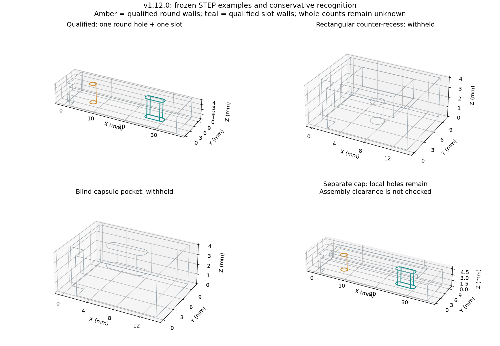

# Hole Recognition: False Positives, Abstention and Exceptions — v1.12.0

このページはv1.12時点の記録です。100万mm移動モデルの材料判定は、[v1.13の数値安定化](hole-numerical-stability.md)で改善しました。以下の当時の数値と証拠ファイルは維持しています。

## 日本語概要

丸穴・長孔の誤認識と例外を、自作44形状で検証しました。四角いくぼみの底にある丸穴を通常の貫通穴として取得していたケースを修正しました。開口が周囲より奥にある場合は保留し、面・辺・頂点の許容差も確認します。

STEP読込後と統合APIでは、取得対象32個中30個を取得し、この固定評価で誤取得は0個でした。原点から100万mm離したモデルの丸穴・長孔2個は保留しました。未取得を「穴なし」へ置き換えません。紛らわしい25形状と微小寸法の3形状は、取得対象として受け入れず保留しました。

これは合成形状の回帰・限界調査です。一般の製造部品に対する精度や独立した測定精度の保証ではありません。公開STEP6件も再確認し、ブラケットの丸穴5か所・長孔6か所を維持しています。各入力の全体の穴数は未確定です。

## English Summary

Forty-four authored controls exercise false positives, abstention and exceptions.
The STEP and unified paths match 30 of 32 eligible features with no false
accepted rows in this fixed set; two misses at a 1,000,000 mm offset remain.
A round bore on a rectangular recessed shoulder is now withheld. Tolerance
checks include opening evidence and vertices. Stress misses and per-component
assembly limitations are explicit, rather than reported as absence. This is
development regression and limit exploration, not held-out accuracy or
independent metrology. The six frozen public inputs retain their prior counts.

## 今回調べたこと

| 分類 | 形状数 | 内容 |
| --- | ---: | --- |
| 取得対象の基本・変換モデル | 12 | 丸穴と長孔、3D回転・反転・移動、0.01〜10倍、許容差付近の寸法、別の止まり穴が共存する部品 |
| 強い条件での限界調査 | 3 | 100倍、100万mm移動、100倍と回転・100万mm移動の組合せ |
| 未対応・紛らわしい形状 | 25 | 止まり穴、円形／四角形の段差、皿状の開口、切欠き、交差穴、突起、内部空洞、テーパー、面分割、NURBS化、楕円、矩形、曲がった長孔、異なる端部半径、斜めの通路など |
| 小さすぎる寸法 | 3 | 半径が0.001 mm以下、または貫通長が0.001 mm未満 |
| 既知の組立に関する制限 | 1 | 別ソリッドが開口をふさいでも、部品単体の穴を局所取得することを確認 |

44形状を「作成直後のB-Rep」「STEP出力・読込後の個別認識」「STEPからの統合API」の3経路で、それぞれ2回評価しました。132観測行・264回の入力評価です。これに、面・辺・頂点の許容差を変える9条件と、入力・API例外の17観測を加えています。各観測の繰り返し結果は一致しました。



図は凍結したSTEPの実際の辺です。左上は取得できる丸穴・長孔、右上は四角いくぼみの底の丸穴、左下は止まり長孔、右下は別部品によるふさがりの例です。橙色・青緑は取得した内壁の辺です。

## 修正した誤認識

四角いくぼみの底にある丸穴は、円筒と両端の円形境界だけを見ると、一定径の通路として条件を満たしていました。しかし、くぼみの底を部品の通常の開口として扱うと、段差を含む形状を単純な貫通穴として案内してしまいます。

v1.12では、円形開口の外周に接する壁の位置を確認します。開口の周囲が外向きに立ち上がっている場合は、段差・ポケット内の穴として保留します。段付き穴を自動で分類・測定する機能を追加したものではありません。

| 経路 | v1.11の取得 | v1.12の取得 |
| --- | ---: | ---: |
| 作成直後の形状 | 1（対象外を誤取得） | 0（保留） |
| 同じ形状をSTEPへ出力・再読込 | 1（対象外を誤取得） | 0（保留） |

[修正前後の記録](../results/hole-robustness/before-after.json)には、旧コードのコミット・SHA-256と入力のSHA-256を残しています。旧円形認識関数を今回の実行環境と共通の幾何ヘルパーで実行した比較であり、過去の環境全体の復元ではありません。

さらに、丸穴では開口面を含む面・辺・頂点、長孔では参加する面・辺・頂点の許容差を確認します。許容差上限0.00001 mmは維持しています。丸穴の低水準APIにも有効なソリッドの検証を追加し、空形状・非ソリッド・不正なソリッドを明示的に拒否します。

## 実測結果と残る見逃し

| 経路 | 形状数 | 取得対象の正解数 | 正しく取得 | 誤取得 | 見逃し | 取得値の照合失敗 |
| --- | ---: | ---: | ---: | ---: | ---: | ---: |
| 作成直後のB-Rep | 44 | 32 | 26 | 0 | 6 | 0 |
| STEP読込後の個別認識 | 44 | 32 | 30 | 0 | 2 | 0 |
| STEPからの統合API | 44 | 32 | 30 | 0 | 2 | 0 |

25の対象外形状と3つの微小寸法モデルは、全経路で取得0個でした。これは指定した種類を受け入れなかった結果であり、部品に物理的な穴が存在しないという意味ではありません。対象外モデルの期待値は「認識を許可する穴が0個」です。

STEP読込後の最大寸法・位置の照合差は約`2.84e-7 mm`、方向ベクトルの最大成分差は約`9.90e-9`でした。比較の閾値は長さ`1e-5 mm`、方向`1e-7`です。正解は作成寸法と解析的な座標変換から定義しましたが、モデル作成・STEP交換・認識は同じOCCTを使います。物理測定精度の実証には使えません。

| 残る条件 | 観測された結果 |
| --- | --- |
| 100万mmの移動 | 丸穴・長孔の内外の材料確認が成立せず、作成直後・STEP読込後とも2個を保留 |
| 100倍のB-Rep拡大、100倍と回転・移動 | 拡大で辺・頂点の許容差が約0.000015 mmとなり、作成直後は各2個を保留。STEP交換後は許容差が再設定され、取得できた |
| 別部品によるふさがり | 対象部品の局所的な丸穴・長孔2個を取得。組立全体の通路が開いているとは判定しない |

強い条件での3形状は探索的な限界調査です。見逃しを残したまま集計し、正解を「穴0個」に変えて合格させていません。`passed`は誤取得・取得値の不一致・通常条件の失敗がないことを示し、全形状の認識成功を示しません。JSONの`all_expected_features_recognized`は`false`です。

公差の安全係数や加工方向は推定しません。長孔の湾曲・段差・ねじ形状を網羅的に分類する機能や、組立の閉塞検出も追加していません。100万mm座標での材料判定の安定化と、実部品での追加評価は今後の課題です。

## 例外と公開サンプルの確認

面・辺・頂点ごとに許容差を0.000009、0.000010、0.000011 mmへ変更する9条件を調べました。上限以内では丸穴・長孔を取得し、上限超過では保留しました。これは低水準B-Repに明示的に許容差を設定した評価です。STEP交換で同じ許容差が保持されるとは主張しません。

| 例外 | 確認した動作 |
| --- | --- |
| 空入力・2 MB超 | 要求エラー。前の読込結果と状態を保持 |
| 不正な構文・途中で切れたSTEP | 読込拒否。新入力の理由と全体数不明を記録 |
| 単位なし・未対応単位 | 単位条件で拒否 |
| 外部参照を含む入力 | 参照を取得せず拒否 |
| null・空compound・非ソリッド・閉じていない不正ソリッド | 丸穴・長孔の低水準APIで検証エラー |
| 516面の入力 | 512面の走査上限で拒否 |

読込拒否のCSVはsummaryのみを保存し、全体の穴数を空欄にします。候補0件を「穴なし」へ変換しません。プレビュー失敗時の測定値保持、古い画面状態からのCSV要求の拒否、API・CLI・HTTPの一致も既存テストで確認しています。

公開STEP6件を3回ずつ再実行しました。ブラケットの丸穴5か所・長孔6か所、残る5件の取得0件、全6件の全体数不明は変わりません。公開サンプルは追加せず、出所・ライセンスと以前の証拠ファイルも保持しています。

## 再現方法と証拠

```bash
python -m research_notes.hole_robustness --output-dir output/hole-robustness-check --repeats 2
python -m research_notes.unified_hole_benchmark --output-dir output/public-regression --repeats 3
python experiments/plot_hole_robustness.py --results results/hole-robustness
python -m pytest tests/test_hole_robustness.py tests/test_unified_hole_inventory.py tests/test_public_hole_inventory.py tests/test_slot_inventory.py -q
```

準備済みWSL環境では、`python`を`output/venv312/bin/python`へ置き換えます。通常の評価は凍結したSTEPを読み、上書きしません。再生成する場合だけ、別の出力先を明示します。

```bash
python -m research_notes.hole_robustness --fixture-dir output/regenerated-hole-controls --refresh-fixtures --output-dir output/regenerated-hole-results
```

- [入力・正解・SHA-256・生成元](../fixtures/hole-robustness/manifest.json)
- [全観測・理由・寸法差・実行環境・コードSHA-256](../results/hole-robustness/results.json)
- [集計可能な評価表](../results/hole-robustness/matrix.csv)
- [修正前後](../results/hole-robustness/before-after.json)
- [公開STEPの回帰結果](../results/hole-robustness/public-regression/results.json)
- [関連テストとパッケージ確認](../results/hole-robustness/verification.json)
- [画面・CLI・Pythonの操作方法](../docs/cad-hole-inventory.md)

関連345テストが合格しました。実際の検証コマンド・環境は上記の検証記録に残します。今回の44形状は共通の元形状からの派生を含み、開発時に使用しています。実部品全体の誤認識率・自動化率へ外挿しません。

2 MB入力、512面走査、256面プレビューの上限と、ネイティブ幾何処理を同一プロセスで行う制限は維持しています。CPU・メモリの強制期限はありません。このリリースは研究リポジトリの更新です。
