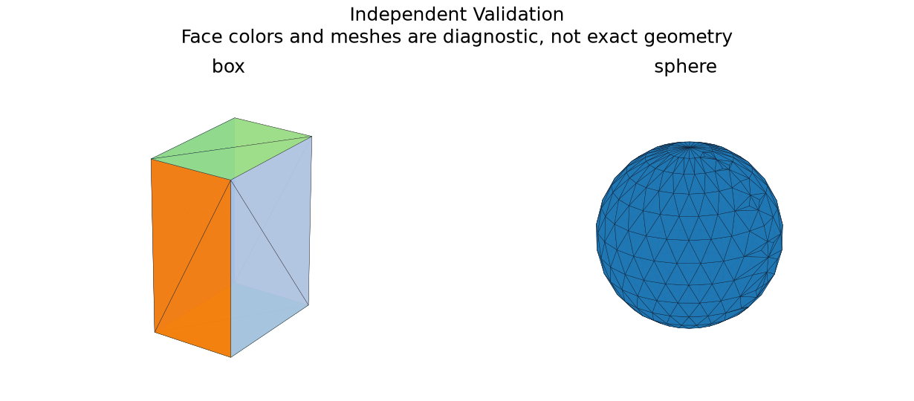

# Independent Geometry Validation

## 日本語概要

v0.74.0では独立計算による幾何検証を実装し、6件の限定した合成条件を検証しました。入力・判断根拠・結果をCSV、JSON、図、再生成可能なサンプルに残しています。

検証範囲と失敗例は以下の英語本文に示します。一般のCADデータへの適用や完全な規格適合を主張するものではありません。

---

## English Summary

For each oriented triangle, the independent integrator accumulates its signed origin-tetrahedron volume, first moment and second moment; a parallel-axis shift produces centroid inertia. The arithmetic is independent of GProp, while tessellation still comes from OCCT. No second native kernel is bundled, no kernel is treated as an oracle, and no arbitrary STEP or repair portability claim follows.

## Results and Interpretation

Six observations compare analytic box/sphere volume against native integration and coarse/fine signed-tetrahedron integration, then verify repair topology/area/volume and a curve intersection with independent cuboid and line truth. Coarse mesh disagreement remains visible.

The 6 `checks_pass` observations check the declared expectation, including
expected rejections and recorded learning failures. They do not mean that every
input was accepted or every learned prediction was correct.

## Sources and Implementation Boundary

[OCCT BRepGProp](https://occt3d.com/dev/doc/refman/html/class_b_rep_g_prop.html) distinguishes exact-surface and triangulation routes. This study implements the triangle arithmetic locally and compares it with closed-form construction truth.

- analytic formulas and signed-tetrahedron integrals are independent arithmetic routes
- tessellation still comes from OCCT; this is not an independent native geometry kernel
- coarse/fine disagreements are retained; no arbitrary STEP portability or repair equivalence claim

## Reproduction and Artifacts

Run from the repository root in the pinned geometry environment:

```bash
python experiments/run_independent_validation.py
```

Default runs verify fixture bytes. To regenerate into separate directories:

```bash
python experiments/run_independent_validation.py --output-dir output/independent-validation --fixture-dir output/fixtures/independent-validation --refresh-fixtures
```

- [Observations](../results/independent_validation.csv)
- [Detailed evidence](../results/independent_validation_evidence.json)
- [Contract and limits](../results/independent_validation_contract.json)
- [Fixture manifest](../fixtures/independent-validation/manifest.csv)
- [Experiment](../experiments/run_independent_validation.py)
- [Implementation](../src/research_notes/engineering_studies.py)


