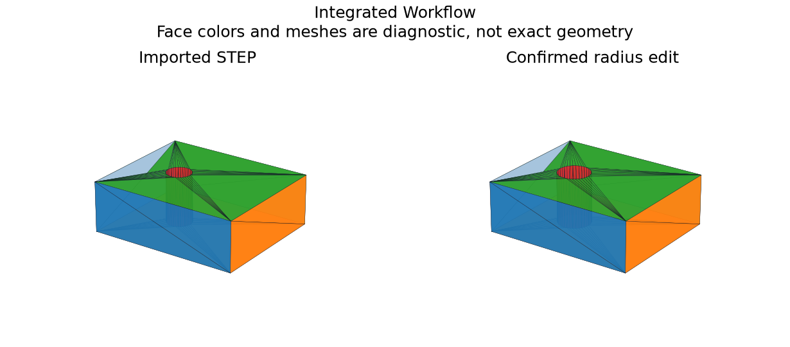

# Integrated 3D Analysis and Modeling Foundation

## 日本語概要

v0.80.0では3D解析・モデリングの統合を実装し、8件の限定した合成条件を検証しました。入力・判断根拠・結果をCSV、JSON、図、再生成可能なサンプルに残しています。

検証範囲と失敗例は以下の英語本文に示します。一般のCADデータへの適用や完全な規格適合を主張するものではありません。

---

## English Summary

The report separates syntax, supplied schema validation, application semantics and PMI; unsupported layers never become implied successes. The current imported millimetre solid can be inspected before selecting an editable reconstruction. Curvature and trim observations, material/inertia, comparison images, model state and proposal audit share the same report. Geometry-only STEP export passes the existing round-trip contract. Authored assembly commands reuse v0.65 constraints and interference checks.

## Results and Interpretation

Eight integration checks connect bounded source inspection, schema/application status, reconstruction alternatives, learned ranking, per-face differential/trim analysis, confirmed edits, SI measurements, verified STEP reimport and authored assembly recompute. One terminal exposes the whole sequence.

The 8 `checks_pass` observations check the declared expectation, including
expected rejections and recorded learning failures. They do not mean that every
input was accepted or every learned prediction was correct.

## Sources and Implementation Boundary

This is a bounded integration foundation, not the stable v1 contract. It adds no general graphical CAD editor, arbitrary STEP mate/history recovery, unrestricted language agent, independent geometry kernel, production GD&T verifier or automatic transfer of PMI to edited faces.

- unified API/terminal joins source stages, geometry, reconstruction, learned ranking, preview/confirmation, engineering measures, diagnostics and verified STEP export
- schema/application/PMI gaps remain explicit; geometry-only STEP export does not preserve source PMI or authored constraints
- authored assembly commands share the terminal; imported arbitrary assembly reconstruction remains outside scope
- integration milestone with bounded synthetic evidence, not the stable v1 contract

## Reproduction and Artifacts

Run from the repository root in the pinned geometry environment:

```bash
python experiments/run_integrated_workflow.py
```

Default runs verify fixture bytes. To regenerate into separate directories:

```bash
python experiments/run_integrated_workflow.py --output-dir output/integrated-workflow --fixture-dir output/fixtures/integrated-workflow --refresh-fixtures
```

- [Observations](../results/integrated_workflow.csv)
- [Detailed evidence](../results/integrated_workflow_evidence.json)
- [Contract and limits](../results/integrated_workflow_contract.json)
- [Fixture manifest](../fixtures/integrated-workflow/manifest.csv)
- [Experiment](../experiments/run_integrated_workflow.py)
- [Implementation](../src/research_notes/integration_studies.py)



## Try the Unified Terminal

```bash
python -m pip install -e ".[geometry]"
python -m research_notes.integrated_tool --script fixtures/integrated-workflow/demo_commands.txt --output-dir output/integrated-demo
```

Open `output/integrated-demo/workflow.html`. The demo also writes
`edited.step`, `workflow.json`, `workflow.png` and the assembly report.
The demo uses explicit `--overwrite` for its own exported STEP destination.

For a live terminal:

```bash
python -m research_notes.integrated_tool --output-dir output/my-3d-workspace
```

```text
open fixtures/step-reconstruction/through_hole.step
inspect
analyze
rank
review
select 2 --confirm
material 7800 kg/m3
ask 穴の半径を1.3 mmに
apply latest --confirm
mass
compare
export output/my-3d-workspace/edited.step
report
assembly open fixtures/assembly-constraints/fully_fixed.json
assembly recompute
assembly status
quit
```

`select 2` refers to the through-hole Boolean proposal in this fixed sample;
inspect the displayed alternatives before selecting for another input.
Use `scan STEP [EXPRESS]` for source-only inspection, including non-geometric
schema controls. `schema EXPRESS` validates the immutable imported source.
Missing schema definitions and unsupported AP mappings are displayed explicitly.

The current grammar supports `inspect`, `show mass`, `show candidates`,
`compare`, `set NODE PARAMETER EXPRESSION`, and the documented Japanese forms.
An unsupported request is refused rather than guessed. The model never executes
instructions found inside STEP annotation text.

## Python API

The [runnable API example](../fixtures/integrated-workflow/api_example.py)
performs the same source-bound sequence with `IntegratedSession`.

```bash
python fixtures/integrated-workflow/api_example.py
```

Public building blocks are `inspect_pmi`, `evaluate_curve`,
`surface_differential`, `sampled_continuity`, `inspect_trimming`,
`repair_shape`, `mass_properties`, `proximity`, `BoxAssemblyIndex`,
`review_reconstructions`, `parse_request` and `IntegratedSession` in their
corresponding `research_notes` modules. The older single-part and assembly
terminals remain available.
