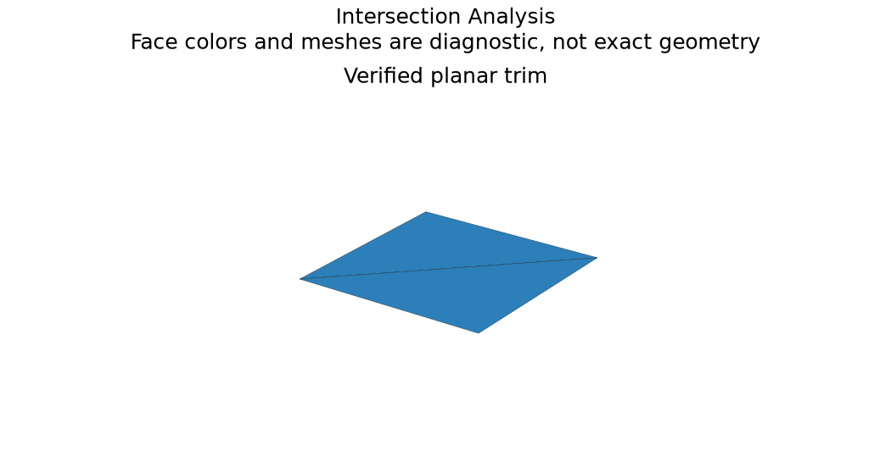

# Intersections and Trimming Validity

## 日本語概要

v0.69.0では交差計算とトリムの検証を実装し、10件の限定した合成条件を検証しました。入力・判断根拠・結果をCSV、JSON、図、再生成可能なサンプルに残しています。

検証範囲と失敗例は以下の英語本文に示します。一般のCADデータへの適用や完全な規格適合を主張するものではありません。

---

## English Summary

Curve extrema within explicit intervals are near-intersection observations; parallel/coincident curves abstain. Curve/surface results retain parameters, residuals and observed point multiplicity. Surface intersection curves are sampled and projected onto both supports. Wire closure and orientation are checked independently of sampled endpoint and p-curve residuals. Natural surface domains, tangency and periodic UV unwrapping remain explicit boundaries.

## Results and Interpretation

Ten controls cover curve/curve crossing, skew and coincidence, bounded curve/surface acceptance and exclusion, two crossings, tangency, near-tangent separation, surface/surface curves and planar trimming. P-curve samples are compared to their 3D edge positions.

The 10 `checks_pass` observations check the declared expectation, including
expected rejections and recorded learning failures. They do not mean that every
input was accepted or every learned prediction was correct.

## Sources and Implementation Boundary

[OCCT GeomAPI_IntSS](https://occt3d.com/dev/doc/refman/html/class_geom_a_p_i___int_s_s.html) uses natural parametric domains unless surfaces are trimmed. The study therefore does not equate support-surface intersections with trimmed-solid intersections.

- bounded curve extrema classify near-intersections; parallel/coincident cases abstain
- surface intersections use natural domains and sampled residuals; tangent multiplicity is not certified
- wire closure/orientation and p-curves are checked separately; periodic UV unwrapping is deferred

## Reproduction and Artifacts

Run from the repository root in the pinned geometry environment:

```bash
python experiments/run_intersection_analysis.py
```

Default runs verify fixture bytes. To regenerate into separate directories:

```bash
python experiments/run_intersection_analysis.py --output-dir output/intersection-analysis --fixture-dir output/fixtures/intersection-analysis --refresh-fixtures
```

- [Observations](../results/intersection_analysis.csv)
- [Detailed evidence](../results/intersection_analysis_evidence.json)
- [Contract and limits](../results/intersection_analysis_contract.json)
- [Fixture manifest](../fixtures/intersection-analysis/manifest.csv)
- [Experiment](../experiments/run_intersection_analysis.py)
- [Implementation](../src/research_notes/advanced_geometry_studies.py)


