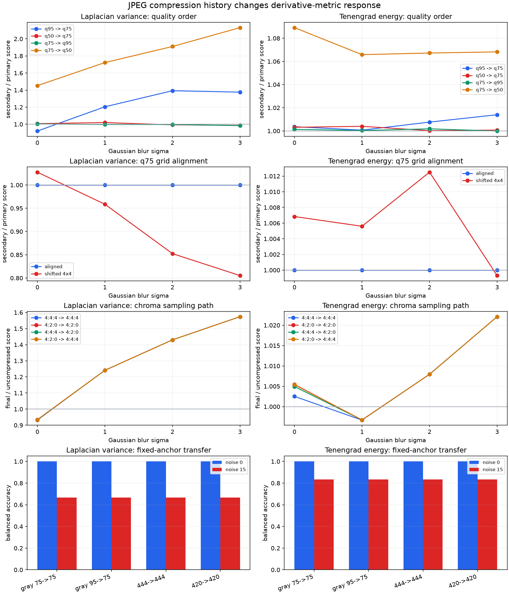

# JPEG Compression History: Quality Order, Grid Alignment, and Chroma Sampling

## Research Question

How do primary-to-secondary JPEG quality order, alignment of the two JPEG block
grids, and explicit 4:4:4 or 4:2:0 chroma sampling change Laplacian variance and
Tenengrad energy? Does a blur decision rule calibrated on uncompressed pixels
transfer across those histories and added noise?

This note evaluates bounded sensitivity. It does not use either derivative
metric as a double-JPEG detector and does not propose a universal focus,
compression, or image-quality threshold.

## Background

Baseline JPEG represents image components in blocks, transforms the samples,
and quantizes transform coefficients. An encode/decode round trip can therefore
remove or introduce spatial derivative response through quantization, rounding,
blocking, and ringing without restoring optical detail. OpenCV exposes an
encoder quality control from 0 to 100 and explicit sampling-factor controls.
Those are codec inputs, not a standardized perceptual scale, and the same
numeric quality need not identify an equivalent process in another encoder.

A compression history includes more than the final quality value. When the
primary and secondary quantization conditions differ, their order changes the
coefficients presented to the second encoder. With the same conditions and an
aligned grid, repeated compression can approach a stable state. If an image is
cropped between encodes, the second 8 x 8 block grid can be shifted relative to
the first; double-JPEG research treats aligned and non-aligned cases as distinct
artifact regimes.

Color JPEG also has a sampling history. The OpenCV 4:4:4 setting uses no chroma
subsampling, while 4:2:0 reduces chroma sampling in both spatial directions.
Because this study computes focus metrics after BGR-to-grayscale conversion,
the luma-dominated response can make sampling differences small. That is a
property to measure rather than a reason to omit the color path.

## Method

The experiment retains the repository's area-normalized definitions:

- **Laplacian variance:** population variance of the `CV_64F` OpenCV Laplacian
  response.
- **Tenengrad energy:** mean of squared 3 x 3 Sobel x and y responses in
  `CV_64F`.

Three deterministic 264 x 264 synthetic BGR canvases contain an achromatic
checkerboard, chromatic stripes, and colored gradients with geometric targets.
Gaussian blur is applied at sigma 0, 1, 2, and 3. Independent channel noise is
then added at standard deviation 0 or 15. Five trials use seeds derived from
base seed `20261301`; noise-free trials are exact repeated controls.

The nine primary-to-secondary histories are:

- grayscale quality 75 to 75;
- grayscale quality 95 to 75 and 75 to 95;
- grayscale quality 50 to 75 and 75 to 50;
- BGR quality 75 with 4:4:4 to 4:4:4;
- BGR quality 75 with 4:2:0 to 4:2:0;
- BGR quality 75 with 4:4:4 to 4:2:0; and
- BGR quality 75 with 4:2:0 to 4:4:4.

After the primary decode, the script extracts a 256 x 256 crop at offset `(0,
0)` or `(4, 4)`. The first keeps the primary and secondary block origins
aligned. The second moves the primary grid four pixels in each direction
relative to the secondary grid. Both outputs have identical dimensions. Each
final score is paired with the score of the exact primary-decoded crop and the
score of its exact uncompressed source crop.

For calibration transfer, each pattern, crop offset, and metric receives a
separate midpoint rule from the uncompressed noise-0 sigma-0 and sigma-3
endpoints. Scores below the midpoint are labeled blurred. Balanced accuracy is
reported for only those two endpoint classes; sigma 1 and 2 check adjacent blur
ordering. This deliberately fixed synthetic rule is a drift probe, not a
deployable classifier.

## Controlled Experiment

Run the study from the repository root:

```bash
python experiments/run_jpeg_compression_history.py
```

The script validates declared relationships before writing:

- `results/jpeg_history_trials.csv` with 4,320 metric observations;
- `results/jpeg_history_response_summary.csv` with 288 condition summaries;
- `results/jpeg_history_calibration_anchors.csv` with 12 uncompressed anchors;
- `results/jpeg_history_calibration_summary.csv` with 72 transfer summaries;
- `results/jpeg_history_examples.png`; and
- `results/jpeg_history_sensitivity.png`.

The trial CSV retains primary and secondary quality, sampling path, crop offset,
raw score, matched primary-only score, matched uncompressed score, both ratios,
seed, fixed threshold, and endpoint decision.

## Results

### Quality order is not interchangeable

The table reports the mean final-to-primary score ratio for aligned, noise-free
grayscale histories across three patterns and five exact replicates per
pattern.

| History | Blur sigma | Laplacian ratio | Tenengrad ratio |
|---|---:|---:|---:|
| q95 -> q75 | 0 | 0.920521 | 1.003660 |
| q75 -> q95 | 0 | 1.003831 | 1.001356 |
| q50 -> q75 | 0 | 1.007001 | 1.003138 |
| q75 -> q50 | 0 | 1.452204 | 1.089167 |
| q95 -> q75 | 3 | 1.375957 | 1.013969 |
| q75 -> q95 | 3 | 0.983823 | 0.999895 |
| q50 -> q75 | 3 | 0.987032 | 1.000718 |
| q75 -> q50 | 3 | 2.131381 | 1.068257 |

The final quality alone does not describe the response. For example, quality
95 followed by 75 lowers the clean sharp Laplacian response relative to the
primary crop, while quality 75 followed by 95 is nearly neutral. Ending at
quality 50 raises the derivative response in this pattern set, especially for
the already blurred Laplacian inputs. That increase is codec structure, not
evidence that optical sharpness improved.

### Grid alignment changes the second round

With grayscale quality 75 followed by 75, the aligned second round has a mean
final-to-primary ratio of exactly `1.000000` to six decimals for both metrics
at sigma 0 and 3. The shifted 4 x 4 path is different:

| Metric | Shifted ratio, sigma 0 | Shifted ratio, sigma 3 |
|---|---:|---:|
| Laplacian variance | 1.027572 | 0.805242 |
| Tenengrad energy | 1.006841 | 0.999302 |

The aligned result is consistent with a codec-dependent stable point for these
decoded images. It must not be generalized to other content, encoders, or
quantization settings. The shifted crop breaks that stability and changes the
two derivative measures by different amounts and directions.

### Chroma sampling has a content-dependent grayscale effect

For aligned, clean sharp inputs, the final-to-uncompressed mean Laplacian ratio
is `0.931761` for 4:4:4 -> 4:4:4 and `0.934355` for 4:2:0 -> 4:2:0. The
corresponding Tenengrad ratios are `1.002525` and `1.005456`. The mixed 4:4:4
-> 4:2:0 path produces `0.934212` and `1.004935`.

The achromatic checkerboard has an exact `1.000000` final-to-primary ratio for
all four color sampling paths and both metrics in the clean sharp aligned
condition. The colored-target pattern produces the largest secondary-stage
difference: 4:4:4 -> 4:2:0 reaches `1.009703` for Laplacian variance and
`1.006406` for Tenengrad. Chroma sampling is therefore part of the reproducible
pipeline, but this grayscale evaluation does not support a large or universal
effect claim.

### Noise dominates the fixed calibration transfer

For shifted grayscale quality 75 -> 75 at sigma 3, the mean Laplacian score
rises from `18.771605` without noise to `1018.405343` at noise standard
deviation 15. The uncompressed midpoint calibration has balanced accuracy
`1.000000` at noise 0, then falls to `0.666667` for Laplacian variance and
`0.833333` for Tenengrad at noise 15. These values summarize only three designed
patterns and are not population accuracy estimates.

The same shifted noisy path has a Laplacian adjacent-order violation rate of
`0.111111`, while the corresponding Tenengrad rate is `0.000000`. This bounded
result does not establish general superiority; it shows that compression
history and noise interact differently with first- and second-derivative
energy.



## Interpretation

Compression history is an input condition, not metadata that can be reduced to
the final quality number. Primary quality affects what the secondary encoder
quantizes. A crop between stages changes the grid phase. A color path changes
which sampled components are reconstructed before grayscale measurement.

The paired primary-only ratio is useful because it isolates the second stage
for the exact crop. The uncompressed ratio answers a different question: the
combined change across the complete history. Reporting only one can hide either
a stable second round after a large first-round change or a small aggregate
difference created by opposing stages.

The aligned quality-75 fixed point is especially easy to misread. No score
change after the second round does not mean the pixels are equivalent to the
uncompressed source, and it does not mean every repeated JPEG path is stable.
The shifted and mismatched-quality controls demonstrate both limitations.

## Failure Modes

- **Final-quality shorthand:** the same final quality can follow different
  primary quantization histories and produce different metric responses.
- **Grid-phase omission:** cropping between encodes can turn an aligned history
  into a non-aligned one even when dimensions and quality values look unchanged.
- **Artifact-as-detail interpretation:** blocking or ringing can raise a
  derivative score without recovering scene detail.
- **False monotonicity:** a second JPEG round can raise, lower, or leave a score
  unchanged depending on quality order, blur, content, and alignment.
- **Sampling-path omission:** grayscale metric input does not make the preceding
  color sampling history irrelevant, although its effect can be small.
- **Codec equivalence assumption:** a numeric quality value is not a portable
  identifier for a quantization table or perceptual quality level.
- **Noise confounding:** high-frequency noise can dominate both compression
  differences and blur calibration.
- **Threshold transfer:** clean uncompressed anchors need not remain valid for
  decoded images with another history.

## Practical Guidance

- Record codec implementation, version, quality inputs, color conversion,
  chroma sampling, resize or crop operations, and encode order with the metric.
- Calibrate on decoded pixels from the same end-to-end pipeline used at
  inference time.
- Use matched primary-only and uncompressed controls when attributing a change
  to one compression stage.
- Treat crop offset modulo eight as a controlled variable when studying JPEG
  recompression.
- Separate grayscale and BGR compression paths; do not infer a color path from
  the final grayscale array.
- Inspect raw images or residuals when derivative scores rise after lossy
  encoding; do not label that rise as recovered focus.
- Revalidate after codec-library changes even if all nominal quality settings
  remain unchanged.
- Derive operational thresholds from representative labeled data and declared
  costs. Do not reuse the numeric values in this note as quality standards.

## Limitations

The study uses three small synthetic 8-bit BGR patterns, one source and crop
size, two crop offsets, two noise levels, four Gaussian blur levels, five exact
or seeded trials, five grayscale quality orders, and four BGR sampling paths.
It uses the pinned OpenCV build and its JPEG backend. OpenCV quality inputs are
not decoded into or compared as explicit quantization tables.

The experiment does not test natural scenes, camera pipelines, JPEG metadata,
progressive JPEG, separate luma and chroma quality controls, other sampling
factors, arbitrary grid offsets, resizes or rotations between encodes, more
than two encodes, codec-build variation, learned double-JPEG detection, or human
quality judgments. Metrics are evaluated after one OpenCV BGR-to-grayscale
conversion, which intentionally limits sensitivity to chroma-only changes.

Known pattern identities and matched uncompressed crops are laboratory controls
that are usually unavailable in blind inspection. Noise-free trials are exact
replicates, and balanced accuracy over three patterns has no inferential or
population interpretation. No score, ratio, JPEG quality, sampling path, or
threshold is proposed as a universal criterion.

## Sources

- [OpenCV: Image codec flags](https://docs.opencv.org/4.x/d8/d6a/group__imgcodecs__flags.html)
  documents the JPEG quality range, sampling-factor option, 4:4:4 no-subsampling
  value, and 4:2:0 value used by the experiment.
- [OpenCV: Image file reading and writing](https://docs.opencv.org/4.x/d4/da8/group__imgcodecs.html)
  documents the in-memory `imencode` and `imdecode` operations used for each
  stage.
- [OpenCV: Color Space Conversions](https://docs.opencv.org/4.x/d8/d01/group__imgproc__color__conversions.html)
  documents the BGR-to-grayscale conversion used before metric evaluation.
- [ITU-T T.81](https://www.itu.int/ITU-T/recommendations/rec.aspx?id=2633)
  is the official JPEG continuous-tone image coding recommendation.
- [Detecting Double JPEG Compression With the Same Quantization Matrix](https://doi.org/10.1109/TIFS.2010.2072921)
  is a primary publication on same-quantization recompression and convergence of
  changes between successive JPEG coefficient sets.
- [Detection of Double-Compression in JPEG Images for Applications in Steganography](https://doi.org/10.1109/TIFS.2008.922456)
  is a primary publication demonstrating that primary and secondary JPEG
  compression history changes DCT coefficient statistics.
- [Detection of Nonaligned Double JPEG Compression Based on Integer Periodicity Maps](https://doi.org/10.1109/TIFS.2011.2170836)
  is a primary publication that treats shifted primary and secondary JPEG grids
  as a distinct non-aligned compression condition.
- [Analyzing the Effect of JPEG Compression on Local Variance of Image Intensity](https://doi.org/10.1109/TIP.2016.2553521)
  analyzes JPEG-dependent local intensity variance. Its statistic differs from
  Laplacian variance, so it supports a general sensitivity concern rather than
  the values measured here.
- [Analysis of focus measure operators for shape-from-focus](https://doi.org/10.1016/j.patcog.2012.11.011)
  defines Tenengrad from squared Sobel responses and evaluates focus-measure
  sensitivity under controlled factors.
