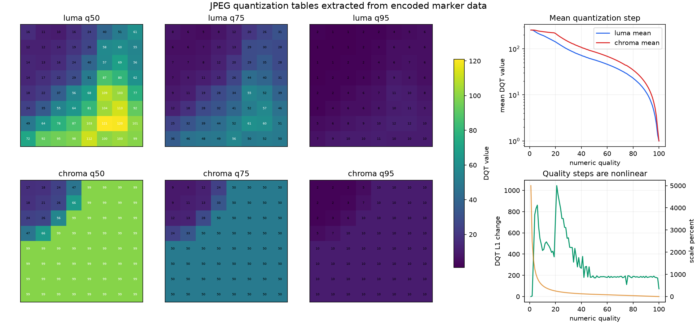
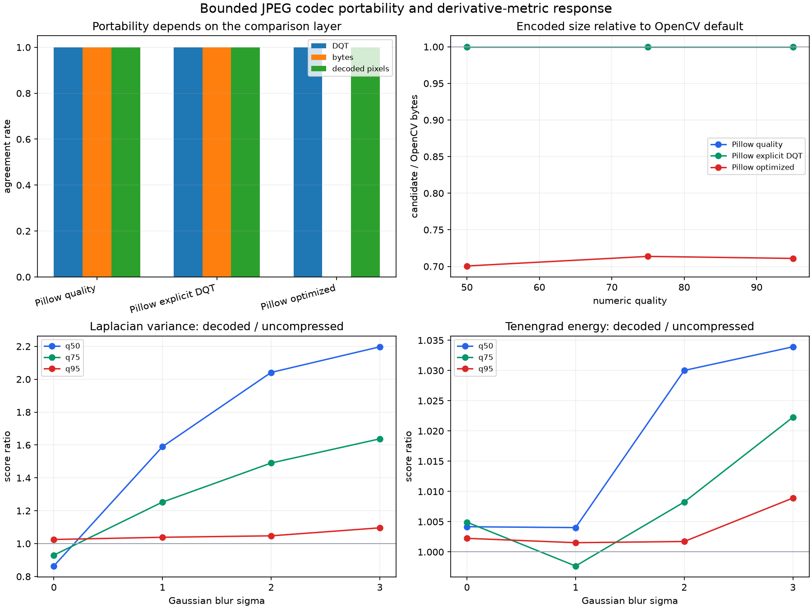

# JPEG Quantization Tables and Codec Portability

## Research Question

Does the same numeric JPEG quality control produce the same quantization tables,
encoded bytes, decoded pixels, and derivative-metric response across the pinned
OpenCV and Pillow paths? If those layers differ, which artifact should be
recorded to make an experiment reviewable and portable?

This note audits one bounded pair of builds. It does not define a universal
mapping from a quality number to perceptual quality, and it does not claim that
agreement between two libjpeg-turbo-based paths generalizes to other encoders.

## Background

JPEG stores quantization tables in Define Quantization Table (`DQT`) marker
segments. A frame component selects a table through its Start of Frame (`SOF`)
definition. The table values control coefficient quantization; larger values
generally discard more coefficient precision. Chroma sampling, entropy coding,
color conversion, DCT implementation, and rounding are separate parts of the
encoded and decoded pipeline.

The JPEG standard specifies the syntax and decoding meaning of quantization
tables, but a user-facing quality number is an encoder convention. The
libjpeg-turbo default API starts from the example luma and chroma tables in
ITU-T T.81 Annex K and applies a nonlinear scaling curve. For quality below 50,
the integer scale is `5000 / quality`; from 50 through 100 it is `200 - 2 *
quality`. Values are rounded and constrained to the permitted table range.
Applications can instead supply custom tables.

This distinction creates several portability layers:

1. two applications may expose the same numeric quality label;
2. the resulting DQT tables and component sampling may or may not match;
3. matching DQT and sampling do not require identical Huffman coding or file
   bytes; and
4. different byte streams can still decode to identical pixels.

For a spatial metric, decoded pixel identity is more directly relevant than a
quality label. For exact artifact reproduction, encoded byte identity is a
stronger requirement than decoded pixel identity.

## Method

### Codec paths

The pinned environment reports:

| Adapter | Wrapper | Reported JPEG backend |
|---|---|---|
| OpenCV | 4.13.0 | build-libjpeg-turbo 3.1.2-70 |
| Pillow | 12.3.0 | libjpeg-turbo 3.1.4.1 |

Four encoder paths are compared:

- OpenCV numeric quality with default Huffman coding;
- Pillow numeric quality with default Huffman coding;
- Pillow with the exact natural-order DQT values parsed from the corresponding
  OpenCV stream and no numeric quality input; and
- Pillow numeric quality with optimized Huffman coding.

Both OpenCV and Pillow decoders process every stream. All color encodes declare
either 4:4:4 or 4:2:0 sampling. Progressive encoding and metadata are disabled.

### Marker parser

`research_notes.jpeg_codec` implements a bounded pure-Python JPEG marker
parser. It verifies the SOI marker, segment lengths, DQT precision and table
identifiers, one SOF definition, component sampling factors, and component-to-
table references. DQT values are retained in encoded zigzag order and exposed
in natural 8 x 8 row-major order. SHA-256 fingerprints include the table
identifier, precision, and all 64 values.

The parser is an audit utility for the generated baseline streams. It is not a
general JPEG repair or forensic parser.

### Quality sweep

Numeric qualities 1 through 100 are encoded independently through the OpenCV
and Pillow default paths at 4:4:4. The experiment compares complete bytes and
DQT fingerprints, records the libjpeg scaling percentage, luma and chroma table
ranges and means, and the L1 change from the preceding quality's two tables.

The exact luma and chroma tables at qualities 50, 75, and 95 are expanded into
384 coefficient rows with natural row and column positions.

### Controlled image evaluation

Three deterministic 256 x 256 synthetic BGR patterns contain achromatic,
chromatic, gradient, and geometric structure. Gaussian blur sigma 0, 1, 2, and
3 is applied without added noise. Every source is encoded at quality 50, 75,
or 95 with 4:4:4 or 4:2:0 sampling through all four paths.

This produces 72 source, blur, quality, and sampling conditions. Each of the
four streams is decoded through both adapters and evaluated with Laplacian
variance and Tenengrad energy, giving 1,152 metric rows. Paired comparisons
record byte equality, DQT equality, SOF component equality, file-size ratio,
decoded pixel error, and metric ratio.

## Controlled Experiment

Run the study from the repository root:

```bash
python experiments/run_jpeg_codec_portability.py
```

The script validates its declared relationships before writing:

- `results/jpeg_codec_manifest.csv` with two adapter and backend records;
- `results/jpeg_quality_table_sweep.csv` with 100 numeric-quality mappings;
- `results/jpeg_quantization_tables.csv` with 384 selected DQT coefficients;
- `results/jpeg_codec_trials.csv` with 1,152 decoded metric observations;
- `results/jpeg_encoder_agreement.csv` with 216 paired encoder comparisons;
- `results/jpeg_decoder_agreement.csv` with 288 cross-decoder comparisons;
- `results/jpeg_codec_portability_summary.csv` with 72 aggregated comparisons;
- `results/jpeg_quantization_tables.png`; and
- `results/jpeg_codec_portability.png`.

Only generated synthetic pixels are encoded. The reference artifacts contain no
external images or private data.

## Results

### The two numeric-quality paths agree in this bounded build pair

For every integer quality from 1 through 100, the OpenCV and Pillow paths
produce identical DQT fingerprints and identical JPEG bytes for the fixed sweep
input. All 100 tested qualities produce distinct combined luma/chroma DQT
fingerprints.

The 72 larger controlled conditions repeat this result across three patterns,
four blur levels, three selected qualities, and two sampling modes. Pillow
numeric quality and Pillow explicit OpenCV-derived DQT both match the OpenCV
default stream byte for byte in every condition. Their decoded pixels and both
metric scores are therefore also identical.

This is positive evidence for the pinned pair, not evidence that a quality
number is a JPEG-standard contract. Both adapters use closely related
libjpeg-turbo releases and compatible default settings.

### Numeric quality is nonlinear in table space

| Quality | libjpeg scale | Luma mean | Chroma mean | Adjacent DQT L1 |
|---:|---:|---:|---:|---:|
| 1 | 5000 | 255.000000 | 255.000000 | 0 |
| 25 | 200 | 115.250000 | 172.031250 | 735 |
| 50 | 100 | 57.625000 | 86.015625 | 176 |
| 75 | 50 | 29.031250 | 43.437500 | 113 |
| 95 | 10 | 5.765625 | 8.718750 | 182 |
| 100 | 0 | 1.000000 | 1.000000 | 73 |

The adjacent L1 distance is not constant. A five-point quality change in one
part of the range is not equivalent to a five-point change elsewhere. Table
clamping and integer rounding also shape the low- and high-quality endpoints.



### Matching DQT does not imply matching bytes

The optimized Pillow path has the same DQT fingerprint, SOF component
signature, decoded pixels, Laplacian variance, and Tenengrad energy as the
OpenCV default in all 72 conditions. Its encoded bytes differ in all 72.

Optimized-to-default file-size ratios range from `0.486489` to `0.925228`, with
a mean of `0.708379`. Mean ratios by quality and sampling are:

| Quality | 4:4:4 | 4:2:0 |
|---:|---:|---:|
| 50 | 0.704115 | 0.697036 |
| 75 | 0.720608 | 0.706732 |
| 95 | 0.711895 | 0.709890 |

The change comes from entropy-coding optimization, not from different
quantization or decoded samples. A DQT fingerprint is therefore insufficient
for byte-level reproducibility, while a file hash is unnecessarily strict when
the contract concerns only decoded pixels.

### The two decoders agree exactly here

OpenCV and Pillow produce identical BGR arrays for all 288 encoded-stream
comparisons. Pixel MAE, maximum absolute error, and changed-pixel fraction are
all zero. This result is bounded to the generated baseline streams and the
reported backends; it is not a broad decoder-conformance test.

### Codec artifacts still change derivative response

Even with adapter agreement, JPEG changes the metric input. For clean sharp
4:2:0 conditions, mean decoded-to-uncompressed ratios are:

| Quality | Laplacian variance | Tenengrad energy |
|---:|---:|---:|
| 50 | 0.863854 | 1.004166 |
| 75 | 0.929815 | 1.004917 |
| 95 | 1.025253 | 1.002246 |

For sigma-3 inputs, the corresponding Laplacian ratios rise to `2.197186`,
`1.637374`, and `1.096027`. Tenengrad ratios are `1.033918`, `1.022266`, and
`1.008907`. Coarser quantization can add derivative response to an already
blurred input without recovering optical detail.



## Interpretation

The most useful portability statement depends on the consumer:

- a user-interface comparison can record numeric quality;
- a codec configuration audit should record DQT and component sampling;
- an exact file fixture should record the encoded SHA-256 hash; and
- a pixel-domain metric pipeline should record decoded pixel hashes or verify
  pixel equality under the deployed decoder.

The explicit-DQT path demonstrates that quantization tables can be carried as a
more precise compression control than a quality label. The optimized path shows
why that control still does not specify an entire JPEG file. Huffman tables and
marker organization can change storage without changing decoded pixels.

The complete agreement between the default OpenCV and Pillow paths is useful
because it establishes a reproducible baseline for this repository. It is also
a warning about experimental scope: comparing two wrappers does not create an
independent codec-family replication when both are backed by libjpeg-turbo.

## Failure Modes

- **Quality-label equivalence:** treating equal numeric quality as proof of
  equal DQT tables across arbitrary applications.
- **DQT-only identity:** assuming equal quantization tables require equal JPEG
  bytes, entropy coding, or marker layout.
- **Byte-only interpretation:** treating different file hashes as proof of
  different decoded pixels or metric values.
- **Wrapper independence:** counting OpenCV and Pillow as independent codec
  families without inspecting their reported backends.
- **Sampling omission:** comparing DQT tables while ignoring SOF sampling
  factors and component table selectors.
- **Decoder omission:** verifying encoder settings without checking the exact
  decoded arrays consumed by a metric.
- **Quality-distance linearity:** interpreting equal numeric quality intervals
  as equal changes in table space.
- **Artifact-as-detail interpretation:** treating a higher derivative score
  after coarse quantization as recovered focus.
- **Fingerprint overreach:** inferring a unique source application from DQT
  alone when different applications can share tables.

## Practical Guidance

- Record wrapper version, reported JPEG backend, numeric quality, chroma
  sampling, optimization flags, and progressive mode.
- Parse and fingerprint DQT and SOF component definitions in reference JPEGs.
- Store exact DQT values when a compression configuration must transfer across
  APIs that support explicit tables.
- Use an encoded file hash for byte-level fixtures and a decoded pixel hash for
  pixel-domain pipeline fixtures; state which contract is intended.
- Test both encoder and decoder changes before transferring a metric
  calibration.
- Keep byte equality, table equality, decoded equality, and metric equality as
  separate assertions.
- Treat quality values as application inputs, not standardized perceptual
  distances.
- Inspect metric response against uncompressed controls; do not infer optical
  improvement from quantization artifacts.
- Derive operational thresholds from representative labeled data and the exact
  deployed decode pipeline. Do not reuse values from this note as standards.

## Limitations

The experiment uses three synthetic 8-bit BGR patterns, one image size, four
Gaussian blur levels, three selected image-evaluation qualities, two sampling
modes, baseline sequential JPEG, and one pinned runtime platform. The quality
sweep uses one small synthetic input because DQT defaults are content
independent in the tested APIs.

Both wrappers use libjpeg-turbo. Their reported versions differ, but this is not
a comparison against IJG libjpeg, mozjpeg, a hardware encoder, a browser codec,
or a camera implementation. The study does not vary DCT method, color profile,
metadata, restart markers, progressive scans, arithmetic coding, custom color
transforms, 12-bit data, malformed streams, or non-default quantization bases.

The parser stops at the first Start of Scan and supports the generated DQT and
SOF structures. It is not designed for adversarial files, multiple frames,
tables redefined between scans, abbreviated streams, or security-sensitive
validation.

Exact byte and decoder agreement is a result for the pinned wheels and declared
controls, not a guarantee for later builds or other platforms. No DQT, quality
number, file-size ratio, derivative score, or threshold is proposed as a
universal image-quality criterion.

## Sources

- [ITU-T T.81](https://www.itu.int/ITU-T/recommendations/rec.aspx?id=2633)
  is the official recommendation defining JPEG continuous-tone image coding,
  including DQT and frame syntax.
- [libjpeg-turbo `jcparam.c`](https://github.com/libjpeg-turbo/libjpeg-turbo/blob/3.1.2/src/jcparam.c)
  is the primary implementation source for the Annex K default tables, quality
  scaling curve, rounding, and baseline value constraints described here.
- [libjpeg-turbo `jpeglib.h`](https://github.com/libjpeg-turbo/libjpeg-turbo/blob/3.1.2/src/jpeglib.h)
  documents 8 x 8 DCT blocks, quantization-table representation, component
  sampling factors, and table selectors in the public API.
- [OpenCV: Image codec flags](https://docs.opencv.org/4.x/d8/d6a/group__imgcodecs__flags.html)
  documents numeric JPEG quality, Huffman optimization, and explicit sampling-
  factor controls used by the OpenCV adapter.
- [Pillow: JPEG saving options](https://pillow.readthedocs.io/en/stable/handbook/image-file-formats.html#jpeg-saving)
  documents numeric quality, subsampling, optimization, progressive mode, and
  explicit `qtables` inputs used by the Pillow adapter.
- [Pillow 12.3.0 release notes](https://pillow.readthedocs.io/en/stable/releasenotes/12.3.0.html)
  verifies the pinned wrapper release used by the experiment.
- [The JPEG Still Picture Compression Standard](https://doi.org/10.1145/103085.103089)
  is a primary overview of the DCT-based baseline JPEG process and its design.
- [Using JPEG Quantization Tables to Identify Imagery Processed by Software](https://doi.org/10.1016/j.diin.2008.05.004)
  is a primary study of quantization tables as software-processing evidence. Its
  forensic classification setting differs from this portability audit and does
  not make DQT a unique source identifier.
