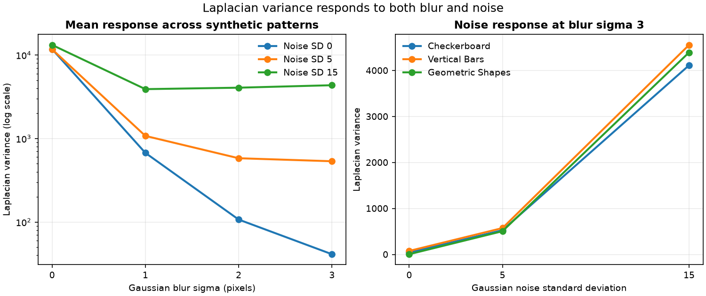

# Laplacian Variance as a Blur Heuristic: Controlled Evaluation and Limitations

## Research Question

Within a fixed image-generation and processing pipeline, does the variance of
the grayscale Laplacian decrease as Gaussian blur increases, and can additive
Gaussian noise raise the score enough to weaken a simple blur interpretation?

## Background

The image Laplacian is the sum of second spatial derivatives. OpenCV implements
a discrete Laplacian and documents its use for emphasizing rapid intensity
changes. Taking the variance of that signed response produces a scalar that is
often used as a focus or sharpness heuristic: an image with stronger and more
varied high-frequency responses tends to produce a larger value.

That interpretation is conditional. The statistic measures variation in a
second-derivative response; it does not identify the cause of that variation.
Edges, fine texture, noise, resampling artifacts, and sharpening can all affect
the score. Published comparisons of focus-measure operators also report that
Laplacian-based measures are sensitive to image noise.

For an image `I`, this note uses:

```text
L(I) = d²I/dx² + d²I/dy²
score(I) = variance(L(I))
```

The implementation calls `cv2.Laplacian` with 64-bit output so that positive
and negative derivative responses are retained before variance is calculated.

## Method

The method deliberately controls content and processing:

1. Generate three 256 x 256, 8-bit grayscale patterns: a checkerboard,
   vertical bars, and geometric shapes.
2. Apply Gaussian blur with sigma 0, 1, 2, or 3 pixels. Sigma 0 is the unchanged
   control.
3. Add zero-mean Gaussian noise with standard deviation 0, 5, or 15 intensity
   units, using a recorded deterministic seed for every condition.
4. Clip the noisy image to the 8-bit range.
5. Calculate the variance of the 64-bit OpenCV Laplacian.
6. Compare scores only within this controlled experiment.

Blur is applied before noise. This models noise introduced after optical or
synthetic smoothing and makes the confounding response easy to inspect. The
order is part of the experiment definition, not a claim about every camera
pipeline.

## Controlled Experiment

The full factorial design contains 36 observations:

| Factor | Values |
| --- | --- |
| Synthetic pattern | checkerboard, vertical bars, geometric shapes |
| Gaussian blur sigma | 0, 1, 2, 3 pixels |
| Gaussian noise standard deviation | 0, 5, 15 intensity units |
| Base seed | 20260721 |

Reproduce the committed outputs from the repository root:

```bash
python -m pip install -e ".[test]"
python -m pytest
python experiments/run_laplacian_variance.py
```

The script writes the complete condition table to
`results/laplacian_variance_summary.csv` and the summary plot to
`results/laplacian_variance.png`.

## Results



The generated results support two observations inside the tested conditions:

1. With noise standard deviation 0, the score decreases strictly as blur sigma
   increases from 0 to 3 for every synthetic pattern.
2. At blur sigma 3, increasing noise raises the score for every pattern. The
   noise response can dominate the remaining structure response of the blurred
   image.

The following selected values are copied from the generated CSV. They show both
the noiseless blur response and the noise-induced reversal risk:

| Pattern | Sigma 0, noise SD 0 | Sigma 3, noise SD 0 | Sigma 3, noise SD 15 |
| --- | ---: | ---: | ---: |
| Checkerboard | 17026.199341 | 42.553467 | 4113.455855 |
| Vertical bars | 15748.242188 | 76.257812 | 4556.316330 |
| Geometric shapes | 2590.331787 | 4.860962 | 4393.682739 |

For geometric shapes, the heavily blurred noisy condition even scores above the
noise-free unblurred condition. This is a controlled counterexample to treating
a larger value as equivalent to a sharper or better image.

The plotted mean is a compact summary of the three patterns. It is not an
estimate of performance on a population of natural images. Pattern-level rows
remain available in the CSV to avoid hiding content dependence behind the mean.

## Interpretation

Gaussian blur suppresses high spatial frequencies and softens transitions, so
the discrete second-derivative response becomes less variable when content is
held fixed. This explains the monotonic noiseless result.

Gaussian noise injects pixel-scale intensity changes. A second-derivative
operator responds strongly to those changes even though they do not represent
useful scene detail. Consequently, a noisy blurred image can receive a higher
score than its noise-free counterpart. The scalar is therefore evidence about
high-frequency response under controlled conditions, not a direct measurement
of blur or perceptual quality.

## Failure Modes

- **Noise:** sensor or synthetic noise can inflate the score and mask blur.
- **Texture and content:** a textured region can score above a clean but
  low-texture region independent of focus quality.
- **Resolution and resizing:** sampling density and interpolation change the
  frequencies presented to the operator.
- **Contrast and sharpening:** stronger edge contrast or halos can raise the
  response without improving natural detail.
- **Local blur:** one global variance can hide spatially varying blur.
- **Border and encoding choices:** border handling, bit depth, clipping, and
  compression artifacts can change the result.
- **Blur family:** Gaussian blur is not interchangeable with motion blur or a
  real defocus point-spread function.

## Practical Guidance

- Use the score for relative comparison only after controlling image size,
  color conversion, bit depth, compression, and preprocessing.
- Calibrate any decision rule on representative, labeled data from the target
  imaging pipeline.
- Inspect noise and texture statistics or combine the heuristic with other
  signals when these factors vary.
- Prefer regional analysis when blur may be localized.
- Record the OpenCV operation, kernel size, border policy, and numeric depth so
  results can be reproduced.
- Treat thresholds as dataset- and pipeline-specific operating choices, not as
  universal definitions of acceptable quality.

## Limitations

This is a small mechanism-oriented experiment, not a benchmark. It uses three
synthetic patterns, one image size, 8-bit grayscale values, one Laplacian
configuration, Gaussian smoothing, and additive Gaussian noise. Clipping makes
the highest-noise condition only approximately Gaussian near intensity limits.
Only one seeded realization is evaluated per condition, so the experiment does
not quantify the distribution of noise-induced variation. It does not compare
alternative focus measures or validate against human labels.

The results establish behavior for the committed implementation and tested
inputs. Broader claims require representative datasets, repeated noise trials,
additional degradation models, and task-specific evaluation.

## Sources

- [OpenCV: Laplace Operator](https://docs.opencv.org/4.x/d5/db5/tutorial_laplace_operator.html)
  defines the two-dimensional Laplacian, documents the discrete OpenCV
  operation, and demonstrates Gaussian smoothing before applying it.
- [OpenCV: Image Gradients](https://docs.opencv.org/4.x/d5/d0f/tutorial_py_gradients.html)
  documents the default discrete kernel and the use of signed, higher-depth
  output for derivative responses.
- [OpenCV: Image Filtering](https://docs.opencv.org/4.x/d4/d86/group__imgproc__filter.html)
  is the official API reference for `Laplacian` and `GaussianBlur`.
- [Diatom autofocusing in brightfield microscopy: a comparative study](https://doi.org/10.1109/ICPR.2000.903548)
  is the primary publication associated with variance-of-Laplacian focus
  measurement in autofocus comparisons.
- [Analysis of focus measure operators for shape-from-focus](https://doi.org/10.1016/j.patcog.2012.11.011)
  evaluates focus-measure families under controlled factors including noise and
  reports high noise sensitivity for Laplacian-based operators.
