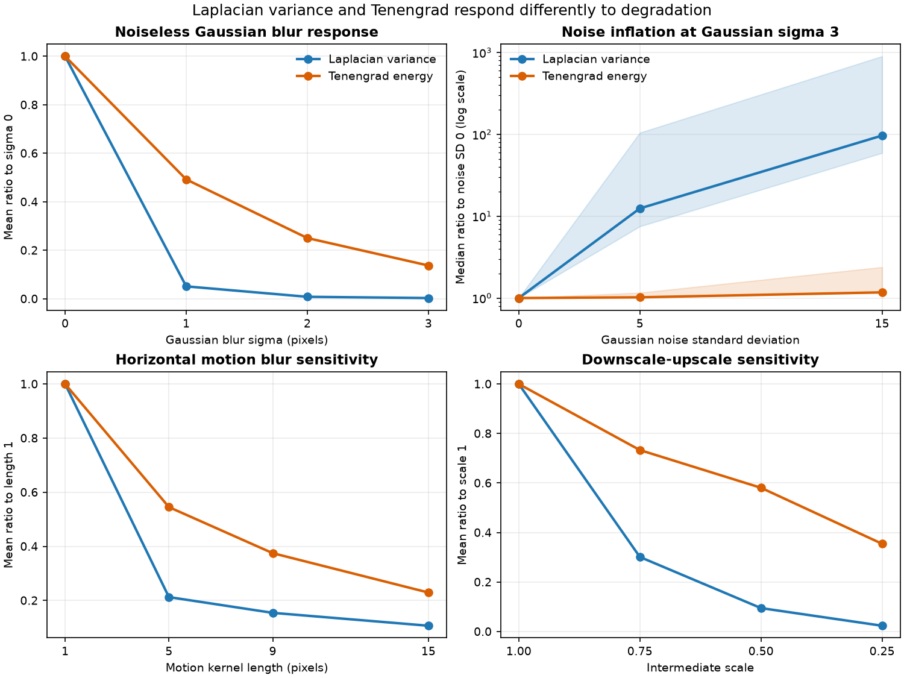

# Laplacian Variance vs. Tenengrad Under Blur and Noise

## Research Question

When image content and preprocessing are controlled, how do Laplacian variance
and an area-normalized Tenengrad measure differ in their response to Gaussian
blur and additive Gaussian noise? Do the same relative patterns extend to a
bounded horizontal-motion experiment and a resize round trip?

## Background

Laplacian variance summarizes the spread of a second-derivative response.
Tenengrad instead combines first-order horizontal and vertical Sobel responses.
Both are focus heuristics: they respond to spatial intensity changes but do not
identify whether those changes represent useful detail, noise, sharpening, or
artifacts.

Published focus-measure comparisons define Tenengrad from squared Sobel
responses and evaluate gradient- and Laplacian-based families under factors
including noise. OpenCV documents the discrete Sobel derivatives used here and
notes that the operator combines smoothing with first-order differentiation.

For this note, the measures are:

```text
Laplacian variance = variance(L(I))
Tenengrad energy = mean(Gx(I)² + Gy(I)²)
```

`Gx` and `Gy` use OpenCV's 3 x 3 Sobel operator. The conventional Tenengrad sum
is divided by the number of pixels. This area normalization prevents score
growth caused only by pixel count; it does not make unrelated images directly
comparable. No gradient threshold is applied.

## Method

The primary experiment retains the v0.1.0 synthetic patterns and processing
order:

1. Generate a checkerboard, vertical bars, and geometric shapes at 256 x 256
   pixels in 8-bit grayscale.
2. Apply Gaussian blur with sigma 0, 1, 2, or 3 pixels.
3. Add zero-mean Gaussian noise with standard deviation 0, 5, or 15 intensity
   units, then clip to the 8-bit range.
4. Repeat every condition for 20 recorded seeds.
5. Calculate Laplacian variance and area-normalized Tenengrad energy.
6. Report the raw trials and condition-level mean, sample standard deviation,
   p10, median, and p90.

The noise-free condition is repeated with different recorded seeds but produces
identical images and zero spread. This keeps a rectangular trial table without
inventing variation in the control.

Two bounded sensitivity experiments are reported separately:

- horizontal motion kernels with lengths 1, 5, 9, and 15 pixels, at zero
  degrees and without added noise;
- downscale-upscale round trips through scales 1.00, 0.75, 0.50, and 0.25,
  using `INTER_AREA` for shrinking and `INTER_LINEAR` for restoration to
  256 x 256 pixels.

## Controlled Experiment

The main factorial experiment contains 720 image observations:

| Factor | Values |
| --- | --- |
| Synthetic pattern | checkerboard, vertical bars, geometric shapes |
| Gaussian blur sigma | 0, 1, 2, 3 pixels |
| Gaussian noise standard deviation | 0, 5, 15 intensity units |
| Trials per condition | 20 |
| Base seed | 20260820 |
| Focus measures | Laplacian variance, area-normalized Tenengrad energy |

Reproduce all v0.2.0 artifacts from the repository root:

```bash
python -m pip install -e ".[test]"
python -m pytest
python experiments/run_focus_metric_comparison.py
```

The script writes raw trials, statistical summaries, two sensitivity tables,
and the comparison figure under `results/`.

## Results



The metrics have different numeric scales, so the figure and table below use
within-pattern ratios before averaging across the three patterns.

| Evaluation | Laplacian variance | Tenengrad energy |
| --- | ---: | ---: |
| Sigma 3 / sigma 0, no noise, mean ratio | 0.003073 | 0.137201 |
| Noise SD 15 inflation at sigma 3, median ratio | 96.679135 | 1.173198 |
| Noise SD 15 inflation, pooled p10-p90 | 59.178497-899.402172 | 1.166625-2.384264 |
| Motion length 15 / length 1, mean ratio | 0.106698 | 0.229381 |
| Resize scale 0.25 / scale 1.00, mean ratio | 0.023450 | 0.354536 |

Both measures decrease strictly with increasing noiseless Gaussian blur for
each pattern. Both also increase with added noise at Gaussian sigma 3. The
amount of inflation differs sharply: the Laplacian ratio is much larger in
these conditions because its noise-free sigma-3 baseline is small and the
second derivative responds strongly to pixel-scale variation.

The broad pooled Laplacian p10-p90 range combines pattern differences and trial
variation; it is not a confidence interval. Condition-level distributions are
available in `focus_metric_summary.csv`, and every observation remains in
`focus_metric_trials.csv`.

## Interpretation

The first-order Tenengrad measure retains more normalized response as Gaussian
blur increases in this experiment. Under strong blur, additive noise inflates
both measures, but the relative effect is much larger for Laplacian variance.
This supports using metric family and noise conditions as explicit design
choices rather than treating all sharpness heuristics as interchangeable.

The motion and resize checks point in the same direction: both operations
reduce both scores, while Laplacian variance falls more sharply in the tested
aggregate ratios. These checks demonstrate sensitivity, not equivalence among
Gaussian blur, motion blur, and resampling.

No result establishes that Tenengrad is universally more accurate. A metric can
be less inflated by one noise model yet still rank real images incorrectly,
miss low-contrast detail, respond to texture, or fail under a different optical
or processing pipeline.

## Failure Modes

- **Noise:** both first- and second-derivative responses can be increased by
  noise; the magnitude depends on content and the clean baseline.
- **Texture and contrast:** edge density and contrast affect both metrics
  independently of optical focus.
- **Directionality:** the motion experiment uses only horizontal blur; response
  depends on the orientation of image structure.
- **Resampling:** interpolation suppresses or changes high-frequency content,
  so resizing can look like a focus change to both metrics.
- **Local blur:** global averages can hide small blurred regions.
- **Threshold variants:** thresholded Tenengrad implementations can behave
  differently from the unthresholded area-normalized definition used here.
- **Metric scaling:** raw values cannot be compared across the two metrics.

## Practical Guidance

- Record the exact metric definition, including Sobel size, threshold policy,
  normalization, border handling, and numeric depth.
- Compare a metric only within a controlled image pipeline unless target-domain
  calibration supports broader use.
- Use multiple seeded trials when evaluating stochastic degradations, and keep
  raw observations alongside aggregate statistics.
- Inspect noise, resolution, interpolation, texture, and contrast before using
  a focus heuristic as a filter.
- Calibrate decisions against representative labels and operational costs; do
  not transfer thresholds from these synthetic values.
- Use regional evaluation when localized degradation matters.

## Limitations

The study uses three synthetic patterns, one resolution, 8-bit grayscale, one
Gaussian-noise model, and 20 trials per condition. Clipping changes the noise
distribution near intensity limits. The sensitivity experiments use one
horizontal motion direction and one resize interpolation pair. They do not
cover defocus point-spread functions, other motion angles, compression,
demosaicing, sharpening, color pipelines, natural scenes, or human judgments.

The ratio summaries average three deliberately different patterns and are not
population estimates. There are no confidence claims, hypothesis tests, or
universal thresholds. Broader conclusions require representative public data,
ground-truth or human labels, and task-specific error analysis.

## Sources

- [OpenCV: Sobel Derivatives](https://docs.opencv.org/4.x/d2/d2c/tutorial_sobel_derivatives.html)
  documents the discrete first-order derivatives, 3 x 3 kernels, and gradient
  combination used by the Tenengrad implementation.
- [OpenCV: Image Filtering](https://docs.opencv.org/4.x/d4/d86/group__imgproc__filter.html)
  is the official reference for `Sobel`, `Laplacian`, `GaussianBlur`, and
  `filter2D`.
- [OpenCV: Geometric Transformations of Images](https://docs.opencv.org/4.x/da/d6e/tutorial_py_geometric_transformations.html)
  documents `resize` and the interpolation choices used by the round trip.
- [Focusing](https://doi.org/10.1007/BF00127822) is a primary publication on
  autofocus focus-measure evaluation associated with gradient-based focus
  methods.
- [Analysis of focus measure operators for shape-from-focus](https://doi.org/10.1016/j.patcog.2012.11.011)
  defines Tenengrad from squared Sobel responses and compares focus-measure
  families under controlled factors including image noise.
