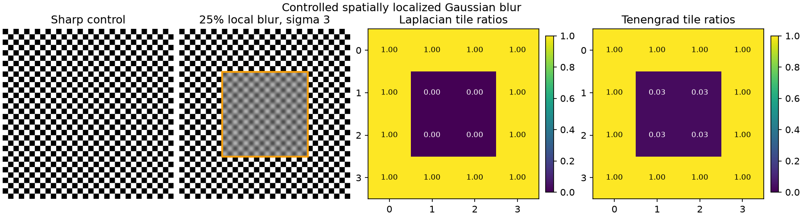
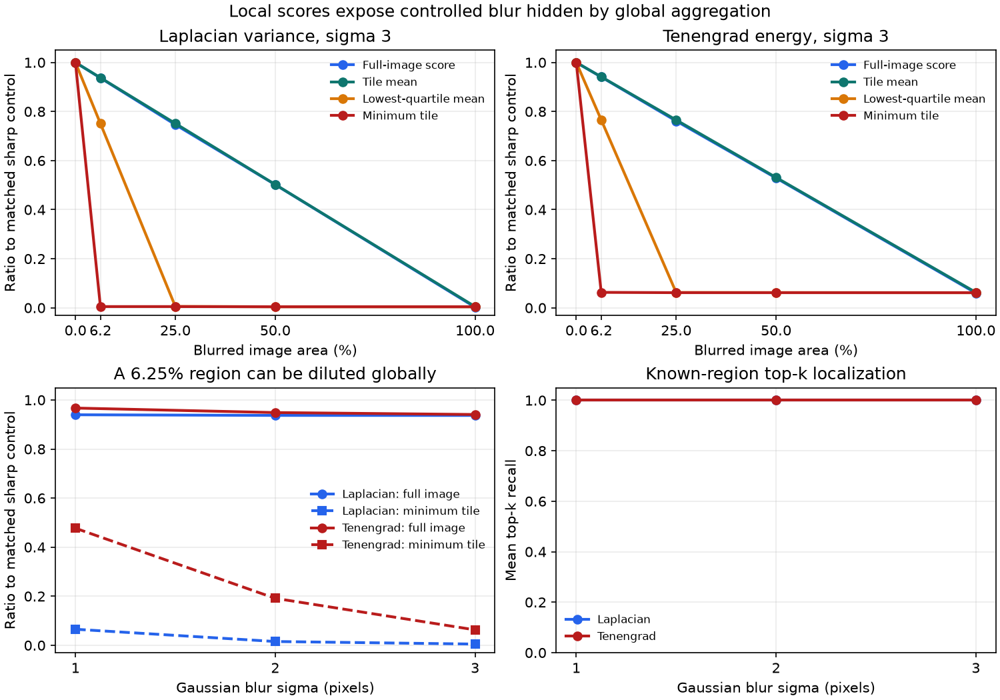

# Local Blur and Spatial Aggregation

## Research Question

When blur affects only part of an otherwise sharp image, how strongly do
full-image Laplacian variance and Tenengrad respond? Can non-overlapping tile
scores expose the affected region, and how do mean, lower-tail, and minimum
spatial aggregations change the interpretation?

## Background

A single full-image focus score discards spatial location. That is appropriate
for some autofocus tasks, but it can hide a small degraded region when most of
the image remains sharp. Research on shape from focus therefore evaluates focus
measures in local windows, and work on partial or spatially varying blur produces
regional response maps rather than only one image-level value.

Local evaluation introduces its own design choices. Window size changes the
amount of texture available to a derivative-based measure and determines the
spatial resolution of the result. Aggregating local values also encodes a
policy: a mean emphasizes overall coverage, while a lower-tail statistic or
minimum emphasizes the worst-scoring regions.

This note does not implement a general blur-segmentation algorithm. It isolates
the spatial aggregation question using the same Laplacian-variance and
area-normalized Tenengrad definitions documented in v0.2.0.

## Method

Three 256 x 256, 8-bit grayscale patterns are generated in code: a
checkerboard, vertical bars, and repeated concentric rings. Every 64 x 64 tile
contains controlled edge content so that matched sharp tile scores are
non-zero.

Each image is divided into a 4 x 4 grid of non-overlapping tiles. A fully
Gaussian-blurred version is generated, and selected tile-aligned regions are
copied into the otherwise sharp image. The binary region contains 1, 4, 8, or
16 tiles, corresponding to 6.25%, 25%, 50%, or 100% of the image. Local
conditions are placed at an edge and near the center where both layouts are
defined. Gaussian sigma values are 1, 2, and 3 pixels.

Both metrics are evaluated in two ways:

1. Apply the metric to the complete composited image.
2. Apply the metric independently to every 64 x 64 tile, giving each tile the
   metric's declared reflected border.

Full-image scores are divided by the matching sharp full-image score. Each tile
score is divided by the score from the same tile in the matching sharp pattern.
The normalized tile map is summarized by:

- the mean of all 16 tile ratios;
- the mean of the four lowest ratios, called the lowest-quartile mean;
- the minimum tile ratio.

For evaluation only, the known number of blurred tiles is used to select the
same number of lowest-ratio tiles. Top-k localization recall is the fraction of
known blurred tiles in that set. This is a controlled ranking check, not a
deployable classifier: an unknown image does not provide k.

## Controlled Experiment

| Factor | Values |
| --- | --- |
| Synthetic pattern | checkerboard, vertical bars, concentric tiles |
| Image size | 256 x 256 pixels |
| Tile grid | 4 x 4 non-overlapping tiles |
| Tile size | 64 x 64 pixels |
| Gaussian blur sigma | 1, 2, 3 pixels |
| Blurred area | 6.25%, 25%, 50%, 100% |
| Local placement | edge, center |
| Focus measures | Laplacian variance, area-normalized Tenengrad energy |

The sharp controls and all valid placement combinations produce 66 synthetic
image conditions. With two metrics, the main table contains 132 metric
observations and the tile table contains 2,112 metric observations.

Reproduce the artifacts from the repository root:

```bash
python -m pip install -e ".[test]"
python -m pytest
python experiments/run_local_blur_evaluation.py
```

## Results





The following values average matched-control ratios across patterns and, where
applicable, both placements at Gaussian sigma 3.

| Metric | Blurred area | Full-image ratio | Lowest-quartile mean | Minimum tile ratio |
| --- | ---: | ---: | ---: | ---: |
| Laplacian variance | 6.25% | 0.936866 | 0.751257 | 0.005025 |
| Laplacian variance | 25% | 0.746448 | 0.005423 | 0.005025 |
| Laplacian variance | 50% | 0.501940 | 0.004324 | 0.004297 |
| Laplacian variance | 100% | 0.002566 | 0.004242 | 0.004242 |
| Tenengrad energy | 6.25% | 0.940676 | 0.765737 | 0.062950 |
| Tenengrad energy | 25% | 0.761332 | 0.062388 | 0.061723 |
| Tenengrad energy | 50% | 0.529013 | 0.062002 | 0.061673 |
| Tenengrad energy | 100% | 0.060143 | 0.061621 | 0.061621 |

With only one of 16 tiles blurred at sigma 3, the full-image scores retain
about 94% of their sharp-control values. The minimum tile ratios retain about
0.5% for Laplacian variance and 6.3% for Tenengrad. The full-image values
therefore express the dominant sharp area rather than the severity of the
smallest affected region.

The tile mean remains close to the full-image ratio because both are dominated
by the fraction of unchanged content. The lowest-quartile mean becomes strongly
responsive when the blurred region covers at least four tiles, but one blurred
tile is still averaged with three sharp tiles. This is an expected consequence
of the aggregation definition, not a defect in the metric implementation.

All affected tiles ranked among the k lowest ratios in every reported local
condition for both metrics, giving top-k recall 1.0. The patterns were designed
to make this ranking problem clean, contain texture in every tile, and exclude
noise. The result is a validation of the experiment controls, not an expected
accuracy on natural images.

The largest edge-versus-center difference in a matched full-image ratio is
0.014530 across the tested local conditions. This bounded result does not show
position invariance beyond the two aligned layouts.

## Interpretation

Spatial aggregation determines what question a focus score answers. A
full-image score or tile mean estimates an image-wide response and can dilute a
small severe defect. A minimum emphasizes the worst tile and exposes the
controlled local blur, while a lower-tail mean responds only when enough low
tiles enter its fixed support.

The minimum is not automatically the best operational choice. On uncontrolled
images it can be driven by a textureless tile, noise, occlusion, border content,
or an isolated artifact. A lower-tail mean is less dependent on one tile but
sets an implicit minimum spatial coverage. Tile size and aggregation policy
must therefore be selected together and calibrated against the intended defect
size and error cost.

Laplacian and Tenengrad values should not be compared to each other directly.
Their normalized tile maps agree on the controlled region, but their retained
ratios differ because their derivative definitions respond differently to
Gaussian smoothing.

## Failure Modes

- **Low-texture tiles:** a local derivative score may be small even when the
  region is in focus; all experiment tiles deliberately contain edges.
- **Noise and artifacts:** a minimum or lower-tail aggregation can select a
  contaminated tile, and derivative measures can increase under noise.
- **Tile alignment:** a defect that crosses tile boundaries may be diluted over
  several tiles or interact with the evaluation border.
- **Tile size:** large tiles dilute small defects; small tiles contain less
  evidence and can be more content-dependent.
- **Aggregation support:** the lowest-quartile mean uses exactly four tiles, so
  its response depends on whether the affected area fills that support.
- **Unknown region count:** top-k recall uses known synthetic ground truth and
  cannot be calculated as an operational decision without an estimate of k.
- **Composition boundary:** copying from a fully blurred image creates a binary
  transition at the region boundary. The full-image derivative can respond to
  that transition.
- **Independent tile borders:** tile metrics use reflected borders and do not
  include derivative responses across tile boundaries. Their mean is therefore
  not mathematically identical to the full-image score.

## Practical Guidance

- Preserve a regional score map when localized degradation matters; do not
  retain only the global average.
- Choose tile size from the smallest operationally important defect, then test
  sensitivity to nearby sizes.
- Prefer a documented lower-tail policy over an unexplained minimum when one
  anomalous tile should not decide the outcome.
- Treat low-texture, noisy, saturated, and border tiles explicitly before
  ranking them as blurred.
- Normalize and calibrate only within a controlled acquisition and processing
  pipeline, using representative labeled examples.
- Record metric definition, tile geometry, overlap, border handling,
  normalization, and aggregation policy together.
- Visualize regional scores during review so that a numeric decision remains
  traceable to image location.

## Limitations

The experiment uses three periodic synthetic patterns, one resolution, one
fixed 4 x 4 grid, non-overlapping tiles, and Gaussian blur without noise. It
does not test sliding windows, overlapping or multiscale regions, natural
texture, unknown blur masks, compression, sharpening, defocus point-spread
functions, motion blur, or human annotations.

The masks are tile-aligned and use a hard spatial transition. The minimum tile
ratio is favored by this alignment and by the guaranteed texture in every tile.
Top-k recall uses the true region size. No result is a population estimate,
universal threshold, or production blur-segmentation accuracy claim.

## Sources

- [OpenCV: Image Filtering](https://docs.opencv.org/4.x/d4/d86/group__imgproc__filter.html)
  documents the Gaussian, Laplacian, and Sobel operations and border options
  used by the experiment.
- [Analysis of focus measure operators for shape-from-focus](https://doi.org/10.1016/j.patcog.2012.11.011)
  evaluates focus measures in local windows and discusses the tradeoff between
  window size, spatial resolution, image information, and robustness.
- [Discriminative Blur Detection Features](https://openaccess.thecvf.com/content_cvpr_2014/html/Shi_Discriminative_Blur_Detection_2014_CVPR_paper.html)
  studies features that distinguish blurred and clear image regions and
  evaluates regional blur maps against labeled data.
- [Spatially-Varying Blur Detection Based on Multiscale Fused and Sorted
  Transform Coefficients of Gradient Magnitudes](https://openaccess.thecvf.com/content_cvpr_2017/html/Golestaneh_Spatially-Varying_Blur_Detection_CVPR_2017_paper.html)
  treats spatially varying blur as a map-estimation problem and illustrates why
  regional evidence is distinct from one image-level score.
