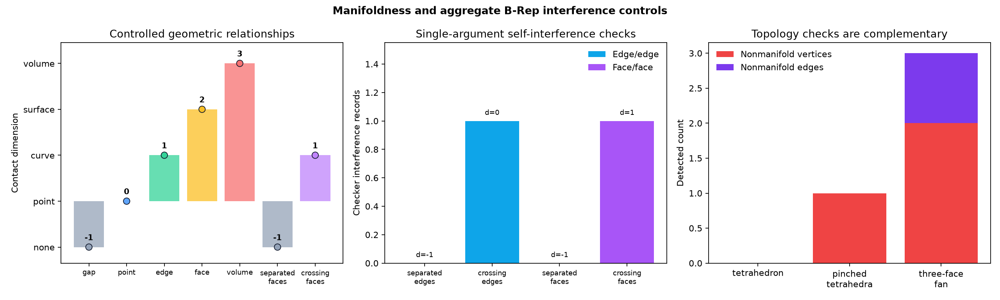

# Manifoldness and Aggregate B-Rep Interference: Vertex Links, CheckerSI, and Contact Dimension

## 日本語概要

本ノートは、四面体、1頂点だけを共有する2四面体、3面共有辺、離隔・点接触・辺接触・面接触・体積重複する箱に加え、単一の集約B-rep内に置いた非交差・交差の独立辺対と独立面対を合成します。全24件で制御位相、全14件の形状対観測で接触次元と測定量、全8件の単一引数自己干渉検査で干渉種類・次元・量が一致しました。交差辺は1個の辺対干渉点、交差面は長さ2の1本の切断曲線としてSTEP再読込後も検出されます。これは1本の曲線や1枚の曲面それ自体の自己交差を扱う研究ではなく、集約B-repに含まれる独立部分形状間の干渉を扱う限定的な検証です。英語本文で方法、結果、限界、次の疑問を説明します。

---

## English Summary

Twelve synthetic controls separate edge incidence, vertex-neighborhood manifoldness, aggregate B-Rep self-interference, geometric contact dimension, and volumetric overlap. `BOPAlgo_CheckerSI` receives one aggregate argument containing either two independent edges or two independent faces; separated negative controls have no relevant records, while crossed controls retain one edge/edge point or one face/face section curve before and after STEP exchange. Exact box pairs separately progress from a unit gap through point, edge, and face contact to a nine-unit volume overlap. This is not a test of one curve or one surface intersecting itself.

## Research Question

Which explicit checks are needed to distinguish edge-manifold incidence, manifold vertex neighborhoods, aggregate subshape interference, boundary contact, and volumetric overlap?

## Background

The v0.35 study counted oriented face uses around each edge. That detects free edges and edges used by more than two faces, but it cannot prove that a vertex neighborhood is a disk. Two closed surfaces can share one topological vertex while every edge still has exactly two face uses.

Open CASCADE provides several algorithms with narrower meanings. [`BOPAlgo_CheckerSI`](https://dev.opencascade.org/doc/refman/html/class_b_o_p_algo___checker_s_i.html) checks self-interference at selectable subshape levels. [`BRepExtrema_DistShapeShape`](https://dev.opencascade.org/doc/refman/html/class_b_rep_extrema___dist_shape_shape.html) computes minimum distance, while [`BRepAlgoAPI_Section`](https://dev.opencascade.org/doc/refman/html/class_b_rep_algo_a_p_i___section.html) builds intersection vertices and edges. None of these results alone identifies the topological dimension and intent of a contact.

In this study, “self-interference” follows the checker API's single-argument
meaning: the argument is one aggregate B-Rep containing independent subshapes.
The crossed-edge control is not one parametric curve crossing itself, and the
crossed-face control is not one support surface crossing itself.

## Method

For each analysis-local vertex, the study builds a combinatorial link multigraph:

- link nodes are unique incident edges;
- each face corner adds one link arc between its two incident edges;
- a closed-manifold vertex has one connected link whose node degrees are all two;
- a boundary-manifold vertex has one connected link with two degree-one nodes and all remaining degrees two; and
- every disconnected, branching, or isolated link is classified as nonmanifold.

For controlled shape pairs, the experiment records minimum distance, Boolean common-part topology and measures, and section topology and length. The relationship is classified by the highest supported dimension: volume, surface, curve, point, or disjoint. A closed section loop is converted to a planar face only in the controlled box case to measure the face-contact area.

Four controls additionally pass the complete aggregate as the only
`BOPAlgo_CheckerSI` argument. Level `2` records through edge/edge interference;
level `5` additionally records edge/face and face/face interference. The study
retains the checker execution status and each interference-table count. One
edge/edge common part of vertex type is reported as dimension `0` with point
count `1`; one face/face curve is reported as dimension `1` and quantified by
the independently serialized section length. `HasErrors == false` means the
checker executed successfully; absence of errors is not interpreted as absence
of interference.

Each shape is measured in memory, written to normalized STEP bytes, imported, and measured again. The STEP fixtures contain only generated geometry.

## Controlled Experiment

| Control | Independent truth | Boundary isolated |
| --- | --- | --- |
| `valid_tetrahedron` | `V=4, E=6, F=4`; every vertex link is one cycle | Closed-manifold positive control |
| `pinched_tetrahedra` | `V=7, E=12, F=8`; all edges have two uses; shared vertex link has two components | Vertex nonmanifoldness invisible to edge incidence |
| `nonmanifold_fan` | `V=5, E=7, F=3`; one edge has three uses; two endpoint links branch with degree three | Edge and vertex nonmanifoldness |
| `separated_edges` | Two independent parallel edges in one aggregate; checker level `2` reports no edge/edge record | Edge-interference negative control |
| `crossing_edges` | Two independent edges in one aggregate cross at one interior point; checker reports one edge/edge vertex common part | Zero-dimensional aggregate interference |
| `disjoint_boxes` | Minimum distance `1` | Separation |
| `vertex_touching_boxes` | Minimum distance `0`; zero-dimensional contact | Point contact |
| `edge_touching_boxes` | One-dimensional contact of length `4` | Curve contact |
| `face_touching_boxes` | Two-dimensional contact of area `16` | Surface contact |
| `overlapping_boxes` | Three-dimensional common volume `9` | Interior overlap |
| `separated_faces` | Two parallel independent faces in one aggregate, separated by `1`; checker reports no face/face record | Face-interference negative control |
| `crossing_faces` | Two independent faces in one aggregate; checker reports two edge/face records, one face/face curve, and section length `2` | Transverse aggregate face interference |

Run from the repository root:

```bash
python -m pip install -e ".[geometry]"
python experiments/run_manifold_self_intersection.py
```

## Results

All 24 constructed and STEP-imported whole-shape observations match the controlled vertex, edge, face, nonmanifold-vertex, and nonmanifold-edge values. All 14 pair observations match the expected relationship dimension and measure with zero recorded absolute error in the pinned environment. All eight single-argument checker observations match their preregistered interference-table counts, intersection dimension, and quantity.

The separated edge aggregate has no edge/edge interference record. The crossed
edge aggregate has one edge/edge record whose common part is a vertex, giving
dimension `0` and point count `1`. The separated face aggregate has no
edge/face or face/face record. The crossed face aggregate has two edge/face
records, one face/face record with one curve, and section length `2`. These
results are unchanged after STEP exchange.

The decisive counterexample is `pinched_tetrahedra`: every one of its 12 edges has two face uses, but the common vertex has two disconnected triangular link components. Edge incidence therefore passes while the vertex-manifold contract fails.

The box sequence has minimum distance zero for point, edge, face, and volume cases. Section and common-part evidence distinguish the cases as dimensions zero, one, two, and three. The controlled measures are length `4`, area `16`, and volume `9`. The crossing-face section retains length `2` across STEP exchange.




## Interpretation

### Two face uses per edge are necessary but insufficient

The pinched control proves that local edge incidence does not determine the topology of a vertex neighborhood. A solid-inspection contract needs both edge-use and vertex-link evidence.

### Zero distance does not identify the relationship

Point, edge, face, and volume controls all have zero minimum distance. Downstream policies must use the dimension and measure of the common or section result rather than treating every zero distance as collision or every contact as harmless.

### Aggregate interference is not the same claim as pairwise contact policy

The checker controls ask whether independent subshapes inside one aggregate
argument interfere at the enabled levels. The box-pair controls instead measure
the dimension of a relation between two explicitly selected solids. A checker
record is geometric evidence; whether a point, edge, or face contact is allowed
remains a separate application policy.

### Topological sharing and geometric coincidence are different

The touching boxes are stored as separate solids. Their coincident point, edge, or face is geometric evidence, not shared topological identity. This distinction becomes important for composite solids in v0.38.

### STEP preserved this bounded contract

The selected writer and reader preserve all 12 controlled topology signatures, all seven pair relationships, and all four aggregate-interference contracts. This is evidence for these normalized fixtures and their 24 topology, 14 pair, and eight checker stage observations, not a persistent-identity guarantee for arbitrary STEP translators.

## Failure Modes

- Declaring a shape manifold because every edge has exactly two face uses.
- Treating a generic validity result as a vertex-neighborhood proof.
- Treating minimum distance zero as proof of volumetric overlap.
- Treating a coincident geometric face as the same topological face.
- Counting a face-contact section perimeter as the contact area.
- Calling every lower-dimensional contact a self-intersection without an application policy.
- Reporting `HasErrors == false` as “no self-interference” without reading the checker data structure.
- Claiming that the aggregate crossed-edge or crossed-face controls prove self-intersection handling for one parametric curve or one support surface.

## Practical Guidance

1. Preserve edge-use and vertex-link results as separate columns.
2. Report the link component count and maximum degree for every suspect vertex.
3. Retain checker level, execution status, and per-type interference counts; do not reduce the result to one Boolean.
4. Record minimum distance, section topology, common topology, and dimensional measure separately.
5. Distinguish topological sharing from geometric coincidence.
6. Define whether point, edge, and face contact are permitted before classifying a model.
7. Compare constructed and imported stages without assuming local indices persist.
8. Quarantine unsupported curved or tolerance-sensitive cases instead of forcing them into this polyhedral contract.

## Limitations

- Controls use planar triangles, analytic boxes, and planar crossing faces in one pinned `cadquery-ocp` route.
- The vertex-link implementation does not cover periodic seams, degenerate edges, nonmanifold wire uses, or arbitrary cellular complexes.
- No single parametric curve or single support surface that intersects itself is evaluated; the checker controls contain independent edges or faces in one aggregate B-Rep.
- No curved, spline, tangent, near-contact, or folded closed-shell self-interference is evaluated.
- Common-part and section evidence comes from the same geometry kernel and is not an independent second-kernel oracle.
- The face-contact area reconstruction is limited to a controlled planar closed section.
- Numeric tolerances are regression bounds for these fixtures, not manufacturing acceptance limits.

## Questions Carried Forward

- Should point or edge contact between material regions be accepted, warned, or rejected?
- Can a persistent semantic relationship survive when STEP preserves geometry but not shared topological identity?
- How should periodic seams and degenerate edges be represented in a general vertex-link multigraph?
- Which independent method should validate curved-face self-intersection results?

## Sources

- [Open CASCADE `BOPAlgo_CheckerSI` class reference](https://dev.opencascade.org/doc/refman/html/class_b_o_p_algo___checker_s_i.html)
- [Open CASCADE `BOPAlgo_ArgumentAnalyzer` class reference](https://dev.opencascade.org/doc/refman/html/class_b_o_p_algo___argument_analyzer.html)
- [Open CASCADE `BRepExtrema_DistShapeShape` class reference](https://dev.opencascade.org/doc/refman/html/class_b_rep_extrema___dist_shape_shape.html)
- [Open CASCADE `BRepAlgoAPI_Section` class reference](https://dev.opencascade.org/doc/refman/html/class_b_rep_algo_a_p_i___section.html)
- [Open CASCADE `BRepAlgoAPI_Common` class reference](https://dev.opencascade.org/doc/refman/html/class_b_rep_algo_a_p_i___common.html)
- [Open CASCADE `ShapeAnalysis_Shell` class reference](https://dev.opencascade.org/doc/refman/html/class_shape_analysis___shell.html)
