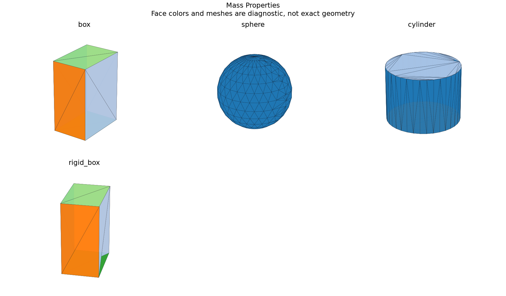

# Mass Properties and Inertia Tensors

## 日本語概要

v0.71.0では質量特性と慣性テンソルを実装し、11件の限定した合成条件を検証しました。入力・判断根拠・結果をCSV、JSON、図、再生成可能なサンプルに残しています。

検証範囲と失敗例は以下の英語本文に示します。一般のCADデータへの適用や完全な規格適合を主張するものではありません。

---

## English Summary

A single valid outward closed solid and explicit homogeneous material density are required. Length units mm, cm, m and inch and density units kg/m3 and g/cm3 are converted to SI. The centroid inertia scales with the fifth power of length. Eigenvectors use canonical signs but repeated principal moments are marked nonunique. Small SI inertia values retain significant digits in JSON instead of rounding to zero.

## Results and Interpretation

Eleven observations compare a box, sphere, cylinder and rigidly moved box before/after STEP exchange with analytic volume, centroid and inertia. Missing material, unknown units and reversed solid orientation are refused.

The 11 `checks_pass` observations check the declared expectation, including
expected rejections and recorded learning failures. They do not mean that every
input was accepted or every learned prediction was correct.

## Sources and Implementation Boundary

[OCCT BRepGProp](https://occt3d.com/dev/doc/refman/html/class_b_rep_g_prop.html) does not itself establish all closure and density preconditions. The wrapper checks them before using its volume-property integration.

- one valid outward closed solid; explicit homogeneous density and length units required
- mass and centroid inertia reported in SI; principal axes for repeated eigenvalues are nonunique
- synthetic engineering measurements; no heterogeneous material assignment inferred

## Reproduction and Artifacts

Run from the repository root in the pinned geometry environment:

```bash
python experiments/run_mass_properties.py
```

Default runs verify fixture bytes. To regenerate into separate directories:

```bash
python experiments/run_mass_properties.py --output-dir output/mass-properties --fixture-dir output/fixtures/mass-properties --refresh-fixtures
```

- [Observations](../results/mass_properties.csv)
- [Detailed evidence](../results/mass_properties_evidence.json)
- [Contract and limits](../results/mass_properties_contract.json)
- [Fixture manifest](../fixtures/mass-properties/manifest.csv)
- [Experiment](../experiments/run_mass_properties.py)
- [Implementation](../src/research_notes/engineering_studies.py)


