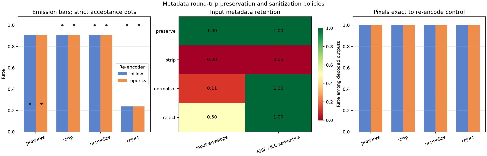
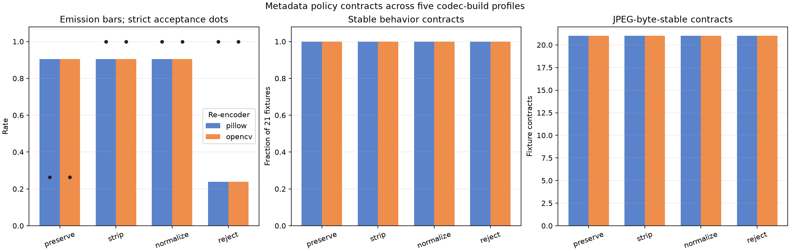

# Metadata Round-Trip Preservation and Sanitization Policies

## 日本語概要

本ノートは、21種類の固定JPEGを復号・再符号化するとき、メタデータを保持・除去・正規化・拒否する4方針が、出力可否、厳格検査、バイト保持、EXIF・ICCの意味、圧縮画像、復号画素へ与える影響を比較します。バイト一致、意味の保持、構造の妥当性を別の契約として扱います。

実験方法、環境別結果、失敗条件、制約は以下の英語本文を参照してください。

---

## English Summary

This study compares preserve, strip, normalize, and reject policies while
re-encoding 21 fixed JPEG fixtures. It evaluates output availability, strict
metadata acceptance, byte preservation, supported EXIF and ICC semantics,
compressed-image changes, and decoded pixels as separate observations.

## Research Question

When a JPEG is decoded and re-encoded, how do four explicit metadata policies
change output availability, strict metadata acceptance, byte preservation,
supported EXIF and ICC semantics, the re-encoded compressed core, and raw
decoded pixels?

The four policies are:

1. `preserve`: blindly copy the fixture's complete controlled metadata
   envelope;
2. `strip`: transfer no input metadata;
3. `normalize`: retain only supported EXIF Orientation and ICC semantics from
   strict-audit inputs, using canonical segments;
4. `reject`: emit no output for a strict-audit rejection and otherwise use the
   same supported normalization rule.

The study asks whether "metadata preserved" is a sufficiently precise
contract. It is not: byte identity, semantic intent, structural validity,
output availability, and decoded pixels are different observations.

## Background

JPEG encoders operate on image samples and encoding parameters; metadata
transfer is a separate application decision. Pillow's JPEG documentation
exposes `exif` and `icc_profile` save parameters and explicitly demonstrates
passing an input profile when it should be retained. Omitting the profile does
not implicitly preserve it. OpenCV exposes image encoding and separate
metadata-aware decoding interfaces, but its ordinary in-memory encoder does
not define an input-metadata round-trip contract.

EXIF and ICC also have different structures. EXIF uses TIFF-structured data
inside APP1. An ICC profile can span numbered APP2 chunks that must be
reassembled consistently. Copying the original bytes preserves both valid and
invalid structures. Rebuilding supported fields can produce a valid,
inspectable output, but it deliberately discards unknown fields and cannot
preserve semantics the application does not understand.

This creates several legitimate but incompatible policy goals:

- archival byte retention favors preservation;
- predictable downstream interpretation favors validation and normalization;
- data minimization favors stripping;
- a strict trust boundary favors rejection.

No single policy is universally correct. The application must declare which
contract it needs and what happens when parsing or decoding fails.

## Method

The experiment reuses the 21 deterministic v0.13 JPEG fixtures. Every fixture
shares one synthetic compressed image stream and adds either no bytes, a
controlled APP envelope immediately after SOI, or controlled trailing bytes
after EOI. The corpus includes valid EXIF and ICC metadata, unknown and large
APP data, malformed EXIF and ICC structures, invalid framing, trailing data,
conflicting Adobe transforms, and an APP-count resource boundary.

Pillow is the fixed raw input decoder. Automatic EXIF transposition and ICC
conversion are disabled. Each successful BGR array is re-encoded at quality 75
and 4:4:4 sampling through:

- Pillow 12.3.0;
- OpenCV 4.13.0.

The same re-encoded stream is then passed to all four policies. This ordering
keeps re-encoding constant within each fixture and encoder so the metadata
policy can be evaluated separately.

The preserve condition is a controlled experimental baseline, not a generic
metadata parser. It copies exactly the manifest-declared inserted byte range
and placement. The other policies do not copy that range. Normalize and
accepted reject outputs reconstruct only a strict-audit EXIF Orientation value
and complete ICC profile; unknown APP data is not transferred.

Each output records:

- whether the input raw decode succeeded;
- whether policy emitted a JPEG;
- whether the emitted JPEG passed the strict metadata audit;
- whether the complete controlled input envelope remained byte-exact;
- whether supported EXIF Orientation and ICC profile identity were retained;
- whether removing policy metadata recovered the exact re-encoder output;
- whether raw output pixels were exact to the same re-encoder control;
- the separate lossy re-encoding difference from input pixels.

## Controlled Experiment

The local design contains 168 attempted policy observations:

```text
21 fixed JPEG fixtures
  x 2 re-encoders
  x 4 metadata policies
= 168 observations
```

The primary controls are:

- identical fixture bytes for every policy;
- one raw decoder and one decoded BGR input per fixture;
- fixed quality and chroma sampling;
- one shared re-encoded control per fixture and encoder;
- exact hashes for fixture bytes, output bytes, and decoded arrays;
- a strict audit performed independently on source and output;
- no camera, workplace, customer, or downloaded image data.

The experiment does not use byte equality between Pillow and OpenCV as an
acceptance criterion. Encoder-specific bytes and the policy-specific metadata
layer are measured separately.

## Results

### Local reference profile

Pillow decoded 19 of the 21 source fixtures. The APP1 length overrun and
truncated ICC chunk-header fixtures did not reach the re-encoder boundary.
This input-decoder limit applies equally to the three policies that would
otherwise emit a recovered image. The reject policy independently rejected
those inputs at the audit boundary.

The results were identical for the Pillow and OpenCV re-encoders:

| Policy | Outputs / 21 | Strict accepted outputs | Complete input envelope exact | Supported EXIF / ICC retained |
| --- | ---: | ---: | ---: | ---: |
| preserve | 19 | 5 / 19 | 18 / 18 applicable | 2 / 2 |
| strip | 19 | 19 / 19 | 0 / 18 applicable | 0 / 2 |
| normalize | 19 | 19 / 19 | 2 / 18 applicable | 2 / 2 |
| reject | 5 | 5 / 5 | 2 / 4 applicable | 2 / 2 |

Preserve copied every available non-empty controlled envelope, including the
malformed envelopes. Consequently, only the five source fixtures accepted by
the strict audit produced accepted preserve outputs. Byte preservation
faithfully retained the rejection condition.

Strip emitted a strict-accepted output for every decoded input but discarded
both supported interpretation metadata and every unknown or malformed
envelope.

Normalize also emitted 19 strict-accepted outputs. It retained the two
supported valid semantics: EXIF Orientation 6 and the synthetic gamma-2.2 ICC
profile. The complete controlled envelope happened to remain byte-exact for
those two canonical fixtures, while all 16 other available envelopes were
discarded. That 2-of-18 byte result is fixture-specific and is not a guarantee
that normalization preserves source serialization.

Reject emitted only the five strict-audit inputs. Two carried supported EXIF
or ICC metadata and were normalized; the two accepted unknown or large APP
envelopes were discarded; the untagged control had no inserted envelope.

Across the 124 emitted outputs:

- all 124 reduced to the exact corresponding re-encoder stream when the
  policy-controlled metadata layer was removed;
- all 124 decoded successfully through Pillow;
- all 124 decoded arrays were exact to the same re-encoder control.

The mean absolute difference between source pixels and the re-encoder control
was 0.036680912 code values for both local encoder paths. This is a separate
lossy JPEG round-trip observation. Pixel exactness to the re-encoder control
shows only that the tested metadata policy did not add another raw-decode
change.



### Cross-platform release matrix

The release workflow repeats the 168 observations on Ubuntu x64 default and
forced-scalar paths, Windows x64, macOS arm64, and macOS Intel x64. The
combined report preserves each platform observation and summarizes behavior
signatures and byte or pixel hash multiplicity per fixture, encoder, and
policy.

The successful
[five-profile workflow](https://github.com/cab0a/research-notes/actions/runs/30427760311)
recorded 840 observations and 168 fixture, encoder, and policy contracts:

- all 168 contracts had one behavior signature across the five profiles;
- 620 of 840 attempts emitted output bytes;
- all 620 emitted outputs passed their compressed-core contract;
- all 620 outputs decoded successfully and were pixel-exact to the same
  re-encoder control;
- preserve copied all 180 available non-empty envelopes byte-exactly but only
  50 of its 190 outputs passed the strict audit;
- strip and normalize each emitted 190 of 210 outputs, all strict accepted;
- reject emitted only the 50 strict-audit inputs, all strict accepted;
- all 124 output-bearing fixture, encoder, and policy contracts had one JPEG
  hash and one decoded-pixel hash across the recorded profiles.



These records are build-specific compatibility evidence, not a guarantee for
other codec builds.

## Interpretation

The preserve result is the central counterexample: exact metadata copying can
be perfectly successful while the resulting metadata remains structurally
rejected. Preservation answers "did the bytes survive?" It does not answer
"should a downstream system trust or interpret them?"

Strip and normalize both repaired the strict audit outcome for every decoded
fixture, but their semantic contracts differ. Strip provides data
minimization and a clean metadata boundary at the cost of discarding
orientation and color-profile intent. Normalize retains the two semantics
implemented and tested here, but drops unknown metadata. Reject sacrifices
availability for an explicit input-validity boundary.

The compressed-core and decoded-pixel controls establish that the observed
audit and retention differences came from metadata policy, not from a hidden
policy-specific image re-encode. They do not remove the ordinary lossy error
introduced before policy application.

## Failure Modes

### Blind preservation propagates rejected structures

The preserve condition copies malformed EXIF, invalid ICC topology, conflicting
Adobe transforms, trailing data, and resource-boundary content whenever the
raw decoder produces pixels. A successful rewrite does not sanitize these
bytes.

### Strip removes appearance-relevant intent

Removing an ICC profile or EXIF Orientation can change how another application
renders or lays out the image even when raw decoder output from the stored JPEG
samples is unchanged. Data minimization must account for those consequences.

### Normalize overclaims unsupported semantics

A normalizer that understands two fields cannot claim to preserve all metadata
meaning. Unknown APP data, maker-specific fields, XMP, IPTC, thumbnails, and
other EXIF fields are outside this implementation and are dropped.

### Reject conflates policy strictness with format universality

The strict audit is an application trust policy, not the only legal JPEG
acceptance rule. A different application can choose recovery, quarantine, or
field-level rejection, but it should make that choice explicit.

### Decode-first workflows inherit decoder limits

Strip and normalize cannot produce a re-encoded image if the selected raw
decoder refuses the input. Another decoder might recover those pixels, but
that would change the trusted computing boundary and require its own controls.

### Byte equality is mistaken for semantic equality

Canonical reconstruction can preserve a supported value while changing its
serialization. Conversely, identical bytes can preserve ambiguity or invalid
offsets. Both byte and semantic observations are needed.

## Practical Guidance

1. Declare preservation, minimization, normalization, and rejection as
   separate policy modes rather than one ambiguous "keep metadata" option.
2. Audit untrusted metadata before interpretation or propagation; do not use
   raw pixel availability as the audit result.
3. Define a field-level allowlist for normalization and document what is
   discarded.
4. Preserve EXIF Orientation or apply it to pixels deliberately; do not
   silently drop both the tag and its intended transform.
5. Preserve or convert an ICC profile deliberately when color interpretation
   matters; do not assume an untagged output has identical appearance.
6. Record whether a round trip promises byte identity, semantic retention,
   strict validity, decoded-pixel invariance, or only output availability.
7. Keep the re-encoding loss measurement separate from metadata policy tests.
8. Treat rewriting as one validation layer, not as a complete file-upload
   security control.

## Limitations

- The corpus contains one small synthetic baseline RGB image and 21 controlled
  metadata envelopes; it is not representative of natural-image or camera
  metadata distributions.
- The preserve mode relies on manifest-declared byte ranges and is not a
  general metadata extraction implementation.
- Normalization supports only EXIF Orientation and complete embedded ICC
  profiles.
- The experiment does not preserve XMP, IPTC, comments, thumbnails, maker
  notes, GPS, multiple same-type APP segments, or arbitrary EXIF fields.
- Orientation and ICC semantics are compared by declared value and profile
  hash. Device-color accuracy, gamut mapping, rendering intent, and visual
  judgments are not evaluated.
- The raw input and output decoder is Pillow. Other decode-first rewrite
  pipelines may have different recovery and rejection behavior.
- The study performs one lossy decode/re-encode cycle. Multi-generation
  compression drift and policy idempotence are not evaluated.
- Rewriting is not a malware scanner, content-disarm proof, vulnerability
  assessment, resource benchmark, sandbox, or guarantee of safe handling.
- The cross-platform conclusions apply only to the pinned wheels and recorded
  runner profiles.

## Sources

- [Pillow JPEG format documentation](https://pillow.readthedocs.io/en/stable/handbook/image-file-formats.html#jpeg)
- [Pillow `JpegImagePlugin` implementation](https://pillow.readthedocs.io/en/stable/_modules/PIL/JpegImagePlugin.html)
- [OpenCV image codec documentation](https://docs.opencv.org/4.13.0/d4/da8/group__imgcodecs.html)
- [ICC technical note on profile embedding](https://www.color.org/technotes/ICC-Technote-ProfileEmbedding.pdf)
- [CIPA Exif standards list](https://www.cipa.jp/e/std/std-sec.html)
- [ExifTool application documentation](https://github.com/exiftool/exiftool/blob/master/html/exiftool_pod.html)
- [ExifTool metadata FAQ](https://github.com/exiftool/exiftool/blob/master/html/faq.html)
- [OWASP File Upload Cheat Sheet](https://cheatsheetseries.owasp.org/cheatsheets/File_Upload_Cheat_Sheet.html)
- [ITU-T T.86: JPEG APPn markers](https://www.itu.int/epublications/publication/itu-t-t-86-v2-2024-02-information-technology-digital-compression-and-coding-of-continuous-tone-still-images-appn-markers)
