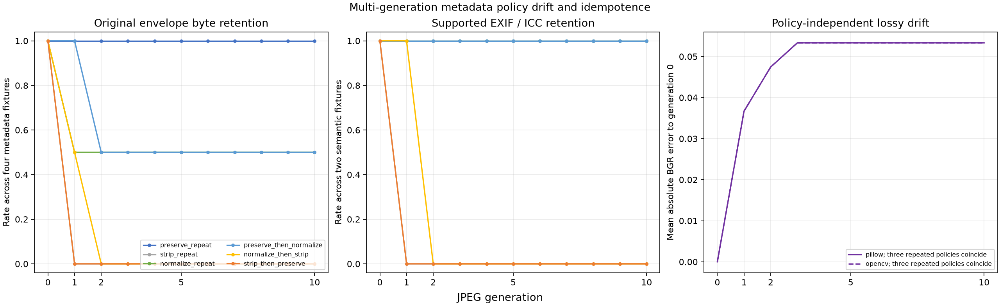

# Multi-Generation Metadata Policy Drift and Idempotence

## 日本語概要

本ノートは、5種類の固定JPEGを最大10世代まで繰り返し復号・再符号化し、メタデータの保持・除去・正規化と代表的な方針遷移を比較します。660件のローカル観測では、すべての方針系列が遷移後に安定したメタデータ状態へ到達する一方、画素は別の非可逆圧縮過程として変化しました。メタデータの冪等性、意味保持、バイト保持、画素収束を別の契約として扱います。

実験方法、観測結果、失敗条件、適用範囲は以下の英語本文を参照してください。

---

## English Summary

This study follows preserve, strip, and supported-normalization policies
through ten repeated JPEG decode and re-encode generations. It separates
metadata byte state, supported EXIF and ICC semantics, strict acceptance,
compressed image data, and decoded-pixel drift instead of treating
"idempotent" as one undifferentiated property.

## Research Question

When an accepted JPEG repeatedly crosses the same decode, re-encode, and
metadata-policy boundary, which properties stabilize and which continue to
change?

The experiment asks four narrower questions:

1. Does blind preservation keep the original controlled metadata envelope
   byte-exact through ten generations?
2. Does supported normalization reach a stable metadata representation after
   its first application?
3. Are stripping and selected policy transitions irreversible when later
   stages receive only the previous stage's output?
4. Can metadata state be idempotent while lossy JPEG bytes and decoded pixels
   still change?

The study does not use "idempotent" as a claim about the complete JPEG file.
It evaluates metadata state, supported semantics, compressed core, encoded
bytes, and raw decoded pixels separately.

## Background

JPEG metadata transfer is an application decision around the image codec.
Pillow exposes explicit `icc_profile` and `exif` save parameters and states
that an ICC profile is omitted unless it is supplied. Re-encoding pixels
therefore does not, by itself, define a metadata round trip. OpenCV similarly
documents in-memory image encoding, but an application must decide which
metadata accompanies the new byte stream.

Repeated processing adds a time dimension to the v0.14.0 policy comparison.
A policy can produce the same metadata representation after its first
application while the underlying image is still decoded and lossily encoded
again. Conversely, exact preservation can retain unknown metadata bytes
without validating their meaning.

EXIF and ICC are also structurally different. EXIF is TIFF-structured data in
APP1. An embedded ICC profile can span ordered APP2 chunks. The experiment
therefore treats the supported Orientation value and complete ICC profile
identity as semantic controls while retaining the complete APP1-APP15 byte
state as a separate observation.

## Method

The experiment reuses five strict-accepted fixtures from the v0.13.0 synthetic
corpus:

- an image without controlled metadata;
- a well-framed unknown APP1 segment;
- a large valid APP15 segment;
- EXIF Orientation 6;
- one complete synthetic ICC profile.

All five fixtures contain the same 104 x 72 synthetic compressed image stream.
This holds image content constant while changing the controlled metadata
envelope. The malformed fixtures are excluded because decoder recovery and
rejection are trust-boundary variables reserved for v0.17.0.

Pillow performs the raw BGR decode without applying orientation or an ICC
conversion. Every positive generation is re-encoded at quality 75 and 4:4:4
sampling through either Pillow 12.3.0 or OpenCV 4.13.0.

The six temporal policy sequences are:

| Sequence | Generation 1 | Generations 2–10 |
| --- | --- | --- |
| `preserve_repeat` | preserve | preserve |
| `strip_repeat` | strip | strip |
| `normalize_repeat` | normalize | normalize |
| `preserve_then_normalize` | preserve | normalize |
| `normalize_then_strip` | normalize | strip |
| `strip_then_preserve` | strip | preserve |

Preserve receives only the controlled envelope available to that branch.
Consequently, `strip_then_preserve` does not receive a hidden copy of the
generation-zero metadata and cannot restore it. Normalize reconstructs only a
strict-audit EXIF Orientation value and a complete ICC profile. Unknown APP
data is not transferred.

Each generation records:

- strict source and output acceptance;
- the complete ordered APP1-APP15 byte state, excluding encoder-created APP0;
- exact retention of the generation-zero controlled envelope;
- EXIF Orientation and complete ICC profile identity;
- the metadata-free compressed-core hash;
- full JPEG and raw BGR hashes;
- exactness and code-value differences from the previous generation;
- exactness and code-value differences from generation zero.

## Controlled Experiment

The local design contains 660 observations:

```text
5 strict-accepted fixtures
  x 2 fixed re-encoders
  x 6 policy sequences
  x 11 recorded generations (0 through 10)
= 660 observations
```

Generations 0, 1, 2, 5, and 10 are marked as reporting checkpoints, while
every intermediate generation is retained so the first stable state is
observable.

The primary controls are:

- identical committed source bytes and fixture hashes;
- one synthetic compressed image stream across all fixtures;
- fixed raw decoder, quality, and chroma sampling;
- the same encoder path for every generation in one sequence;
- metadata-only policy application after each re-encode;
- separate hashes for metadata, compressed core, full JPEG, and decoded BGR
  pixels;
- no random inputs or machine-specific paths.

The experiment validates relative contracts. It does not declare a universal
generation count at which JPEG data or metadata must converge.

## Results

All 660 outputs passed the declared strict metadata audit. Each of the 60
fixture, encoder, and sequence contracts reached one metadata-state hash after
its final policy transition.

At generation 10, the local metadata outcomes were:

| Sequence | Original envelope exact | Supported EXIF / ICC retained | Stable metadata contracts |
| --- | ---: | ---: | ---: |
| `preserve_repeat` | 8 / 8 | 4 / 4 | 10 / 10 |
| `strip_repeat` | 0 / 8 | 0 / 4 | 10 / 10 |
| `normalize_repeat` | 4 / 8 | 4 / 4 | 10 / 10 |
| `preserve_then_normalize` | 4 / 8 | 4 / 4 | 10 / 10 |
| `normalize_then_strip` | 0 / 8 | 0 / 4 | 10 / 10 |
| `strip_then_preserve` | 0 / 8 | 0 / 4 | 10 / 10 |

The eight envelope cases are four metadata-bearing fixtures through two
encoders. The four semantic cases are the EXIF and ICC fixtures through two
encoders. Normalize's four byte-exact envelope outcomes come only from those
two supported fixtures. The unknown APP1 and large APP15 envelopes were
removed. This corpus-specific equality is not a general promise that
normalization preserves source EXIF or ICC bytes.



The compressed-image and pixel controls were independent of the metadata
sequence:

- all 110 fixture, encoder, and generation groups had one compressed-core hash
  across the six sequences;
- all 110 groups had one decoded-pixel hash across the six sequences;
- in this pinned local environment, all 55 fixture and generation groups also
  had one compressed-core and pixel hash across the two encoder wrappers.

The mean absolute BGR error from generation zero was 0.036680912 after one
encode, 0.047453704 after two, and 0.053329772 after three. Every generation-4
output was pixel-exact to generation 3, and generations 4 through 10 remained
unchanged in this fixed setting. The maximum generation-zero code-value error
at generation 10 was 18.

That fixed point is an observation about one small image, one quality and
sampling configuration, and the pinned builds. It is not a general JPEG
convergence bound.

## Interpretation

The main result is that metadata idempotence and image idempotence are
different contracts.

Repeated preserve kept all four controlled envelopes byte-exact. Repeated
normalize reached its supported representation after generation 1 and then
kept that metadata state unchanged. Repeated strip reached an empty controlled
metadata state after generation 1. The selected two-stage sequences reached
their final state after the second policy was applied.

Those stable metadata states did not make the first three lossy image
generations identical. The metadata policies produced the same compressed
core and raw pixels within each controlled generation, so the observed image
drift belongs to the repeated codec path rather than to preserve, strip, or
normalize.

`strip_then_preserve` is the irreversibility control. Preserve copied the
metadata visible in its current input; it did not consult generation zero.
Once strip removed the controlled metadata, a later preserve stage had
nothing to restore.

The result also shows why a stable normalizer can still be destructive.
Normalization retained the two implemented semantics and reached a stable
state, but it deliberately removed unknown APP data. Stability after a loss
does not prove completeness.

## Failure Modes

### File-byte idempotence is inferred from metadata idempotence

The metadata hash can remain fixed while repeated lossy encoding changes the
compressed core, JPEG hash, and decoded pixels. A complete-file equality claim
must test the complete file.

### Stable normalization is treated as complete semantic preservation

The normalizer implements only EXIF Orientation and complete ICC profiles.
Unknown APP1, APP15, XMP, IPTC, thumbnails, maker-specific EXIF fields, and
other metadata are outside this study.

### A later preserve stage is assumed to recover stripped data

A pipeline stage can preserve only the metadata it receives. Restoring
generation-zero fields requires a separate trusted source and an explicit
provenance rule; it is not preservation of the current input.

### Codec convergence is treated as losslessness

The fixed pixels after generation 3 had already changed from generation zero.
A repeated process reaching a fixed point does not recover the original
samples and does not establish perceptual equivalence.

### Raw-pixel equality is treated as rendered equivalence

The pixel control disables EXIF orientation and ICC conversion. Removing those
fields can change downstream layout or color interpretation even when the raw
decoder output is unchanged.

## Practical Guidance

- Record both the current metadata policy and the prior policy transition when
  pipeline history matters.
- Test metadata bytes, supported semantics, strict validity, compressed data,
  and decoded pixels as separate contracts.
- Treat strip as irreversible unless a separate, authenticated metadata source
  is explicitly introduced.
- Publish the exact support list for normalization and classify every
  unsupported field as dropped, rejected, or preserved by another declared
  rule.
- Avoid decoding and lossily re-encoding an image when the intended operation
  changes metadata only.
- Do not use the observed generation-3 pixel fixed point as a quality target or
  a general codec guarantee.

## Limitations

- The corpus contains five strict-accepted fixtures around one small synthetic
  RGB image stream.
- Only generations 0 through 10, quality 75, and 4:4:4 sampling are tested.
- Pillow is the only raw decoder at the repeated boundary.
- The two encoder wrappers use the pinned codec builds recorded in the
  manifest; local agreement does not establish independent codec-family
  agreement.
- Only EXIF Orientation and one complete ICC profile are interpreted.
- XMP, IPTC, EXIF thumbnails, maker-specific fields, comments, and mixed-field
  policies are deferred to v0.16.0.
- Malformed inputs, recovery, rejection, quarantine, and resource boundaries
  are deferred to v0.17.0.
- The raw-pixel controls do not apply orientation, color management, display
  rendering, or perceptual evaluation.
- The local fixed point is not a universal convergence bound, quality
  threshold, or losslessness claim.
- Cross-platform findings require the recorded release matrix and do not
  extend to unrecorded dependencies, builds, or hardware paths.

## Sources

- [Pillow JPEG format documentation](https://pillow.readthedocs.io/en/stable/handbook/image-file-formats.html#jpeg)
- [Pillow `JpegImagePlugin` implementation](https://pillow.readthedocs.io/en/stable/_modules/PIL/JpegImagePlugin.html)
- [OpenCV image codec documentation](https://docs.opencv.org/4.13.0/d4/da8/group__imgcodecs.html)
- [ITU-T T.81: JPEG continuous-tone image coding](https://www.itu.int/ITU-T/recommendations/rec.aspx?id=2633)
- [ITU-T T.86: JPEG APPn markers](https://www.itu.int/epublications/publication/itu-t-t-86-v2-2024-02-information-technology-digital-compression-and-coding-of-continuous-tone-still-images-appn-markers)
- [ICC technical note on profile embedding](https://www.color.org/technotes/ICC-Technote-ProfileEmbedding.pdf)
- [CIPA Exif standards list](https://www.cipa.jp/e/std/std-sec.html)
- [Detecting Double JPEG Compression With the Same Quantization Matrix](https://doi.org/10.1109/TIFS.2010.2072921)
