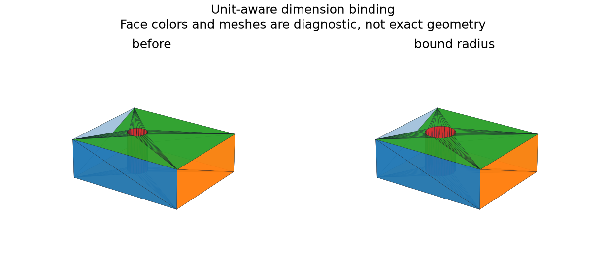

# Parameter Expressions, Units, and Domains

## 日本語概要

v0.62.0では、名前付き寸法式、単位変換、範囲、循環依存を検査します。長さと角度を区別し、式の原文と正規化値を保持します。17件の検査と穴半径への結合を検証します。詳細は英語本文に示します。

---

## English Summary

17 controls cover dimensional arithmetic, unit conversion, twelve rejection cases, and a bound radius edit.

## Question and Method

Can authored dimension expressions retain their spelling, unit meaning,
dependencies, and domain checks before they affect geometry?
Python's [AST interface](https://docs.python.org/3/library/ast.html) supplies
a syntax tree. The implementation interprets an allowlist; it never executes
the tree or calls `eval()`.

The grammar accepts numeric literals, names, parentheses, unary signs, and
`+ - * /`. Calls, attributes, indexing, powers, and implicit unit coercion
reject. A quantity carries independent length/angle exponents. Base units
are mm and rad; available literals are `mm`, `cm`, `m`, `inch`, `rad`, `deg`,
and dimensionless `one`. Addition requires equal dimensions. Multiplication
and division combine exponents.

Each parameter declares an output unit and inclusive range in that unit.
Names resolve in stable dependency order; duplicate/reserved names, missing
references, and cycles reject. Limits are 64 parameters, 256 characters per
expression, 96 AST nodes, magnitude at most 1e12 for intermediate quantities,
and dimension exponents within ±4.

## Results

| Expression | Base-unit result |
| --- | ---: |
| `width = 2 * inch` | 50.8 mm |
| `half = width / 2`, declared cm | 25.4 mm = 2.54 cm |
| `ratio = half / width` | 0.5 |
| `angle = 90 * deg` | π/2 rad |

Twelve invalid controls reject. A diameter of `0.3 * cm` binds its half
to a hole radius of 1.5 mm. The resulting plate volume matches
`480 − 9π` mm³ within 1e-7. All 17 checks pass.

The Python API exposes `evaluate_parameters` and `bind_model_parameters`.
Bindings are explicit triples of parameter name, model node, and field.
Unconfirmed reconstruction models reject editing, and a model length cannot
receive an angular quantity.

## Boundary

This is a small dimensional arithmetic language, not a general expression
engine or symbolic algebra system. It has no temperature, mass, user-defined
unit, function, implicit conversion, or external name lookup. Geometric
feature-domain checks still run after expression evaluation; a numerically
valid length can be an invalid feature dimension.

## Reproduction and Artifacts

```bash
python experiments/run_parameter_expressions.py
```

Default runs verify fixture bytes. Use `--fixture-dir` and `--output-dir`
with `--refresh-fixtures` to generate separate copies.

- [Fixture manifest](../fixtures/parameter-expressions/manifest.csv)
- [Observations](../results/parameter_expressions.csv)
- [Detailed records](../results/parameter_values.json)
- [Contract](../results/parameter_expressions_contract.json)
- [Implementation](../src/research_notes/parameter_expressions.py)
- [Experiment](../experiments/run_parameter_expressions.py)


