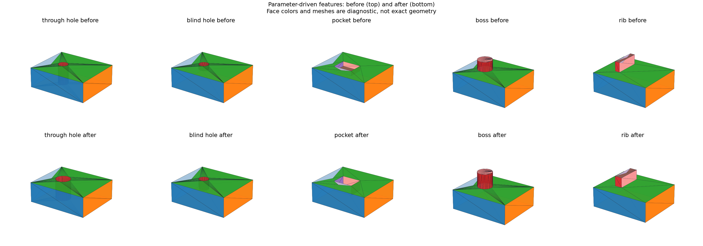

# Parametric Holes, Pockets, Bosses, and Ribs

## 日本語概要

v0.57.0では、v0.56.0の長方形・円スケッチから、貫通穴、止まり穴、ポケット、ボス、リブを構成します。5種類の変更前後10形状について、構成時とSTEP再読込後の計20観測を独立な体積・表面積の式で検証し、境界接触など5件の不適切な入力を拒否します。対応は軸に平行な板と内部の単独形状に限定します。詳細は英語本文に示します。

---

## English Summary

Ten shapes connect solved rectangle/circle profiles to five explicit feature
families. All 20 constructed/imported observations match independent volume
and surface-area truth within the declared absolute limits, retain topology
counts across STEP, and have a valid single solid. Five domain failures reject.
The result qualifies a small modeling grammar, not arbitrary CAD operations.

## Research Question

Can the local sketches studied in v0.56.0 drive parameterized B-Rep operations
whose dimension changes can be checked independently of the kernel?

## Method and Sources

[OCCT Boolean operations](https://occt3d.com/dev/doc/refman/html/class_b_rep_algo_a_p_i___fuse.html)
provide the construction mechanism; they are not the independent oracle.
The implementation uses the pinned `cadquery-ocp==7.9.3.1.1` route, serial
non-destructive booleans, operation completion, and B-Rep validity checks.

The base is a 12 × 10 × 4 mm plate. Rectangle and circle profiles are solved
using the [v0.56.0 sketch implementation](two-dimensional-sketches-geometric-constraints.md).
Solved coordinates are checkpointed to 12 decimal places before construction.
Tools cut from or fuse onto the plate; their footprints must lie strictly
inside its XY boundary. No face-index selection is needed.

| Feature | Changed dimension | Before → after (mm) |
| --- | --- | --- |
| Through hole | Radius | 1 → 1.5 |
| Blind hole | Depth | 1 → 2 |
| Rectangular pocket | Depth | 1 → 2 |
| Cylindrical boss | Height | 2 → 3 |
| Rectangular rib | Width | 1 → 1.5 |

For plate width W, length L, thickness T, the base volume is WLT and area is
2(WL + WT + LT). The following analytic increments apply to one isolated
interior feature, using radius r, rectangular width w, length l, depth d,
or height h as appropriate.

| Feature | Volume increment | Surface-area increment |
| --- | --- | --- |
| Through hole | −πr²T | 2πrT − 2πr² |
| Blind hole | −πr²d | 2πrd |
| Pocket | −wld | 2d(w + l) |
| Boss | +πr²h | 2πrh |
| Rib | +wlh | 2h(w + l) |

Both constructed and imported measurements must differ from truth by less
than 1e-7 mm³ for volume and 1e-7 mm² for area. Topology counts must agree.
STEP writer uncertainty is explicitly 1e-7 mm, so preceding in-process
writer activity cannot silently change the fixture uncertainty declaration.

## Results

| Check | Passed |
| --- | ---: |
| Constructed/imported truth observations | 20 / 20 |
| STEP shape round trips | 10 / 10 |
| Rejected domain violations | 5 / 5 |



Rejections cover a footprint touching the outer boundary, oversized radius,
removal of the entire blind-hole floor, negative boss height, and an outside
rib. Every accepted profile reports fully constrained status.

## Reproduction and Evidence

Install the repository's pinned geometry extra, then run from its root:

```bash
python experiments/run_parametric_features.py
python -m pytest -q tests/test_parametric_features.py
```

Default execution verifies existing fixture bytes. Use `--refresh-fixtures`
with a separate `--fixture-dir` to regenerate copies.

- [Authored parameters](../fixtures/parametric-features/parameters.json) and [digest manifest](../fixtures/parametric-features/manifest.csv)
- [Truth observations](../results/parametric_features.csv) and [rejections](../results/parametric_feature_rejections.csv)
- [Contract](../results/parametric_features_contract.json)
- [Feature implementation](../src/research_notes/parametric_features.py) and [experiment](../experiments/run_parametric_features.py)

## Limitations and Next Question

Dimensions must be finite, above 1e-4 and at most 1000 mm; origins are bounded
to ±10000 mm. Footprints have a strict 1e-4 mm interior margin and blind depths
retain a floor. These domains are implementation preconditions, not universal
manufacturing tolerances. Interacting features, arbitrary orientation, fillets,
general sketches, cross-kernel validation, and STEP preservation of constraints
or design intent are outside this evidence. The next study propagates changes
through an explicit dependency graph.
