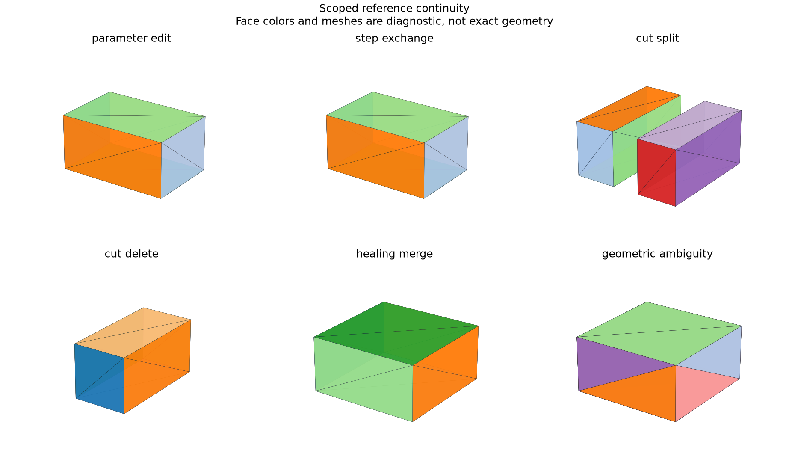

# Persistent Topological References

## 日本語概要

v0.61.0では、面・辺の選択を変更後の形状へ追跡します。6ケース・120関係で一対一、分割、統合、削除、曖昧さを記録し、一意に追跡できない選択は自動採用しません。詳細は英語本文に示します。

---

## English Summary

6 controls and 120 face/edge relations qualify box edits, STEP exchange, split, merge, deletion, and ambiguity.

## Question and Method

Can an application retain a selected face/edge across a qualified change
without confusing geometry similarity with permanent kernel identity?
[OCCT OCAF](https://github.com/Open-Cascade-SAS/OCCT/wiki/ocaf) describes
reference keys and shape evolution. This study implements a smaller scoped
reference record, not the general OCAF naming algorithm.

A reference has a caller-supplied owner, stable selection ID, snapshot ID,
kind, and local index. Snapshots bind a declared revision to a descriptor
digest. Matching requires the same owner and source snapshot.

For an unfeatured axis-aligned box, normalized vertex coordinates describe
six face and twelve straight-edge roles during dimension changes. STEP
matching compares the qualified planar/straight geometry. Actual Boolean
and same-domain-unification history establishes split, merge, or deletion.
Geometric ties remain ambiguous. Only a one-to-one transition advances
automatically; a merge requires an explicit `accept_merge=True` decision.

## Results

| Control | Relations | Outcome |
| --- | ---: | --- |
| Box dimensions changed | 18 | 18 one-to-one |
| STEP exchange | 18 | 18 one-to-one |
| Middle strip cut | 18 | 8 split, 10 one-to-one |
| Left region removed | 18 | 5 deleted, 13 one-to-one |
| Same-domain healing | 30 | 16 merge, 4 deleted, 10 one-to-one |
| Coincident duplicate geometry | 18 | 18 ambiguous |

All 120 relations match independently known control categories. Reference
IDs survive accepted transitions; split/deleted/ambiguous selections refuse
automatic adoption. STEP import does not preserve kernel object identity.

## Boundary

These are scoped, evidence-qualified references. Normalized roles support
only plain axis-aligned boxes. Geometric descriptors are not a proof for
arbitrary curved trims, reversed orientation, or general topology. The
caller supplies operation history for native evolution; no hidden history
is inferred after exchange. Assembly datums in v0.64.0 remain explicitly
authored and do not silently attach to an ambiguous geometric match.

## Reproduction and Artifacts

```bash
python experiments/run_topological_references.py
```

Default runs verify fixture bytes. Use `--fixture-dir` and `--output-dir`
with `--refresh-fixtures` to generate separate copies.

- [Fixture manifest](../fixtures/topological-references/manifest.csv)
- [Observations](../results/topological_references.csv)
- [Detailed records](../results/topological_reference_relations.json)
- [Contract](../results/topological_references_contract.json)
- [Implementation](../src/research_notes/topological_references.py)
- [Experiment](../experiments/run_topological_references.py)


