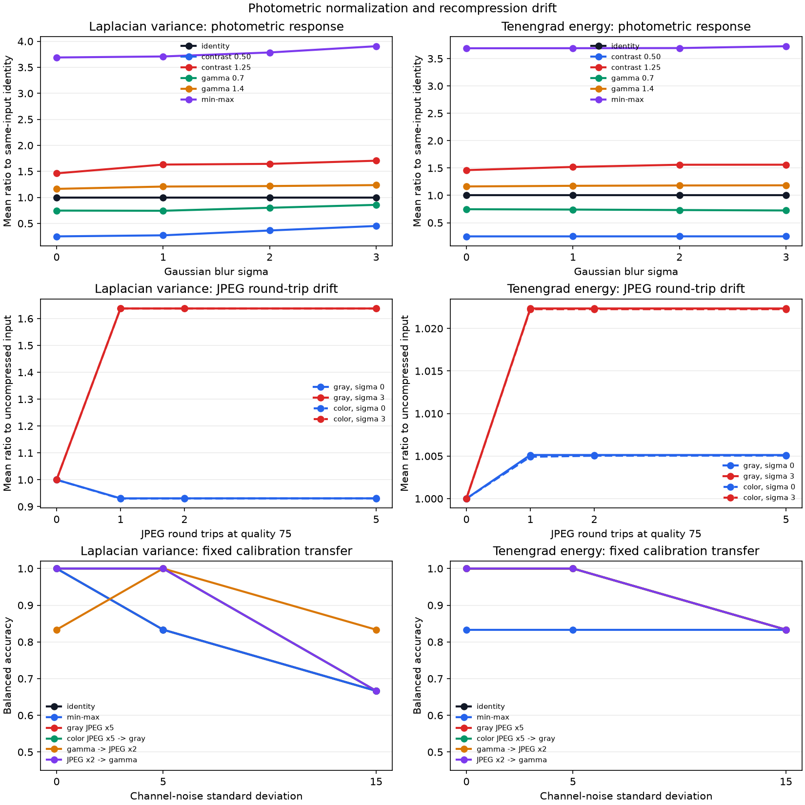

# Photometric Normalization and Recompression Drift

## Research Question

How do deterministic brightness, contrast, gamma, global min-max
normalization, repeated JPEG round trips, and grayscale-conversion order change
Laplacian variance and Tenengrad energy? If a decision boundary is calibrated
on clean, uncompressed grayscale inputs, which changes alter the score scale or
cause that fixed calibration to fail?

This note evaluates controlled sensitivity. It does not propose an absolute
focus or image-quality threshold.

## Background

Laplacian variance and Tenengrad energy are derivative-energy summaries. For a
linear transform without clipping or quantization, multiplying intensities by
`alpha` multiplies image derivatives by the same factor. Both tested scores
therefore scale approximately with `alpha squared`. Adding a constant leaves
interior derivatives unchanged in ideal arithmetic, but 8-bit clipping can
remove contrast near the range boundaries.

Gamma correction is nonlinear. Its local slope depends on the input intensity,
so it can change different edges by different amounts. Global min-max
normalization is also input-dependent: its gain is determined by the observed
minimum and maximum. Noise, clipping, or a single extreme value can therefore
change the scale applied to every pixel.

JPEG is a transform codec with quantization. A decoded image can contain edge,
block, and ringing changes that affect spatial derivative scores. Re-encoding
a decoded JPEG creates a compression history, but repeated encoding at the
same quality and aligned block grid does not imply a fixed amount of additional
damage per round. The image can approach an encoder-dependent fixed point.
Double-compression research also shows that compression history changes DCT
coefficient statistics; the metrics in this repository are not intended as
double-JPEG detectors.

## Method

The experiment uses the existing area-normalized definitions:

- **Laplacian variance:** population variance of the `CV_64F` OpenCV Laplacian
  response.
- **Tenengrad energy:** mean of squared 3 x 3 Sobel x and y responses in
  `CV_64F`.

Three 256 x 256 synthetic BGR patterns provide achromatic checks, chromatic
stripes, gradients, and geometric edges. Gaussian blur is applied in BGR space
at sigma 0, 1, 2, and 3. Independent Gaussian noise is then added to each BGR
channel at standard deviation 0, 5, or 15. Ten deterministic trials use seeds
derived from base seed `20261201`; the same noisy source is supplied to every
pipeline in a condition.

The 16 pipelines are:

- BGR-to-grayscale identity;
- brightness bias -30 and +30;
- contrast gain 0.50 and 1.25;
- gamma 0.7 and 1.4;
- global grayscale min-max normalization;
- grayscale JPEG quality 75 for 1, 2, and 5 round trips;
- BGR JPEG quality 75 for 1, 2, and 5 round trips, followed by grayscale;
- gamma 0.7 followed by two grayscale JPEG round trips; and
- two grayscale JPEG round trips followed by gamma 0.7.

Each score is divided by the identity score for the exact same synthetic input
to expose pipeline response. A separate fixed calibration uses, for each
pattern and metric, the midpoint between clean identity sigma-0 and sigma-3
scores. Scores below that midpoint are labeled blurred. Balanced accuracy is
reported only for the two endpoint classes; sigma 1 and 2 are used to check
adjacent ordering. This artificial calibration is a transfer probe, not an
operational quality rule.

## Controlled Experiment

Run the study from the repository root:

```bash
python experiments/run_photometric_recompression.py
```

The script validates declared relationships before writing:

- `results/photometric_recompression_trials.csv` with 11,520 metric
  observations;
- `results/photometric_recompression_response_summary.csv` with 384
  condition summaries;
- `results/photometric_recompression_calibration_anchors.csv` with six clean
  identity anchors;
- `results/photometric_recompression_calibration_summary.csv` with 96
  transfer summaries;
- `results/photometric_recompression_examples.png`; and
- `results/photometric_recompression_drift.png`.

The CSVs retain raw scores, paired identity ratios, sharp-anchor ratios,
clipped-endpoint fractions, fixed-threshold decisions, and blur-order checks.

## Results

### Photometric scale changes

The following values average the three patterns and ten deterministic noise-0
replicates. Replicates are exact within a pattern when noise is zero.

| Pipeline, clean condition | Laplacian ratio | Tenengrad ratio | Fixed-calibration balanced accuracy |
|---|---:|---:|---:|
| Contrast 0.50, sigma 0 | 0.250919 | 0.250680 | 0.500000 / 0.500000 |
| Contrast 1.25, sigma 0 | 1.462245 | 1.461963 | 1.000000 / 1.000000 |
| Gamma 0.7, sigma 0 | 0.746661 | 0.746952 | 1.000000 / 1.000000 |
| Gamma 1.4, sigma 0 | 1.164097 | 1.163448 | 1.000000 / 1.000000 |
| Min-max, sigma 0 | 3.689135 | 3.688885 | 1.000000 / 0.833333 |

The contrast-0.50 result closely follows the expected squared-gain response.
Its blur ordering remains perfect at noise 0, yet every sharp endpoint crosses
the unchanged identity midpoint. Score ordering and fixed calibration are
therefore different properties.

Min-max normalization expands the clean sharp scores by about 3.69 times in
this bounded pattern set. It also expands sigma-3 scores by 3.905305 for
Laplacian variance and 3.726228 for Tenengrad. The unchanged Tenengrad midpoint
misses one of the three designed blurred pattern classes, producing balanced
accuracy 0.833333. Normalization did not make the metric invariant; it changed
the metric input scale according to each image's extrema.

### Recompression response

For grayscale JPEG at quality 75, the first round changes the mean response as
follows:

| Condition | Laplacian ratio | Tenengrad ratio |
|---|---:|---:|
| Sigma 0 | 0.930825 | 1.005127 |
| Sigma 3 | 1.637515 | 1.022350 |

The same grayscale path is unchanged to six decimal places at rounds 2 and 5
for all four values in the table. In this implementation and synthetic set,
the first encode/decode cycle reaches a stable result for those aggregate
scores. Repeated compression must not be modeled as a guaranteed monotonic
loss in either metric.

The BGR-first path retains small additional changes for clean sharp inputs.
Its Laplacian ratio moves from 0.929815 at round 1 to 0.930283 at round 2 and
0.930611 at round 5; Tenengrad moves from 1.004917 to 1.005042 and 1.005059.
These differences are much smaller than the first-round response and depend on
the tested encoder and color path.

### Operation order and noise transfer

For clean sharp inputs, gamma-then-JPEG produces a Laplacian ratio of 0.679608,
while JPEG-then-gamma produces 0.701265. The corresponding Tenengrad ratios are
0.746670 and 0.751478. The clean Laplacian fixed-calibration balanced accuracy
is 0.833333 for gamma-then-JPEG and 1.000000 for the reverse order.

Noise causes another independent transfer failure. For the identity path,
Laplacian balanced accuracy changes from 1.000000 at noise 0 to 0.833333 at
noise 5 and 0.666667 at noise 15. Tenengrad remains 1.000000 at noise 5 and
falls to 0.833333 at noise 15. These are outcomes for three designed patterns,
not population accuracy estimates.



## Interpretation

Photometric processing changes what derivative metrics measure. A score can
retain the correct ordering across blur levels while a threshold fails because
the entire scale moved. Conversely, an apparent normalization can enlarge
both sharp and blurred scores without improving separation under a fixed rule.

The tested second-derivative measure reacts strongly to JPEG structure on the
already blurred inputs: its mean sigma-3 response rises by about 64% after one
quality-75 round trip. Tenengrad changes by about 2% in the same aggregate
comparison. This does not establish general superiority for Tenengrad; it is a
codec-, content-, implementation-, and parameter-specific sensitivity result.

The same-quality grayscale recompression trajectory is also informative
because it converges rather than continuing to drift. The color-first path and
gamma/JPEG ordering show that the surrounding pipeline still matters. A
compression count alone is not a sufficient pipeline description.

## Failure Modes

- **Gain transfer:** contrast changes rescale squared derivative metrics and
  move inputs across a threshold calibrated at another gain.
- **Clipping:** brightness or contrast adjustment can flatten saturated edges
  and make an otherwise simple point transform content-dependent.
- **Extrema-driven normalization:** min-max gain changes with noise, clipping,
  and outliers; it does not guarantee score comparability.
- **Nonlinear tone mapping:** gamma changes local contrast according to pixel
  intensity, so equal geometric edges need not receive equal score changes.
- **Compression artifacts:** quantization, block structure, or ringing can add
  derivative response without recovering optical detail.
- **False recompression assumptions:** identical quality and aligned grids can
  converge quickly, while different qualities or grids can behave differently.
- **Color-order drift:** compressing BGR before grayscale is not equivalent to
  compressing the already converted grayscale image.
- **Non-commuting operations:** tone mapping before a lossy codec can produce a
  different result from the reverse order.
- **Calibration conflation:** monotonic blur ordering does not imply that an
  old absolute decision boundary remains valid.

## Practical Guidance

- Version brightness, contrast, gamma, normalization, color conversion, codec,
  quality, recompression count, and operation order with the metric.
- Calibrate on the exact decoded pixel pipeline used at inference time.
- Keep paired same-input controls when evaluating preprocessing; raw score
  shifts alone do not identify whether blur separation improved.
- Inspect sharp false-blur and blurred-miss rates separately from ordering.
- Treat normalization parameters estimated from each image as data-dependent,
  and test sensitivity to extrema and noise.
- Do not infer optical improvement from a higher derivative score after JPEG,
  tone mapping, or normalization.
- Revalidate after codec-library or color-pipeline changes, even when the
  nominal JPEG quality remains constant.
- Derive any decision boundary from representative labeled data and declared
  costs; do not reuse the numeric values in this note as quality standards.

## Limitations

The experiment uses three synthetic 8-bit BGR patterns, one image size, one
Gaussian blur family, independent channel noise, one OpenCV grayscale
conversion, one global min-max rule, two brightness biases, two gains, two
gamma values, one JPEG quality, and same-size aligned recompression. JPEG
behavior is tied to the pinned OpenCV build and its codec implementation.

It does not test natural scenes, camera response functions, exposure metadata,
white balance, demosaicing, HDR tone mapping, color profiles, explicit chroma
sampling factors, different primary and secondary JPEG qualities, shifted JPEG
block grids, resizes between encodes, other codecs, or human focus judgments.
The BGR channel-noise model is not a calibrated sensor-noise model.

The synthetic pattern identity is known when constructing the midpoint rules.
Noise-free trials are repeated controls rather than independent samples.
Balanced accuracy over three patterns is descriptive and has no confidence or
population claim. No score, ratio, quality setting, or threshold is proposed as
a universal image-quality criterion.

## Sources

- [OpenCV: Changing the contrast and brightness of an image](https://docs.opencv.org/4.x/d3/dc1/tutorial_basic_linear_transform.html)
  documents the linear gain-and-bias transform, 8-bit saturation, and gamma
  mapping used in the controls.
- [OpenCV: Color Space Conversions](https://docs.opencv.org/4.x/d8/d01/group__imgproc__color__conversions.html)
  documents `COLOR_BGR2GRAY` and the supported conversion operation.
- [OpenCV: Image file reading and writing](https://docs.opencv.org/4.x/d4/da8/group__imgcodecs.html)
  documents the in-memory `imencode` and `imdecode` operations used for each
  JPEG round trip.
- [OpenCV: Image codec flags](https://docs.opencv.org/4.x/d8/d6a/group__imgcodecs__flags.html)
  documents `IMWRITE_JPEG_QUALITY` and its quality range.
- [ITU-T T.81](https://www.itu.int/ITU-T/recommendations/rec.aspx?id=2633)
  is the official recommendation for JPEG continuous-tone image coding.
- [Detection of Double-Compression in JPEG Images for Applications in Steganography](https://doi.org/10.1109/TIFS.2008.922456)
  is a primary publication showing that double JPEG compression changes DCT
  coefficient statistics and that the primary compression matters.
- [Analyzing the Effect of JPEG Compression on Local Variance of Image Intensity](https://doi.org/10.1109/TIP.2016.2553521)
  analyzes JPEG-dependent local intensity variance. Its statistic differs from
  Laplacian variance, so it supports a sensitivity concern rather than the
  specific values measured here.
- [Analysis of focus measure operators for shape-from-focus](https://doi.org/10.1016/j.patcog.2012.11.011)
  defines Tenengrad from squared Sobel responses and evaluates focus-measure
  sensitivity under controlled factors.
