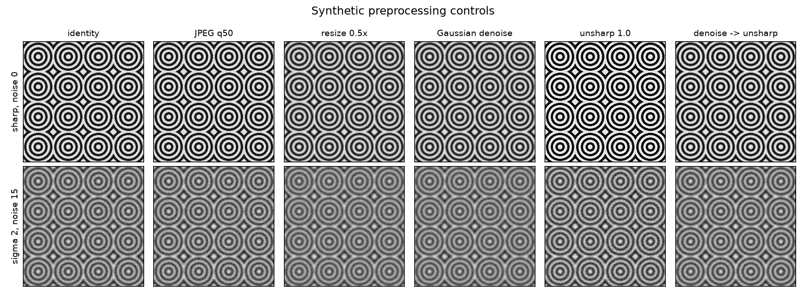
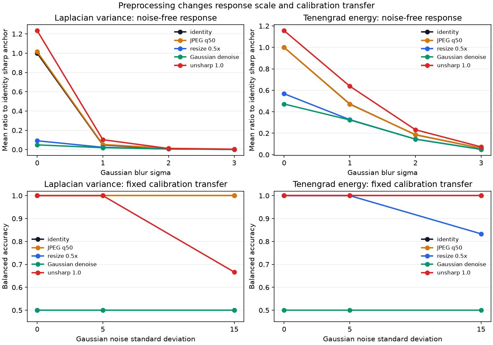

# Preprocessing Sensitivity and Calibration Drift

## Research Question

How do JPEG compression, resize interpolation, Gaussian denoising, unsharp
masking, and operation order change Laplacian variance and Tenengrad energy?
What fails when a controlled decision rule calibrated before preprocessing is
applied unchanged after the pipeline changes?

## Background

Laplacian variance and Tenengrad are derivative-energy measures. They respond
to image structure created or removed anywhere in the processing pipeline, not
only to optical focus. A low-pass filter removes noise and edge energy together.
Sharpening adds high-frequency contrast. Resize interpolation reconstructs a
new sample grid. Lossy JPEG coding can smooth coefficients while also creating
block and ringing structure.

The earlier notes controlled blur, noise, resize, spatial coverage, and window
geometry separately. This study treats preprocessing as part of the metric
definition and tests calibration transfer explicitly. The objective is not to
select one universally correct pipeline. It is to measure whether changing the
pipeline changes the question answered by a previously calibrated score.

OpenCV documents the codec parameters, interpolation methods, and filters used
here. The JPEG standard defines a coding process for continuous-tone images;
the `quality` parameter in this experiment is an OpenCV encoder setting, not a
portable physical scale shared by every codec implementation.

## Method

Three 256 x 256, 8-bit grayscale patterns are generated in code: a
checkerboard, vertical bars, and repeated concentric tiles. Gaussian blur sigma
values 0, 1, 2, and 3 are applied first. Seeded Gaussian noise with standard
deviation 0, 5, or 15 is added second. Preprocessing is applied last, matching
a pipeline in which a focus heuristic receives an already encoded, resized, or
enhanced image.

Thirteen pipelines are evaluated:

| Pipeline | Operation |
| --- | --- |
| `identity` | no preprocessing |
| `jpeg_q95` | JPEG quality 95 round trip |
| `jpeg_q75` | JPEG quality 75 round trip |
| `jpeg_q50` | JPEG quality 50 round trip |
| `resize_area_linear` | 0.5x `INTER_AREA` down, `INTER_LINEAR` up |
| `resize_linear_linear` | 0.5x `INTER_LINEAR` down and up |
| `gaussian_denoise` | Gaussian low-pass sigma 1 |
| `unsharp_0_5` | unsharp amount 0.5 with Gaussian sigma 1 |
| `unsharp_1_0` | unsharp amount 1.0 with Gaussian sigma 1 |
| `denoise_then_unsharp` | denoise followed by unsharp amount 1.0 |
| `unsharp_then_denoise` | the same operations in reverse order |
| `jpeg_then_resize` | JPEG quality 75 followed by area-linear resize |
| `resize_then_jpeg` | the same operations in reverse order |

The unsharp control uses `source + amount * (source - Gaussian(source))`, then
rounds and clips the result to the 8-bit range. JPEG is encoded and decoded in
memory. Every pipeline preserves the original image dimensions.

Two normalized responses are recorded:

1. The processed score divided by the identity score for the exact same blur,
   noise, pattern, and trial measures preprocessing-induced scale drift.
2. The processed score divided by the clean identity sharp score for the same
   pattern measures retained response relative to a controlled anchor.

### Synthetic calibration transfer

For each pattern and metric, the clean identity sigma-0 and sigma-3 scores form
two anchors. Their arithmetic midpoint is stored as a fixed decision rule:

```text
threshold = (identity sharp score + identity sigma-3 score) / 2
```

Only sigma 0 (`sharp`) and sigma 3 (`blurred`) are used to evaluate this binary
transfer check. The same per-pattern threshold is applied unchanged after each
preprocessing pipeline and noise condition. Balanced accuracy, sharp
false-blur rate, and blurred miss rate are reported.

This is deliberately favorable to calibration because the pattern identity is
known and receives its own threshold. It is a diagnostic of pipeline drift,
not a deployable rule. It is not an absolute quality threshold, and an unknown
image would not provide clean sharp and blurred anchors.

The evaluation also tests whether scores remain strictly decreasing across
adjacent blur sigma values 0 to 3. This separates endpoint classification from
the ordering of intermediate blur levels.

## Controlled Experiment

| Factor | Values |
| --- | --- |
| Synthetic pattern | checkerboard, vertical bars, concentric tiles |
| Image size | 256 x 256 pixels |
| Gaussian blur sigma | 0, 1, 2, 3 pixels |
| Gaussian noise standard deviation | 0, 5, 15 intensity units |
| Repetitions | 10 deterministic trials per raw condition |
| Preprocessing pipelines | 13 |
| Focus measures | Laplacian variance, area-normalized Tenengrad energy |
| Binary calibration anchors | identity, noise 0, sigma 0 and sigma 3 |

The factorial experiment contains 9,360 metric observations. It produces 312
response summaries, six transparent calibration-anchor rows, and 78
calibration-transfer summaries. There are 360 declared seeds; the noise-free
trials are identical but retain their seed records to keep the factorial table
regular.

Reproduce the artifacts from the repository root:

```bash
python -m pip install -e ".[test]"
python -m pytest
python experiments/run_preprocessing_sensitivity.py
```

## Results





### Sharp-image score scale

For clean sharp inputs, the mean processed-to-identity ratios across the three
patterns are:

| Pipeline | Laplacian ratio | Tenengrad ratio |
| --- | ---: | ---: |
| identity | 1.000000 | 1.000000 |
| JPEG quality 50 | 1.015323 | 1.000708 |
| resize area-linear | 0.091416 | 0.567999 |
| Gaussian denoise | 0.048873 | 0.472182 |
| unsharp amount 1.0 | 1.233627 | 1.156136 |

Resize and denoising strongly lower the same sharp image's derivative response.
Unsharp masking raises it. A score scale calibrated before these operations is
therefore not measuring on the same numeric support afterward.

### JPEG sensitivity

For sigma-3, noise-free inputs, JPEG changes the score relative to the same
uncompressed blurred input:

| JPEG quality | Laplacian ratio | Tenengrad ratio |
| ---: | ---: | ---: |
| 95 | 1.070669 | 1.003846 |
| 75 | 1.517602 | 1.010076 |
| 50 | 1.853677 | 1.011845 |

The mean Laplacian response rises as the declared quality is reduced in these
patterns, even though compression does not restore source detail. Tenengrad is
much less shifted in this bounded comparison. This is metric-specific artifact
sensitivity, not evidence that Tenengrad is generally compression-invariant.

### Fixed calibration transfer

Balanced accuracy from the per-pattern identity midpoint rule is:

| Pipeline | Noise | Laplacian | Tenengrad |
| --- | ---: | ---: | ---: |
| identity | 0 | 1.000000 | 1.000000 |
| identity | 15 | 1.000000 | 1.000000 |
| JPEG quality 50 | 0 | 1.000000 | 1.000000 |
| JPEG quality 50 | 15 | 1.000000 | 1.000000 |
| resize area-linear | 0 | 0.500000 | 1.000000 |
| resize area-linear | 15 | 0.500000 | 0.833333 |
| Gaussian denoise | 0 | 0.500000 | 0.500000 |
| Gaussian denoise | 15 | 0.500000 | 0.500000 |
| unsharp amount 1.0 | 0 | 1.000000 | 1.000000 |
| unsharp amount 1.0 | 15 | 0.666667 | 1.000000 |

The Laplacian failures after resize or denoising are all sharp false-blur
decisions: their clean sharp responses move below thresholds calibrated on
unprocessed inputs. With noise 15, unsharp amount 1.0 instead produces a
Laplacian blurred miss rate of 0.666667 because noise and enhancement lift the
blurred response.

Identity Laplacian still classifies both endpoint anchors correctly at noise
15, but its adjacent blur-order violation rate is 0.222222 and only 0.666667 of
the 30 pattern-trial sequences remain fully ordered. Correct endpoint decisions
do not guarantee stable ordering of intermediate blur levels.

### Operation order

Order changes the result even when the operation names and parameters are the
same. At noise 0, `denoise_then_unsharp` retains Tenengrad balanced accuracy
1.000000, while `unsharp_then_denoise` falls to 0.666667 through sharp
false-blur decisions. For sigma-3 Laplacian, `jpeg_then_resize` has a mean
same-input ratio of 0.815154, while `resize_then_jpeg` has 1.108079. Equal
endpoint classification in the latter pair therefore does not imply equal
score calibration.

## Interpretation

The preprocessing pipeline is part of the focus metric's operational
definition. Recording only `Laplacian variance` or `Tenengrad` is incomplete if
codec, resolution, interpolation, filtering, sharpening, clipping, and order
can change between calibration and use.

Denoising creates a predictable ambiguity: it removes noise but also removes
the derivatives measured as focus evidence. Sharpening creates the opposite
ambiguity by lifting noise and edge contrast without recovering the original
optical information. JPEG can add frequency structure that affects a
second-derivative metric more strongly than the tested first-derivative metric.

Calibration transfer and monotonic ordering are separate checks. A midpoint
can still separate the two endpoint anchors while intermediate blur levels
change order. Conversely, an ordering can remain correct while the entire score
scale moves across a fixed threshold.

Operation order matters because these transformations are not interchangeable.
Clipping, quantization, interpolation, and filtering discard or create
different information before the next operation receives the image.

## Failure Modes

- **Unrecorded pipeline changes:** the same threshold is applied after a codec,
  resolution, or filter change that altered the score scale.
- **Denoising false blur:** a sharp input loses derivative energy and crosses a
  threshold calibrated before smoothing.
- **Sharpening blur miss:** enhanced edges or noise lift a blurred input above
  the fixed decision boundary.
- **Compression artifacts:** block or ringing structure contributes derivative
  energy that is not recovered optical detail.
- **Resize drift:** resampling changes edge width, contrast, and derivative
  support even when the image returns to its original dimensions.
- **Order dependence:** two pipelines with the same operations produce
  different scores because the transformations do not commute.
- **Endpoint-only validation:** sigma 0 and sigma 3 remain separated while
  intermediate levels lose their expected order.
- **Content-specific calibration:** the per-pattern thresholds used here are
  unavailable for unknown content and conceal cross-pattern scale differences.

## Practical Guidance

- Calibrate after the complete production preprocessing pipeline, not on raw
  images if the metric will receive encoded or enhanced images.
- Treat codec, quality setting, resize dimensions, interpolation, denoising,
  sharpening, clipping, and operation order as versioned metric parameters.
- Re-run calibration-transfer tests whenever any preprocessing dependency or
  parameter changes.
- Evaluate score drift, endpoint decisions, and intermediate ordering
  separately; none of them proves the others.
- Preserve preprocessed examples beside numeric summaries so artifact-driven
  responses remain visually reviewable.
- Stratify validation by texture, noise, and acquisition conditions instead of
  transferring one threshold from the synthetic values in this note.
- Prefer raw or consistently normalized inputs when operational constraints
  allow them, while still documenting the exact normalization.

## Limitations

The experiment uses three periodic grayscale patterns, one resolution, Gaussian
blur, clipped additive Gaussian noise, three JPEG quality values, one resize
scale, two interpolation pairs, one Gaussian denoise strength, and two unsharp
amounts. JPEG behavior is tied to the pinned OpenCV build and its codec. The
study does not test repeated recompression, chroma subsampling choices, color
conversion, camera pipelines, demosaicing, exposure, contrast normalization,
learned restoration, natural images, or human focus judgments.

The midpoint thresholds use known pattern identities and synthetic clean
anchors. Repeated noise-free trials are not independent samples. Balanced
accuracy is reported over three designed patterns and is not a population
accuracy estimate. No score, ratio, JPEG setting, or midpoint is proposed as a
universal image-quality threshold.

## Sources

- [OpenCV: Image file reading and writing](https://docs.opencv.org/4.x/d4/da8/group__imgcodecs.html)
  documents the in-memory `imencode` and `imdecode` operations used for JPEG
  round trips.
- [OpenCV: Image codec flags](https://docs.opencv.org/4.x/d8/d6a/group__imgcodecs__flags.html)
  documents `IMWRITE_JPEG_QUALITY` and other format-specific parameters.
- [OpenCV: Geometric Image Transformations](https://docs.opencv.org/4.x/da/d54/group__imgproc__transform.html)
  documents `resize` and the interpolation methods used in the two round-trip
  controls.
- [OpenCV: Smoothing Images](https://docs.opencv.org/4.x/d4/d13/tutorial_py_filtering.html)
  describes low-pass filtering, noise removal, and the associated loss of
  high-frequency edge content.
- [ITU-T T.81](https://www.itu.int/ITU-T/recommendations/rec.aspx?id=2633)
  is the official recommendation for JPEG continuous-tone image coding.
- [Analyzing the Effect of JPEG Compression on Local Variance of Image Intensity](https://doi.org/10.1109/TIP.2016.2553521)
  analyzes how JPEG quantization changes local intensity variance. Its measure
  is not Laplacian variance, but it supports treating variance statistics as
  compression-dependent rather than invariant.
- [Analysis of focus measure operators for shape-from-focus](https://doi.org/10.1016/j.patcog.2012.11.011)
  evaluates focus measures under controlled factors including noise and
  motivates checking robustness under the intended processing conditions.
