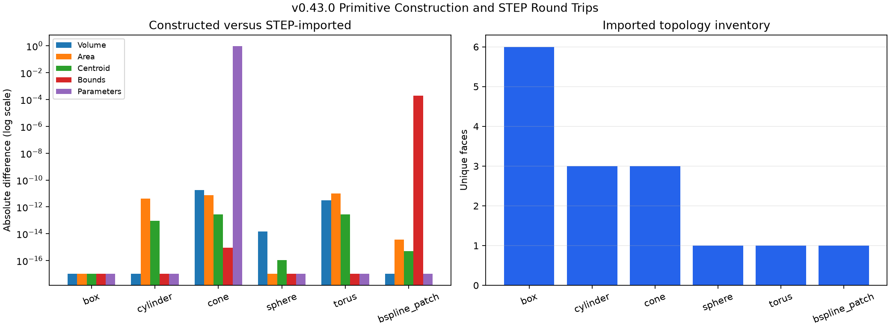
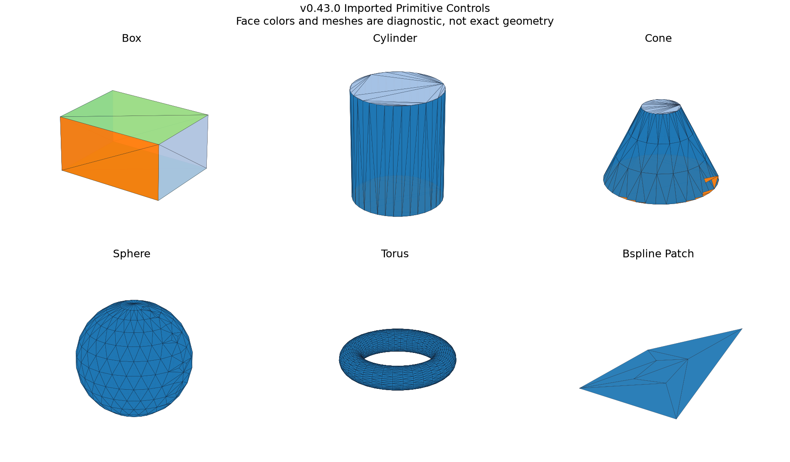

# Primitive Construction and STEP Round Trips

## 日本語概要

v0.43.0では、箱、円柱、円すい台、球、トーラス、Bスプライン面を既知のパラメーターから構築し、STEP出力・再読込後の位相数、曲面種類、体積、表面積、重心、境界、公差、曲面パラメーターを比較します。6形状すべてが有効な形状として再読込され、位相数と曲面構成を保持しました。一方、円すいの半角符号は同値な媒介化によって反転し、Bスプライン面では面公差の正規化により境界箱が約0.0001999変化しました。構築パラメーターは合成真値であり、STEPから復元した設計履歴ではありません。詳細は以下の英語本文を参照してください。

---

## English Summary

This study constructs six controlled primitives and surfaces, exports them to
normalized STEP fixtures, re-imports them, and compares topology, support
surfaces, measurements, tolerances, bounds, and selected surface parameters.
All six routes remain kernel-valid and preserve topology and surface
inventories. Four satisfy the strict literal round-trip contract. The cone
retains its geometry while changing the sign of an equivalent semi-angle
parameterization, and the raised B-spline face tolerance is normalized during
exchange, changing tolerance-inflated bounds. Construction truth is retained
outside the STEP result and is not presented as recovered feature history.

## Research Question

Which properties of parameter-controlled primitives survive one STEP
export/import cycle, and which apparently simple fields depend on
parameterization or tolerance representation rather than geometric identity?

## Background

A modeling tool begins with explicit construction parameters. A STEP reader,
however, receives a product representation and boundary geometry, not the
original command that created it. Comparing only screenshots or face counts
would conflate several different preservation questions.

This study separates:

1. synthetic construction parameters;
2. independently known analytic volume and area;
3. kernel-evaluated topology and geometry;
4. normalized STEP exchange structure; and
5. imported support-surface parameterization and tolerances.

The official Open CASCADE primitive APIs define boxes and one-axis rotational
primitives as construction algorithms. The STEP controller translates shapes
to and from exchange data. Neither interface promises recovery of the original
modeling command or persistent local topology identifiers.

## Source Review

- [`BRepPrimAPI_MakeBox`](https://dev.opencascade.org/doc/refman/html/class_b_rep_prim_a_p_i___make_box.html)
  constructs axis-aligned or locally oriented boxes and rejects flat input.
- [`BRepPrimAPI_MakeCylinder`](https://dev.opencascade.org/doc/refman/html/class_b_rep_prim_a_p_i___make_cylinder.html),
  [`BRepPrimAPI_MakeCone`](https://dev.opencascade.org/doc/refman/html/class_b_rep_prim_a_p_i___make_cone.html),
  [`BRepPrimAPI_MakeSphere`](https://dev.opencascade.org/doc/refman/html/class_b_rep_prim_a_p_i___make_sphere.html),
  and [`BRepPrimAPI_MakeTorus`](https://dev.opencascade.org/doc/refman/html/class_b_rep_prim_a_p_i___make_torus.html)
  construct complete or angularly limited one-axis primitives.
- [`BRepBuilderAPI_MakeFace`](https://dev.opencascade.org/doc/refman/html/class_b_rep_builder_a_p_i___make_face.html)
  creates a face from the generated B-spline surface.
- [`STEPControl_Writer`](https://dev.opencascade.org/doc/refman/html/class_s_t_e_p_control___writer.html)
  and [`STEPControl_Reader`](https://dev.opencascade.org/doc/refman/html/class_s_t_e_p_control___reader.html)
  provide the bounded exchange route used by the experiment.
- [`BRepGProp`](https://dev.opencascade.org/doc/refman/html/class_b_rep_g_prop.html)
  supplies evaluated surface and volume properties independently of the STEP
  entity inventory.

## Method

### Controls

| Control | Parameters | Independent truth |
| --- | --- | --- |
| Box | `4 × 3 × 2` | volume `24`, area `52` |
| Cylinder | radius `2`, height `5` | volume `20π`, area `28π` |
| Conical frustum | radii `3`, `1`, height `4` | analytic frustum volume and area |
| Sphere | radius `2.5` | analytic sphere volume and area |
| Torus | major radius `4`, minor radius `1` | volume `8π²`, area `16π²` |
| B-spline patch | `4 × 4` poles | no independent closed-form area claim |

Each constructed shape is measured, written to a narrowly normalized STEP
fixture, read back, and measured again. The experiment records unique
vertex/edge/face/shell/solid counts, support-surface inventory, volume, area,
surface centroid, tolerance-inflated bounds, maximum subshape tolerances,
selected support parameters, STEP entity counts, and analyzer validity.

The strict literal contract requires all recorded topology, geometry, bounds,
and support parameters to agree within `1e-8`. A contract failure is evidence
of representation drift; it does not automatically mean the boundary shape is
geometrically different.

## Results



All six controls preserve unique topology counts and surface-family counts.
All constructed and imported observations are accepted by the kernel analyzer.
The five analytic solids agree with independent volume and area truth within
`2e-8` at both stages.

| Control | Topology preserved | Largest relevant observation |
| --- | ---: | --- |
| Box | yes | literal residuals are zero |
| Cylinder | yes | area difference `4.14e-12` |
| Conical frustum | yes | semi-angle changes from `-0.4636476` to `+0.4636476` radians |
| Sphere | yes | volume difference `1.42e-14` |
| Torus | yes | area difference `1.03e-11` |
| B-spline patch | yes | bounds change by `0.0001999` as face tolerance is normalized |

Four of six controls pass the intentionally literal contract. The other two
are retained as interpretable counterexamples rather than coerced to pass.



## Interpretation

Primitive creation from explicit parameters is reproducible, and geometric
measurements survive this controlled exchange route closely. But parameter
fields do not have one universal identity rule. The cone's signed semi-angle
depends on an equivalent axis convention. The B-spline's visible support
surface remains the same while a local face tolerance changes and therefore
changes the tolerance-expanded bounding box.

A future modeling API should store the user's feature parameters in its own
versioned model. STEP geometry can validate or replace the evaluated result,
but it should not be silently treated as proof of the original construction
command.

## Failure Modes

- Equating identical topology counts with identical geometry.
- Equating signed surface parameters without normalizing equivalent frames.
- Comparing tolerance-inflated bounds as if they were exact geometric extrema.
- Claiming a closed-form B-spline area truth that was not independently
  derived.
- Treating generated STEP bytes as a stable semantic serialization.
- Treating local face or edge order as persistent identity.

## Practical Guidance

1. Store construction parameters separately from the evaluated B-Rep.
2. Compare analytic truth, evaluated geometry, topology, tolerances, and STEP
   structure as distinct layers.
3. Normalize equivalent surface frames before declaring parameter drift.
4. Record exact and tolerance-expanded bounds separately in production tools.
5. Preserve the source fixture hash and backend version with every result.

## Limitations

- The corpus contains six small generated controls on one pinned Linux x64
  OCCT route.
- Only one export/import cycle is evaluated.
- The study does not preserve feature history, sketches, dimensions, names,
  colors, assemblies, or semantic product structure.
- B-spline area and extrema are kernel observations rather than independently
  certified truth.
- Cross-kernel portability and alternate STEP mappings remain untested.
- Preview meshes are diagnostic and are not exact B-Rep geometry.

## Questions Raised

1. Which equivalent-frame normalization should define a stable analytic
   surface contract?
2. Should exact geometric bounds be added beside tolerance-expanded bounds?
3. How should a future parametric model bind its own feature identity to a
   replaceable evaluated B-Rep result?

## Reproduction

```bash
python -m pip install -e ".[geometry,test]"
python experiments/run_primitive_round_trips.py
python -m pytest tests/test_primitive_round_trips.py
```

## Sources

- [Open CASCADE `BRepPrimAPI_MakeBox` reference](https://dev.opencascade.org/doc/refman/html/class_b_rep_prim_a_p_i___make_box.html)
- [Open CASCADE `BRepPrimAPI_MakeCylinder` reference](https://dev.opencascade.org/doc/refman/html/class_b_rep_prim_a_p_i___make_cylinder.html)
- [Open CASCADE `BRepPrimAPI_MakeCone` reference](https://dev.opencascade.org/doc/refman/html/class_b_rep_prim_a_p_i___make_cone.html)
- [Open CASCADE `BRepPrimAPI_MakeSphere` reference](https://dev.opencascade.org/doc/refman/html/class_b_rep_prim_a_p_i___make_sphere.html)
- [Open CASCADE `BRepPrimAPI_MakeTorus` reference](https://dev.opencascade.org/doc/refman/html/class_b_rep_prim_a_p_i___make_torus.html)
- [Open CASCADE `BRepBuilderAPI_MakeFace` reference](https://dev.opencascade.org/doc/refman/html/class_b_rep_builder_a_p_i___make_face.html)
- [Open CASCADE `STEPControl_Writer` reference](https://dev.opencascade.org/doc/refman/html/class_s_t_e_p_control___writer.html)
- [Open CASCADE `STEPControl_Reader` reference](https://dev.opencascade.org/doc/refman/html/class_s_t_e_p_control___reader.html)
- [Open CASCADE `BRepGProp` reference](https://dev.opencascade.org/doc/refman/html/class_b_rep_g_prop.html)

