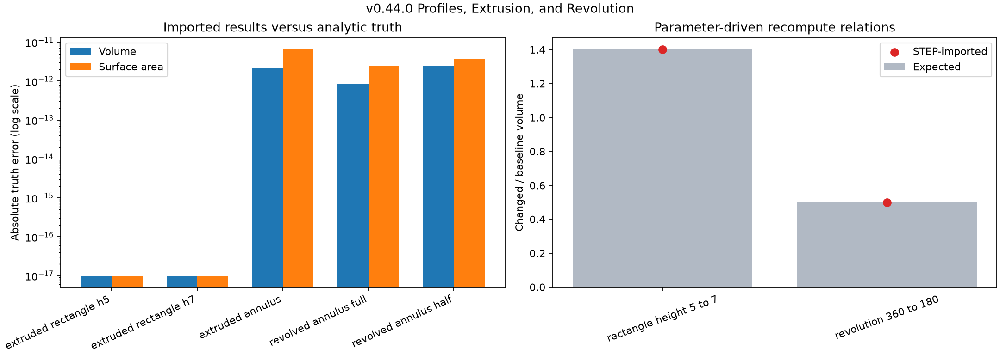
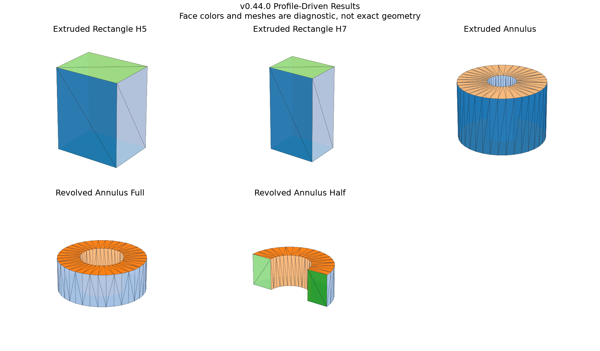

# Profiles, Extrusion, and Revolution

## 日本語概要

v0.44.0では、長方形と穴付き円環の輪郭を押し出し、半径方向の長方形輪郭を360度と180度で回転します。5個の結果を構築直後とSTEP再読込後に評価し、10件すべてが解析真値、位相、曲面構成を保持しました。押出し高さを5から7へ変えた体積比1.4と、回転角を360度から180度へ変えた体積比0.5も両段階で再現します。穴を表す内周は外周と逆向きでなければならず、輪郭方向を形状意味の一部として扱います。詳細は以下の英語本文を参照してください。

---

## English Summary

This study constructs five profile-driven solids: two rectangular extrusions,
one annular extrusion with an inner wire, and full and half annular
revolutions. Every constructed and STEP-imported result is kernel-valid,
matches independent analytic volume and area, and preserves topology and
surface inventories. Two one-parameter recompute relations retain the expected
volume ratios. The annulus control also demonstrates that wire orientation is
part of the bounded profile contract rather than incidental point order.

## Research Question

Can explicit two-dimensional profile truth be carried through extrusion,
revolution, parameter recompute, and STEP exchange without being confused with
feature history recovered from the final B-Rep?

## Background

An extrusion translates a generating shape along a vector. A revolution
rotates a generating shape around an axis. Both algorithms can generate
topology from a face, but the result alone does not prove which sketch,
dimension, or feature command produced it.

The official prism API describes linear sweep construction and exposes a
choice to copy the input and canonicalize simple generated surfaces. The
revolution API accepts a generating shape, axis, angle, and copy flag. The
profile face builder accepts wires; correct material interpretation requires
the inner boundary orientation to oppose the outer boundary.

## Source Review

- [`BRepPrimAPI_MakePrism`](https://dev.opencascade.org/doc/refman/html/class_b_rep_prim_a_p_i___make_prism.html)
  constructs a linear swept topology from a generating shape and vector.
- [`BRepPrimAPI_MakeRevol`](https://dev.opencascade.org/doc/refman/html/class_b_rep_prim_a_p_i___make_revol.html)
  constructs a rotational sweep from a generating shape, axis, and angle.
- [`BRepBuilderAPI_MakeFace`](https://dev.opencascade.org/doc/refman/html/class_b_rep_builder_a_p_i___make_face.html)
  builds bounded faces and accepts additional wires.
- [`BRepBuilderAPI_MakeWire`](https://dev.opencascade.org/doc/refman/html/class_b_rep_builder_a_p_i___make_wire.html)
  assembles connected edges into profile boundaries.
- [`BRepBuilderAPI_MakeShape`](https://dev.opencascade.org/doc/refman/html/class_b_rep_builder_a_p_i___make_shape.html)
  is the common construction root and defines deferred topology-history
  interfaces; their availability varies by concrete algorithm.

## Method

| Control | Profile | Operation | Independent volume truth |
| --- | --- | --- | ---: |
| Rectangle h5 | `4 × 3` | extrusion by `5` | `60` |
| Rectangle h7 | `4 × 3` | extrusion by `7` | `84` |
| Annulus | radii `3` and `1` | extrusion by `4` | `32π` |
| Full annular revolution | radii `2` and `4`, height `3` | `360°` | `36π` |
| Half annular revolution | same profile | `180°` | `18π` |

The annular extrusion uses one outer and one oppositely oriented inner wire.
The revolution profile is a rectangle in the radial-height plane. Every result
is measured before STEP export and after re-import.

Two recompute relations change exactly one declared parameter:

- height `5 -> 7`, expected volume ratio `1.4`;
- revolution angle `360° -> 180°`, expected volume ratio `0.5`.

## Results



All ten stage observations are analyzer-valid. All five pairs retain topology
and support-surface inventories, and all volume and area errors are below
`1e-8`. The largest constructed/imported area difference is below `7e-12`.

Both recompute relations match their expected ratios at the constructed and
STEP-imported stages. The half revolution adds two radial planar end faces,
increasing the face count from four to six while halving material volume.



## Interpretation

The experiment demonstrates a small but complete modeling loop: explicit
profile parameters produce a B-Rep, one parameter changes, the result
recomputes, and the evaluated geometry survives STEP exchange. The construction
truth remains in the experiment contract rather than being inferred from the
imported face arrangement.

Wire direction is not cosmetic. An inner loop added with the outer loop's
orientation can represent overlapping positive material and produce an invalid
constructed face. Reversing the inner wire establishes the intended hole
before any exchange normalization occurs.

## Failure Modes

- Treating an inner wire as an unordered list of points.
- Inferring sketch dimensions or feature commands from final face counts.
- Reusing a mutable profile without recording copy and canonicalization flags.
- Comparing full and partial revolutions without accounting for radial end
  faces.
- Treating successful STEP import as proof that the constructed source was
  valid before export.

## Practical Guidance

1. Store profile loops, directions, dimensions, operation type, and operation
   parameters as versioned model data.
2. Validate the constructed B-Rep before STEP export.
3. Recompute from explicit parameters rather than editing positional faces.
4. Compare analytic truth and imported measurements independently.
5. Treat STEP as evaluated geometry exchange, not silent sketch recovery.

## Limitations

- Only planar rectangle, annulus, and radial-rectangle profiles are covered.
- Only straight extrusion and one fixed revolution axis are evaluated.
- No sketch constraint solver, arcs in mixed profiles, open-wire surface
  sweep, taper, draft, thin feature, or self-intersecting profile is included.
- The two recompute relations do not establish a general dependency graph.
- One pinned Linux x64 OCCT route is not cross-kernel evidence.

## Questions Raised

1. Which profile checks should reject open, self-crossing, duplicated, or
   inconsistently oriented loops before native-kernel execution?
2. How should a parametric model identify a profile when generated face order
   changes after recompute?
3. Which continuity and compatibility contracts are needed for multiple
   moving sections rather than one rigid profile?

## Reproduction

```bash
python -m pip install -e ".[geometry,test]"
python experiments/run_profile_modeling.py
python -m pytest tests/test_profile_modeling.py
```

## Sources

- [Open CASCADE `BRepPrimAPI_MakePrism` reference](https://dev.opencascade.org/doc/refman/html/class_b_rep_prim_a_p_i___make_prism.html)
- [Open CASCADE `BRepPrimAPI_MakeRevol` reference](https://dev.opencascade.org/doc/refman/html/class_b_rep_prim_a_p_i___make_revol.html)
- [Open CASCADE `BRepBuilderAPI_MakeFace` reference](https://dev.opencascade.org/doc/refman/html/class_b_rep_builder_a_p_i___make_face.html)
- [Open CASCADE `BRepBuilderAPI_MakeWire` reference](https://dev.opencascade.org/doc/refman/html/class_b_rep_builder_a_p_i___make_wire.html)
- [Open CASCADE `BRepBuilderAPI_MakeShape` reference](https://dev.opencascade.org/doc/refman/html/class_b_rep_builder_a_p_i___make_shape.html)

