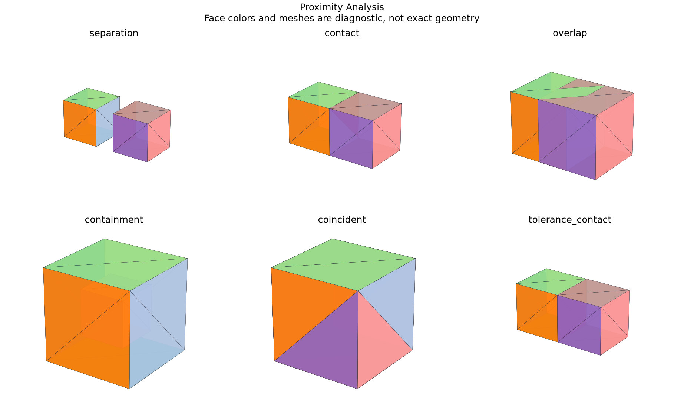

# Distance, Contact, Interference and Clearance

## 日本語概要

v0.72.0では距離・接触・干渉・クリアランスを実装し、6件の限定した合成条件を検証しました。入力・判断根拠・結果をCSV、JSON、図、再生成可能なサンプルに残しています。

検証範囲と失敗例は以下の英語本文に示します。一般のCADデータへの適用や完全な規格適合を主張するものではありません。

---

## English Summary

Minimum distance and common volume answer different questions. Containment is reported separately and never represented as a negative distance. Required clearance uses explicit length tolerance; overlap classification uses a separate volume tolerance. Witnesses are analysis-local and capped at 64 with a truncation flag. Both inputs must pass solid validity/closure/orientation checks; swept collision and penetration depth remain outside the API.

## Results and Interpretation

Six box-pair controls distinguish a 1 mm separation, touching, 4 mm3 penetration, containment, coincident material and a 5e-8 mm tolerance-sensitive near-contact. Each observation retains witness points and support subshape indices.

The 6 `checks_pass` observations check the declared expectation, including
expected rejections and recorded learning failures. They do not mean that every
input was accepted or every learned prediction was correct.

## Sources and Implementation Boundary

The mass/solid admission gates follow the same [OCCT geometry-property boundary](https://occt3d.com/dev/doc/refman/html/class_b_rep_g_prop.html) used in v0.71; pair truth in this experiment comes from independent cuboid arithmetic.

- distance and common volume are separate; containment does not become a negative distance
- analysis-local support subshapes and witness points are retained with transform provenance
- classification uses separate length and volume tolerances; penetration depth is not estimated

## Reproduction and Artifacts

Run from the repository root in the pinned geometry environment:

```bash
python experiments/run_proximity_analysis.py
```

Default runs verify fixture bytes. To regenerate into separate directories:

```bash
python experiments/run_proximity_analysis.py --output-dir output/proximity-analysis --fixture-dir output/fixtures/proximity-analysis --refresh-fixtures
```

- [Observations](../results/proximity_analysis.csv)
- [Detailed evidence](../results/proximity_analysis_evidence.json)
- [Contract and limits](../results/proximity_analysis_contract.json)
- [Fixture manifest](../fixtures/proximity-analysis/manifest.csv)
- [Experiment](../experiments/run_proximity_analysis.py)
- [Implementation](../src/research_notes/engineering_studies.py)


