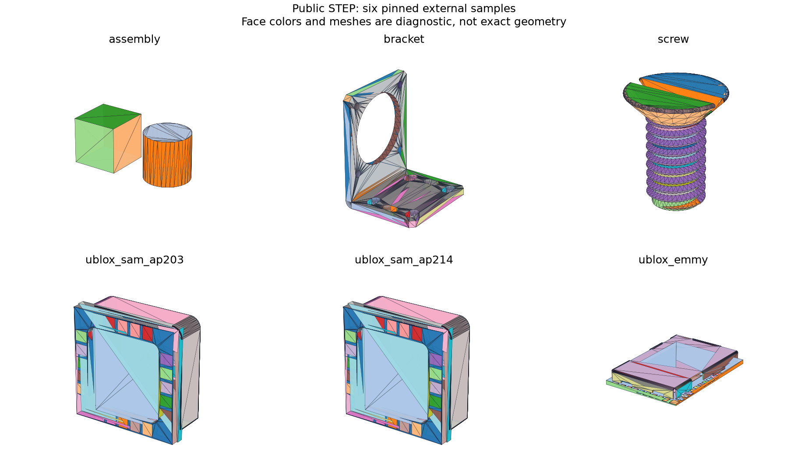

# Public STEP Validation and Inspection Coverage

## 日本語概要

v0.81.0では、CadQuery・build123d・u-bloxの公開STEPを6件追加しました。元データ、取得元URL、固定コミット、SHA-256、ライセンス原文を保存し、通常の検証はネットワークなしで再現できます。

検査専用の入口は、複数ルート・複数ソリッド・24面を超える形状と、明示的な単位換算に対応します。6件とも読込と再出力後の計測値比較は通りました。SAMは各57面で厳しいp-curve検査に不一致があり、EMMYは399面中256面を解析した部分結果です。編集履歴の復元やAP203/AP214の意味解釈は未対応のまま表示します。詳細は英語本文に示します。

---

## English Summary

Six byte-preserved upstream STEP files from three projects add five external
part families to the previously synthetic coverage. A new explicit inspection
route handles multiple roots, multiple solids, complex surfaces and uniform
SI/conversion-based length contexts, normalized into millimetres. It does not
relax the confirmed reconstruction/editing contract.

## Question and Method

Which existing contracts survive small, publicly redistributable STEP files?
Selection was based on explicit upstream permissions, manageable file sizes
(18–503 kB), source-unit differences, geometric complexity, and AP declarations.
All six chosen files remain in the results; failures were not filtered out.
The SAM AP203/AP214 pair counts as one family. No external file is used for
learning, calibration or a claimed generalization score.

1. Verify each STEP and license/notice against its pinned SHA-256 and size.
2. Parse bounded bytes and retain schema/application/PMI status independently.
3. Validate local length-unit reference chains, including positive factors,
   length dimensions, missing references, cycles and a maximum eight-unit chain.
   Uniform metre/centimetre/millimetre SI units and conversion chains terminating
   in them are accepted. Mixed scales are refused. Unit names are not evidence.
4. Transfer every root with OCCT explicitly targeting millimetres; inspect native
   validity, topology, surface inventory and bounded per-face observations.
5. Integrate each closed outward solid at an explicitly hypothetical density of
   1 kg/m³. This is a computational reference, not a material or assembly mass.
6. Re-export geometry and reimport with the same kernel. Require native validity,
   identical topology counts, volume/area differences at most max(1e-6, value ×
   1e-6), and bounds difference at most 1e-4 mm. Preserve the observed residuals.
7. Attempt the original reconstruction route separately and record its refusals.

The original input bytes and headers are never normalized. The existing writer
normalizes volatile headers only in generated derivative exports. No derivative
STEP is included as a replacement for the original files.

## Results and Interpretation

| Sample | Roots | Solids | Faces | Face observations | Strict trim failures | Geometry round trip |
| --- | ---: | ---: | ---: | --- | ---: | --- |
| CadQuery cube/cylinder | 2 | 2 | 9 | Complete | 0 | Verified invariants |
| build123d NEMA-17 bracket | 1 | 1 | 42 | Complete | 0 | Verified invariants |
| build123d M6 screw | 1 | 1 | 28 | Complete | 0 | Verified invariants |
| u-blox SAM AP203 | 1 | 3 | 98 | Complete | 57 | Verified invariants |
| u-blox SAM AP214 | 1 | 3 | 98 | Complete | 57 | Verified invariants |
| u-blox EMMY-W1 | 1 | 54 | 399 | Partial: 256/399 | 0 in visited faces | Verified invariants |

The two-root CadQuery input encodes metres via a conversion unit. Its transferred
volume agrees with the independent formula for a 10-mm cube plus a radius-5,
height-10 cylinder: 1000 + 250π mm³. This control detects a 1000-fold length-scale
mistake without relying only on importer/exporter agreement.

SAM's maximum sampled p-curve discrepancy is approximately 0.000252686 mm,
above the strict 0.000001-mm trim threshold. All inspected wires still pass
kernel closure and orientation checks, and the native shape is valid. These
observations are kept distinct: the strict sampled check fails, without claiming
that the vendor model is unusable or silently relaxing its threshold. Both AP
variants have equal measured volume and area; this is not semantic equivalence.

EMMY contains 54 solids and 399 faces. All solids pass the per-solid measurement
gate, but 143 faces are omitted from detailed analysis by the default face budget.
No unvisited face is counted as checked. The screw contains B-splines, cones and
surfaces of revolution. Its volume/area round-trip differences are approximately
5.311e-6 mm³ and 9.369e-6 mm² respectively, within the declared relative limits.

All six retain `unsupported_schema` for AP application semantics and zero
editable reconstruction candidates. `checks_pass` means agreement with frozen
reviewed observations, including unsupported and partial outcomes. It does not
mean every operation passed or that the original CAD authors certified our result.

## Sources and License Evidence

- [CadQuery source at the pinned revision](https://github.com/CadQuery/cadquery/blob/c11b3f93278bb25053991f7071451f71664c90fc/tests/testdata/red_cube_blue_cylinder.step), under its [retained Apache-2.0 license](../fixtures/public-step-corpus/licenses/cadquery/LICENSE).
- [build123d pinned source tree](https://github.com/gumyr/build123d/tree/17999d509ea0b08a6b45cb9bf71f6a7c9cc5dbc1/docs), with [Apache-2.0](../fixtures/public-step-corpus/licenses/build123d/LICENSE) and its [NOTICE](../fixtures/public-step-corpus/licenses/build123d/NOTICE).
- [u-blox pinned source tree](https://github.com/u-blox/3D-Step-Models-Library/tree/ac8778fbdcb8faa7d722bc52877f9d17d557a330), with the [unaltered permission/copyright notice](../fixtures/public-step-corpus/licenses/3D-Step-Models-Library/LICENSE.txt).
- [Per-file provenance and digests](../fixtures/public-step-corpus/manifest.json).

External STEP files and their notices retain the upstream licenses. They are not
relicensed under this repository's PolyForm terms. Generated diagnostic figures
depict those upstream designs and retain their attribution here and in the HTML.

## Reproduction and Artifacts

Use the pinned geometry environment from the repository root:

```bash
python experiments/run_public_step_corpus.py
python -m research_notes.integrated_tool --script fixtures/public-step-corpus/demo_commands.txt --output-dir output/public-step-demo
```

The second command writes `output/public-step-demo/workflow.html`, JSON evidence,
a preview and `bracket.step`. It explicitly overwrites only that demo export.
For manual use, start the integrated terminal and run:

```text
open fixtures/public-step-corpus/sources/build123d_bracket.step --inspect-only
inspect
analyze
export output/my-public-inspection/bracket.step --inspection-only
report
quit
```

The corresponding Python methods are `IntegratedSession.open_step_for_inspection`
and `export_inspected_step`. Explicit material density can be assigned for a
single eligible solid. Inspection-only mode has no editable proposal or learned
ranking; the earlier `open`, candidate selection and confirmed edit flow remains.

```python
from pathlib import Path
from research_notes.integrated_workflow import IntegratedSession

session = IntegratedSession()
session.open_step_for_inspection(Path("fixtures/public-step-corpus/sources/build123d_bracket.step"))
print(session.analyze())
session.export_inspected_step(Path("output/my-public-inspection/bracket.step"))
session.report(Path("output/my-public-inspection"))
```

- [Coverage CSV](../results/public_step_corpus.csv)
- [Detailed evidence](../results/public_step_corpus_evidence.json)
- [Contract](../results/public_step_corpus_contract.json)
- [HTML report](../results/public_step_corpus.html)
- [Fixture and refetch instructions](../fixtures/public-step-corpus/README.md)
- [Implementation](../src/research_notes/public_step.py)
- [Regression tests](../tests/test_public_step_corpus.py)



## Claim Boundaries

Six files do not establish general industrial compatibility or ISO conformance.
Native code has no process-level memory/time sandbox. Complete face visitation
does not prove whole-face differential/trim validity. Same-kernel round trips
verify measured invariants, not pointwise equality or cross-kernel agreement.
Geometry exports omit source colors, names, product structure, materials, PMI
and constraints. Assembly mass, original mates and authoring history are not
inferred. v0.82.0 AP semantic portability remains a separate future study.
