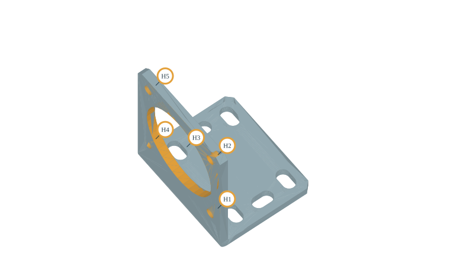

# Public STEP Circular Hole Verification — v1.9.0

## 日本語概要

以前は穴一覧用の読込条件で拒否された外部公開STEP6件を、既存の検査用読込経路で再検証しました。全6件を読み込み、build123dのブラケットから円形貫通穴5個（径3.3 mmが4個、径32 mmが1個、深さはいずれも3 mm）の開口位置を取得しました。6本の長穴は対象外で、全体の穴数は不明のまま保持します。他5件の認識0件も穴なしとは判断しません。英語本文では固定入力、3回の反復、同一カーネル内の別経路照合、再現方法と制限を説明します。

---

## English Summary

All six unchanged public STEP inputs pass the existing inspection importer.
Five circular through holes in the build123d NEMA-17 bracket qualify locally;
the total opening count remains unknown, including its elongated slots.
Other sources have no qualifying circular through holes, which does not prove
absence of openings. These six files represent five families, used during
development. This is post-hoc verification, not held-out recognition accuracy.

## Inputs and intake

The [original manifest](../fixtures/public-step-corpus/manifest.json) fixes all
source revisions, hashes, attributions and license notices. Inputs are unchanged.
Its historical external-validation designation describes the earlier study;
for **this** extension the same files were inspected during development.
The [v1.8 evidence](../results/hole-inventory/results.json) remains frozen: that
plate-oriented reader rejected all six before recognition, due to multiple
length declarations or more than 24 faces. This was not a download failure.

The new `--public` API/CLI route and `/holes` UI reuse `read_step_for_inspection`.
It resolves supported SI and conversion-based length contexts and normalizes
geometry to millimetres. Multiple contexts must agree in physical scale.
Multiple roots and solids are accepted within a 2 MB input and topology budget;
external references are not fetched. Existing editing/comparison intake is unchanged.

| Fixed source | Solids | Faces | Verified round through holes | Whole count |
| --- | ---: | ---: | ---: | --- |
| CadQuery assembly | 2 | 9 | 0 | Unknown |
| build123d bracket | 1 | 42 | 5 | Unknown |
| build123d screw | 1 | 28 | 0 | Unknown |
| u-blox SAM AP203 | 3 | 98 | 0 | Unknown |
| u-blox SAM AP214 | 3 | 98 | 0 | Unknown |
| u-blox EMMY | 54 | 399 | 0 | Unknown |

All 399 EMMY faces are scanned. Its preview exceeds the separate 256-face
tessellation limit and is omitted with an explicit reason; measurements survive.

## Local qualification and count semantics

The plate reconstruction certificate remains the only basis for a whole-part
count (`complete`). Otherwise a locally qualified full inward cylinder needs
two circular inner wires on perpendicular planar opening faces, matching
centres, radii, axis and untrimmed cylinder area. Material classifications at
48 radial points and five axial points supplement these geometric checks.
Each face must belong to exactly one solid. A partial result has populated
hole rows and `recognized_hole_count`, but `hole_count=null` (empty in CSV).

Stepped-hole shoulders can also have circular inner wires. Therefore circular
outer boundaries on either opening face are withheld, including washers.
A counterbore negative control caught this ambiguity during implementation;
the final rule abstains. Half cylinders in slots, convex cylinders on screws
and bosses, blind caps and intersected circular walls do not qualify locally.
Simple plate blind holes still qualify through full material reconstruction.

This conservative rule does not handle split circular faces, slotted openings,
arbitrary blind/countersunk/counterbored holes or threads. Geometric and sampling
checks are not a proof of arbitrary topology. Local holes belong to individual
components; blockage by another assembly component is not checked.

## Bracket measurements



| ID | Diameter mm | Opening X mm | Opening Y mm | Opening Z mm | Depth mm |
| --- | ---: | ---: | ---: | ---: | ---: |
| H1 | 3.3 | 3 | -15.5 | 14.5 | 3 |
| H2 | 3.3 | 3 | -15.5 | 45.5 | 3 |
| H3 | 32 | 3 | 0 | 30 | 3 |
| H4 | 3.3 | 3 | 15.5 | 14.5 | 3 |
| H5 | 3.3 | 3 | 15.5 | 45.5 | 3 |

All axes point `(-1, 0, 0)`. Opening selection is the lexicographically larger
of the two centres, for deterministic display, not inferred machining direction.
STEP coordinates are retained after unit conversion. Six elongated slots are
visually observable; their twelve half-cylinder faces are withheld. This is not
an automatic count of every hole or an eleven-hole recognition success.

The separate boundary cross-check integrates planar inner-wire length and line
centroid, using `perimeter / pi` for diameter. All ten opening rims match the
reported positions and diameters within 1e-6 mm (observed maximum ~7.56e-14 mm).
Both paths use OCCT: this checks internal agreement, not independent CAD truth
or physical metrology accuracy. No original engineering drawing is used.

## Reproduction and evidence

```bash
python -m pip install -e ".[geometry,test]"
python -m research_notes.public_hole_benchmark --output-dir output/public-holes --repeats 3
python -m research_notes.hole_inventory fixtures/public-step-corpus/sources/build123d_bracket.step --public --output-dir output/bracket-holes
python -m research_notes.cad_web
```

The individual CLI exits 2 for `partial`, after writing CSV/JSON/SVG; it exits 0
only for a complete whole-part inventory. Without `--public`, the CLI preserves
the original strict plate intake for reproduction of the v1.8 controls.
Python uses `analyze_step(source_bytes, file_name, inspection=True)`.

[Results JSON](../results/public-hole-inventory/results.json) records three
identical measurements per input, timings, environment, source hashes,
withheld-face reasons and boundary cross-check. [Summary CSV](../results/public-hole-inventory/results.csv),
[bracket CSV](../results/public-hole-inventory/csv/build123d_bracket.csv) and
[unchanged licensed source bundle](../results/public-hole-inventory/samples.zip)
are available. Timing includes reading bytes, intake, recognition and optional
preview, with the first run retained; it excludes CSV/SVG and cross-check.
EMMY timing excludes its unavailable preview, so it is not directly comparable.

Tests cover frozen external inputs, counts versus unknowns, perimeter/centroid
agreement, counterbores and other negative controls, rotated plates, legacy
plate completeness, CSV/session state and the existing unit-context suite.
The local validation record is [verification.json](../results/public-hole-inventory/verification.json).
The geometry runtime is not isolated in a worker process with hard CPU/memory
limits. Multiple operating-system validation is outside this result.
