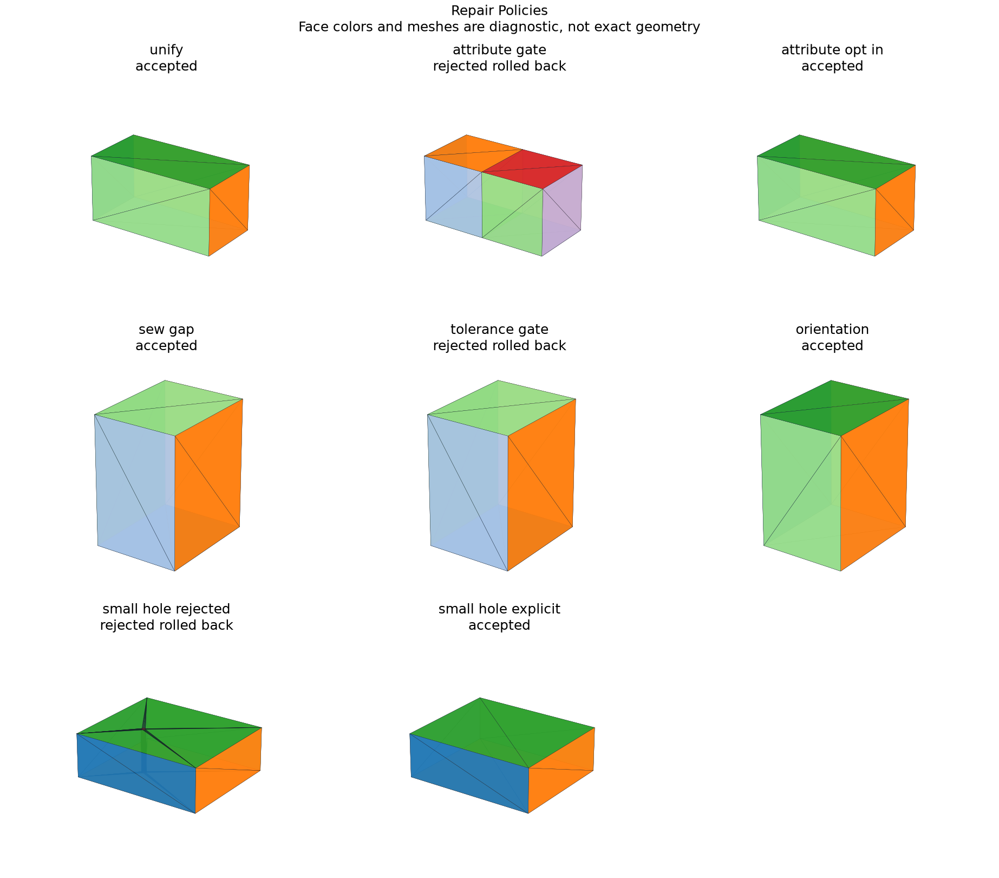

# Auditable Shape Repair Policies

## 日本語概要

v0.70.0では監査可能な形状修復を実装し、8件の限定した合成条件を検証しました。入力・判断根拠・結果をCSV、JSON、図、再生成可能なサンプルに残しています。

検証範囲と失敗例は以下の英語本文に示します。一般のCADデータへの適用や完全な規格適合を主張するものではありません。

---

## English Summary

Operations run on a copied shape. The audit retains before/candidate metrics, per-vertex/edge/face tolerances and orientations, face/edge relations, unresolved attributes, reasons, and bidirectional material difference where both inputs are solids. Small-feature removal requires selected face indices. Volume, area and tolerance budgets are explicit; this is not a Hausdorff-distance guarantee or automatic attribute transfer.

## Results and Interpretation

Eight controls exercise same-domain unification, explicit attribute-loss acceptance/refusal, gap sewing, tolerance rejection, orientation correction, and small-hole removal with restrictive or permissive geometric budgets. Rejection returns the original shape.

The 8 `checks_pass` observations check the declared expectation, including
expected rejections and recorded learning failures. They do not mean that every
input was accepted or every learned prediction was correct.

## Sources and Implementation Boundary

[OCCT same-domain unification](https://occt3d.com/dev/doc/refman/html/class_shape_upgrade___unify_same_domain.html) exposes shape/history output. Native operation history and geometric inference are separately identified in the audit.

- operations run on a deep copy; failed validity/tolerance/volume/area/attribute gates return the original
- per-edge/per-face correspondences report unresolved geometry honestly; native history used where available
- small-feature removal requires explicit face selections and geometric budgets; no silent repair or Hausdorff claim

## Reproduction and Artifacts

Run from the repository root in the pinned geometry environment:

```bash
python experiments/run_repair_policies.py
```

Default runs verify fixture bytes. To regenerate into separate directories:

```bash
python experiments/run_repair_policies.py --output-dir output/repair-policies --fixture-dir output/fixtures/repair-policies --refresh-fixtures
```

- [Observations](../results/repair_policies.csv)
- [Detailed evidence](../results/repair_policies_evidence.json)
- [Contract and limits](../results/repair_policies_contract.json)
- [Fixture manifest](../fixtures/repair-policies/manifest.csv)
- [Experiment](../experiments/run_repair_policies.py)
- [Implementation](../src/research_notes/advanced_geometry_studies.py)


