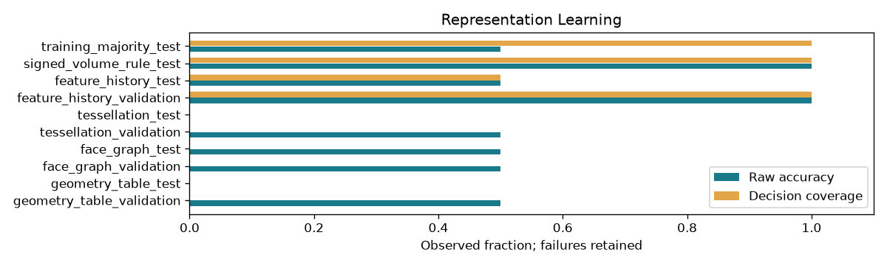

# 3D Representation Learning Baselines

## 日本語概要

v0.76.0では3D表現ごとの学習ベースラインを実装し、10件の限定した合成条件を検証しました。入力・判断根拠・結果をCSV、JSON、図、再生成可能なサンプルに残しています。

検証範囲と失敗例は以下の英語本文に示します。一般のCADデータへの適用や完全な規格適合を主張するものではありません。

---

## English Summary

Means, scales and class centroids use only training rows; temperature uses only validation rows. Probability, Brier score, calibration error, abstention and high-confidence mistakes are retained. Most learned geometry predictions abstain because held-out descriptors leave the bounded training range. This experiment demonstrates a strong non-learned baseline and a generalization failure, not a useful general 3D model.

## Results and Interpretation

Four centroid representations predict additive/subtractive edits under the fixed six-family split. On the held-out controls, raw accuracy is 0% for geometry tables, 50% for graph summaries, 0% for tessellation summaries and 50% for privileged histories. The signed-volume rule reaches 100%; training-majority reaches 50%.

The 10 `checks_pass` observations check the declared expectation, including
expected rejections and recorded learning failures. They do not mean that every
input was accepted or every learned prediction was correct.

## Sources and Implementation Boundary

Nearest-centroid distances, softmax temperature calibration and the signed-volume rule are implemented explicitly in NumPy. Tests perturb held-out labels/features and require identical fitted model records, exposing accidental fit/calibration leakage.

- task: additive versus subtractive parametric change, six isolated synthetic construction families
- train-only means/scales/centroids; validation-only temperature; test labels never fit model or calibration
- signed-volume rule is a strong exact control; authored-history descriptors are privileged, not recovered from STEP
- accuracy, Brier score, calibration, abstentions and high-confidence errors retained without a success threshold

## Reproduction and Artifacts

Run from the repository root in the pinned geometry environment:

```bash
python experiments/run_representation_learning.py
```

Default runs verify fixture bytes. To regenerate into separate directories:

```bash
python experiments/run_representation_learning.py --output-dir output/representation-learning --fixture-dir output/fixtures/representation-learning --refresh-fixtures
```

- [Observations](../results/representation_learning.csv)
- [Detailed evidence](../results/representation_learning_evidence.json)
- [Contract and limits](../results/representation_learning_contract.json)
- [Fixture manifest](../fixtures/representation-learning/manifest.csv)
- [Experiment](../experiments/run_representation_learning.py)
- [Implementation](../src/research_notes/learning_studies.py)


