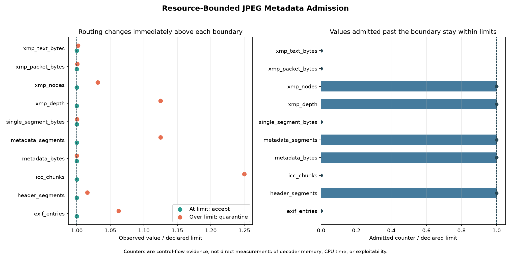

# Resource-Bounded Metadata Parsing and Quarantine Decisions

## 日本語概要

本ノートは、JPEG metadataをdecoderへ渡す前に、header segment数、metadata segment数とbyte数、単一segment長、EXIF entry数、XMP packet・node・depth・text量、ICC chunk数へ明示的な上限を適用する境界を評価します。24個の決定論的な合成fixtureでは、10種類の上限値ちょうどをすべてacceptし、上限値+1をすべてquarantineしました。5環境の120観測でも、全24契約についてdecision、reason code、work counter、fixture hashが一致しました。これは限定したadmission policyの制御実験であり、一般的なmetadata安全性、decoderのmemory・CPU上限、脆弱性やexploitabilityを証明するものではありません。

実験設計、結果、運用上の境界、適用範囲は以下の英語本文を参照してください。

---

## English Summary

This study evaluates a fail-closed admission boundary before JPEG image
decoding. Ten explicit metadata-work ceilings are exercised exactly at the
limit and at the first value above it. Separate controls cover prohibited XMP
declarations, invalid EXIF syntax, and a JPEG segment-length overrun.

The boundary returns `accept`, `quarantine`, or `reject` with a stable reason
code and observed-versus-admitted work counters. These outcomes are routing
decisions for the controlled parser, not claims that admitted metadata is
trusted, that a full JPEG is valid, or that decoder resource use is bounded.

## Research Question

Can a small JPEG metadata admission layer enforce explicit work ceilings,
stop at the first disallowed unit, and produce deterministic quarantine
decisions before an image decoder is called?

The experiment asks four narrower questions:

1. Does each declared resource dimension admit a fixture exactly at its limit?
2. Does the same dimension fail closed at limit plus one without admitting
   work beyond the declared ceiling?
3. Can metadata-policy failures remain distinct from JPEG container-framing
   failures?
4. Are fixture bytes, routing decisions, reason codes, and work counters
   stable across the five recorded CI profiles?

## Background

JPEG uses a marker-oriented structure. Application and comment segments can
carry EXIF, XMP, ICC, or application-specific payloads before the
start-of-scan marker. Segment framing therefore provides an early boundary at
which an application can count metadata before invoking a pixel decoder.
[ITU-T T.81](https://www.itu.int/ITU-T/recommendations/rec.aspx?id=2633)
defines the JPEG coding syntax, while
[ITU-T T.86](https://www.itu.int/epublications/publication/itu-t-t-86-v2-2024-02-information-technology-digital-compression-and-coding-of-continuous-tone-still-images-appn-markers)
describes APPn marker use.

Container length is only one resource dimension. A small number of segments
can still contain a large aggregate payload, while a bounded byte payload can
still expose a parser to many EXIF entries, XML nodes, deep XML nesting, or
ICC chunks. Resource controls should therefore state their units, boundary
behavior, and failure mode rather than rely on an undocumented file-size
check. [CWE-770](https://cwe.mitre.org/data/definitions/770.html) recommends
explicit resource limits and graceful behavior when they are reached.

XMP introduces an XML parser boundary. Python's
[XML security documentation](https://docs.python.org/3.12/library/xml.html)
warns that XML modules are not designed as a general defense against
malicious input and that behavior depends in part on the linked Expat
version. This experiment first caps packet bytes, rejects the controlled
literal `DOCTYPE` and `ENTITY` declarations, feeds an `XMLPullParser` in
64-byte chunks, and records its runtime parser version. That design narrows
the experiment; it does not establish general untrusted-XML safety.

Image decoding has separate resource risks. Pillow's
[image module documentation](https://pillow.readthedocs.io/en/stable/reference/Image.html)
documents decompression-bomb safeguards based on image dimensions. This study
uses that separation as a design principle: metadata admission occurs first,
but callers and decoders must independently bound file reads, decoded pixels,
memory, and execution time.

## Method

`JPEGMetadataResourceBudget` declares ten positive integer ceilings:

| Resource | Default study limit | Unit |
| --- | ---: | --- |
| Header traversal | 64 | marker segments |
| Metadata segment count | 8 | APP1-APP15 or COM segments |
| Aggregate metadata size | 16,384 | payload bytes |
| Single metadata segment | 4,096 | payload bytes |
| EXIF IFD0 entries | 16 | entries |
| XMP packet size | 2,048 | XML bytes |
| XMP element count | 32 | start nodes |
| XMP nesting depth | 8 | open elements |
| XMP text size | 512 | UTF-8 text bytes |
| ICC profile chunks | 4 | APP2 chunks |

These values are experiment controls, not recommended production defaults.
An application should derive limits from its input channel, metadata support,
latency budget, and failure policy.

`audit_jpeg_metadata_resources()` receives an in-memory `bytes` object and
traverses markers from SOI toward SOS. It does not call OpenCV, Pillow, FFmpeg,
or another image decoder. Recognized EXIF, XMP, and ICC payloads receive
additional bounded checks:

- EXIF validates TIFF byte order, magic, IFD0 bounds, entry types, and
  out-of-line value bounds without following nested IFD pointers.
- XMP applies the packet-size ceiling before parsing, rejects the controlled
  literal declaration patterns, then counts nodes, depth, and UTF-8 text
  while clearing completed elements.
- ICC validates the bounded sequence/count topology without assembling a
  profile.
- Other APP1-APP15 and COM payloads remain opaque but still consume segment
  and byte budgets.

The three routing states are:

| Decision | Meaning in this study |
| --- | --- |
| `accept` | Header admission reached SOS within the declared metadata policy; a caller may attempt downstream decoding |
| `quarantine` | A metadata work ceiling, recognized metadata syntax check, or ICC topology check failed |
| `reject` | JPEG marker framing failed before a metadata policy decision could admit the input |

`quarantine` is only a returned decision. The code does not move, rename, or
persist a file. `accept` does not mean that metadata values are truthful, all
metadata semantics are understood, or the complete compressed stream will
decode successfully.

Each result records stable reason codes and paired counters:

- `seen` records the value that caused or preceded a decision;
- `admitted` records work accepted under the corresponding ceiling.

For a paired over-limit fixture, the controlled expectation is that `seen`
equals `limit + 1` and `admitted` is at most `limit`.

## Controlled Experiment

One deterministic 96 x 72 synthetic BGR image is encoded by Pillow at quality
75 with 4:4:4 sampling. Metadata envelopes are generated entirely in memory
and inserted after SOI. No external image or metadata data is used.

The fixture corpus contains:

```text
10 resource dimensions
  x 2 boundary relations (at limit and limit + 1)
= 20 paired boundary fixtures

+ 1 mixed-metadata baseline
+ 1 prohibited XMP declaration
+ 1 invalid EXIF magic fixture
+ 1 JPEG segment-length overrun
= 24 fixtures
```

Every at-limit fixture is expected to return `accept`. Every limit-plus-one
fixture and both metadata-syntax controls are expected to return
`quarantine`. The segment-length overrun is expected to return `reject`.

Fixtures are reconstructed deterministically on every run. Their SHA-256
values, expected and observed decisions, reason codes, all work counters, and
normalized observed-to-limit ratios are written to CSV.

The local command is:

```bash
python experiments/run_resource_bounded_metadata.py
```

The CI matrix repeats the same experiment on:

- Ubuntu x64 with the default codec path;
- Ubuntu x64 with `JSIMD_FORCENONE=1`;
- Windows x64;
- macOS arm64;
- macOS Intel x64.

The experiment does not invoke a decoder, so the SIMD distinction is recorded
as an environment profile rather than evidence about metadata-parser SIMD
behavior.

## Results

The local run produced 24 observations and 14 resource-family summaries:

| Outcome | Local observations | Controlled cause |
| --- | ---: | --- |
| `accept` | 11 | mixed baseline and ten at-limit fixtures |
| `quarantine` | 12 | ten limit-plus-one fixtures and two metadata-syntax fixtures |
| `reject` | 1 | segment-length overrun |

All ten at-limit cases observed and admitted exactly the declared limit. All
ten limit-plus-one cases observed the first disallowed value, returned
`quarantine`, and kept the corresponding admitted counter at or below the
limit. No admitted counter in any fixture exceeded its declared ceiling.

| Resource | At limit | Limit + 1 |
| --- | --- | --- |
| Header segments | `accept` at 64 | `quarantine` at 65 |
| Metadata segments | `accept` at 8 | `quarantine` at 9 |
| Metadata bytes | `accept` at 16,384 | `quarantine` at 16,385 |
| Single segment bytes | `accept` at 4,096 | `quarantine` at 4,097 |
| EXIF entries | `accept` at 16 | `quarantine` at 17 |
| XMP packet bytes | `accept` at 2,048 | `quarantine` at 2,049 |
| XMP nodes | `accept` at 32 | `quarantine` at 33 |
| XMP depth | `accept` at 8 | `quarantine` at 9 |
| XMP text bytes | `accept` at 512 | `quarantine` at 513 |
| ICC chunks | `accept` at 4 | `quarantine` at 5 |



The successful
[five-profile workflow](https://github.com/cab0a/research-notes/actions/runs/30506465070)
produced 120 observations and 24 fixture contracts:

- 55 observations returned `accept`;
- 60 observations returned `quarantine`;
- 5 observations returned `reject`;
- all 24 contracts included all five profiles;
- all 24 contracts had one decision, reason-code, issue, counter, and fixture
  hash signature;
- all 120 expectations were met.


The runtime manifest is retained as environment provenance. CI byte-compares
the stable observations, contracts, and summary, but not hosted-runner image
identifiers because those can change independently of the fixed behavior.

## Interpretation

The paired fixtures show that the implemented policy has an observable closed
boundary: equality is admitted and the first value above each ceiling changes
the route. The counter record makes that boundary reviewable without inferring
it from elapsed time or process memory.

The three decisions deliberately separate metadata policy from container
framing. A recognized metadata payload that is too large or structurally
outside the controlled parser is quarantined for separate handling. A segment
length that overruns the available JPEG bytes is rejected as a framing
failure. An accepted header may proceed to a decoder attempt, but the decoder
can still reject the entropy-coded stream or encounter its own resource
limits.

The cross-platform result supports a narrow compatibility claim: the same
synthetic bytes reached the same decision, reason, and counters under the five
recorded Python and ElementTree/Expat environments. It does not show that
other parsers, metadata formats, budgets, runner-image revisions, or
adversarial encodings will behave identically.

## Failure Modes

### `accept` is treated as a trust decision

Admission means only that this bounded header policy reached SOS. Opaque APP
payloads can be admitted without semantic inspection, and recognized values
can still be false, stale, or misleading.

### A metadata ceiling is treated as a complete process limit

The input byte string is already resident in memory. The audit does not bound
file-read allocation, request buffering, decoded dimensions, pixel memory,
decoder CPU, wall-clock time, recursion outside the controlled XML path, or
downstream metadata processing.

### The literal XMP declaration check is treated as an XML firewall

The experiment recognizes controlled literal `DOCTYPE` and `ENTITY` byte
patterns after the packet-size check. It does not prove equivalent
declarations, alternate encodings, namespace combinations, or all XML parser
behaviors are rejected.

### A quarantine label is treated as containment

The function returns a routing value and issue code. It does not create a
restricted storage area, enforce access control, redact logs, or define
retention and deletion rules.

### Work counters are treated as performance measurements

Counters show control-flow admission under the declared units. They are not
measurements of allocation, resident memory, CPU instructions, latency, or
energy use.

### One bounded parser is treated as format coverage

The EXIF path stops at IFD0, the XMP path handles one standard packet, and the
ICC path checks chunk topology without parsing profile tags. Extended XMP,
maker notes, thumbnails, IPTC IIM, nested IFDs, unknown namespaces, and
application-specific APP payload semantics remain outside the model.

## Practical Guidance

- Bound input bytes before materializing the full file, independently of this
  metadata audit.
- Apply marker, segment, aggregate-byte, and format-specific work ceilings
  before decoder invocation.
- Define whether equality is accepted and test both the exact boundary and
  the first value above it.
- Return stable reason codes and observed-versus-admitted counters so routing
  behavior is auditable.
- Keep malformed container framing distinct from metadata-policy quarantine.
- Treat `accept` as permission for the next bounded stage, not as a statement
  of trust or complete validity.
- Define quarantine storage, access, retention, redaction, and operator
  workflows outside the parser.
- Bound decoded pixel count, memory, time, and concurrency separately.
- Prefer a hardened XML strategy appropriate to the deployment context; the
  controlled ElementTree path is not a general replacement for one.
- Preserve unknown metadata only when the product policy explicitly permits
  opaque data, and do not infer safety from size alone.

## Limitations

- All inputs are synthetic and centered on one small Pillow-encoded JPEG
  carrier.
- The default ceilings are experimental values, not production sizing
  guidance.
- The API receives a complete `bytes` object, so file acquisition and input
  buffering are outside the measured boundary.
- No image decoder is called; decoded-pixel allocation and entropy-decoder
  behavior are not evaluated.
- No wall-clock benchmark, peak-memory measurement, concurrency test, or
  operating-system resource limit is included.
- The corpus has 24 hand-constructed fixtures and is not a fuzzer or broad
  malformed-input suite.
- The EXIF implementation checks one IFD0 and does not follow nested pointers.
- The XMP implementation caps one packet before parsing and uses a simple
  literal declaration check. It is not a complete XML security policy.
- XMP node, depth, and text counters may observe the first disallowed unit so
  that the parser can quarantine it; only admitted counters are constrained
  to the ceiling.
- The ICC implementation validates sequence topology without assembling or
  interpreting profile contents.
- Opaque APP payloads can pass within the segment and byte budgets.
- Five-profile equality applies only to the recorded hosted runners, Python
  runtimes, ElementTree/Expat builds, and fixed fixture bytes.
- The study is not a vulnerability assessment, penetration test,
  memory-safety proof, denial-of-service proof, or exploitability analysis.

## Sources

- [ITU-T T.81: JPEG continuous-tone image coding](https://www.itu.int/ITU-T/recommendations/rec.aspx?id=2633)
- [ITU-T T.86: JPEG APPn markers](https://www.itu.int/epublications/publication/itu-t-t-86-v2-2024-02-information-technology-digital-compression-and-coding-of-continuous-tone-still-images-appn-markers)
- [CIPA Exif standards list](https://www.cipa.jp/e/std/std-sec.html)
- [Adobe XMP specifications](https://developer.adobe.com/xmp/docs/xmp-specifications/)
- [ICC profile embedding guidance](https://www.color.org/technotes/ICC-Technote-ProfileEmbedding.pdf)
- [Python XML security](https://docs.python.org/3.12/library/xml.html)
- [CWE-770: Allocation of Resources Without Limits or Throttling](https://cwe.mitre.org/data/definitions/770.html)
- [Pillow Image module and decompression-bomb safeguards](https://pillow.readthedocs.io/en/stable/reference/Image.html)
